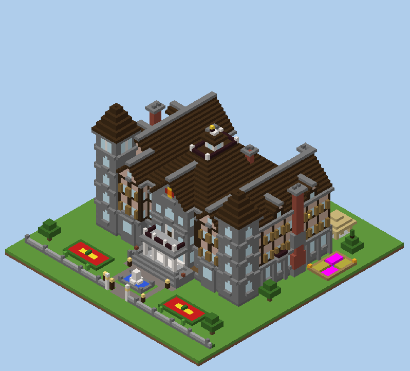
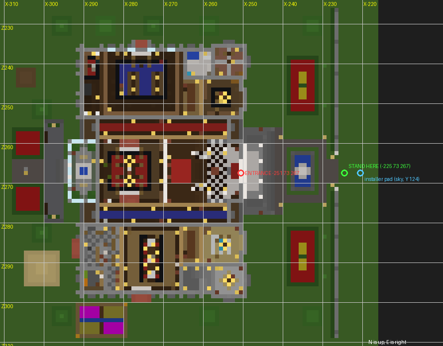
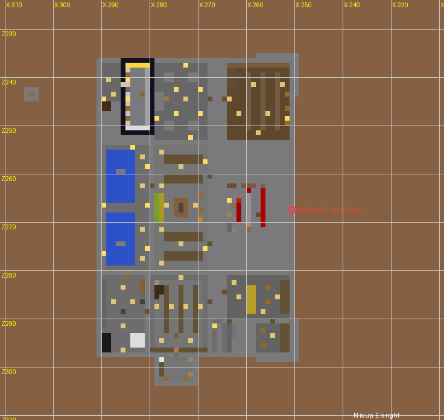
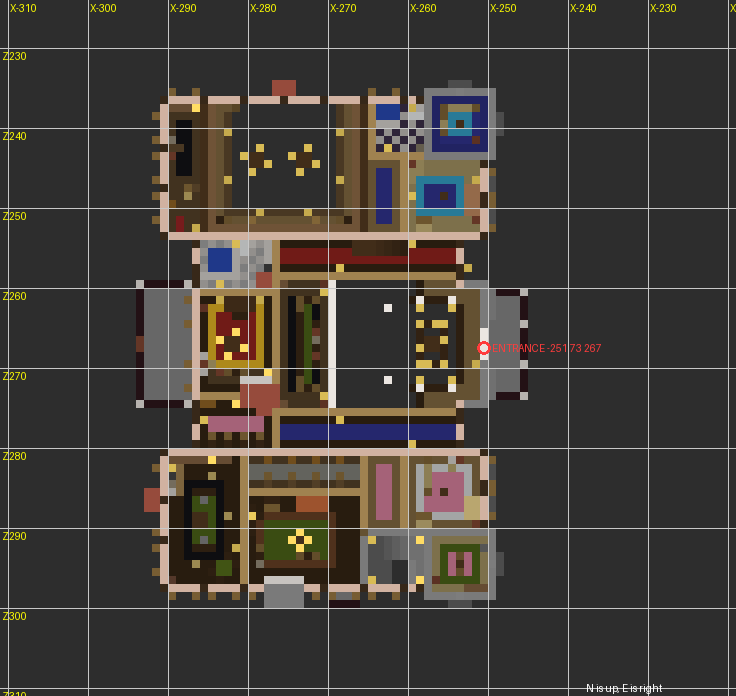
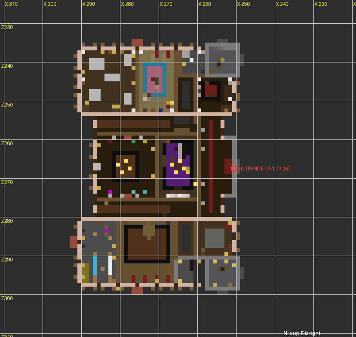
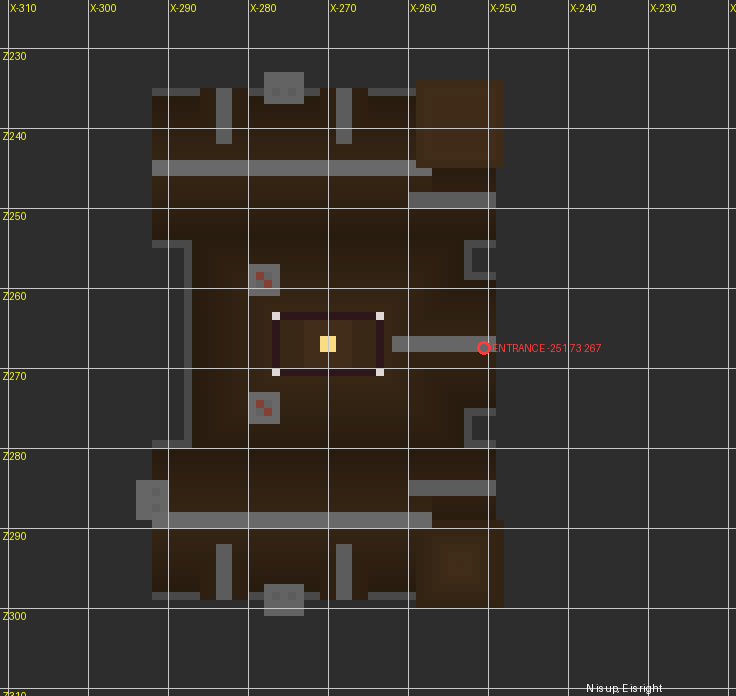

# Ashgrove Manor - SERVER CONSOLE INSTALLATION (Minecraft Java 1.8 / 1.8.9)

> ## BACK UP THE WORLD BEFORE INSTALLATION.
> Stage 2 **clears and levels** the whole building site. Everything inside the box below is replaced for good: trees, hills, buildings, chests, redstone.
>
> **Area that will be changed (absolute world coordinates, inclusive):**
>
> | | from | to | size |
> |---|---|---|---|
> | X | -309 | -227 | 83 blocks |
> | Y | 62 | 118 | 57 blocks |
> | Z | 226 | 308 | 83 blocks |
>
> Everything from Y 73 up to Y 118 in that X/Z square becomes air. Y 69-72 becomes dirt with grass on top, and the basement, cellars, cistern and escape tunnel are dug below that, down to Y 62. The installer also uses a few blocks in the sky at X -221..-219, Y 124..127, Z 267 (see below). Nothing else in the world is touched.



This file is all you need to install the mansion from your hosting dashboard's **server console**. You never open a command block. It is the same Ashgrove Manor as the command-block edition (`commands/command_01.txt` ... `command_09.txt` and `MANSION.md`, kept unchanged as a fallback). It has been moved to your coordinates and turned to face east.

## 1. Quick facts

| | |
|---|---|
| Minecraft | Java Edition **1.8.0 - 1.8.9**, vanilla server. Tested on real 1.8.9 and 1.8.0 servers. |
| Main entrance | Centre of the front double doors: **X -251, Z 267**. The doors themselves are the blocks `-251 76 266` and `-251 76 267`. |
| Facing | **EAST.** Walk out of the front doors and you go **+X (east)**; walk in and you go -X (west). |
| Ground level | The lawn is grass at **Y 72**, so you stand on it at **Y 73** (the F3 screen shows Y 73). The front steps start on the lawn at Y 73. The ground floor is raised over the basement, like the original design, so the door sill is 3 steps up: door feet at **Y 76**. |
| House | Walls and roofs from X -294 to X -246 and Z 233 to Z 300; the portico balcony and front steps reach east to X -243. The whole house is west of the entrance except the portico and steps. |
| Whole site (changed area) | X -309..-227, Y 62..118, Z 226..308 |
| Console lines | **24**, pasted in order: `commands_console/console_01.txt` ... `console_24.txt` |
| Longest line | 15919 characters (every line is at most 16000) |
| Leading slash | **Do not type a `/`.** Paste each file exactly as it is. (A vanilla 1.8 console would also accept a leading `/`; the files do not have one.) |
| Stand here | **X -225, Y 73, Z 267**: on the ground just outside the east edge of the site, in line with the front doors, facing west. |
| Server view-distance | **6 or more** (`view-distance` in `server.properties`; vanilla default is 10). This server setting decides which chunks stay loaded around you. Your own client render distance does not change that, but set it to 8 or more if you want to watch the whole site being built. |
| Installer | A single bedrock "pad" at **-221 124 267** (in the sky, 4 blocks east of where you stand). Each stage drops a tiny command machine onto it. The machine removes itself, and the last stage removes the pad. |
| Time | Each stage finishes in about 1-5 s on the test machine (30 s of building in total), so the whole install is mostly the time you spend pasting. Slower hosts take longer. **Always wait for the message, not for a number of seconds.** |

World orientation (north is up, east is right):

```
                                   NORTH (-Z)
        X -309                                                        X -227
  Z 226 +--------------------------------------------------------------+
        |  dry well    +---------------------------------------+ NE    |
        |  (tunnel     | NORTH WING: secret study | library |  |tower  |
        |   exit)      |   study, map room, blue room...      |  +--+  |
  WEST  |  parterre    +--------------+--------+--------------+     |  |  EAST
  (-X)  |  rear garden |CONSERVATORY  | SALON  | GRAND FOYER  |PORTICO |  (+X)
        |  gazebo      |              |        |    doors >>>>|steps   |  fountain  drive -->
        |              +--------------+--------+--------------+ X -251 |
        |  kitchen     | SOUTH WING: kitchen, pantry | dining | +--+   |
        |  garden      |   drawing room, back stairs          | |SE    |
        |              +---------------------------------------+ tower |
  Z 308 +--------------------------------------------------------------+
                                   SOUTH (+Z)          you stand at X -225, Z 267 ->
```

Everything turned with the house. The original "north-west tower" (star room and observatory) is now the **north-east tower**. The original "north-east tower" (lookout) is now the **south-east tower**. The library wing is the **north wing** and the kitchen wing is the **south wing**. The gardens, gazebo and dry well are behind the house to the **west**.

**Ground floor and grounds (feet Y 76 in the house, lawn Y 73)**



**Basement (feet Y 69) and escape tunnel (feet Y 63)**



**Upper floor (feet Y 84)**



**Top floor (feet Y 91)**



**Attic, tower rooms and roof walk (Y 96-112)**



## 2. Before you start

1. **Back up the world** (most dashboards have a Backups page; or stop the server and copy the world folder).
2. Check that nothing you want to keep is inside **X -309..-227, Y 62..118, Z 226..308**.
3. In `server.properties` make sure that:
   * `enable-command-block=true` (the installer uses command blocks and command-block minecarts);
   * `view-distance` is **6 or more** (10 is the vanilla default). If you change a property, restart the server.
4. The installer column needs open sky at **X -221..-219, Y 124..128, Z 267**, which is normally empty air. If a mountain or a build of yours reaches Y 124 there, move it first.
5. Flat ground near Y 72 gives the best result. The site is levelled to a lawn at Y 72. Higher terrain inside the site is cut away; land outside the site is not changed, so a hillside next to the site will show a cut face. Terrain below Y 69 inside the site is kept, apart from what the basement digs out.

## 3. Installation, step by step

1. Start the server and **join it** with your Minecraft account.
2. Go to **X -225, Y 73, Z 267** and stay there until the end. That is on the ground, just east of the site, in line with the front doors. Creative mode is easiest, but survival is safe too: nothing is built where you stand. Your character keeps the site's chunks loaded; the server console cannot. If you wander more than a few chunks away, commands aimed at unloaded chunks fail.
3. Open your hosting dashboard and go to the **Console** page.
4. Open `commands_console/console_01.txt`, copy its single line, paste it into the console input and press Enter. Paste exactly the file contents, without a leading `/`.
5. Wait for the reply in the table below. The reply comes on its own line in the console log; some panels put `[Server thread/INFO]:` in front of it.
6. Paste the next file. Continue in order until `console_24.txt` answers **`[Installer] Mansion Console Stage 24/24 complete. Mansion construction complete.`**
7. Walk through the front doors at -251 76 266/267 (up the front steps from the lawn).

What a build stage prints in the console (stage 5 as an example, copied from the test server):

```
Object successfully summoned
[Installer: Object successfully summoned]
[Installer: Game rule has been updated]
[Installer] Mansion Console Stage 5/24 complete. Next: paste console_06.txt
[Installer: 7 blocks filled]
```

The first line comes straight away and means the console accepted your line. The `[Installer] Mansion Console Stage ... complete` line means that stage is fully built and its machinery has removed itself. **Paste the next file only after the "complete" line.** The line after it is the machine clearing itself away. Players in the game see the `[Installer] ...` line in chat.

| # | File | Chars | Reply to wait for | What it builds |
|---|---|---|---|---|
| 1 | `console_01.txt` | 29 | `Block placed` | places the installer pad at -221 124 267 |
| 2 | `console_02.txt` | 2634 | `[Installer] Mansion Console Stage 2/24 complete. Next: paste console_03.txt` | clears the site down to Y 73 and lays the lawn at Y 72 |
| 3 | `console_03.txt` | 1902 | `[Installer] Mansion Console Stage 3/24 complete. Next: paste console_04.txt` | basement shell (**heavy**: big wall shells; the server pauses for a few seconds) |
| 4 | `console_04.txt` | 2384 | `[Installer] Mansion Console Stage 4/24 complete. Next: paste console_05.txt` | shell (**heavy**: big wall shells; the server pauses for a few seconds) |
| 5 | `console_05.txt` | 15869 | `[Installer] Mansion Console Stage 5/24 complete. Next: paste console_06.txt` | shell, floors, roofs (**heavy**: big wall shells; the server pauses for a few seconds) |
| 6 | `console_06.txt` | 15915 | `[Installer] Mansion Console Stage 6/24 complete. Next: paste console_07.txt` | roofs, facades |
| 7 | `console_07.txt` | 15855 | `[Installer] Mansion Console Stage 7/24 complete. Next: paste console_08.txt` | facades |
| 8 | `console_08.txt` | 15879 | `[Installer] Mansion Console Stage 8/24 complete. Next: paste console_09.txt` | facades |
| 9 | `console_09.txt` | 15848 | `[Installer] Mansion Console Stage 9/24 complete. Next: paste console_10.txt` | facades, portico + front steps, towers |
| 10 | `console_10.txt` | 15907 | `[Installer] Mansion Console Stage 10/24 complete. Next: paste console_11.txt` | towers, dormers, widow walk + cupola, central chimneys, basement layout, basement archive ... |
| 11 | `console_11.txt` | 15861 | `[Installer] Mansion Console Stage 11/24 complete. Next: paste console_12.txt` | basement family crypt, basement storage hall, basement cistern, basement south: storage, wine cellar, utility, wine cellar secret door + stash, secret redstone room ... |
| 12 | `console_12.txt` | 15768 | `[Installer] Mansion Console Stage 12/24 complete. Next: paste console_13.txt` | secret vault, secret escape tunnel, F1 walls, F1 foyer + grand staircase |
| 13 | `console_13.txt` | 15719 | `[Installer] Mansion Console Stage 13/24 complete. Next: paste console_14.txt` | F1 foyer + grand staircase, F1 salon + conservatory, F1 halls |
| 14 | `console_14.txt` | 15919 | `[Installer] Mansion Console Stage 14/24 complete. Next: paste console_15.txt` | F1 halls, F1 study + map room + bath, F1 corridors, F1 library (two storeys) |
| 15 | `console_15.txt` | 15872 | `[Installer] Mansion Console Stage 15/24 complete. Next: paste console_16.txt` | F1 library (two storeys), F1 library secret door, F1 secret study, F1 drawing room + breakfast nook, F1 dining room, F1 kitchen + pantry |
| 16 | `console_16.txt` | 15873 | `[Installer] Mansion Console Stage 16/24 complete. Next: paste console_17.txt` | F1 kitchen + pantry, back stairs, F1 doors, F1 lighting |
| 17 | `console_17.txt` | 15882 | `[Installer] Mansion Console Stage 17/24 complete. Next: paste console_18.txt` | F1 lighting, F1 foyer details, secret hatches, F2 walls, F2 north: blue room, tower, bath, corridor, F2 halls + lounge |
| 18 | `console_18.txt` | 15868 | `[Installer] Mansion Console Stage 18/24 complete. Next: paste console_19.txt` | F2 halls + lounge, F2 master suite, F2 south: rose room, green room, billiards |
| 19 | `console_19.txt` | 15835 | `[Installer] Mansion Console Stage 19/24 complete. Next: paste console_20.txt` | F2 south: rose room, green room, billiards, F2 doors, F3 walls, F2-F3 north stair, F3 gallery, music room, trophy room, halls |
| 20 | `console_20.txt` | 15886 | `[Installer] Mansion Console Stage 20/24 complete. Next: paste console_21.txt` | F3 gallery, music room, trophy room, halls, F3 north: old bedroom, washroom, nursery, lumber room, NE tower stairs + observatory |
| 21 | `console_21.txt` | 15899 | `[Installer] Mansion Console Stage 21/24 complete. Next: paste console_22.txt` | NE tower stairs + observatory, F3 south: governess, servants, laundry, SE tower, F3 doors, secret attic room, central attic + cupola ladder |
| 22 | `console_22.txt` | 15867 | `[Installer] Mansion Console Stage 22/24 complete. Next: paste console_23.txt` | central attic + cupola ladder, extra lighting |
| 23 | `console_23.txt` | 15866 | `[Installer] Mansion Console Stage 23/24 complete. Next: paste console_24.txt` | extra lighting, finishing: water, fire, paintings, grounds |
| 24 | `console_24.txt` | 7459 | `[Installer] Mansion Console Stage 24/24 complete. Mansion construction complete.` | grounds; removes the pad; restores command-block output |

**Lag.** The heavy walls are split over several small stages, so the server never has to do all of them at once. On the flat test world the longest stage took 4.6 s from paste to "complete" (console_03.txt). On the hilly generated test world the longest stage took 5.6 s from paste to "complete" (console_04.txt). Every other stage took about 1 s. Players on the server just see the game pause for a moment. Nothing runs between stages: the installer leaves no clock and no redstone loop behind.

## 4. If something goes wrong

| You see | Meaning | What to do |
|---|---|---|
| `Cannot place block outside of the world` (after console_01) | The pad's chunk is not loaded: no player is near it. | Stand at -225 73 267 (step 2) and paste console_01 again. |
| `Cannot summon the object out of the world` | Same: the pad's chunk is not loaded. | Stand at the spot, paste the same file again. |
| `Data tag parsing failed: ...` or `Unknown command` | The line was cut short or changed when it was copied. Nothing was built. | Copy the whole file again (every file is one line) and paste it again. See "Known limitations" if your console shortens long lines. |
| `Object successfully summoned` but no "complete" line after about 2 minutes | The installer did not run (for example command blocks are disabled, or the chunk unloaded). | Check `enable-command-block=true`, stand at the spot, run the **cleanup** below, then paste the same file again. |
| The server crashed or restarted during a stage | The stage stopped part-way. | Start the server, stand at the spot, run the **cleanup** below, paste `console_01.txt` again if the pad is gone (`testforblock -221 124 267 bedrock` says whether it is there), then paste the stage that did not finish. |

**Repeating a stage is safe.** Every stage only places blocks, so running it twice gives the same result. Paintings, armor stands and the item frame clear their old copy before they are summoned, so they are never duplicated. **Never** go back and repeat stage 2 after later stages have run: it clears the site.

### Emergency stop and manual cleanup

Paste these into the console one at a time (no `/`). They only touch the installer area in the sky and the build site. They are safe to run at any time, even when nothing is left to clean:

```
kill @e[type=MinecartCommandBlock,x=-224,y=122,z=264,dx=6,dy=100,dz=6]
kill @e[type=FallingSand,x=-224,y=122,z=264,dx=6,dy=100,dz=6]
fill -222 124 266 -218 128 268 air
gamerule commandBlockOutput true
gamerule logAdminCommands true
kill @e[type=Item,x=-309,y=62,z=226,dx=82,dy=56,dz=82]
```

The first two remove the command minecarts and falling blocks of the installer. The `fill` removes the installer column **and the pad**; paste `console_01.txt` again before you continue with the next stage. The two gamerules put command-block logging back to normal (the installer turns them off during a stage and back on at its end). The last line removes dropped items from the site.

## 5. Check that it finished

After the final message, these console commands confirm it. The replies are the ones the test server gave:

| Command | Reply when everything is finished |
|---|---|
| `testforblock -221 124 267 air` | `Successfully found the block at -221,124,267.` (the pad is gone) |
| `testfor @e[type=MinecartCommandBlock]` | *no reply at all* (no installer minecarts left) |
| `testfor @e[type=FallingSand]` | *no reply at all* (no falling blocks left) |
| `testforblock -251 76 266 dark_oak_door` | `Successfully found the block at -251,76,266.` (front door, north leaf) |
| `testforblock -251 76 267 dark_oak_door` | `Successfully found the block at -251,76,267.` (front door, south leaf) |

In 1.8 a `testfor` whose selector matches nothing prints nothing. If an installer minecart or falling block were still there, it would answer `Found ...`; then run the cleanup commands in section 4.

Afterwards none of these should exist: the bedrock pad, command blocks, redstone blocks or activator rails at -221..-219 124..127 267, command-block minecarts, falling blocks (`FallingSand`) and dropped items. The installer leaves no scaffolding and no clock. The only command block in the finished mansion is the "whirring machine" prop in Lord Ashgrove's laboratory (at `-263 69 271`, basement). Command-block chat output and admin-command logging are switched back on (the vanilla defaults).

## 6. Where things are (world coordinates)

Standing positions (your feet). The walk test reached every one of them on foot from the front lawn, and walked back out again.

| Room | X Y Z | Room | X Y Z |
|---|---|---|---|
| foyer | `-256 76 262` | gallery F3 | `-257 91 261` |
| landing | `-266 80 266` | alcove F3 | `-253 91 266` |
| N gallery | `-257 84 259` | music room | `-269 91 270` |
| S gallery | `-257 84 274` | trophy room | `-284 91 266` |
| front gallery | `-253 84 266` | N hall F3 | `-281 91 256` |
| salon | `-276 76 266` | S hall F3 | `-281 91 277` |
| conservatory | `-292 76 263` | old bedroom | `-256 91 245` |
| N hall | `-271 76 255` | washroom | `-261 91 240` |
| S hall | `-271 76 278` | nursery | `-268 91 242` |
| study | `-258 76 245` | lumber room | `-280 91 244` |
| map room | `-252 76 237` | tower N F3 | `-253 91 239` |
| bath F1 | `-261 76 240` | star room | `-255 98 239` |
| corridor N F1 | `-263 76 246` | observatory | `-256 104 241` |
| library | `-281 76 239` | governess | `-254 91 285` |
| library gallery | `-268 84 241` | tower S F3 | `-256 91 293` |
| secret study | `-287 76 248` | SE lookout | `-256 98 293` |
| drawing room | `-256 76 282` | servants | `-269 91 286` |
| breakfast nook | `-256 76 293` | laundry | `-287 91 286` |
| corridor S F1 | `-263 76 286` | secret attic room | `-255 97 248` |
| dining | `-269 76 282` | B corridor | `-266 69 266` |
| kitchen | `-285 76 283` | archive | `-262 69 244` |
| pantry | `-288 76 293` | crypt | `-271 69 244` |
| back stairs F1 | `-265 76 292` | storage hall | `-272 69 262` |
| stair cubby | `-264 76 265` | cistern | `-282 69 256` |
| portico balcony | `-248 84 266` | causeway | `-288 69 266` |
| rear balcony | `-291 84 266` | B storage | `-255 69 282` |
| blue room | `-256 84 245` | SE tower cellar | `-255 69 293` |
| tower N F2 | `-253 84 238` | wine cellar | `-273 69 294` |
| bath N F2 | `-261 84 240` | utility | `-285 69 286` |
| corridor N F2 | `-263 84 246` | wine stash | `-275 69 300` |
| scholar room | `-288 84 244` | redstone room | `-259 69 266` |
| N hall F2 | `-271 84 255` | antechamber | `-289 69 240` |
| S hall F2 | `-271 84 278` | vault | `-283 69 244` |
| lounge | `-275 84 266` | tunnel | `-291 63 243` |
| master bedroom | `-285 84 267` | hideout | `-304 63 244` |
| master bath | `-280 84 257` | back stairs B | `-264 69 292` |
| closet | `-282 84 276` | central attic | `-261 97 266` |
| rose room | `-256 84 283` | cupola | `-270 109 267` |
| tower S F2 | `-253 84 294` | widow walk | `-266 109 264` |
| corridor S F2 | `-263 84 286` | rear steps | `-297 74 266` |
| linen hall | `-271 84 282` | gazebo | `-300 73 290` |
| green room | `-271 84 291` | kitchen garden | `-286 73 302` |
| green balcony | `-269 84 298` | fountain rim | `-235 74 262` |
| billiards | `-287 84 283` |  |  |

Basement feet level is Y 69 and the ground floor is Y 76. The upper floor is Y 84, the top floor Y 91, the attic about Y 97 and the roof walk Y 109. Useful facilities: kitchen (furnaces, crafting, cauldron, chests), pantry, storage hall and store room (chests), enchanting table and brewing stand, an anvil, beds in every bedroom, and chests throughout.

## 7. Secret places (spoilers)

All the original secrets are here, turned with the house. The positions are world coordinates
(block positions, Y = the block itself). Every mechanism was operated by a player on the test server.

1. **The library bookcase door (north wing, ground floor).** Go to the librarian's desk in the
   two-storey library. A floor lever beside the desk is at `-281 76 246`. The lever is **ON** while
   the passage is closed; flip it **OFF**. A sticky piston pulls the bookcase at `-285 76 244` down
   into the floor. The top half of the doorway is a small "Kebab" painting over a wall sign, so you
   can walk straight through it. Flip the lever ON again to close the passage.
2. **Lord Ashgrove's secret study.** Behind the bookcase are a desk, a skull, and a chest at `-287 76 238`
   holding the *Journal of Lord Ashgrove*, a written book of clues to the other secrets.
3. **The hidden vault.** A narrow stair in the secret study, railed with fences and starting near
   `-289 76 251`, leads down into the foundations to a dusty antechamber. The iron vault door at
   `-286 69 241` opens with the lever beside it at `-287 70 240` (there is one on the inside too).
   Inside, behind an obsidian shell: gold, iron, emerald and diamond blocks, and treasure chests.
4. **The escape tunnel.** A trapdoor in the vault floor at `-282 69 243` opens onto a ladder down to a
   long tunnel (for example `-291 63 243`). It runs **west** under the rear lawn to a hidden bunk-room at
   `-304 63 243` with a bed, supplies and a sign. From there a ladder climbs up to the **dry well** in
   the rear (west) garden at `-305 73 243`. From outside, the well is also a secret way in.
5. **The Wanderer's door.** In the grand foyer, walk behind the central staircase, under the landing.
   On the **north** side hangs a tall "Wanderer" painting at `-264 76 262` that hides a doorway. Walk
   through it into a hidden cubby at `-264 76 266`. A trapdoor in the cubby floor at `-263 76 266` leads down
   a ladder into **Lord Ashgrove's laboratory** at `-260 69 266`. It has a working lamp panel (flip the lever),
   repeater and comparator lines, note blocks, and a command block that "whirs" when you step on its
   pressure plate.
6. **The loose barrel (wine cellar, south side of the basement).** A floor lever "tap" stands between
   the racks at `-275 69 293`. Flip it OFF and the barrel in the barrel wall at `-275 69 296` sinks into the floor.
   Walk through the small "Plant" painting above it into the **smuggler's stash**, dug outside the
   foundations at `-275 69 300`. It holds diamonds, emeralds, gold, a music disc and contraband.
7. **The wardrobe (top floor, north wing).** In the Old Bedroom, the tall wardrobe has a door at
   `-253 91 251`. Inside, a ladder climbs through the ceiling into a **sealed room in the roof** at
   `-255 97 248`: a single chair facing a portrait, candles, dead flowers, and a chest with a
   golden apple and a music disc. There is no other way in.
8. **Up top.** A ladder in the top floor's south hall at `-284 91 276` leads into the big central attic
   (trunks, sheeted furniture, a dress form). From there a second ladder climbs into the glass
   cupola at `-271 109 266` and out onto the roof walk.

## 8. How this edition was built and tested

The mansion was **not** rebuilt by hand. The same generator (`tools/`) that made the command-block
edition was changed:

* `tools/rotation.py` turns the whole design a quarter turn clockwise and moves it to the requested spot:
  world X = -225 - local Z, Y = 73 + local Y, world Z = 224 + local X. This puts the front-door plane on
  X = -251 and the house's mirror axis on Z = 267.0. Every coordinate of every `/fill`, `/setblock`,
  `/clone` (including the destination corner) and `/summon` is written out as an **absolute world
  coordinate**. None of the 3356 build commands uses `~`.
* All directional metadata is turned as well: stairs, doors, trapdoors, torches, levers (wall, floor
  and ceiling), buttons, ladders, wall signs, banners, chests, furnaces, dispensers, droppers, hoppers,
  pistons, piston heads, repeaters, comparators, beds, fence gates, pumpkins, anvils, tripwire hooks,
  logs and hay (axis), quartz pillars, standing signs and banners, floor skulls (their `Rot` tag),
  vines, rails and huge mushrooms. Paintings and item frames get the turned `Facing`, and armor stands
  get their yaw +90 degrees. Each table was checked against the generator's own direction helpers
  (which the command-block edition had already proven on real servers), and four turns must give back
  the original value.
* `tools/console_build.py` packs the commands into 24 console lines of at most 16000 characters
  (the longest is 15919). This is about half the old 32,700 and far below any hard limit. Each build
  line is a single `/summon` with absolute coordinates: a falling command block, redstone block and
  activator rail land on the pad, and a pile of command-block minecarts runs one build command each. This
  is the same 1.8 minecart method the command-block edition used and tested (groups of 6 carts, safe on
  1.8.0 too). The old 32,700-character pastes were **not** wrapped inside another command.
* Static checks (`tools/console_check.py`) replay the exact command text with an independent interpreter
  and compare the result with the turned design, block by block. They also run the original design checks
  on the turned model: supports for everything that hangs on something, fire safety, walking to all 87
  room probes and back again, and 0 dark spawnable spots indoors. Finally they check the position, the
  orientation and the installer's safety distances.
* Real servers (`tools/console_test.py`): vanilla server jars, a real player connection (a small headless
  1.8 client, `tools/mcbot.py`) standing at -225 73 267 with `view-distance=6` and the default 60 s
  tick watchdog, and world spawn far away. Only that player keeps the site loaded. Every
  `console_NN.txt` was typed into the server console exactly as shipped, and the test waited for the
  documented reply each time. Afterwards the saved world was compared block by block with the design.
  The design checks were run again on the blocks **read back from the world**. The paintings, armor
  stands and item frame, and the removal of all installer blocks and entities, were checked. Then the
  player **clicked** every lever, door, hatch, gate, chest, furnace, crafting table, bed and so on.

The results of those runs:

**1.8.9, superflat world with the lawn at Y 72**: 44/44 checks passed. Install time 31 s; the longest single freeze was 3.9 s.

* PASS gamerules restored afterwards
* PASS the test player stayed connected at the stand point for the whole install
* PASS no server errors, exceptions or watchdog
* PASS recovery drill: pad re-placed, console_23.txt pasted a second time, documented cleanup run
* PASS documented checks answer as expected
* PASS every console line answered with its documented completion message
* PASS no stage lagged a tick past the 60 s watchdog
* PASS console stays readable: at most 5 installer lines per stage
* PASS no command errors reported in the console
* PASS every block in the 113x97x113 test box matches the design
* PASS installer pad and column removed (air from Y 123 to 131)
* PASS no command block left except the laboratory prop
* PASS no stray redstone blocks
* PASS no minecarts, falling blocks or dropped items left
* PASS all 16 paintings hang where designed, facing the rotated way
* PASS item frame in place and facing correctly
* PASS all 8 armor stands in place with rotated yaw
* PASS unsupported attachments in the real world
* PASS fire hazards in the real world
* PASS real world: every room probe reachable on foot from the lawn and back
* PASS real world: no dark spawnable interior spots
* PASS library bookcase door: lever off drops the bookcase, lever on restores it
* PASS wine-cellar barrel: tap lever sinks the barrel and brings it back
* PASS vault iron door opens and shuts from the levers on both sides
* PASS laboratory lamp panel lit, switches off and on with its lever
* PASS laboratory pressure plate runs its command block (player gets the "whirs" message)
* PASS laboratory hatch in the stair cubby opens
* PASS escape-tunnel hatch in the vault floor opens
* PASS wardrobe door to the roof room opens
* PASS anvil: 3/3 work
* PASS beacon: 1/1 work
* PASS bed (sleep attempt answered, both halves intact): 20/20 work
* PASS brewing_stand: 35/35 work
* PASS chest: 49/49 work
* PASS crafting_table: 22/22 work
* PASS dispenser: 4/4 work
* PASS dropper: 1/1 work
* PASS enchanting_table: 3/3 work
* PASS ender_chest: 1/1 work
* PASS fence_gate (opens and closes): 1/1 work
* PASS furnace: 23/23 work
* PASS trapdoor (opens and closes): 338/338 work
* PASS wooden door (opens and closes): 102/102 work
* PASS test player stayed connected

**1.8.0, superflat world with the lawn at Y 72**: 44/44 checks passed. Install time 26 s; the longest single freeze was 2.4 s.

**1.8.9, normal generated terrain (hills, trees, caves)**: 18/18 checks passed. Install time 34 s; the longest single freeze was 4.6 s.

## 9. Known limitations

* **Console line length depends on your host.** Each line is one command of up to about 16,000 characters.
  The vanilla 1.8 server console reads lines of any length; that was tested. Your hosting dashboard's
  web console could **not** be tested, and some panels may limit how much you can paste at once. If your
  panel cuts long input short, the server answers `Data tag parsing failed` and **nothing** is built,
  so a cut line can never build half a stage. Pasting in the normal order, the first long line is
  `console_05.txt` (15,869 characters). If that one answers `Data tag parsing failed`, your panel
  shortens long input. In that case the fallback is the command-block edition
  (`commands/`, `MANSION.md`). Consoles that work through **RCON** only accept about 1,400 characters per
  command and cannot be used.
* **Tested on vanilla servers only** (1.8.9 and 1.8.0). Spigot and Paper 1.8 run the same vanilla commands,
  and the installer is kept within 4 blocks of where you stand so that Spigot's entity-activation range
  does not pause it. They were not tested.
* **Chunk loading needs a player.** 1.8 has no `/forceload`. Stay at the stand point with the server's
  view-distance at 6 or more until the final message.
* **Terrain.** The site is levelled at Y 72. Rock below Y 69 stays, so caves under the lawn stay as they
  are (the basement and tunnel have their own solid walls). Water or lava that touches the edge of the site
  can flow into it after the clearing (in the generated-terrain test, with hills up to Y 92 and water on the site, none did). On a steep hillside the land just outside the site
  is left as a cut face.
* **Game-made differences.** Grass that ends up under a wall slowly turns to dirt in vanilla, which is
  invisible. Redstone dust power levels and leaf "check decay" bits are set by the game. The attic armor
  stand settles half a block onto its slab floor.
* The rest of the known behaviour is the same as the command-block edition. For example, the secret
  bookcase and barrel doors are held closed by levers that are ON, as designed.

