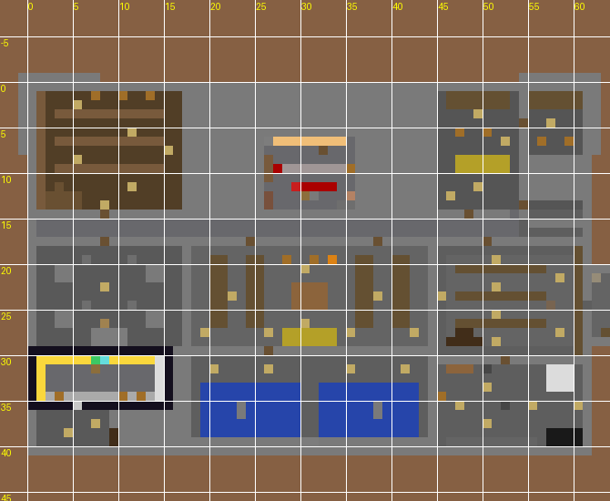
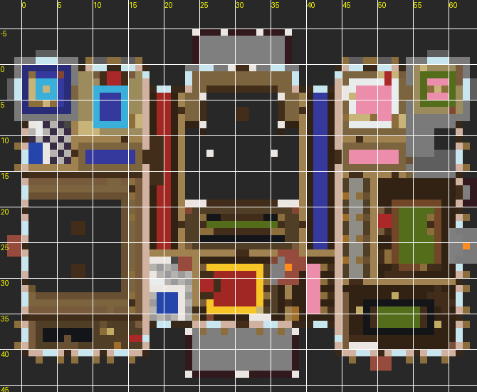
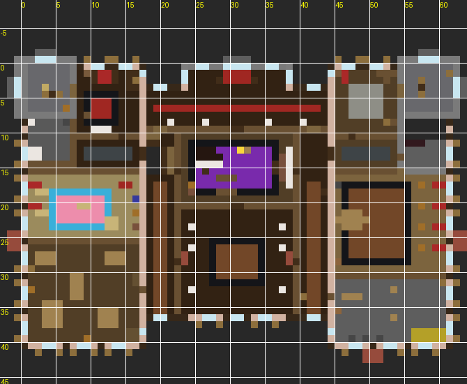
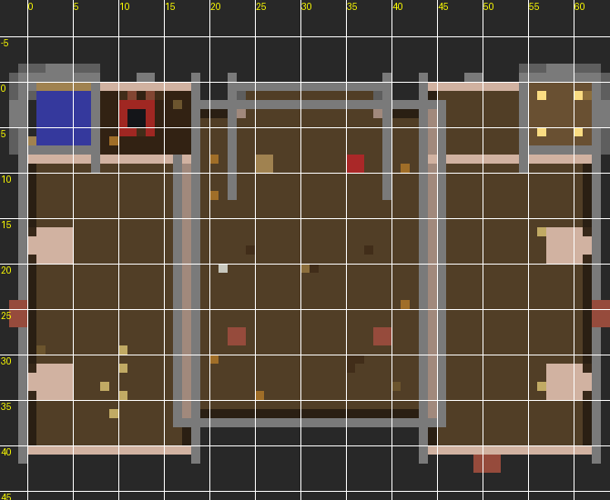

# Ashgrove Manor - a staged command-block mansion for Minecraft Java 1.8 / 1.8.9


## PART 1 - IMPORTANT NOTES

* **One command is not possible for a build this size.** In 1.8 a command block holds at most 32,767 characters, and the client packet that saves it caps the text at about 32,750 bytes. The whole mansion is 3331 individual `/fill`, `/setblock`, `/clone` and `/summon` commands (about 290 KB of command text, packed as tightly as the 1.8 minecart method allows), so it ships as **9 pastes into the same command block**. Every paste is complete and runs on its own. Nothing is truncated anywhere.
* **Version.** Vanilla Java Edition **1.8.0 - 1.8.9**. The installer uses only 1.8 syntax: `FallingSand` with `TileEntityData`, `MinecartCommandBlock` stacked with `Riding` (not `Passengers`), numeric block data values (no block states), and the old `/summon`, `/fill`, `/clone` and `/gamerule` syntax. It uses no functions, datapacks, structure blocks, observers, concrete, glazed terracotta, `/execute ... run`, or 1.9+ entity ids.
* **Tested on real servers.** All 9 pastes were run on vanilla 1.8.9 and 1.8.0 server jars (details in Part 7). The world was then compared block-by-block with the design model: **0 wrong blocks**, and every painting, armor stand and item frame was in place.
* **The build direction is +X (east) and +Z (south) of your command block.** The build occupies the box from CB+(2, -11, 2) to CB+(84, 45, 84): 83 x 83 blocks of ground, 45 blocks up and 11 down (for the escape tunnel). The mansion itself is 62 wide (X) and 41 deep (Z), plus the portico, conservatory and grounds.
* **Terrain.** Stage 1 levels the whole plot. It clears everything from ground level up to 45 blocks above the command block and lays dirt and grass at the command block's ground level. Flat land (for example a superflat world) gives the best result. On a hillside, terrain below the command block's level stays as it is under the lawn.
* **Chunks must be loaded.** Stand next to the command block while installing, and use a render distance of **8 chunks or more** (the far corner is about 120 blocks away). A `/fill` into an unloaded chunk fails silently.
* **Lag.** Stage 1 clears about 310,000 blocks, so the game freezes for 10-20 seconds; the server log may print "Can't keep up". The other stages take about 5 seconds each. Wait for the chat message before pasting the next command.
* **Self-cleaning.** After each stage the installer removes its minecarts, the rail, the helper blocks and any dropped items within 150 blocks. The last stage also removes your command block and turns command-block chat feedback back on. Nothing of the installer remains, and nothing inside the mansion is touched by the cleanup.
* **Multiplayer.** Command blocks must be enabled (`enable-command-block=true` in `server.properties`), and you must be an operator in Creative mode to edit one.

## PART 2 - INSTALLATION

1. Find (or make) a flat area at least **90 x 90 blocks** to the south-east of where you stand, with open sky. Press F3: **+X is east and +Z is south.** The mansion is built in the +X/+Z quarter from your command block, starting 2 blocks away.
2. Get a command block: `/give @p command_block` (you need cheats enabled or op).
3. Place the command block **on the ground** (its bottom touching the grass). Keep the 3 blocks above it empty; the installer drops its minecarts there.
4. Put a **stone button on the north (-Z) or west (-X) face** of the command block. Do not put it on top (that is where the installer lands) or on the east face (the cleanup uses that column).
5. Stand anywhere next to it (not on top), for example 3 blocks to the west. Right-click the command block, paste **Command 1** (Part 3), click **Done**, then press the button.
6. When chat shows **"[Mansion] Stage 1/9 complete. Now paste Command 2..."**, open the **same** command block again, select all (Ctrl+A), paste **Command 2** over the old text, click Done and press the button. Repeat for Commands 3 to 9. Always paste in order.
7. After Command 9 chat says **"the mansion is finished!"** and the command block disappears. Walk up the drive and through the front doors.

Tips: every command is one line of about 32,700 characters. Copy it from the raw text files (`commands/command_01.txt` ... `command_09.txt`) or from the code blocks below. Select the whole line; a missing character breaks the paste. If a stage is interrupted (for example, the game was closed mid-stage), paste the same command again; every stage is safe to repeat.

| Command | Characters | What it builds |
|---|---|---|
| 1 | 32668 | site, basement shell, shell, floors, roofs, facades |
| 2 | 32670 | facades, portico + front steps |
| 3 | 32680 | portico + front steps, facades, towers, dormers, widow walk + cupola, central chimneys, basement layout, basement archive, basement family crypt ... |
| 4 | 32691 | basement east: storage, wine cellar, utility, wine cellar secret door + stash, secret redstone room, secret vault, secret escape tunnel, F1 walls, F1 foyer + grand staircase, F1 salon + conservatory |
| 5 | 32655 | F1 salon + conservatory, F1 halls, F1 study + map room + bath, F1 corridors, F1 library (two storeys), F1 library secret door, F1 secret study, F1 drawing room + breakfast nook, F1 dining room |
| 6 | 32613 | F1 dining room, F1 kitchen + pantry, back stairs, F1 doors, F1 lighting, F1 foyer details, secret hatches, F2 walls, F2 west: blue room, tower, bath, corridor ... |
| 7 | 32634 | F2 halls + lounge, F2 master suite, F2 east: rose room, green room, billiards, F2 doors, F3 walls, F2-F3 west stair, F3 gallery, music room, trophy room, halls |
| 8 | 32612 | F3 gallery, music room, trophy room, halls, F3 west: old bedroom, washroom, nursery, lumber room, NW tower stairs + observatory, F3 east: governess, servants, laundry, NE tower, F3 doors, secret attic room, central attic + cupola ladder, extra lighting |
| 9 | 29210 | extra lighting, finishing: water, fire, paintings, grounds |

## PART 3 - COMMAND

**Command 1 of 9**: paste into the command block, press the button. Also in [`commands/command_01.txt`](commands/command_01.txt).

```
summon FallingSand ~ ~1 ~ {Block:activator_rail,Time:1,Riding:{id:FallingSand,Block:redstone_block,Time:1,Riding:{id:FallingSand,Block:command_block,Time:1,TileEntityData:{Command:"summon MinecartCommandBlock ~ ~1.6 ~ {Command:fill ~2 ~-3 ~44 ~22 ~19 ~84 air,Riding:{id:MinecartCommandBlock,Command:fill ~23 ~20 ~2 ~43 ~42 ~43 air,Riding:{id:MinecartCommandBlock,Command:fill ~2 ~20 ~2 ~22 ~42 ~43 air,Riding:{id:MinecartCommandBlock,Command:fill ~23 ~-3 ~2 ~43 ~19 ~43 air,Riding:{id:MinecartCommandBlock,Command:fill ~2 ~-3 ~2 ~22 ~19 ~43 air,Riding:{id:MinecartCommandBlock,Command:gamerule commandBlockOutput false,Riding:{id:FallingSand,Riding:{id:MinecartCommandBlock,Command:fill ~44 ~20 ~2 ~84 ~42 ~22 air,Riding:{id:MinecartCommandBlock,Command:fill ~44 ~-3 ~23 ~84 ~19 ~43 air,Riding:{id:MinecartCommandBlock,Command:fill ~44 ~-3 ~2 ~84 ~19 ~22 air,Riding:{id:MinecartCommandBlock,Command:fill ~23 ~20 ~44 ~43 ~42 ~84 air,Riding:{id:MinecartCommandBlock,Command:fill ~2 ~20 ~44 ~22 ~42 ~84 air,Riding:{id:MinecartCommandBlock,Command:fill ~23 ~-3 ~44 ~43 ~19 ~84 air,Riding:{id:FallingSand,Riding:{id:MinecartCommandBlock,Command:fill ~2 ~-7 ~2 ~84 ~-5 ~84 dirt,Riding:{id:MinecartCommandBlock,Command:fill ~65 ~20 ~44 ~84 ~42 ~84 air,Riding:{id:MinecartCommandBlock,Command:fill ~44 ~20 ~44 ~64 ~42 ~84 air,Riding:{id:MinecartCommandBlock,Command:fill ~65 ~-3 ~44 ~84 ~19 ~84 air,Riding:{id:MinecartCommandBlock,Command:fill ~44 ~-3 ~44 ~64 ~19 ~84 air,Riding:{id:MinecartCommandBlock,Command:fill ~44 ~20 ~23 ~84 ~42 ~43 air,Riding:{id:FallingSand,Riding:{id:MinecartCommandBlock,Command:fill ~11 ~-3 ~25 ~19 ~-3 ~25 cobblestone,Riding:{id:MinecartCommandBlock,Command:fill ~13 ~-2 ~27 ~72 ~-2 ~65 planks 1,Riding:{id:MinecartCommandBlock,Command:fill ~12 ~-8 ~26 ~73 ~-2 ~66 stonebrick 0 hollow,Riding:{id:MinecartCommandBlock,Command:fill ~66 ~-8 ~25 ~74 ~-2 ~33 stonebrick,Riding:{id:MinecartCommandBlock,Command:fill ~11 ~-8 ~25 ~19 ~-2 ~33 stonebrick,Riding:{id:MinecartCommandBlock,Command:fill ~2 ~-4 ~2 ~84 ~-4 ~84 grass,Riding:{id:FallingSand,Riding:{id:MinecartCommandBlock,Command:fill ~29 ~-1 ~29 ~56 ~20 ~62 stonebrick 0 hollow,Riding:{id:MinecartCommandBlock,Command:fill ~56 ~-1 ~26 ~73 ~20 ~66 stonebrick 0 hollow,Riding:{id:MinecartCommandBlock,Command:fill ~12 ~-1 ~26 ~29 ~20 ~66 stonebrick 0 hollow,Riding:{id:MinecartCommandBlock,Command:fill ~74 ~-3 ~25 ~74 ~-3 ~33 cobblestone,Riding:{id:MinecartCommandBlock,Command:fill ~66 ~-3 ~25 ~74 ~-3 ~25 cobblestone,Riding:{id:MinecartCommandBlock,Command:fill ~11 ~-3 ~25 ~11 ~-3 ~33 cobblestone,Riding:{id:FallingSand,Riding:{id:MinecartCommandBlock,Command:fill ~73 ~-3 ~26 ~73 ~-3 ~66 cobblestone,Riding:{id:MinecartCommandBlock,Command:fill ~12 ~-3 ~26 ~12 ~-3 ~66 cobblestone,Riding:{id:MinecartCommandBlock,Command:fill ~12 ~-3 ~66 ~73 ~-3 ~66 cobblestone,Riding:{id:MinecartCommandBlock,Command:fill ~12 ~-3 ~26 ~73 ~-3 ~26 cobblestone,Riding:{id:MinecartCommandBlock,Command:fill ~35 ~-1 ~62 ~50 ~6 ~69 stonebrick 0 hollow,Riding:{id:MinecartCommandBlock,Command:fill ~35 ~-1 ~26 ~50 ~20 ~29 stonebrick 0 hollow,Riding:{id:FallingSand,Riding:{id:MinecartCommandBlock,Command:fill ~13 ~6 ~27 ~28 ~6 ~65 planks 1,Riding:{id:MinecartCommandBlock,Command:fill ~66 ~-1 ~25 ~74 ~27 ~33 stonebrick 0 hollow,Riding:{id:MinecartCommandBlock,Command:fill ~11 ~-1 ~25 ~19 ~33 ~33 stonebrick 0 hollow,Riding:{id:MinecartCommandBlock,Command:fill ~30 ~7 ~29 ~55 ~20 ~62 stained_hardened_clay 0 replace stonebrick,Riding:{id:MinecartCommandBlock,Command:fill ~56 ~7 ~26 ~73 ~20 ~66 stained_hardened_clay 0 replace stonebrick,Riding:{id:MinecartCommandBlock,Command:fill ~12 ~7 ~26 ~29 ~20 ~66 stained_hardened_clay 0 replace stonebrick,Riding:{id:FallingSand,Riding:{id:MinecartCommandBlock,Command:fill ~57 ~7 ~27 ~72 ~7 ~65 planks,Riding:{id:MinecartCommandBlock,Command:fill ~57 ~6 ~27 ~72 ~6 ~65 planks 1,Riding:{id:MinecartCommandBlock,Command:fill ~13 ~20 ~27 ~28 ~20 ~65 wooden_slab 1,Riding:{id:MinecartCommandBlock,Command:fill ~13 ~14 ~27 ~28 ~14 ~65 planks,Riding:{id:MinecartCommandBlock,Command:fill ~13 ~13 ~27 ~28 ~13 ~65 planks 1,Riding:{id:MinecartCommandBlock,Command:fill ~13 ~7 ~27 ~28 ~7 ~65 planks,Riding:{id:FallingSand,Riding:{id:MinecartCommandBlock,Command:fill ~30 ~13 ~30 ~55 ~13 ~61 planks 1,Riding:{id:MinecartCommandBlock,Command:fill ~30 ~7 ~30 ~55 ~7 ~61 planks,Riding:{id:MinecartCommandBlock,Command:fill ~30 ~6 ~30 ~55 ~6 ~61 planks 1,Riding:{id:MinecartCommandBlock,Command:fill ~57 ~20 ~27 ~72 ~20 ~65 wooden_slab 1,Riding:{id:MinecartCommandBlock,Command:fill ~57 ~14 ~27 ~72 ~14 ~65 planks,Riding:{id:MinecartCommandBlock,Command:fill ~57 ~13 ~27 ~72 ~13 ~65 planks 1,Riding:{id:FallingSand,Riding:{id:MinecartCommandBlock,Command:fill ~36 ~14 ~27 ~49 ~14 ~29 planks,Riding:{id:MinecartCommandBlock,Command:fill ~36 ~13 ~27 ~49 ~13 ~29 planks 1,Riding:{id:MinecartCommandBlock,Command:fill ~36 ~7 ~27 ~49 ~7 ~29 planks,Riding:{id:MinecartCommandBlock,Command:fill ~36 ~6 ~27 ~49 ~6 ~29 planks 1,Riding:{id:MinecartCommandBlock,Command:fill ~30 ~20 ~30 ~55 ~20 ~61 wooden_slab 1,Riding:{id:MinecartCommandBlock,Command:fill ~30 ~14 ~30 ~55 ~14 ~61 planks,Riding:{id:FallingSand,Riding:{id:MinecartCommandBlock,Command:fill ~12 ~20 ~26 ~18 ~20 ~32 planks 1,Riding:{id:MinecartCommandBlock,Command:fill ~12 ~14 ~26 ~18 ~14 ~32 planks,Riding:{id:MinecartCommandBlock,Command:fill ~12 ~13 ~26 ~18 ~13 ~32 planks 1,Riding:{id:MinecartCommandBlock,Command:fill ~12 ~7 ~26 ~18 ~7 ~32 planks,Riding:{id:MinecartCommandBlock,Command:fill ~12 ~6 ~26 ~18 ~6 ~32 planks 1,Riding:{id:MinecartCommandBlock,Command:fill ~36 ~20 ~27 ~49 ~20 ~29 wooden_slab 1,Riding:{id:FallingSand,Riding:{id:MinecartCommandBlock,Command:fill ~67 ~20 ~26 ~73 ~20 ~32 planks 1,Riding:{id:MinecartCommandBlock,Command:fill ~67 ~14 ~26 ~73 ~14 ~32 planks,Riding:{id:MinecartCommandBlock,Command:fill ~67 ~13 ~26 ~73 ~13 ~32 planks 1,Riding:{id:MinecartCommandBlock,Command:fill ~67 ~7 ~26 ~73 ~7 ~32 planks,Riding:{id:MinecartCommandBlock,Command:fill ~67 ~6 ~26 ~73 ~6 ~32 planks 1,Riding:{id:MinecartCommandBlock,Command:fill ~12 ~21 ~26 ~18 ~21 ~32 planks,Riding:{id:FallingSand,Riding:{id:MinecartCommandBlock,Command:fill ~12 ~21 ~34 ~29 ~21 ~34 stained_hardened_clay,Riding:{id:MinecartCommandBlock,Command:fill ~30 ~21 ~33 ~30 ~21 ~67 stone_brick_stairs 1,Riding:{id:MinecartCommandBlock,Command:fill ~11 ~21 ~33 ~11 ~21 ~67 stone_brick_stairs,Riding:{id:MinecartCommandBlock,Command:fill ~36 ~6 ~63 ~49 ~6 ~68 planks 1,Riding:{id:MinecartCommandBlock,Command:fill ~12 ~27 ~26 ~18 ~27 ~32 planks 5,Riding:{id:MinecartCommandBlock,Command:fill ~67 ~21 ~26 ~73 ~21 ~32 planks,Riding:{id:FallingSand,Riding:{id:MinecartCommandBlock,Command:fill ~13 ~23 ~33 ~13 ~23 ~67 dark_oak_stairs,Riding:{id:MinecartCommandBlock,Command:fill ~13 ~22 ~66 ~28 ~22 ~66 stained_hardened_clay,Riding:{id:MinecartCommandBlock,Command:fill ~13 ~22 ~34 ~28 ~22 ~34 stained_hardened_clay,Riding:{id:MinecartCommandBlock,Command:fill ~29 ~22 ~33 ~29 ~22 ~67 dark_oak_stairs 1,Riding:{id:MinecartCommandBlock,Command:fill ~12 ~22 ~33 ~12 ~22 ~67 dark_oak_stairs,Riding:{id:MinecartCommandBlock,Command:fill ~12 ~21 ~66 ~29 ~21 ~66 stained_hardened_clay,Riding:{id:FallingSand,Riding:{id:MinecartCommandBlock,Command:fill ~15 ~24 ~34 ~26 ~24 ~34 stained_hardened_clay,Riding:{id:MinecartCommandBlock,Command:fill ~27 ~24 ~33 ~27 ~24 ~67 dark_oak_stairs 1,Riding:{id:MinecartCommandBlock,Command:fill ~14 ~24 ~33 ~14 ~24 ~67 dark_oak_stairs,Riding:{id:MinecartCommandBlock,Command:fill ~14 ~23 ~66 ~27 ~23 ~66 stained_hardened_clay,Riding:{id:MinecartCommandBlock,Command:fill ~14 ~23 ~34 ~27 ~23 ~34 stained_hardened_clay,Riding:{id:MinecartCommandBlock,Command:fill ~28 ~23 ~33 ~28 ~23 ~67 dark_oak_stairs 1,Riding:{id:FallingSand,Riding:{id:MinecartCommandBlock,Command:fill ~16 ~26 ~33 ~16 ~26 ~67 dark_oak_stairs,Riding:{id:MinecartCommandBlock,Command:fill ~16 ~25 ~66 ~25 ~25 ~66 stained_hardened_clay,Riding:{id:MinecartCommandBlock,Command:fill ~16 ~25 ~34 ~25 ~25 ~34 stained_hardened_clay,Riding:{id:MinecartCommandBlock,Command:fill ~26 ~25 ~33 ~26 ~25 ~67 dark_oak_stairs 1,Riding:{id:MinecartCommandBlock,Command:fill ~15 ~25 ~33 ~15 ~25 ~67 dark_oak_stairs,Riding:{id:MinecartCommandBlock,Command:fill ~15 ~24 ~66 ~26 ~24 ~66 stained_hardened_clay,Riding:{id:FallingSand,Riding:{id:MinecartCommandBlock,Command:fill ~18 ~27 ~34 ~23 ~27 ~34 stained_hardened_clay,Riding:{id:MinecartCommandBlock,Command:fill ~24 ~27 ~33 ~24 ~27 ~67 dark_oak_stairs 1,Riding:{id:MinecartCommandBlock,Command:fill ~17 ~27 ~33 ~17 ~27 ~67 dark_oak_stairs,Riding:{id:MinecartCommandBlock,Command:fill ~17 ~26 ~66 ~24 ~26 ~66 stained_hardened_clay,Riding:{id:MinecartCommandBlock,Command:fill ~17 ~26 ~34 ~24 ~26 ~34 stained_hardened_clay,Riding:{id:MinecartCommandBlock,Command:fill ~25 ~26 ~33 ~25 ~26 ~67 dark_oak_stairs 1,Riding:{id:FallingSand,Riding:{id:MinecartCommandBlock,Command:fill ~19 ~29 ~33 ~19 ~29 ~67 dark_oak_stairs,Riding:{id:MinecartCommandBlock,Command:fill ~19 ~28 ~66 ~22 ~28 ~66 stained_hardened_clay,Riding:{id:MinecartCommandBlock,Command:fill ~19 ~28 ~34 ~22 ~28 ~34 stained_hardened_clay,Riding:{id:MinecartCommandBlock,Command:fill ~23 ~28 ~33 ~23 ~28 ~67 dark_oak_stairs 1,Riding:{id:MinecartCommandBlock,Command:fill ~18 ~28 ~33 ~18 ~28 ~67 dark_oak_stairs,Riding:{id:MinecartCommandBlock,Command:fill ~18 ~27 ~66 ~23 ~27 ~66 stained_hardened_clay,Riding:{id:FallingSand,Riding:{id:MinecartCommandBlock,Command:fill ~20 ~31 ~33 ~21 ~31 ~67 stone_slab 5,Riding:{id:MinecartCommandBlock,Command:fill ~21 ~30 ~33 ~21 ~30 ~67 dark_oak_stairs 1,Riding:{id:MinecartCommandBlock,Command:fill ~20 ~30 ~33 ~20 ~30 ~67 dark_oak_stairs,Riding:{id:MinecartCommandBlock,Command:fill ~20 ~29 ~66 ~21 ~29 ~66 stained_hardened_clay,Riding:{id:MinecartCommandBlock,Command:fill ~20 ~29 ~34 ~21 ~29 ~34 stained_hardened_clay,Riding:{id:MinecartCommandBlock,Command:fill ~22 ~29 ~33 ~22 ~29 ~67 dark_oak_stairs 1,Riding:{id:FallingSand,Riding:{id:MinecartCommandBlock,Command:fill ~21 ~22 ~26 ~28 ~22 ~26 stained_hardened_clay,Riding:{id:MinecartCommandBlock,Command:fill ~29 ~22 ~25 ~29 ~22 ~35 dark_oak_stairs 1,Riding:{id:MinecartCommandBlock,Command:fill ~20 ~22 ~25 ~20 ~22 ~35 dark_oak_stairs,Riding:{id:MinecartCommandBlock,Command:fill ~20 ~21 ~26 ~29 ~21 ~26 stained_hardened_clay,Riding:{id:MinecartCommandBlock,Command:fill ~30 ~21 ~25 ~30 ~21 ~35 stone_brick_stairs 1,Riding:{id:MinecartCommandBlock,Command:fill ~19 ~21 ~25 ~19 ~21 ~35 stone_brick_stairs,Riding:{id:FallingSand,Riding:{id:MinecartCommandBlock,Command:fill ~23 ~24 ~26 ~26 ~24 ~26 stained_hardened_clay,Riding:{id:MinecartCommandBlock,Command:fill ~27 ~24 ~25 ~27 ~24 ~35 dark_oak_stairs 1,Riding:{id:MinecartCommandBlock,Command:fill ~22 ~24 ~25 ~22 ~24 ~35 dark_oak_stairs,Riding:{id:MinecartCommandBlock,Command:fill ~22 ~23 ~26 ~27 ~23 ~26 stained_hardened_clay,Riding:{id:MinecartCommandBlock,Command:fill ~28 ~23 ~25 ~28 ~23 ~35 dark_oak_stairs 1,Riding:{id:MinecartCommandBlock,Command:fill ~21 ~23 ~25 ~21 ~23 ~35 dark_oak_stairs,Riding:{id:FallingSand,Riding:{id:MinecartCommandBlock,Command:fill ~24 ~27 ~25 ~25 ~27 ~35 stone_slab 5,Riding:{id:MinecartCommandBlock,Command:fill ~25 ~26 ~25 ~25 ~26 ~35 dark_oak_stairs 1,Riding:{id:MinecartCommandBlock,Command:fill ~24 ~26 ~25 ~24 ~26 ~35 dark_oak_stairs,Riding:{id:MinecartCommandBlock,Command:fill ~24 ~25 ~26 ~25 ~25 ~26 stained_hardened_clay,Riding:{id:MinecartCommandBlock,Command:fill ~26 ~25 ~25 ~26 ~25 ~35 dark_oak_stairs 1,Riding:{id:MinecartCommandBlock,Command:fill ~23 ~25 ~25 ~23 ~25 ~35 dark_oak_stairs,Riding:{id:FallingSand,Riding:{id:MinecartCommandBlock,Command:fill ~73 ~22 ~33 ~73 ~22 ~67 dark_oak_stairs 1,Riding:{id:MinecartCommandBlock,Command:fill ~56 ~22 ~33 ~56 ~22 ~67 dark_oak_stairs,Riding:{id:MinecartCommandBlock,Command:fill ~56 ~21 ~66 ~73 ~21 ~66 stained_hardened_clay,Riding:{id:MinecartCommandBlock,Command:fill ~56 ~21 ~34 ~73 ~21 ~34 stained_hardened_clay,Riding:{id:MinecartCommandBlock,Command:fill ~74 ~21 ~33 ~74 ~21 ~67 stone_brick_stairs 1,Riding:{id:MinecartCommandBlock,Command:fill ~55 ~21 ~33 ~55 ~21 ~67 stone_brick_stairs,Riding:{id:FallingSand,Riding:{id:MinecartCommandBlock,Command:fill ~58 ~23 ~66 ~71 ~23 ~66 stained_hardened_clay,Riding:{id:MinecartCommandBlock,Command:fill ~58 ~23 ~34 ~71 ~23 ~34 stained_hardened_clay,Riding:{id:MinecartCommandBlock,Command:fill ~72 ~23 ~33 ~72 ~23 ~67 dark_oak_stairs 1,Riding:{id:MinecartCommandBlock,Command:fill ~57 ~23 ~33 ~57 ~23 ~67 dark_oak_stairs,Riding:{id:MinecartCommandBlock,Command:fill ~57 ~22 ~66 ~72 ~22 ~66 stained_hardened_clay,Riding:{id:MinecartCommandBlock,Command:fill ~57 ~22 ~34 ~72 ~22 ~34 stained_hardened_clay,Riding:{id:FallingSand,Riding:{id:MinecartCommandBlock,Command:fill ~70 ~25 ~33 ~70 ~25 ~67 dark_oak_stairs 1,Riding:{id:MinecartCommandBlock,Command:fill ~59 ~25 ~33 ~59 ~25 ~67 dark_oak_stairs,Riding:{id:MinecartCommandBlock,Command:fill ~59 ~24 ~66 ~70 ~24 ~66 stained_hardened_clay,Riding:{id:MinecartCommandBlock,Command:fill ~59 ~24 ~34 ~70 ~24 ~34 stained_hardened_clay,Riding:{id:MinecartCommandBlock,Command:fill ~71 ~24 ~33 ~71 ~24 ~67 dark_oak_stairs 1,Riding:{id:MinecartCommandBlock,Command:fill ~58 ~24 ~33 ~58 ~24 ~67 dark_oak_stairs,Riding:{id:FallingSand,Riding:{id:MinecartCommandBlock,Command:fill ~61 ~26 ~66 ~68 ~26 ~66 stained_hardened_clay,Riding:{id:MinecartCommandBlock,Command:fill ~61 ~26 ~34 ~68 ~26 ~34 stained_hardened_clay,Riding:{id:MinecartCommandBlock,Command:fill ~69 ~26 ~33 ~69 ~26 ~67 dark_oak_stairs 1,Riding:{id:MinecartCommandBlock,Command:fill ~60 ~26 ~33 ~60 ~26 ~67 dark_oak_stairs,Riding:{id:MinecartCommandBlock,Command:fill ~60 ~25 ~66 ~69 ~25 ~66 stained_hardened_clay,Riding:{id:MinecartCommandBlock,Command:fill ~60 ~25 ~34 ~69 ~25 ~34 stained_hardened_clay,Riding:{id:FallingSand,Riding:{id:MinecartCommandBlock,Command:fill ~67 ~28 ~33 ~67 ~28 ~67 dark_oak_stairs 1,Riding:{id:MinecartCommandBlock,Command:fill ~62 ~28 ~33 ~62 ~28 ~67 dark_oak_stairs,Riding:{id:MinecartCommandBlock,Command:fill ~62 ~27 ~66 ~67 ~27 ~66 stained_hardened_clay,Riding:{id:MinecartCommandBlock,Command:fill ~62 ~27 ~34 ~67 ~27 ~34 stained_hardened_clay,Riding:{id:MinecartCommandBlock,Command:fill ~68 ~27 ~33 ~68 ~27 ~67 dark_oak_stairs 1,Riding:{id:MinecartCommandBlock,Command:fill ~61 ~27 ~33 ~61 ~27 ~67 dark_oak_stairs,Riding:{id:FallingSand,Riding:{id:MinecartCommandBlock,Command:fill ~64 ~29 ~66 ~65 ~29 ~66 stained_hardened_clay,Riding:{id:MinecartCommandBlock,Command:fill ~64 ~29 ~34 ~65 ~29 ~34 stained_hardened_clay,Riding:{id:MinecartCommandBlock,Command:fill ~66 ~29 ~33 ~66 ~29 ~67 dark_oak_stairs 1,Riding:{id:MinecartCommandBlock,Command:fill ~63 ~29 ~33 ~63 ~29 ~67 dark_oak_stairs,Riding:{id:MinecartCommandBlock,Command:fill ~63 ~28 ~66 ~66 ~28 ~66 stained_hardened_clay,Riding:{id:MinecartCommandBlock,Command:fill ~63 ~28 ~34 ~66 ~28 ~34 stained_hardened_clay,Riding:{id:FallingSand,Riding:{id:MinecartCommandBlock,Command:fill ~56 ~21 ~26 ~65 ~21 ~26 stained_hardened_clay,Riding:{id:MinecartCommandBlock,Command:fill ~66 ~21 ~25 ~66 ~21 ~35 stone_brick_stairs 1,Riding:{id:MinecartCommandBlock,Command:fill ~55 ~21 ~25 ~55 ~21 ~35 stone_brick_stairs,Riding:{id:MinecartCommandBlock,Command:fill ~64 ~31 ~33 ~65 ~31 ~67 stone_slab 5,Riding:{id:MinecartCommandBlock,Command:fill ~65 ~30 ~33 ~65 ~30 ~67 dark_oak_stairs 1,Riding:{id:MinecartCommandBlock,Command:fill ~64 ~30 ~33 ~64 ~30 ~67 dark_oak_stairs,Riding:{id:FallingSand,Riding:{id:MinecartCommandBlock,Command:fill ~58 ~23 ~26 ~63 ~23 ~26 stained_hardened_clay,Riding:{id:MinecartCommandBlock,Command:fill ~64 ~23 ~25 ~64 ~23 ~35 dark_oak_stairs 1,Riding:{id:MinecartCommandBlock,Command:fill ~57 ~23 ~25 ~57 ~23 ~35 dark_oak_stairs,Riding:{id:MinecartCommandBlock,Command:fill ~57 ~22 ~26 ~64 ~22 ~26 stained_hardened_clay,Riding:{id:MinecartCommandBlock,Command:fill ~65 ~22 ~25 ~65 ~22 ~35 dark_oak_stairs 1,Riding:{id:MinecartCommandBlock,Command:fill ~56 ~22 ~25 ~56 ~22 ~35 dark_oak_stairs,Riding:{id:FallingSand,Riding:{id:MinecartCommandBlock,Command:fill ~60 ~25 ~26 ~61 ~25 ~26 stained_hardened_clay,Riding:{id:MinecartCommandBlock,Command:fill ~62 ~25 ~25 ~62 ~25 ~35 dark_oak_stairs 1,Riding:{id:MinecartCommandBlock,Command:fill ~59 ~25 ~25 ~59 ~25 ~35 dark_oak_stairs,Riding:{id:MinecartCommandBlock,Command:fill ~59 ~24 ~26 ~62 ~24 ~26 stained_hardened_clay,Riding:{id:MinecartCommandBlock,Command:fill ~63 ~24 ~25 ~63 ~24 ~35 dark_oak_stairs 1,Riding:{id:MinecartCommandBlock,Command:fill ~58 ~24 ~25 ~58 ~24 ~35 dark_oak_stairs,Riding:{id:FallingSand,Riding:{id:MinecartCommandBlock,Command:fill ~28 ~21 ~29 ~28 ~21 ~62 stone_brick_stairs,Riding:{id:MinecartCommandBlock,Command:fill ~28 ~21 ~63 ~57 ~21 ~63 stone_brick_stairs 3,Riding:{id:MinecartCommandBlock,Command:fill ~28 ~21 ~28 ~57 ~21 ~28 stone_brick_stairs 2,Riding:{id:MinecartCommandBlock,Command:fill ~60 ~27 ~25 ~61 ~27 ~35 stone_slab 5,Riding:{id:MinecartCommandBlock,Command:fill ~61 ~26 ~25 ~61 ~26 ~35 dark_oak_stairs 1,Riding:{id:MinecartCommandBlock,Command:fill ~60 ~26 ~25 ~60 ~26 ~35 dark_oak_stairs,Riding:{id:FallingSand,Riding:{id:MinecartCommandBlock,Command:fill ~30 ~23 ~30 ~55 ~23 ~30 dark_oak_stairs 2,Riding:{id:MinecartCommandBlock,Command:fill ~56 ~22 ~30 ~56 ~22 ~61 dark_oak_stairs 1,Riding:{id:MinecartCommandBlock,Command:fill ~29 ~22 ~30 ~29 ~22 ~61 dark_oak_stairs,Riding:{id:MinecartCommandBlock,Command:fill ~29 ~22 ~62 ~56 ~22 ~62 dark_oak_stairs 3,Riding:{id:MinecartCommandBlock,Command:fill ~29 ~22 ~29 ~56 ~22 ~29 dark_oak_stairs 2,Riding:{id:MinecartCommandBlock,Command:fill ~57 ~21 ~29 ~57 ~21 ~62 stone_brick_stairs 1,Riding:{id:FallingSand,Riding:{id:MinecartCommandBlock,Command:fill ~31 ~24 ~32 ~31 ~24 ~59 dark_oak_stairs,Riding:{id:MinecartCommandBlock,Command:fill ~31 ~24 ~60 ~54 ~24 ~60 dark_oak_stairs 3,Riding:{id:MinecartCommandBlock,Command:fill ~31 ~24 ~31 ~54 ~24 ~31 dark_oak_stairs 2,Riding:{id:MinecartCommandBlock,Command:fill ~55 ~23 ~31 ~55 ~23 ~60 dark_oak_stairs 1,Riding:{id:MinecartCommandBlock,Command:fill ~30 ~23 ~31 ~30 ~23 ~60 dark_oak_stairs,Riding:{id:MinecartCommandBlock,Command:fill ~30 ~23 ~61 ~55 ~23 ~61 dark_oak_stairs 3,Riding:{id:FallingSand,Riding:{id:MinecartCommandBlock,Command:fill ~33 ~26 ~33 ~52 ~26 ~33 dark_oak_stairs 2,Riding:{id:MinecartCommandBlock,Command:fill ~53 ~25 ~33 ~53 ~25 ~58 dark_oak_stairs 1,Riding:{id:MinecartCommandBlock,Command:fill ~32 ~25 ~33 ~32 ~25 ~58 dark_oak_stairs,Riding:{id:MinecartCommandBlock,Command:fill ~32 ~25 ~59 ~53 ~25 ~59 dark_oak_stairs 3,Riding:{id:MinecartCommandBlock,Command:fill ~32 ~25 ~32 ~53 ~25 ~32 dark_oak_stairs 2,Riding:{id:MinecartCommandBlock,Command:fill ~54 ~24 ~32 ~54 ~24 ~59 dark_oak_stairs 1,Riding:{id:FallingSand,Riding:{id:MinecartCommandBlock,Command:fill ~34 ~27 ~35 ~34 ~27 ~56 dark_oak_stairs,Riding:{id:MinecartCommandBlock,Command:fill ~34 ~27 ~57 ~51 ~27 ~57 dark_oak_stairs 3,Riding:{id:MinecartCommandBlock,Command:fill ~34 ~27 ~34 ~51 ~27 ~34 dark_oak_stairs 2,Riding:{id:MinecartCommandBlock,Command:fill ~52 ~26 ~34 ~52 ~26 ~57 dark_oak_stairs 1,Riding:{id:MinecartCommandBlock,Command:fill ~33 ~26 ~34 ~33 ~26 ~57 dark_oak_stairs,Riding:{id:MinecartCommandBlock,Command:fill ~33 ~26 ~58 ~52 ~26 ~58 dark_oak_stairs 3,Riding:{id:FallingSand,Riding:{id:MinecartCommandBlock,Command:fill ~36 ~29 ~36 ~49 ~29 ~36 dark_oak_stairs 2,Riding:{id:MinecartCommandBlock,Command:fill ~50 ~28 ~36 ~50 ~28 ~55 dark_oak_stairs 1,Riding:{id:MinecartCommandBlock,Command:fill ~35 ~28 ~36 ~35 ~28 ~55 dark_oak_stairs,Riding:{id:MinecartCommandBlock,Command:fill ~35 ~28 ~56 ~50 ~28 ~56 dark_oak_stairs 3,Riding:{id:MinecartCommandBlock,Command:fill ~35 ~28 ~35 ~50 ~28 ~35 dark_oak_stairs 2,Riding:{id:MinecartCommandBlock,Command:fill ~51 ~27 ~35 ~51 ~27 ~56 dark_oak_stairs 1,Riding:{id:FallingSand,Riding:{id:MinecartCommandBlock,Command:fill ~37 ~30 ~38 ~37 ~30 ~53 dark_oak_stairs,Riding:{id:MinecartCommandBlock,Command:fill ~37 ~30 ~54 ~48 ~30 ~54 dark_oak_stairs 3,Riding:{id:MinecartCommandBlock,Command:fill ~37 ~30 ~37 ~48 ~30 ~37 dark_oak_stairs 2,Riding:{id:MinecartCommandBlock,Command:fill ~49 ~29 ~37 ~49 ~29 ~54 dark_oak_stairs 1,Riding:{id:MinecartCommandBlock,Command:fill ~36 ~29 ~37 ~36 ~29 ~54 dark_oak_stairs,Riding:{id:MinecartCommandBlock,Command:fill ~36 ~29 ~55 ~49 ~29 ~55 dark_oak_stairs 3,Riding:{id:FallingSand,Riding:{id:MinecartCommandBlock,Command:fill ~39 ~32 ~39 ~46 ~32 ~52 wooden_slab 5,Riding:{id:MinecartCommandBlock,Command:fill ~47 ~31 ~39 ~47 ~31 ~52 dark_oak_stairs 1,Riding:{id:MinecartCommandBlock,Command:fill ~38 ~31 ~39 ~38 ~31 ~52 dark_oak_stairs,Riding:{id:MinecartCommandBlock,Command:fill ~38 ~31 ~53 ~47 ~31 ~53 dark_oak_stairs 3,Riding:{id:MinecartCommandBlock,Command:fill ~38 ~31 ~38 ~47 ~31 ~38 dark_oak_stairs 2,Riding:{id:MinecartCommandBlock,Command:fill ~48 ~30 ~38 ~48 ~30 ~53 dark_oak_stairs 1,Riding:{id:FallingSand,Riding:{id:MinecartCommandBlock,Command:fill ~36 ~22 ~26 ~49 ~22 ~26 stonebrick,Riding:{id:MinecartCommandBlock,Command:fill ~50 ~22 ~25 ~50 ~22 ~38 dark_oak_stairs 1,Riding:{id:MinecartCommandBlock,Command:fill ~35 ~22 ~25 ~35 ~22 ~38 dark_oak_stairs,Riding:{id:MinecartCommandBlock,Command:fill ~35 ~21 ~26 ~50 ~21 ~26 stonebrick,Riding:{id:MinecartCommandBlock,Command:fill ~51 ~21 ~25 ~51 ~21 ~38 stone_brick_stairs 1,Riding:{id:MinecartCommandBlock,Command:fill ~34 ~21 ~25 ~34 ~21 ~38 stone_brick_stairs,Riding:{id:FallingSand,Riding:{id:MinecartCommandBlock,Command:fill ~38 ~24 ~26 ~47 ~24 ~26 stonebrick,Riding:{id:MinecartCommandBlock,Command:fill ~48 ~24 ~25 ~48 ~24 ~38 dark_oak_stairs 1,Riding:{id:MinecartCommandBlock,Command:fill ~37 ~24 ~25 ~37 ~24 ~38 dark_oak_stairs,Riding:{id:MinecartCommandBlock,Command:fill ~37 ~23 ~26 ~48 ~23 ~26 stonebrick,Riding:{id:MinecartCommandBlock,Command:fill ~49 ~23 ~25 ~49 ~23 ~38 dark_oak_stairs 1,Riding:{id:MinecartCommandBlock,Command:fill ~36 ~23 ~25 ~36 ~23 ~38 dark_oak_stairs,Riding:{id:FallingSand,Riding:{id:MinecartCommandBlock,Command:fill ~40 ~26 ~26 ~45 ~26 ~26 stonebrick,Riding:{id:MinecartCommandBlock,Command:fill ~46 ~26 ~25 ~46 ~26 ~38 dark_oak_stairs 1,Riding:{id:MinecartCommandBlock,Command:fill ~39 ~26 ~25 ~39 ~26 ~38 dark_oak_stairs,Riding:{id:MinecartCommandBlock,Command:fill ~39 ~25 ~26 ~46 ~25 ~26 stonebrick,Riding:{id:MinecartCommandBlock,Command:fill ~47 ~25 ~25 ~47 ~25 ~38 dark_oak_stairs 1,Riding:{id:MinecartCommandBlock,Command:fill ~38 ~25 ~25 ~38 ~25 ~38 dark_oak_stairs,Riding:{id:FallingSand,Riding:{id:MinecartCommandBlock,Command:fill ~42 ~28 ~26 ~43 ~28 ~26 stonebrick,Riding:{id:MinecartCommandBlock,Command:fill ~44 ~28 ~25 ~44 ~28 ~38 dark_oak_stairs 1,Riding:{id:MinecartCommandBlock,Command:fill ~41 ~28 ~25 ~41 ~28 ~38 dark_oak_stairs,Riding:{id:MinecartCommandBlock,Command:fill ~41 ~27 ~26 ~44 ~27 ~26 stonebrick,Riding:{id:MinecartCommandBlock,Command:fill ~45 ~27 ~25 ~45 ~27 ~38 dark_oak_stairs 1,Riding:{id:MinecartCommandBlock,Command:fill ~40 ~27 ~25 ~40 ~27 ~38 dark_oak_stairs,Riding:{id:FallingSand,Riding:{id:MinecartCommandBlock,Command:fill ~10 ~34 ~25 ~10 ~34 ~33 dark_oak_stairs,Riding:{id:MinecartCommandBlock,Command:fill ~10 ~34 ~34 ~20 ~34 ~34 dark_oak_stairs 3,Riding:{id:MinecartCommandBlock,Command:fill ~10 ~34 ~24 ~20 ~34 ~24 dark_oak_stairs 2,Riding:{id:MinecartCommandBlock,Command:fill ~42 ~30 ~25 ~43 ~30 ~38 stone_slab 5,Riding:{id:MinecartCommandBlock,Command:fill ~43 ~29 ~25 ~43 ~29 ~38 dark_oak_stairs 1,Riding:{id:MinecartCommandBlock,Command:fill ~42 ~29 ~25 ~42 ~29 ~38 dark_oak_stairs,Riding:{id:FallingSand,Riding:{id:MinecartCommandBlock,Command:fill ~19 ~36 ~26 ~19 ~36 ~32 dark_oak_stairs 1,Riding:{id:MinecartCommandBlock,Command:fill ~11 ~36 ~26 ~11 ~36 ~32 dark_oak_stairs,Riding:{id:MinecartCommandBlock,Command:fill ~11 ~36 ~33 ~19 ~36 ~33 dark_oak_stairs 3,Riding:{id:MinecartCommandBlock,Command:fill ~11 ~36 ~25 ~19 ~36 ~25 dark_oak_stairs 2,Riding:{id:MinecartCommandBlock,Command:fill ~11 ~35 ~25 ~19 ~35 ~33 planks 5,Riding:{id:MinecartCommandBlock,Command:fill ~20 ~34 ~25 ~20 ~34 ~33 dark_oak_stairs 1,Riding:{id:FallingSand,Riding:{id:MinecartCommandBlock,Command:fill ~13 ~39 ~27 ~17 ~39 ~31 planks 5,Riding:{id:MinecartCommandBlock,Command:fill ~18 ~38 ~27 ~18 ~38 ~31 dark_oak_stairs 1,Riding:{id:MinecartCommandBlock,Command:fill ~12 ~38 ~27 ~12 ~38 ~31 dark_oak_stairs,Riding:{id:MinecartCommandBlock,Command:fill ~12 ~38 ~32 ~18 ~38 ~32 dark_oak_stairs 3,Riding:{id:MinecartCommandBlock,Command:fill ~12 ~38 ~26 ~18 ~38 ~26 dark_oak_stairs 2,Riding:{id:MinecartCommandBlock,Command:fill ~12 ~37 ~26 ~18 ~37 ~32 planks 5,Riding:{id:FallingSand,Riding:{id:MinecartCommandBlock,Command:fill ~14 ~42 ~28 ~16 ~42 ~28 dark_oak_stairs 2,Riding:{id:MinecartCommandBlock,Command:fill ~14 ~41 ~28 ~16 ~41 ~30 planks 5,Riding:{id:MinecartCommandBlock,Command:fill ~17 ~40 ~28 ~17 ~40 ~30 dark_oak_stairs 1,Riding:{id:MinecartCommandBlock,Command:fill ~13 ~40 ~28 ~13 ~40 ~30 dark_oak_stairs,Riding:{id:MinecartCommandBlock,Command:fill ~13 ~40 ~31 ~17 ~40 ~31 dark_oak_stairs 3,Riding:{id:MinecartCommandBlock,Command:fill ~13 ~40 ~27 ~17 ~40 ~27 dark_oak_stairs 2,Riding:{id:FallingSand,Riding:{id:MinecartCommandBlock,Command:fill ~65 ~28 ~25 ~65 ~28 ~33 dark_oak_stairs,Riding:{id:MinecartCommandBlock,Command:fill ~65 ~28 ~34 ~75 ~28 ~34 dark_oak_stairs 3,Riding:{id:MinecartCommandBlock,Command:fill ~65 ~28 ~24 ~75 ~28 ~24 dark_oak_stairs 2,Riding:{id:MinecartCommandBlock,Command:fill ~16 ~42 ~29 ~16 ~42 ~29 dark_oak_stairs 1,Riding:{id:MinecartCommandBlock,Command:fill ~14 ~42 ~29 ~14 ~42 ~29 dark_oak_stairs,Riding:{id:MinecartCommandBlock,Command:fill ~14 ~42 ~30 ~16 ~42 ~30 dark_oak_stairs 3,Riding:{id:FallingSand,Riding:{id:MinecartCommandBlock,Command:fill ~74 ~30 ~26 ~74 ~30 ~32 dark_oak_stairs 1,Riding:{id:MinecartCommandBlock,Command:fill ~66 ~30 ~26 ~66 ~30 ~32 dark_oak_stairs,Riding:{id:MinecartCommandBlock,Command:fill ~66 ~30 ~33 ~74 ~30 ~33 dark_oak_stairs 3,Riding:{id:MinecartCommandBlock,Command:fill ~66 ~30 ~25 ~74 ~30 ~25 dark_oak_stairs 2,Riding:{id:MinecartCommandBlock,Command:fill ~66 ~29 ~25 ~74 ~29 ~33 planks 5,Riding:{id:MinecartCommandBlock,Command:fill ~75 ~28 ~25 ~75 ~28 ~33 dark_oak_stairs 1,Riding:{id:FallingSand,Riding:{id:MinecartCommandBlock,Command:fill ~68 ~33 ~27 ~72 ~33 ~31 planks 5,Riding:{id:MinecartCommandBlock,Command:fill ~73 ~32 ~27 ~73 ~32 ~31 dark_oak_stairs 1,Riding:{id:MinecartCommandBlock,Command:fill ~67 ~32 ~27 ~67 ~32 ~31 dark_oak_stairs,Riding:{id:MinecartCommandBlock,Command:fill ~67 ~32 ~32 ~73 ~32 ~32 dark_oak_stairs 3,Riding:{id:MinecartCommandBlock,Command:fill ~67 ~32 ~26 ~73 ~32 ~26 dark_oak_stairs 2,Riding:{id:MinecartCommandBlock,Command:fill ~67 ~31 ~26 ~73 ~31 ~32 planks 5,Riding:{id:FallingSand,Riding:{id:MinecartCommandBlock,Command:fill ~69 ~36 ~28 ~71 ~36 ~28 dark_oak_stairs 2,Riding:{id:MinecartCommandBlock,Command:fill ~69 ~35 ~28 ~71 ~35 ~30 planks 5,Riding:{id:MinecartCommandBlock,Command:fill ~72 ~34 ~28 ~72 ~34 ~30 dark_oak_stairs 1,Riding:{id:MinecartCommandBlock,Command:fill ~68 ~34 ~28 ~68 ~34 ~30 dark_oak_stairs,Riding:{id:MinecartCommandBlock,Command:fill ~68 ~34 ~31 ~72 ~34 ~31 dark_oak_stairs 3,Riding:{id:MinecartCommandBlock,Command:fill ~68 ~34 ~27 ~72 ~34 ~27 dark_oak_stairs 2,Riding:{id:FallingSand,Riding:{id:MinecartCommandBlock,Command:fill ~11 ~6 ~36 ~11 ~6 ~40 stone_brick_stairs 4,Riding:{id:MinecartCommandBlock,Command:setblock ~11 ~5 ~36 stone_brick_stairs,Riding:{id:MinecartCommandBlock,Command:fill ~11 ~-3 ~36 ~11 ~4 ~36 stonebrick,Riding:{id:MinecartCommandBlock,Command:fill ~71 ~36 ~29 ~71 ~36 ~29 dark_oak_stairs 1,Riding:{id:MinecartCommandBlock,Command:fill ~69 ~36 ~29 ~69 ~36 ~29 dark_oak_stairs,Riding:{id:MinecartCommandBlock,Command:fill ~69 ~36 ~30 ~71 ~36 ~30 dark_oak_stairs 3,Riding:{id:FallingSand,Riding:{id:MinecartCommandBlock,Command:fill ~12 ~14 ~37 ~12 ~14 ~40 log2 9,Riding:{id:MinecartCommandBlock,Command:fill ~12 ~7 ~37 ~12 ~7 ~40 log2 9,Riding:{id:MinecartCommandBlock,Command:fill ~12 ~7 ~36 ~12 ~20 ~36 log2 1,Riding:{id:MinecartCommandBlock,Command:fill ~12 ~5 ~38 ~12 ~5 ~39 stonebrick 3,Riding:{id:MinecartCommandBlock,Command:fill ~11 ~ ~38 ~11 ~ ~39 stone_brick_stairs 4,Riding:{id:MinecartCommandBlock,Command:fill ~12 ~1 ~38 ~12 ~4 ~39 glass_pane,Riding:{id:FallingSand,Riding:{id:MinecartCommandBlock,Command:fill ~11 ~15 ~37 ~11 ~17 ~37 trapdoor 6,Riding:{id:MinecartCommandBlock,Command:fill ~12 ~15 ~38 ~12 ~17 ~39 glass_pane,Riding:{id:MinecartCommandBlock,Command:fill ~11 ~8 ~40 ~11 ~10 ~40 trapdoor 6,Riding:{id:MinecartCommandBlock,Command:fill ~11 ~8 ~37 ~11 ~10 ~37 trapdoor 6,Riding:{id:MinecartCommandBlock,Command:fill ~12 ~8 ~38 ~12 ~10 ~39 glass_pane,Riding:{id:MinecartCommandBlock,Command:fill ~12 ~20 ~37 ~12 ~20 ~40 log2 9,Riding:{id:FallingSand,Riding:{id:MinecartCommandBlock,Command:clone ~11 ~-3 ~36 ~12 ~20 ~40 ~11 ~-3 ~61 masked,Riding:{id:MinecartCommandBlock,Command:clone ~11 ~-3 ~36 ~12 ~20 ~40 ~11 ~-3 ~56 masked,Riding:{id:MinecartCommandBlock,Command:clone ~11 ~-3 ~36 ~12 ~20 ~40 ~11 ~-3 ~51 masked,Riding:{id:MinecartCommandBlock,Command:clone ~11 ~-3 ~36 ~12 ~20 ~40 ~11 ~-3 ~46 masked,Riding:{id:MinecartCommandBlock,Command:clone ~11 ~-3 ~36 ~12 ~20 ~40 ~11 ~-3 ~41 masked,Riding:{id:MinecartCommandBlock,Command:fill ~11 ~15 ~40 ~11 ~17 ~40 trapdoor 6,Riding:{id:FallingSand,Riding:{id:MinecartCommandBlock,Command:fill ~12 ~20 ~35 ~12 ~20 ~35 log2 9,Riding:{id:MinecartCommandBlock,Command:fill ~12 ~14 ~35 ~12 ~14 ~35 log2 9,Riding:{id:MinecartCommandBlock,Command:fill ~12 ~7 ~35 ~12 ~7 ~35 log2 9,Riding:{id:MinecartCommandBlock,Command:fill ~11 ~6 ~34 ~11 ~6 ~35 stone_brick_stairs 4,Riding:{id:MinecartCommandBlock,Command:fill ~12 ~7 ~34 ~12 ~20 ~34 log2 1,Riding:{id:MinecartCommandBlock,Command:fill ~12 ~7 ~66 ~12 ~20 ~66 log2 1,Riding:{id:FallingSand,Riding:{id:MinecartCommandBlock,Command:fill ~12 ~1 ~48 ~12 ~11 ~49 glass_pane,Riding:{id:MinecartCommandBlock,Command:fill ~12 ~6 ~43 ~12 ~6 ~44 stonebrick 3,Riding:{id:MinecartCommandBlock,Command:fill ~11 ~8 ~42 ~11 ~10 ~45 air,Riding:{id:MinecartCommandBlock,Command:fill ~12 ~1 ~43 ~12 ~11 ~44 glass_pane,Riding:{id:MinecartCommandBlock,Command:setblock ~11 ~5 ~66 stone_brick_stairs,Riding:{id:MinecartCommandBlock,Command:fill ~11 ~-3 ~66 ~11 ~4 ~66 stonebrick,Riding:{id:FallingSand,Riding:{id:MinecartCommandBlock,Command:fill ~12 ~1 ~58 ~12 ~11 ~59 glass_pane,Riding:{id:MinecartCommandBlock,Command:fill ~12 ~6 ~53 ~12 ~6 ~54 stonebrick 3,Riding:{id:MinecartCommandBlock,Command:fill ~11 ~8 ~52 ~11 ~10 ~55 air,Riding:{id:MinecartCommandBlock,Command:fill ~12 ~1 ~53 ~12 ~11 ~54 glass_pane,Riding:{id:MinecartCommandBlock,Command:fill ~12 ~6 ~48 ~12 ~6 ~49 stonebrick 3,Riding:{id:MinecartCommandBlock,Command:fill ~11 ~8 ~47 ~11 ~10 ~50 air,Riding:{id:FallingSand,Riding:{id:MinecartCommandBlock,Command:fill ~10 ~-3 ~49 ~11 ~2 ~53 stonebrick,Riding:{id:MinecartCommandBlock,Command:fill ~11 ~8 ~50 ~11 ~10 ~52 air,Riding:{id:MinecartCommandBlock,Command:fill ~11 ~ ~63 ~11 ~ ~64 air,Riding:{id:MinecartCommandBlock,Command:fill ~12 ~1 ~63 ~12 ~4 ~64 stonebrick 2,Riding:{id:MinecartCommandBlock,Command:fill ~12 ~6 ~58 ~12 ~6 ~59 stonebrick 3,Riding:{id:MinecartCommandBlock,Command:fill ~11 ~8 ~57 ~11 ~10 ~60 air,Riding:{id:FallingSand,Riding:{id:MinecartCommandBlock,Command:setblock ~1 ~-1 ~ redstone_block,Riding:{id:MinecartCommandBlock,Command:\"setblock ~1 ~-2 ~ command_block 0 replace {Command:fill ~-1 ~ ~ ~ ~2 ~ air}\",Riding:{id:MinecartCommandBlock,Command:\"tellraw @a {\\\"text\\\":\\\"\\\",\\\"extra\\\":[{\\\"text\\\":\\\"[Mansion] \\\",\\\"color\\\":\\\"gold\\\",\\\"bold\\\":true},{\\\"text\\\":\\\"Stage 1/9 complete. \\\",\\\"color\\\":\\\"green\\\"},{\\\"text\\\":\\\"Now paste Command 2 into the same command block and press the button.\\\",\\\"color\\\":\\\"yellow\\\"}]}\",Riding:{id:MinecartCommandBlock,Command:\"kill @e[type=Item,r=150]\",Riding:{id:MinecartCommandBlock,Command:fill ~10 ~3 ~53 ~11 ~3 ~53 stone_brick_stairs 3,Riding:{id:MinecartCommandBlock,Command:fill ~10 ~3 ~49 ~11 ~3 ~49 stone_brick_stairs 2,Riding:{id:FallingSand,Riding:{id:MinecartCommandBlock,Command:\"kill @e[type=MinecartCommandBlock,r=1]\"}}}}}}}}}}}}}}}}}}}}}}}}}}}}}}}}}}}}}}}}}}}}}}}}}}}}}}}}}}}}}}}}}}}}}}}}}}}}}}}}}}}}}}}}}}}}}}}}}}}}}}}}}}}}}}}}}}}}}}}}}}}}}}}}}}}}}}}}}}}}}}}}}}}}}}}}}}}}}}}}}}}}}}}}}}}}}}}}}}}}}}}}}}}}}}}}}}}}}}}}}}}}}}}}}}}}}}}}}}}}}}}}}}}}}}}}}}}}}}}}}}}}}}}}}}}}}}}}}}}}}}}}}}}}}}}}}}}}}}}}}}}}}}}}}}}}}}}}}}}}}}}}}}}}}}}}}}}}}}}}}}}}}}}}}}}}}}}}}}}}}}}}}}}}}}}}}}}}}}}}}}}}}}}}}}}}}}}}}}}}}}}}}}}}}}}}}}}}}}}}}}}}}}}}}}}}}}}}}}}}}"}}}}
```

## PART 4 - ADDITIONAL COMMANDS

Paste each one into the **same** command block, replacing the previous text, and press the button. Only paste the next one **after** chat confirms the previous stage.

### COMMAND 2

Activate after chat shows "Stage 1/9 complete". Builds: facades, portico + front steps. Also in [`commands/command_02.txt`](commands/command_02.txt).

```
summon FallingSand ~ ~1 ~ {Block:activator_rail,Time:1,Riding:{id:FallingSand,Block:redstone_block,Time:1,Riding:{id:FallingSand,Block:command_block,Time:1,TileEntityData:{Command:"summon MinecartCommandBlock ~ ~1.6 ~ {Command:setblock ~11 ~30 ~52 cobblestone_wall,Riding:{id:MinecartCommandBlock,Command:setblock ~11 ~30 ~50 cobblestone_wall,Riding:{id:MinecartCommandBlock,Command:fill ~12 ~29 ~49 ~12 ~29 ~53 stone_slab 5,Riding:{id:MinecartCommandBlock,Command:fill ~9 ~29 ~49 ~11 ~29 ~53 stone_slab 5,Riding:{id:MinecartCommandBlock,Command:fill ~10 ~3 ~50 ~11 ~28 ~52 brick_block,Riding:{id:MinecartCommandBlock,Command:gamerule commandBlockOutput false,Riding:{id:FallingSand,Riding:{id:MinecartCommandBlock,Command:fill ~73 ~5 ~38 ~73 ~5 ~39 stonebrick 3,Riding:{id:MinecartCommandBlock,Command:fill ~74 ~ ~38 ~74 ~ ~39 stone_brick_stairs 5,Riding:{id:MinecartCommandBlock,Command:fill ~73 ~1 ~38 ~73 ~4 ~39 glass_pane,Riding:{id:MinecartCommandBlock,Command:fill ~74 ~6 ~36 ~74 ~6 ~40 stone_brick_stairs 5,Riding:{id:MinecartCommandBlock,Command:setblock ~74 ~5 ~36 stone_brick_stairs 1,Riding:{id:MinecartCommandBlock,Command:fill ~74 ~-3 ~36 ~74 ~4 ~36 stonebrick,Riding:{id:FallingSand,Riding:{id:MinecartCommandBlock,Command:fill ~74 ~8 ~37 ~74 ~10 ~37 trapdoor 7,Riding:{id:MinecartCommandBlock,Command:fill ~73 ~8 ~38 ~73 ~10 ~39 glass_pane,Riding:{id:MinecartCommandBlock,Command:fill ~73 ~20 ~37 ~73 ~20 ~40 log2 9,Riding:{id:MinecartCommandBlock,Command:fill ~73 ~14 ~37 ~73 ~14 ~40 log2 9,Riding:{id:MinecartCommandBlock,Command:fill ~73 ~7 ~37 ~73 ~7 ~40 log2 9,Riding:{id:MinecartCommandBlock,Command:fill ~73 ~7 ~36 ~73 ~20 ~36 log2 1,Riding:{id:FallingSand,Riding:{id:MinecartCommandBlock,Command:clone ~73 ~-3 ~36 ~74 ~20 ~40 ~73 ~-3 ~46 masked,Riding:{id:MinecartCommandBlock,Command:clone ~73 ~-3 ~36 ~74 ~20 ~40 ~73 ~-3 ~41 masked,Riding:{id:MinecartCommandBlock,Command:fill ~74 ~15 ~40 ~74 ~17 ~40 trapdoor 7,Riding:{id:MinecartCommandBlock,Command:fill ~74 ~15 ~37 ~74 ~17 ~37 trapdoor 7,Riding:{id:MinecartCommandBlock,Command:fill ~73 ~15 ~38 ~73 ~17 ~39 glass_pane,Riding:{id:MinecartCommandBlock,Command:fill ~74 ~8 ~40 ~74 ~10 ~40 trapdoor 7,Riding:{id:FallingSand,Riding:{id:MinecartCommandBlock,Command:fill ~74 ~6 ~34 ~74 ~6 ~35 stone_brick_stairs 5,Riding:{id:MinecartCommandBlock,Command:fill ~73 ~7 ~34 ~73 ~20 ~34 log2 1,Riding:{id:MinecartCommandBlock,Command:fill ~73 ~7 ~66 ~73 ~20 ~66 log2 1,Riding:{id:MinecartCommandBlock,Command:clone ~73 ~-3 ~36 ~74 ~20 ~40 ~73 ~-3 ~61 masked,Riding:{id:MinecartCommandBlock,Command:clone ~73 ~-3 ~36 ~74 ~20 ~40 ~73 ~-3 ~56 masked,Riding:{id:MinecartCommandBlock,Command:clone ~73 ~-3 ~36 ~74 ~20 ~40 ~73 ~-3 ~51 masked,Riding:{id:FallingSand,Riding:{id:MinecartCommandBlock,Command:fill ~74 ~8 ~50 ~74 ~10 ~52 air,Riding:{id:MinecartCommandBlock,Command:setblock ~74 ~5 ~66 stone_brick_stairs 1,Riding:{id:MinecartCommandBlock,Command:fill ~74 ~-3 ~66 ~74 ~4 ~66 stonebrick,Riding:{id:MinecartCommandBlock,Command:fill ~73 ~20 ~35 ~73 ~20 ~35 log2 9,Riding:{id:MinecartCommandBlock,Command:fill ~73 ~14 ~35 ~73 ~14 ~35 log2 9,Riding:{id:MinecartCommandBlock,Command:fill ~73 ~7 ~35 ~73 ~7 ~35 log2 9,Riding:{id:FallingSand,Riding:{id:MinecartCommandBlock,Command:fill ~73 ~29 ~49 ~73 ~29 ~53 stone_slab 5,Riding:{id:MinecartCommandBlock,Command:fill ~74 ~29 ~49 ~76 ~29 ~53 stone_slab 5,Riding:{id:MinecartCommandBlock,Command:fill ~74 ~3 ~50 ~75 ~28 ~52 brick_block,Riding:{id:MinecartCommandBlock,Command:fill ~74 ~3 ~53 ~75 ~3 ~53 stone_brick_stairs 3,Riding:{id:MinecartCommandBlock,Command:fill ~74 ~3 ~49 ~75 ~3 ~49 stone_brick_stairs 2,Riding:{id:MinecartCommandBlock,Command:fill ~74 ~-3 ~49 ~75 ~2 ~53 stonebrick,Riding:{id:FallingSand,Riding:{id:MinecartCommandBlock,Command:fill ~29 ~7 ~26 ~29 ~20 ~26 log2 1,Riding:{id:MinecartCommandBlock,Command:fill ~25 ~7 ~26 ~25 ~20 ~26 log2 1,Riding:{id:MinecartCommandBlock,Command:fill ~24 ~7 ~26 ~24 ~20 ~26 log2 1,Riding:{id:MinecartCommandBlock,Command:fill ~20 ~7 ~26 ~20 ~20 ~26 log2 1,Riding:{id:MinecartCommandBlock,Command:setblock ~74 ~30 ~52 cobblestone_wall,Riding:{id:MinecartCommandBlock,Command:setblock ~74 ~30 ~50 cobblestone_wall,Riding:{id:FallingSand,Riding:{id:MinecartCommandBlock,Command:fill ~23 ~1 ~25 ~26 ~4 ~25 glass_pane,Riding:{id:MinecartCommandBlock,Command:fill ~22 ~-3 ~25 ~27 ~5 ~25 stonebrick,Riding:{id:MinecartCommandBlock,Command:fill ~20 ~6 ~25 ~29 ~6 ~25 stone_brick_stairs 6,Riding:{id:MinecartCommandBlock,Command:fill ~20 ~20 ~26 ~29 ~20 ~26 log2 5,Riding:{id:MinecartCommandBlock,Command:fill ~20 ~14 ~26 ~29 ~14 ~26 log2 5,Riding:{id:MinecartCommandBlock,Command:fill ~20 ~7 ~26 ~29 ~7 ~26 log2 5,Riding:{id:FallingSand,Riding:{id:MinecartCommandBlock,Command:fill ~27 ~7 ~25 ~27 ~7 ~25 stone_brick_stairs 1,Riding:{id:MinecartCommandBlock,Command:fill ~22 ~7 ~25 ~22 ~7 ~25 stone_brick_stairs,Riding:{id:MinecartCommandBlock,Command:fill ~23 ~7 ~25 ~26 ~7 ~25 stone_brick_stairs 2,Riding:{id:MinecartCommandBlock,Command:fill ~22 ~6 ~25 ~27 ~6 ~25 stonebrick,Riding:{id:MinecartCommandBlock,Command:fill ~22 ~6 ~24 ~27 ~6 ~24 stone_brick_stairs 2,Riding:{id:MinecartCommandBlock,Command:fill ~23 ~ ~26 ~26 ~5 ~26 air,Riding:{id:FallingSand,Riding:{id:MinecartCommandBlock,Command:fill ~28 ~8 ~25 ~28 ~10 ~25 trapdoor 4,Riding:{id:MinecartCommandBlock,Command:fill ~25 ~8 ~25 ~25 ~10 ~25 trapdoor 4,Riding:{id:MinecartCommandBlock,Command:fill ~26 ~8 ~26 ~27 ~10 ~26 glass_pane,Riding:{id:MinecartCommandBlock,Command:fill ~24 ~8 ~25 ~24 ~10 ~25 trapdoor 4,Riding:{id:MinecartCommandBlock,Command:fill ~21 ~8 ~25 ~21 ~10 ~25 trapdoor 4,Riding:{id:MinecartCommandBlock,Command:fill ~22 ~8 ~26 ~23 ~10 ~26 glass_pane,Riding:{id:FallingSand,Riding:{id:MinecartCommandBlock,Command:fill ~28 ~15 ~25 ~28 ~17 ~25 trapdoor 4,Riding:{id:MinecartCommandBlock,Command:fill ~25 ~15 ~25 ~25 ~17 ~25 trapdoor 4,Riding:{id:MinecartCommandBlock,Command:fill ~26 ~15 ~26 ~27 ~17 ~26 glass_pane,Riding:{id:MinecartCommandBlock,Command:fill ~24 ~15 ~25 ~24 ~17 ~25 trapdoor 4,Riding:{id:MinecartCommandBlock,Command:fill ~21 ~15 ~25 ~21 ~17 ~25 trapdoor 4,Riding:{id:MinecartCommandBlock,Command:fill ~22 ~15 ~26 ~23 ~17 ~26 glass_pane,Riding:{id:FallingSand,Riding:{id:MinecartCommandBlock,Command:fill ~56 ~7 ~26 ~56 ~20 ~26 log2 1,Riding:{id:MinecartCommandBlock,Command:fill ~60 ~7 ~26 ~60 ~20 ~26 log2 1,Riding:{id:MinecartCommandBlock,Command:fill ~61 ~7 ~26 ~61 ~20 ~26 log2 1,Riding:{id:MinecartCommandBlock,Command:fill ~65 ~7 ~26 ~65 ~20 ~26 log2 1,Riding:{id:MinecartCommandBlock,Command:fill ~24 ~21 ~25 ~25 ~21 ~25 stone_brick_stairs 6,Riding:{id:MinecartCommandBlock,Command:fill ~24 ~22 ~26 ~25 ~23 ~26 glass_pane,Riding:{id:FallingSand,Riding:{id:MinecartCommandBlock,Command:fill ~59 ~1 ~25 ~62 ~4 ~25 glass_pane,Riding:{id:MinecartCommandBlock,Command:fill ~58 ~-3 ~25 ~63 ~5 ~25 stonebrick,Riding:{id:MinecartCommandBlock,Command:fill ~56 ~6 ~25 ~65 ~6 ~25 stone_brick_stairs 6,Riding:{id:MinecartCommandBlock,Command:fill ~56 ~20 ~26 ~65 ~20 ~26 log2 5,Riding:{id:MinecartCommandBlock,Command:fill ~56 ~14 ~26 ~65 ~14 ~26 log2 5,Riding:{id:MinecartCommandBlock,Command:fill ~56 ~7 ~26 ~65 ~7 ~26 log2 5,Riding:{id:FallingSand,Riding:{id:MinecartCommandBlock,Command:fill ~63 ~7 ~25 ~63 ~7 ~25 stone_brick_stairs,Riding:{id:MinecartCommandBlock,Command:fill ~58 ~7 ~25 ~58 ~7 ~25 stone_brick_stairs 1,Riding:{id:MinecartCommandBlock,Command:fill ~59 ~7 ~25 ~62 ~7 ~25 stone_brick_stairs 2,Riding:{id:MinecartCommandBlock,Command:fill ~58 ~6 ~25 ~63 ~6 ~25 stonebrick,Riding:{id:MinecartCommandBlock,Command:fill ~58 ~6 ~24 ~63 ~6 ~24 stone_brick_stairs 2,Riding:{id:MinecartCommandBlock,Command:fill ~59 ~ ~26 ~62 ~5 ~26 air,Riding:{id:FallingSand,Riding:{id:MinecartCommandBlock,Command:fill ~60 ~8 ~25 ~60 ~10 ~25 trapdoor 4,Riding:{id:MinecartCommandBlock,Command:fill ~57 ~8 ~25 ~57 ~10 ~25 trapdoor 4,Riding:{id:MinecartCommandBlock,Command:fill ~58 ~8 ~26 ~59 ~10 ~26 glass_pane,Riding:{id:MinecartCommandBlock,Command:fill ~64 ~8 ~25 ~64 ~10 ~25 trapdoor 4,Riding:{id:MinecartCommandBlock,Command:fill ~61 ~8 ~25 ~61 ~10 ~25 trapdoor 4,Riding:{id:MinecartCommandBlock,Command:fill ~62 ~8 ~26 ~63 ~10 ~26 glass_pane,Riding:{id:FallingSand,Riding:{id:MinecartCommandBlock,Command:fill ~60 ~15 ~25 ~60 ~17 ~25 trapdoor 4,Riding:{id:MinecartCommandBlock,Command:fill ~57 ~15 ~25 ~57 ~17 ~25 trapdoor 4,Riding:{id:MinecartCommandBlock,Command:fill ~58 ~15 ~26 ~59 ~17 ~26 glass_pane,Riding:{id:MinecartCommandBlock,Command:fill ~64 ~15 ~25 ~64 ~17 ~25 trapdoor 4,Riding:{id:MinecartCommandBlock,Command:fill ~61 ~15 ~25 ~61 ~17 ~25 trapdoor 4,Riding:{id:MinecartCommandBlock,Command:fill ~62 ~15 ~26 ~63 ~17 ~26 glass_pane,Riding:{id:FallingSand,Riding:{id:MinecartCommandBlock,Command:fill ~29 ~7 ~66 ~29 ~20 ~66 log2 1,Riding:{id:MinecartCommandBlock,Command:fill ~23 ~7 ~66 ~23 ~20 ~66 log2 1,Riding:{id:MinecartCommandBlock,Command:fill ~18 ~7 ~66 ~18 ~20 ~66 log2 1,Riding:{id:MinecartCommandBlock,Command:fill ~12 ~7 ~66 ~12 ~20 ~66 log2 1,Riding:{id:MinecartCommandBlock,Command:fill ~60 ~21 ~25 ~61 ~21 ~25 stone_brick_stairs 6,Riding:{id:MinecartCommandBlock,Command:fill ~60 ~22 ~26 ~61 ~23 ~26 glass_pane,Riding:{id:FallingSand,Riding:{id:MinecartCommandBlock,Command:setblock ~12 ~5 ~67 stone_brick_stairs 3,Riding:{id:MinecartCommandBlock,Command:fill ~12 ~-3 ~67 ~12 ~4 ~67 stonebrick,Riding:{id:MinecartCommandBlock,Command:fill ~12 ~6 ~67 ~29 ~6 ~67 stone_brick_stairs 7,Riding:{id:MinecartCommandBlock,Command:fill ~12 ~20 ~66 ~29 ~20 ~66 log2 5,Riding:{id:MinecartCommandBlock,Command:fill ~12 ~14 ~66 ~29 ~14 ~66 log2 5,Riding:{id:MinecartCommandBlock,Command:fill ~12 ~7 ~66 ~29 ~7 ~66 log2 5,Riding:{id:FallingSand,Riding:{id:MinecartCommandBlock,Command:setblock ~29 ~5 ~67 stone_brick_stairs 3,Riding:{id:MinecartCommandBlock,Command:fill ~29 ~-3 ~67 ~29 ~4 ~67 stonebrick,Riding:{id:MinecartCommandBlock,Command:setblock ~23 ~5 ~67 stone_brick_stairs 3,Riding:{id:MinecartCommandBlock,Command:fill ~23 ~-3 ~67 ~23 ~4 ~67 stonebrick,Riding:{id:MinecartCommandBlock,Command:setblock ~18 ~5 ~67 stone_brick_stairs 3,Riding:{id:MinecartCommandBlock,Command:fill ~18 ~-3 ~67 ~18 ~4 ~67 stonebrick,Riding:{id:FallingSand,Riding:{id:MinecartCommandBlock,Command:fill ~22 ~8 ~67 ~22 ~10 ~67 trapdoor 5,Riding:{id:MinecartCommandBlock,Command:fill ~19 ~8 ~67 ~19 ~10 ~67 trapdoor 5,Riding:{id:MinecartCommandBlock,Command:fill ~20 ~8 ~66 ~21 ~10 ~66 glass_pane,Riding:{id:MinecartCommandBlock,Command:fill ~17 ~8 ~67 ~17 ~10 ~67 trapdoor 5,Riding:{id:MinecartCommandBlock,Command:fill ~14 ~8 ~67 ~14 ~10 ~67 trapdoor 5,Riding:{id:MinecartCommandBlock,Command:fill ~15 ~8 ~66 ~16 ~10 ~66 glass_pane,Riding:{id:FallingSand,Riding:{id:MinecartCommandBlock,Command:fill ~17 ~15 ~67 ~17 ~17 ~67 trapdoor 5,Riding:{id:MinecartCommandBlock,Command:fill ~14 ~15 ~67 ~14 ~17 ~67 trapdoor 5,Riding:{id:MinecartCommandBlock,Command:fill ~15 ~15 ~66 ~16 ~17 ~66 glass_pane,Riding:{id:MinecartCommandBlock,Command:fill ~27 ~8 ~67 ~27 ~10 ~67 trapdoor 5,Riding:{id:MinecartCommandBlock,Command:fill ~24 ~8 ~67 ~24 ~10 ~67 trapdoor 5,Riding:{id:MinecartCommandBlock,Command:fill ~25 ~8 ~66 ~26 ~10 ~66 glass_pane,Riding:{id:FallingSand,Riding:{id:MinecartCommandBlock,Command:fill ~27 ~15 ~67 ~27 ~17 ~67 trapdoor 5,Riding:{id:MinecartCommandBlock,Command:fill ~24 ~15 ~67 ~24 ~17 ~67 trapdoor 5,Riding:{id:MinecartCommandBlock,Command:fill ~25 ~15 ~66 ~26 ~17 ~66 glass_pane,Riding:{id:MinecartCommandBlock,Command:fill ~22 ~15 ~67 ~22 ~17 ~67 trapdoor 5,Riding:{id:MinecartCommandBlock,Command:fill ~19 ~15 ~67 ~19 ~17 ~67 trapdoor 5,Riding:{id:MinecartCommandBlock,Command:fill ~20 ~15 ~66 ~21 ~17 ~66 glass_pane,Riding:{id:FallingSand,Riding:{id:MinecartCommandBlock,Command:fill ~25 ~ ~67 ~26 ~ ~67 stone_brick_stairs 7,Riding:{id:MinecartCommandBlock,Command:fill ~25 ~1 ~66 ~26 ~4 ~66 stonebrick 2,Riding:{id:MinecartCommandBlock,Command:fill ~15 ~ ~67 ~16 ~ ~67 stone_brick_stairs 7,Riding:{id:MinecartCommandBlock,Command:fill ~15 ~1 ~66 ~16 ~4 ~66 stonebrick 2,Riding:{id:MinecartCommandBlock,Command:fill ~20 ~22 ~67 ~21 ~22 ~67 stone_brick_stairs 7,Riding:{id:MinecartCommandBlock,Command:fill ~20 ~23 ~66 ~21 ~25 ~66 glass_pane,Riding:{id:FallingSand,Riding:{id:MinecartCommandBlock,Command:fill ~56 ~14 ~66 ~73 ~14 ~66 log2 5,Riding:{id:MinecartCommandBlock,Command:fill ~56 ~7 ~66 ~73 ~7 ~66 log2 5,Riding:{id:MinecartCommandBlock,Command:fill ~56 ~7 ~66 ~56 ~20 ~66 log2 1,Riding:{id:MinecartCommandBlock,Command:fill ~62 ~7 ~66 ~62 ~20 ~66 log2 1,Riding:{id:MinecartCommandBlock,Command:fill ~67 ~7 ~66 ~67 ~20 ~66 log2 1,Riding:{id:MinecartCommandBlock,Command:fill ~73 ~7 ~66 ~73 ~20 ~66 log2 1,Riding:{id:FallingSand,Riding:{id:MinecartCommandBlock,Command:setblock ~67 ~5 ~67 stone_brick_stairs 3,Riding:{id:MinecartCommandBlock,Command:fill ~67 ~-3 ~67 ~67 ~4 ~67 stonebrick,Riding:{id:MinecartCommandBlock,Command:setblock ~73 ~5 ~67 stone_brick_stairs 3,Riding:{id:MinecartCommandBlock,Command:fill ~73 ~-3 ~67 ~73 ~4 ~67 stonebrick,Riding:{id:MinecartCommandBlock,Command:fill ~56 ~6 ~67 ~73 ~6 ~67 stone_brick_stairs 7,Riding:{id:MinecartCommandBlock,Command:fill ~56 ~20 ~66 ~73 ~20 ~66 log2 5,Riding:{id:FallingSand,Riding:{id:MinecartCommandBlock,Command:fill ~68 ~8 ~67 ~68 ~10 ~67 trapdoor 5,Riding:{id:MinecartCommandBlock,Command:fill ~69 ~8 ~66 ~70 ~10 ~66 glass_pane,Riding:{id:MinecartCommandBlock,Command:setblock ~56 ~5 ~67 stone_brick_stairs 3,Riding:{id:MinecartCommandBlock,Command:fill ~56 ~-3 ~67 ~56 ~4 ~67 stonebrick,Riding:{id:MinecartCommandBlock,Command:setblock ~62 ~5 ~67 stone_brick_stairs 3,Riding:{id:MinecartCommandBlock,Command:fill ~62 ~-3 ~67 ~62 ~4 ~67 stonebrick,Riding:{id:FallingSand,Riding:{id:MinecartCommandBlock,Command:fill ~58 ~8 ~67 ~58 ~10 ~67 trapdoor 5,Riding:{id:MinecartCommandBlock,Command:fill ~59 ~8 ~66 ~60 ~10 ~66 glass_pane,Riding:{id:MinecartCommandBlock,Command:fill ~66 ~8 ~67 ~66 ~10 ~67 trapdoor 5,Riding:{id:MinecartCommandBlock,Command:fill ~63 ~8 ~67 ~63 ~10 ~67 trapdoor 5,Riding:{id:MinecartCommandBlock,Command:fill ~64 ~8 ~66 ~65 ~10 ~66 glass_pane,Riding:{id:MinecartCommandBlock,Command:fill ~71 ~8 ~67 ~71 ~10 ~67 trapdoor 5,Riding:{id:FallingSand,Riding:{id:MinecartCommandBlock,Command:fill ~63 ~15 ~67 ~63 ~17 ~67 trapdoor 5,Riding:{id:MinecartCommandBlock,Command:fill ~64 ~15 ~66 ~65 ~17 ~66 glass_pane,Riding:{id:MinecartCommandBlock,Command:fill ~71 ~15 ~67 ~71 ~17 ~67 trapdoor 5,Riding:{id:MinecartCommandBlock,Command:fill ~68 ~15 ~67 ~68 ~17 ~67 trapdoor 5,Riding:{id:MinecartCommandBlock,Command:fill ~69 ~15 ~66 ~70 ~17 ~66 glass_pane,Riding:{id:MinecartCommandBlock,Command:fill ~61 ~8 ~67 ~61 ~10 ~67 trapdoor 5,Riding:{id:FallingSand,Riding:{id:MinecartCommandBlock,Command:fill ~64 ~22 ~67 ~65 ~22 ~67 stone_brick_stairs 7,Riding:{id:MinecartCommandBlock,Command:fill ~64 ~23 ~66 ~65 ~25 ~66 glass_pane,Riding:{id:MinecartCommandBlock,Command:fill ~61 ~15 ~67 ~61 ~17 ~67 trapdoor 5,Riding:{id:MinecartCommandBlock,Command:fill ~58 ~15 ~67 ~58 ~17 ~67 trapdoor 5,Riding:{id:MinecartCommandBlock,Command:fill ~59 ~15 ~66 ~60 ~17 ~66 glass_pane,Riding:{id:MinecartCommandBlock,Command:fill ~66 ~15 ~67 ~66 ~17 ~67 trapdoor 5,Riding:{id:FallingSand,Riding:{id:MinecartCommandBlock,Command:fill ~59 ~5 ~66 ~60 ~5 ~66 stonebrick 3,Riding:{id:MinecartCommandBlock,Command:fill ~59 ~ ~67 ~60 ~ ~67 stone_brick_stairs 7,Riding:{id:MinecartCommandBlock,Command:fill ~59 ~1 ~66 ~60 ~4 ~66 glass_pane,Riding:{id:MinecartCommandBlock,Command:fill ~69 ~5 ~66 ~70 ~5 ~66 stonebrick 3,Riding:{id:MinecartCommandBlock,Command:fill ~69 ~ ~67 ~70 ~ ~67 stone_brick_stairs 7,Riding:{id:MinecartCommandBlock,Command:fill ~69 ~1 ~66 ~70 ~4 ~66 glass_pane,Riding:{id:FallingSand,Riding:{id:MinecartCommandBlock,Command:fill ~30 ~20 ~29 ~34 ~20 ~29 log2 5,Riding:{id:MinecartCommandBlock,Command:fill ~30 ~14 ~29 ~34 ~14 ~29 log2 5,Riding:{id:MinecartCommandBlock,Command:fill ~30 ~7 ~29 ~34 ~7 ~29 log2 5,Riding:{id:MinecartCommandBlock,Command:fill ~34 ~7 ~29 ~34 ~20 ~29 log2 1,Riding:{id:MinecartCommandBlock,Command:fill ~33 ~7 ~29 ~33 ~20 ~29 log2 1,Riding:{id:MinecartCommandBlock,Command:fill ~30 ~7 ~29 ~30 ~20 ~29 log2 1,Riding:{id:FallingSand,Riding:{id:MinecartCommandBlock,Command:fill ~31 ~15 ~29 ~32 ~17 ~29 glass_pane,Riding:{id:MinecartCommandBlock,Command:fill ~31 ~8 ~29 ~32 ~10 ~29 glass_pane,Riding:{id:MinecartCommandBlock,Command:fill ~31 ~5 ~29 ~32 ~5 ~29 stonebrick 3,Riding:{id:MinecartCommandBlock,Command:fill ~31 ~ ~28 ~32 ~ ~28 stone_brick_stairs 6,Riding:{id:MinecartCommandBlock,Command:fill ~31 ~1 ~29 ~32 ~4 ~29 glass_pane,Riding:{id:MinecartCommandBlock,Command:fill ~30 ~6 ~28 ~34 ~6 ~28 stone_brick_stairs 6,Riding:{id:FallingSand,Riding:{id:MinecartCommandBlock,Command:fill ~30 ~20 ~62 ~34 ~20 ~62 log2 5,Riding:{id:MinecartCommandBlock,Command:fill ~30 ~14 ~62 ~34 ~14 ~62 log2 5,Riding:{id:MinecartCommandBlock,Command:fill ~30 ~7 ~62 ~34 ~7 ~62 log2 5,Riding:{id:MinecartCommandBlock,Command:fill ~34 ~7 ~62 ~34 ~20 ~62 log2 1,Riding:{id:MinecartCommandBlock,Command:fill ~33 ~7 ~62 ~33 ~20 ~62 log2 1,Riding:{id:MinecartCommandBlock,Command:fill ~30 ~7 ~62 ~30 ~20 ~62 log2 1,Riding:{id:FallingSand,Riding:{id:MinecartCommandBlock,Command:fill ~31 ~15 ~62 ~32 ~17 ~62 glass_pane,Riding:{id:MinecartCommandBlock,Command:fill ~31 ~8 ~62 ~32 ~10 ~62 glass_pane,Riding:{id:MinecartCommandBlock,Command:fill ~31 ~5 ~62 ~32 ~5 ~62 stonebrick 3,Riding:{id:MinecartCommandBlock,Command:fill ~31 ~ ~63 ~32 ~ ~63 stone_brick_stairs 7,Riding:{id:MinecartCommandBlock,Command:fill ~31 ~1 ~62 ~32 ~4 ~62 glass_pane,Riding:{id:MinecartCommandBlock,Command:fill ~30 ~6 ~63 ~34 ~6 ~63 stone_brick_stairs 7,Riding:{id:FallingSand,Riding:{id:MinecartCommandBlock,Command:fill ~29 ~20 ~26 ~29 ~20 ~28 log2 9,Riding:{id:MinecartCommandBlock,Command:fill ~29 ~14 ~26 ~29 ~14 ~28 log2 9,Riding:{id:MinecartCommandBlock,Command:fill ~29 ~7 ~26 ~29 ~7 ~28 log2 9,Riding:{id:MinecartCommandBlock,Command:fill ~29 ~7 ~26 ~29 ~20 ~26 log2 1,Riding:{id:MinecartCommandBlock,Command:fill ~29 ~15 ~27 ~29 ~17 ~27 glass_pane,Riding:{id:MinecartCommandBlock,Command:fill ~29 ~8 ~27 ~29 ~10 ~27 glass_pane,Riding:{id:FallingSand,Riding:{id:MinecartCommandBlock,Command:fill ~55 ~7 ~29 ~55 ~20 ~29 log2 1,Riding:{id:MinecartCommandBlock,Command:fill ~29 ~20 ~63 ~29 ~20 ~65 log2 9,Riding:{id:MinecartCommandBlock,Command:fill ~29 ~14 ~63 ~29 ~14 ~65 log2 9,Riding:{id:MinecartCommandBlock,Command:fill ~29 ~7 ~63 ~29 ~7 ~65 log2 9,Riding:{id:MinecartCommandBlock,Command:fill ~29 ~15 ~64 ~29 ~17 ~64 glass_pane,Riding:{id:MinecartCommandBlock,Command:fill ~29 ~8 ~64 ~29 ~10 ~64 glass_pane,Riding:{id:FallingSand,Riding:{id:MinecartCommandBlock,Command:fill ~51 ~6 ~28 ~55 ~6 ~28 stone_brick_stairs 6,Riding:{id:MinecartCommandBlock,Command:fill ~51 ~20 ~29 ~55 ~20 ~29 log2 5,Riding:{id:MinecartCommandBlock,Command:fill ~51 ~14 ~29 ~55 ~14 ~29 log2 5,Riding:{id:MinecartCommandBlock,Command:fill ~51 ~7 ~29 ~55 ~7 ~29 log2 5,Riding:{id:MinecartCommandBlock,Command:fill ~51 ~7 ~29 ~51 ~20 ~29 log2 1,Riding:{id:MinecartCommandBlock,Command:fill ~52 ~7 ~29 ~52 ~20 ~29 log2 1,Riding:{id:FallingSand,Riding:{id:MinecartCommandBlock,Command:fill ~55 ~7 ~62 ~55 ~20 ~62 log2 1,Riding:{id:MinecartCommandBlock,Command:fill ~53 ~15 ~29 ~54 ~17 ~29 glass_pane,Riding:{id:MinecartCommandBlock,Command:fill ~53 ~8 ~29 ~54 ~10 ~29 glass_pane,Riding:{id:MinecartCommandBlock,Command:fill ~53 ~5 ~29 ~54 ~5 ~29 stonebrick 3,Riding:{id:MinecartCommandBlock,Command:fill ~53 ~ ~28 ~54 ~ ~28 stone_brick_stairs 6,Riding:{id:MinecartCommandBlock,Command:fill ~53 ~1 ~29 ~54 ~4 ~29 glass_pane,Riding:{id:FallingSand,Riding:{id:MinecartCommandBlock,Command:fill ~51 ~6 ~63 ~55 ~6 ~63 stone_brick_stairs 7,Riding:{id:MinecartCommandBlock,Command:fill ~51 ~20 ~62 ~55 ~20 ~62 log2 5,Riding:{id:MinecartCommandBlock,Command:fill ~51 ~14 ~62 ~55 ~14 ~62 log2 5,Riding:{id:MinecartCommandBlock,Command:fill ~51 ~7 ~62 ~55 ~7 ~62 log2 5,Riding:{id:MinecartCommandBlock,Command:fill ~51 ~7 ~62 ~51 ~20 ~62 log2 1,Riding:{id:MinecartCommandBlock,Command:fill ~52 ~7 ~62 ~52 ~20 ~62 log2 1,Riding:{id:FallingSand,Riding:{id:MinecartCommandBlock,Command:fill ~56 ~8 ~27 ~56 ~10 ~27 glass_pane,Riding:{id:MinecartCommandBlock,Command:fill ~53 ~15 ~62 ~54 ~17 ~62 glass_pane,Riding:{id:MinecartCommandBlock,Command:fill ~53 ~8 ~62 ~54 ~10 ~62 glass_pane,Riding:{id:MinecartCommandBlock,Command:fill ~53 ~5 ~62 ~54 ~5 ~62 stonebrick 3,Riding:{id:MinecartCommandBlock,Command:fill ~53 ~ ~63 ~54 ~ ~63 stone_brick_stairs 7,Riding:{id:MinecartCommandBlock,Command:fill ~53 ~1 ~62 ~54 ~4 ~62 glass_pane,Riding:{id:FallingSand,Riding:{id:MinecartCommandBlock,Command:fill ~56 ~8 ~64 ~56 ~10 ~64 glass_pane,Riding:{id:MinecartCommandBlock,Command:fill ~56 ~20 ~26 ~56 ~20 ~28 log2 9,Riding:{id:MinecartCommandBlock,Command:fill ~56 ~14 ~26 ~56 ~14 ~28 log2 9,Riding:{id:MinecartCommandBlock,Command:fill ~56 ~7 ~26 ~56 ~7 ~28 log2 9,Riding:{id:MinecartCommandBlock,Command:fill ~56 ~7 ~26 ~56 ~20 ~26 log2 1,Riding:{id:MinecartCommandBlock,Command:fill ~56 ~15 ~27 ~56 ~17 ~27 glass_pane,Riding:{id:FallingSand,Riding:{id:MinecartCommandBlock,Command:fill ~35 ~14 ~62 ~50 ~14 ~62 log2 5,Riding:{id:MinecartCommandBlock,Command:fill ~35 ~7 ~62 ~50 ~7 ~62 log2 5,Riding:{id:MinecartCommandBlock,Command:fill ~56 ~20 ~63 ~56 ~20 ~65 log2 9,Riding:{id:MinecartCommandBlock,Command:fill ~56 ~14 ~63 ~56 ~14 ~65 log2 9,Riding:{id:MinecartCommandBlock,Command:fill ~56 ~7 ~63 ~56 ~7 ~65 log2 9,Riding:{id:MinecartCommandBlock,Command:fill ~56 ~15 ~64 ~56 ~17 ~64 glass_pane,Riding:{id:FallingSand,Riding:{id:MinecartCommandBlock,Command:fill ~35 ~7 ~62 ~35 ~20 ~62 log2 1,Riding:{id:MinecartCommandBlock,Command:fill ~50 ~14 ~62 ~50 ~20 ~62 log2 1,Riding:{id:MinecartCommandBlock,Command:fill ~44 ~14 ~62 ~44 ~20 ~62 log2 1,Riding:{id:MinecartCommandBlock,Command:fill ~41 ~14 ~62 ~41 ~20 ~62 log2 1,Riding:{id:MinecartCommandBlock,Command:fill ~35 ~14 ~62 ~35 ~20 ~62 log2 1,Riding:{id:MinecartCommandBlock,Command:fill ~35 ~20 ~62 ~50 ~20 ~62 log2 5,Riding:{id:FallingSand,Riding:{id:MinecartCommandBlock,Command:fill ~37 ~15 ~63 ~37 ~17 ~63 trapdoor 5,Riding:{id:MinecartCommandBlock,Command:fill ~38 ~15 ~62 ~39 ~17 ~62 glass_pane,Riding:{id:MinecartCommandBlock,Command:fill ~40 ~8 ~63 ~40 ~10 ~63 trapdoor 5,Riding:{id:MinecartCommandBlock,Command:fill ~37 ~8 ~63 ~37 ~10 ~63 trapdoor 5,Riding:{id:MinecartCommandBlock,Command:fill ~38 ~8 ~62 ~39 ~10 ~62 glass_pane,Riding:{id:MinecartCommandBlock,Command:fill ~50 ~7 ~62 ~50 ~20 ~62 log2 1,Riding:{id:FallingSand,Riding:{id:MinecartCommandBlock,Command:fill ~45 ~15 ~63 ~45 ~17 ~63 trapdoor 5,Riding:{id:MinecartCommandBlock,Command:fill ~46 ~15 ~62 ~47 ~17 ~62 glass_pane,Riding:{id:MinecartCommandBlock,Command:fill ~48 ~8 ~63 ~48 ~10 ~63 trapdoor 5,Riding:{id:MinecartCommandBlock,Command:fill ~45 ~8 ~63 ~45 ~10 ~63 trapdoor 5,Riding:{id:MinecartCommandBlock,Command:fill ~46 ~8 ~62 ~47 ~10 ~62 glass_pane,Riding:{id:MinecartCommandBlock,Command:fill ~40 ~15 ~63 ~40 ~17 ~63 trapdoor 5,Riding:{id:FallingSand,Riding:{id:MinecartCommandBlock,Command:setblock ~35 ~5 ~26 stonebrick 3,Riding:{id:MinecartCommandBlock,Command:setblock ~35 ~3 ~26 stonebrick 3,Riding:{id:MinecartCommandBlock,Command:setblock ~35 ~1 ~26 stonebrick 3,Riding:{id:MinecartCommandBlock,Command:setblock ~35 ~-1 ~26 stonebrick 3,Riding:{id:MinecartCommandBlock,Command:fill ~42 ~15 ~62 ~43 ~17 ~62 glass_pane,Riding:{id:MinecartCommandBlock,Command:fill ~48 ~15 ~63 ~48 ~17 ~63 trapdoor 5,Riding:{id:FallingSand,Riding:{id:MinecartCommandBlock,Command:setblock ~35 ~17 ~26 stonebrick 3,Riding:{id:MinecartCommandBlock,Command:setblock ~35 ~15 ~26 stonebrick 3,Riding:{id:MinecartCommandBlock,Command:setblock ~35 ~13 ~26 stonebrick 3,Riding:{id:MinecartCommandBlock,Command:setblock ~35 ~11 ~26 stonebrick 3,Riding:{id:MinecartCommandBlock,Command:setblock ~35 ~9 ~26 stonebrick 3,Riding:{id:MinecartCommandBlock,Command:setblock ~35 ~7 ~26 stonebrick 3,Riding:{id:FallingSand,Riding:{id:MinecartCommandBlock,Command:setblock ~50 ~7 ~26 stonebrick 3,Riding:{id:MinecartCommandBlock,Command:setblock ~50 ~5 ~26 stonebrick 3,Riding:{id:MinecartCommandBlock,Command:setblock ~50 ~3 ~26 stonebrick 3,Riding:{id:MinecartCommandBlock,Command:setblock ~50 ~1 ~26 stonebrick 3,Riding:{id:MinecartCommandBlock,Command:setblock ~50 ~-1 ~26 stonebrick 3,Riding:{id:MinecartCommandBlock,Command:setblock ~35 ~19 ~26 stonebrick 3,Riding:{id:FallingSand,Riding:{id:MinecartCommandBlock,Command:setblock ~50 ~19 ~26 stonebrick 3,Riding:{id:MinecartCommandBlock,Command:setblock ~50 ~17 ~26 stonebrick 3,Riding:{id:MinecartCommandBlock,Command:setblock ~50 ~15 ~26 stonebrick 3,Riding:{id:MinecartCommandBlock,Command:setblock ~50 ~13 ~26 stonebrick 3,Riding:{id:MinecartCommandBlock,Command:setblock ~50 ~11 ~26 stonebrick 3,Riding:{id:MinecartCommandBlock,Command:setblock ~50 ~9 ~26 stonebrick 3,Riding:{id:FallingSand,Riding:{id:MinecartCommandBlock,Command:setblock ~44 ~4 ~26 quartz_stairs 4,Riding:{id:MinecartCommandBlock,Command:setblock ~41 ~4 ~26 quartz_stairs 5,Riding:{id:MinecartCommandBlock,Command:fill ~41 ~ ~26 ~44 ~4 ~26 glass_pane,Riding:{id:MinecartCommandBlock,Command:fill ~45 ~ ~26 ~45 ~5 ~26 quartz_block 2,Riding:{id:MinecartCommandBlock,Command:fill ~40 ~ ~26 ~40 ~5 ~26 quartz_block 2,Riding:{id:MinecartCommandBlock,Command:fill ~40 ~ ~26 ~45 ~5 ~26 quartz_block,Riding:{id:FallingSand,Riding:{id:MinecartCommandBlock,Command:setblock ~43 ~5 ~25 quartz_block 1,Riding:{id:MinecartCommandBlock,Command:setblock ~42 ~5 ~25 quartz_block 1,Riding:{id:MinecartCommandBlock,Command:fill ~40 ~5 ~25 ~45 ~5 ~25 quartz_stairs 6,Riding:{id:MinecartCommandBlock,Command:fill ~44 ~2 ~26 ~44 ~2 ~26 quartz_block,Riding:{id:MinecartCommandBlock,Command:fill ~41 ~2 ~26 ~41 ~2 ~26 quartz_block,Riding:{id:MinecartCommandBlock,Command:fill ~42 ~ ~26 ~43 ~1 ~26 air,Riding:{id:FallingSand,Riding:{id:MinecartCommandBlock,Command:fill ~47 ~1 ~26 ~48 ~4 ~26 glass_pane,Riding:{id:MinecartCommandBlock,Command:fill ~39 ~1 ~26 ~39 ~4 ~26 quartz_block 2,Riding:{id:MinecartCommandBlock,Command:fill ~36 ~1 ~26 ~36 ~4 ~26 quartz_block 2,Riding:{id:MinecartCommandBlock,Command:fill ~36 ~5 ~25 ~39 ~5 ~25 quartz_stairs 6,Riding:{id:MinecartCommandBlock,Command:fill ~36 ~ ~25 ~39 ~ ~25 quartz_stairs 6,Riding:{id:MinecartCommandBlock,Command:fill ~37 ~1 ~26 ~38 ~4 ~26 glass_pane,Riding:{id:FallingSand,Riding:{id:MinecartCommandBlock,Command:fill ~42 ~10 ~26 ~43 ~11 ~26 glass_pane,Riding:{id:MinecartCommandBlock,Command:fill ~41 ~8 ~26 ~44 ~12 ~26 quartz_block,Riding:{id:MinecartCommandBlock,Command:fill ~49 ~1 ~26 ~49 ~4 ~26 quartz_block 2,Riding:{id:MinecartCommandBlock,Command:fill ~46 ~1 ~26 ~46 ~4 ~26 quartz_block 2,Riding:{id:MinecartCommandBlock,Command:fill ~46 ~5 ~25 ~49 ~5 ~25 quartz_stairs 6,Riding:{id:MinecartCommandBlock,Command:fill ~46 ~ ~25 ~49 ~ ~25 quartz_stairs 6,Riding:{id:FallingSand,Riding:{id:MinecartCommandBlock,Command:fill ~47 ~8 ~26 ~48 ~10 ~26 glass_pane,Riding:{id:MinecartCommandBlock,Command:fill ~36 ~11 ~25 ~39 ~11 ~25 stone_brick_stairs 6,Riding:{id:MinecartCommandBlock,Command:fill ~37 ~8 ~26 ~38 ~10 ~26 glass_pane,Riding:{id:MinecartCommandBlock,Command:fill ~44 ~8 ~26 ~44 ~11 ~26 quartz_block 2,Riding:{id:MinecartCommandBlock,Command:fill ~41 ~8 ~26 ~41 ~11 ~26 quartz_block 2,Riding:{id:MinecartCommandBlock,Command:fill ~42 ~8 ~26 ~43 ~9 ~26 air,Riding:{id:FallingSand,Riding:{id:MinecartCommandBlock,Command:fill ~41 ~15 ~26 ~44 ~18 ~26 glass_pane,Riding:{id:MinecartCommandBlock,Command:fill ~47 ~15 ~26 ~48 ~17 ~26 glass_pane,Riding:{id:MinecartCommandBlock,Command:fill ~37 ~15 ~26 ~38 ~17 ~26 glass_pane,Riding:{id:MinecartCommandBlock,Command:fill ~35 ~13 ~25 ~50 ~13 ~25 stone_brick_stairs 6,Riding:{id:MinecartCommandBlock,Command:fill ~35 ~6 ~25 ~50 ~6 ~25 stone_brick_stairs 6,Riding:{id:MinecartCommandBlock,Command:fill ~46 ~11 ~25 ~49 ~11 ~25 stone_brick_stairs 6,Riding:{id:FallingSand,Riding:{id:MinecartCommandBlock,Command:fill ~42 ~23 ~26 ~43 ~26 ~26 stained_glass_pane 4,Riding:{id:MinecartCommandBlock,Command:fill ~41 ~23 ~26 ~44 ~26 ~26 stained_glass_pane 14,Riding:{id:MinecartCommandBlock,Command:fill ~41 ~14 ~25 ~44 ~14 ~25 stone_brick_stairs 6,Riding:{id:MinecartCommandBlock,Command:fill ~42 ~19 ~26 ~43 ~19 ~26 stonebrick 3,Riding:{id:MinecartCommandBlock,Command:setblock ~44 ~18 ~26 stone_brick_stairs 4,Riding:{id:MinecartCommandBlock,Command:setblock ~41 ~18 ~26 stone_brick_stairs 5,Riding:{id:FallingSand,Riding:{id:MinecartCommandBlock,Command:fill ~40 ~22 ~25 ~45 ~22 ~25 stone_brick_stairs 6,Riding:{id:MinecartCommandBlock,Command:setblock ~44 ~26 ~26 stone_brick_stairs 4,Riding:{id:MinecartCommandBlock,Command:setblock ~41 ~26 ~26 stone_brick_stairs 5,Riding:{id:MinecartCommandBlock,Command:setblock ~44 ~23 ~26 stone_brick_stairs,Riding:{id:MinecartCommandBlock,Command:setblock ~41 ~23 ~26 stone_brick_stairs 1,Riding:{id:MinecartCommandBlock,Command:fill ~42 ~24 ~26 ~43 ~25 ~26 stained_glass_pane 1,Riding:{id:FallingSand,Riding:{id:MinecartCommandBlock,Command:fill ~50 ~15 ~27 ~50 ~17 ~28 glass_pane,Riding:{id:MinecartCommandBlock,Command:fill ~50 ~8 ~27 ~50 ~10 ~28 glass_pane,Riding:{id:MinecartCommandBlock,Command:fill ~50 ~1 ~27 ~50 ~4 ~28 glass_pane,Riding:{id:MinecartCommandBlock,Command:fill ~35 ~15 ~27 ~35 ~17 ~28 glass_pane,Riding:{id:MinecartCommandBlock,Command:fill ~35 ~8 ~27 ~35 ~10 ~28 glass_pane,Riding:{id:MinecartCommandBlock,Command:fill ~35 ~1 ~27 ~35 ~4 ~28 glass_pane,Riding:{id:FallingSand,Riding:{id:MinecartCommandBlock,Command:fill ~32 ~-3 ~18 ~53 ~-3 ~18 stone_brick_stairs 2,Riding:{id:MinecartCommandBlock,Command:fill ~38 ~-1 ~22 ~47 ~-1 ~24 quartz_block,Riding:{id:MinecartCommandBlock,Command:fill ~36 ~-1 ~21 ~49 ~-1 ~25 double_stone_slab 8,Riding:{id:MinecartCommandBlock,Command:fill ~36 ~-1 ~21 ~49 ~-1 ~21 stone_slab 13,Riding:{id:MinecartCommandBlock,Command:fill ~36 ~-1 ~21 ~49 ~-1 ~25 quartz_block,Riding:{id:MinecartCommandBlock,Command:fill ~34 ~-3 ~20 ~51 ~-2 ~25 stonebrick,Riding:{id:FallingSand,Riding:{id:MinecartCommandBlock,Command:fill ~32 ~-2 ~25 ~35 ~-1 ~25 stonebrick,Riding:{id:MinecartCommandBlock,Command:fill ~32 ~-3 ~18 ~32 ~-1 ~25 stonebrick,Riding:{id:MinecartCommandBlock,Command:fill ~34 ~-1 ~20 ~51 ~-1 ~20 stone_brick_stairs 2,Riding:{id:MinecartCommandBlock,Command:fill ~32 ~-2 ~20 ~53 ~-2 ~20 stonebrick,Riding:{id:MinecartCommandBlock,Command:fill ~32 ~-2 ~19 ~53 ~-2 ~19 stone_brick_stairs 2,Riding:{id:MinecartCommandBlock,Command:fill ~32 ~-3 ~19 ~53 ~-3 ~20 stonebrick,Riding:{id:FallingSand,Riding:{id:MinecartCommandBlock,Command:fill ~50 ~-2 ~25 ~53 ~-1 ~25 stonebrick,Riding:{id:MinecartCommandBlock,Command:fill ~53 ~-3 ~18 ~53 ~-1 ~25 stonebrick,Riding:{id:MinecartCommandBlock,Command:setblock ~34 ~ ~20 stone_slab 5,Riding:{id:MinecartCommandBlock,Command:\"setblock ~32 ~ ~21 flower_pot 0 replace {Item:red_flower,Data:0}\",Riding:{id:MinecartCommandBlock,Command:setblock ~32 ~ ~18 stone_slab 5,Riding:{id:MinecartCommandBlock,Command:fill ~33 ~-3 ~20 ~33 ~-1 ~24 stonebrick,Riding:{id:FallingSand,Riding:{id:MinecartCommandBlock,Command:\"tellraw @a {\\\"text\\\":\\\"\\\",\\\"extra\\\":[{\\\"text\\\":\\\"[Mansion] \\\",\\\"color\\\":\\\"gold\\\",\\\"bold\\\":true},{\\\"text\\\":\\\"Stage 2/9 complete. \\\",\\\"color\\\":\\\"green\\\"},{\\\"text\\\":\\\"Now paste Command 3 into the same command block and press the button.\\\",\\\"color\\\":\\\"yellow\\\"}]}\",Riding:{id:MinecartCommandBlock,Command:\"kill @e[type=Item,r=150]\",Riding:{id:MinecartCommandBlock,Command:setblock ~51 ~ ~20 stone_slab 5,Riding:{id:MinecartCommandBlock,Command:\"setblock ~53 ~ ~21 flower_pot 0 replace {Item:red_flower,Data:0}\",Riding:{id:MinecartCommandBlock,Command:setblock ~53 ~ ~18 stone_slab 5,Riding:{id:MinecartCommandBlock,Command:fill ~52 ~-3 ~20 ~52 ~-1 ~24 stonebrick,Riding:{id:FallingSand,Riding:{id:MinecartCommandBlock,Command:\"kill @e[type=MinecartCommandBlock,r=1]\",Riding:{id:MinecartCommandBlock,Command:setblock ~1 ~-1 ~ redstone_block,Riding:{id:MinecartCommandBlock,Command:\"setblock ~1 ~-2 ~ command_block 0 replace {Command:fill ~-1 ~ ~ ~ ~2 ~ air}\"}}}}}}}}}}}}}}}}}}}}}}}}}}}}}}}}}}}}}}}}}}}}}}}}}}}}}}}}}}}}}}}}}}}}}}}}}}}}}}}}}}}}}}}}}}}}}}}}}}}}}}}}}}}}}}}}}}}}}}}}}}}}}}}}}}}}}}}}}}}}}}}}}}}}}}}}}}}}}}}}}}}}}}}}}}}}}}}}}}}}}}}}}}}}}}}}}}}}}}}}}}}}}}}}}}}}}}}}}}}}}}}}}}}}}}}}}}}}}}}}}}}}}}}}}}}}}}}}}}}}}}}}}}}}}}}}}}}}}}}}}}}}}}}}}}}}}}}}}}}}}}}}}}}}}}}}}}}}}}}}}}}}}}}}}}}}}}}}}}}}}}}}}}}}}}}}}}}}}}}}}}}}}}}}}}}}}}}}}}}}}}}}}}}}}}}}}}}}}}}}}}}}}}}}}}}}}}}}}}}}}}}}}}}}}}}}}}}}}}}}}}}}"}}}}
```

### COMMAND 3

Activate after chat shows "Stage 2/9 complete". Builds: portico + front steps, facades, towers, dormers, widow walk + cupola, central chimneys, basement layout, basement archive, basement family crypt, basement storage hall, basement cistern, basement east: storage, wine cellar, utility. Also in [`commands/command_03.txt`](commands/command_03.txt).

```
summon FallingSand ~ ~1 ~ {Block:activator_rail,Time:1,Riding:{id:FallingSand,Block:redstone_block,Time:1,Riding:{id:FallingSand,Block:command_block,Time:1,TileEntityData:{Command:"summon MinecartCommandBlock ~ ~1.6 ~ {Command:setblock ~40 ~5 ~21 quartz_block 1,Riding:{id:MinecartCommandBlock,Command:fill ~40 ~ ~21 ~40 ~4 ~21 quartz_block 2,Riding:{id:MinecartCommandBlock,Command:setblock ~36 ~ ~25 quartz_block 2,Riding:{id:MinecartCommandBlock,Command:setblock ~36 ~5 ~21 quartz_block 1,Riding:{id:MinecartCommandBlock,Command:fill ~36 ~ ~21 ~36 ~4 ~21 quartz_block 2,Riding:{id:MinecartCommandBlock,Command:gamerule commandBlockOutput false,Riding:{id:FallingSand,Riding:{id:MinecartCommandBlock,Command:setblock ~49 ~5 ~21 quartz_block 1,Riding:{id:MinecartCommandBlock,Command:fill ~49 ~ ~21 ~49 ~4 ~21 quartz_block 2,Riding:{id:MinecartCommandBlock,Command:setblock ~45 ~ ~25 quartz_block 2,Riding:{id:MinecartCommandBlock,Command:setblock ~45 ~5 ~21 quartz_block 1,Riding:{id:MinecartCommandBlock,Command:fill ~45 ~ ~21 ~45 ~4 ~21 quartz_block 2,Riding:{id:MinecartCommandBlock,Command:setblock ~40 ~ ~25 quartz_block 2,Riding:{id:FallingSand,Riding:{id:MinecartCommandBlock,Command:fill ~37 ~6 ~22 ~48 ~6 ~24 planks 1,Riding:{id:MinecartCommandBlock,Command:fill ~50 ~6 ~21 ~50 ~6 ~25 stone_brick_stairs 4,Riding:{id:MinecartCommandBlock,Command:fill ~35 ~6 ~21 ~35 ~6 ~25 stone_brick_stairs 5,Riding:{id:MinecartCommandBlock,Command:fill ~35 ~6 ~20 ~50 ~6 ~20 stone_brick_stairs 6,Riding:{id:MinecartCommandBlock,Command:fill ~36 ~6 ~20 ~49 ~6 ~25 stonebrick,Riding:{id:MinecartCommandBlock,Command:setblock ~49 ~ ~25 quartz_block 2,Riding:{id:FallingSand,Riding:{id:MinecartCommandBlock,Command:fill ~49 ~8 ~21 ~49 ~8 ~25 nether_brick_fence,Riding:{id:MinecartCommandBlock,Command:fill ~36 ~8 ~21 ~36 ~8 ~25 nether_brick_fence,Riding:{id:MinecartCommandBlock,Command:fill ~36 ~8 ~21 ~49 ~8 ~21 nether_brick_fence,Riding:{id:MinecartCommandBlock,Command:fill ~36 ~7 ~21 ~49 ~7 ~25 double_stone_slab 8,Riding:{id:MinecartCommandBlock,Command:setblock ~43 ~6 ~23 glowstone,Riding:{id:MinecartCommandBlock,Command:setblock ~42 ~6 ~23 glowstone,Riding:{id:FallingSand,Riding:{id:MinecartCommandBlock,Command:setblock ~45 ~9 ~21 stone_slab 7,Riding:{id:MinecartCommandBlock,Command:setblock ~45 ~8 ~21 quartz_block 2,Riding:{id:MinecartCommandBlock,Command:setblock ~40 ~9 ~21 stone_slab 7,Riding:{id:MinecartCommandBlock,Command:setblock ~40 ~8 ~21 quartz_block 2,Riding:{id:MinecartCommandBlock,Command:setblock ~36 ~9 ~21 stone_slab 7,Riding:{id:MinecartCommandBlock,Command:setblock ~36 ~8 ~21 quartz_block 2,Riding:{id:FallingSand,Riding:{id:MinecartCommandBlock,Command:fill ~44 ~-1 ~69 ~44 ~6 ~69 quartz_block 2,Riding:{id:MinecartCommandBlock,Command:fill ~41 ~-1 ~69 ~41 ~6 ~69 quartz_block 2,Riding:{id:MinecartCommandBlock,Command:fill ~38 ~-1 ~69 ~38 ~6 ~69 stonebrick,Riding:{id:MinecartCommandBlock,Command:fill ~35 ~-1 ~69 ~35 ~6 ~69 stonebrick,Riding:{id:MinecartCommandBlock,Command:setblock ~49 ~9 ~21 stone_slab 7,Riding:{id:MinecartCommandBlock,Command:setblock ~49 ~8 ~21 quartz_block 2,Riding:{id:FallingSand,Riding:{id:MinecartCommandBlock,Command:fill ~48 ~ ~69 ~49 ~5 ~69 glass_pane,Riding:{id:MinecartCommandBlock,Command:fill ~45 ~ ~69 ~46 ~5 ~69 glass_pane,Riding:{id:MinecartCommandBlock,Command:fill ~39 ~ ~69 ~40 ~5 ~69 glass_pane,Riding:{id:MinecartCommandBlock,Command:fill ~36 ~ ~69 ~37 ~5 ~69 glass_pane,Riding:{id:MinecartCommandBlock,Command:fill ~50 ~-1 ~69 ~50 ~6 ~69 stonebrick,Riding:{id:MinecartCommandBlock,Command:fill ~47 ~-1 ~69 ~47 ~6 ~69 stonebrick,Riding:{id:FallingSand,Riding:{id:MinecartCommandBlock,Command:fill ~35 ~ ~63 ~35 ~5 ~64 glass_pane,Riding:{id:MinecartCommandBlock,Command:fill ~35 ~-1 ~69 ~35 ~6 ~69 stonebrick,Riding:{id:MinecartCommandBlock,Command:fill ~35 ~-1 ~65 ~35 ~6 ~65 stonebrick,Riding:{id:MinecartCommandBlock,Command:fill ~35 ~-1 ~62 ~35 ~6 ~62 stonebrick,Riding:{id:MinecartCommandBlock,Command:fill ~42 ~ ~69 ~43 ~1 ~69 air,Riding:{id:MinecartCommandBlock,Command:fill ~42 ~2 ~69 ~43 ~5 ~69 glass_pane,Riding:{id:FallingSand,Riding:{id:MinecartCommandBlock,Command:fill ~50 ~ ~66 ~50 ~5 ~68 glass_pane,Riding:{id:MinecartCommandBlock,Command:fill ~50 ~ ~63 ~50 ~5 ~64 glass_pane,Riding:{id:MinecartCommandBlock,Command:fill ~50 ~-1 ~69 ~50 ~6 ~69 stonebrick,Riding:{id:MinecartCommandBlock,Command:fill ~50 ~-1 ~65 ~50 ~6 ~65 stonebrick,Riding:{id:MinecartCommandBlock,Command:fill ~50 ~-1 ~62 ~50 ~6 ~62 stonebrick,Riding:{id:MinecartCommandBlock,Command:fill ~35 ~ ~66 ~35 ~5 ~68 glass_pane,Riding:{id:FallingSand,Riding:{id:MinecartCommandBlock,Command:fill ~35 ~8 ~63 ~35 ~8 ~69 nether_brick_fence,Riding:{id:MinecartCommandBlock,Command:fill ~35 ~8 ~69 ~50 ~8 ~69 nether_brick_fence,Riding:{id:MinecartCommandBlock,Command:fill ~35 ~7 ~63 ~50 ~7 ~69 double_stone_slab 8,Riding:{id:MinecartCommandBlock,Command:fill ~51 ~6 ~62 ~51 ~6 ~70 stone_brick_stairs 5,Riding:{id:MinecartCommandBlock,Command:fill ~34 ~6 ~62 ~34 ~6 ~70 stone_brick_stairs 4,Riding:{id:MinecartCommandBlock,Command:fill ~35 ~6 ~70 ~50 ~6 ~70 stone_brick_stairs 7,Riding:{id:FallingSand,Riding:{id:MinecartCommandBlock,Command:setblock ~50 ~8 ~63 quartz_block 2,Riding:{id:MinecartCommandBlock,Command:setblock ~35 ~9 ~69 stone_slab 7,Riding:{id:MinecartCommandBlock,Command:setblock ~35 ~8 ~69 quartz_block 2,Riding:{id:MinecartCommandBlock,Command:setblock ~35 ~9 ~63 stone_slab 7,Riding:{id:MinecartCommandBlock,Command:setblock ~35 ~8 ~63 quartz_block 2,Riding:{id:MinecartCommandBlock,Command:fill ~50 ~8 ~63 ~50 ~8 ~69 nether_brick_fence,Riding:{id:FallingSand,Riding:{id:MinecartCommandBlock,Command:\"setblock ~42 ~9 ~69 flower_pot 0 replace {Item:red_flower,Data:4}\",Riding:{id:MinecartCommandBlock,Command:setblock ~43 ~8 ~69 quartz_block 2,Riding:{id:MinecartCommandBlock,Command:setblock ~42 ~8 ~69 quartz_block 2,Riding:{id:MinecartCommandBlock,Command:setblock ~50 ~9 ~69 stone_slab 7,Riding:{id:MinecartCommandBlock,Command:setblock ~50 ~8 ~69 quartz_block 2,Riding:{id:MinecartCommandBlock,Command:setblock ~50 ~9 ~63 stone_slab 7,Riding:{id:FallingSand,Riding:{id:MinecartCommandBlock,Command:fill ~11 ~5 ~29 ~11 ~5 ~29 stonebrick 3,Riding:{id:MinecartCommandBlock,Command:setblock ~11 ~4 ~30 stone_brick_stairs 6,Riding:{id:MinecartCommandBlock,Command:setblock ~11 ~4 ~28 stone_brick_stairs 7,Riding:{id:MinecartCommandBlock,Command:fill ~11 ~1 ~28 ~11 ~4 ~30 glass_pane,Riding:{id:MinecartCommandBlock,Command:fill ~10 ~6 ~25 ~10 ~6 ~33 stone_brick_stairs 4,Riding:{id:MinecartCommandBlock,Command:\"setblock ~43 ~9 ~69 flower_pot 0 replace {Item:red_flower,Data:6}\",Riding:{id:FallingSand,Riding:{id:MinecartCommandBlock,Command:clone ~10 ~6 ~25 ~10 ~6 ~33 ~10 ~20 ~25 masked,Riding:{id:MinecartCommandBlock,Command:clone ~10 ~6 ~25 ~10 ~6 ~33 ~10 ~13 ~25 masked,Riding:{id:MinecartCommandBlock,Command:clone ~10 ~ ~28 ~11 ~5 ~30 ~10 ~21 ~28 masked,Riding:{id:MinecartCommandBlock,Command:clone ~10 ~ ~28 ~11 ~5 ~30 ~10 ~14 ~28 masked,Riding:{id:MinecartCommandBlock,Command:clone ~10 ~ ~28 ~11 ~5 ~30 ~10 ~7 ~28 masked,Riding:{id:MinecartCommandBlock,Command:fill ~10 ~ ~28 ~10 ~ ~30 stone_brick_stairs 4,Riding:{id:FallingSand,Riding:{id:MinecartCommandBlock,Command:setblock ~11 ~9 ~25 stonebrick 3,Riding:{id:MinecartCommandBlock,Command:setblock ~11 ~7 ~25 stonebrick 3,Riding:{id:MinecartCommandBlock,Command:setblock ~11 ~5 ~25 stonebrick 3,Riding:{id:MinecartCommandBlock,Command:setblock ~11 ~3 ~25 stonebrick 3,Riding:{id:MinecartCommandBlock,Command:setblock ~11 ~1 ~25 stonebrick 3,Riding:{id:MinecartCommandBlock,Command:setblock ~11 ~-1 ~25 stonebrick 3,Riding:{id:FallingSand,Riding:{id:MinecartCommandBlock,Command:setblock ~11 ~21 ~25 stonebrick 3,Riding:{id:MinecartCommandBlock,Command:setblock ~11 ~19 ~25 stonebrick 3,Riding:{id:MinecartCommandBlock,Command:setblock ~11 ~17 ~25 stonebrick 3,Riding:{id:MinecartCommandBlock,Command:setblock ~11 ~15 ~25 stonebrick 3,Riding:{id:MinecartCommandBlock,Command:setblock ~11 ~13 ~25 stonebrick 3,Riding:{id:MinecartCommandBlock,Command:setblock ~11 ~11 ~25 stonebrick 3,Riding:{id:FallingSand,Riding:{id:MinecartCommandBlock,Command:fill ~10 ~33 ~24 ~20 ~33 ~24 stone_brick_stairs 6,Riding:{id:MinecartCommandBlock,Command:setblock ~11 ~31 ~25 stonebrick 3,Riding:{id:MinecartCommandBlock,Command:setblock ~11 ~29 ~25 stonebrick 3,Riding:{id:MinecartCommandBlock,Command:setblock ~11 ~27 ~25 stonebrick 3,Riding:{id:MinecartCommandBlock,Command:setblock ~11 ~25 ~25 stonebrick 3,Riding:{id:MinecartCommandBlock,Command:setblock ~11 ~23 ~25 stonebrick 3,Riding:{id:FallingSand,Riding:{id:MinecartCommandBlock,Command:setblock ~74 ~4 ~28 stone_brick_stairs 7,Riding:{id:MinecartCommandBlock,Command:fill ~74 ~1 ~28 ~74 ~4 ~30 glass_pane,Riding:{id:MinecartCommandBlock,Command:fill ~75 ~6 ~25 ~75 ~6 ~33 stone_brick_stairs 5,Riding:{id:MinecartCommandBlock,Command:fill ~20 ~33 ~25 ~20 ~33 ~33 stone_brick_stairs 5,Riding:{id:MinecartCommandBlock,Command:fill ~10 ~33 ~25 ~10 ~33 ~33 stone_brick_stairs 4,Riding:{id:MinecartCommandBlock,Command:fill ~10 ~33 ~34 ~20 ~33 ~34 stone_brick_stairs 7,Riding:{id:FallingSand,Riding:{id:MinecartCommandBlock,Command:clone ~74 ~ ~28 ~75 ~5 ~30 ~74 ~21 ~28 masked,Riding:{id:MinecartCommandBlock,Command:clone ~74 ~ ~28 ~75 ~5 ~30 ~74 ~14 ~28 masked,Riding:{id:MinecartCommandBlock,Command:clone ~74 ~ ~28 ~75 ~5 ~30 ~74 ~7 ~28 masked,Riding:{id:MinecartCommandBlock,Command:fill ~75 ~ ~28 ~75 ~ ~30 stone_brick_stairs 5,Riding:{id:MinecartCommandBlock,Command:fill ~74 ~5 ~29 ~74 ~5 ~29 stonebrick 3,Riding:{id:MinecartCommandBlock,Command:setblock ~74 ~4 ~30 stone_brick_stairs 6,Riding:{id:FallingSand,Riding:{id:MinecartCommandBlock,Command:setblock ~74 ~5 ~25 stonebrick 3,Riding:{id:MinecartCommandBlock,Command:setblock ~74 ~3 ~25 stonebrick 3,Riding:{id:MinecartCommandBlock,Command:setblock ~74 ~1 ~25 stonebrick 3,Riding:{id:MinecartCommandBlock,Command:setblock ~74 ~-1 ~25 stonebrick 3,Riding:{id:MinecartCommandBlock,Command:clone ~75 ~6 ~25 ~75 ~6 ~33 ~75 ~20 ~25 masked,Riding:{id:MinecartCommandBlock,Command:clone ~75 ~6 ~25 ~75 ~6 ~33 ~75 ~13 ~25 masked,Riding:{id:FallingSand,Riding:{id:MinecartCommandBlock,Command:setblock ~74 ~17 ~25 stonebrick 3,Riding:{id:MinecartCommandBlock,Command:setblock ~74 ~15 ~25 stonebrick 3,Riding:{id:MinecartCommandBlock,Command:setblock ~74 ~13 ~25 stonebrick 3,Riding:{id:MinecartCommandBlock,Command:setblock ~74 ~11 ~25 stonebrick 3,Riding:{id:MinecartCommandBlock,Command:setblock ~74 ~9 ~25 stonebrick 3,Riding:{id:MinecartCommandBlock,Command:setblock ~74 ~7 ~25 stonebrick 3,Riding:{id:FallingSand,Riding:{id:MinecartCommandBlock,Command:fill ~65 ~27 ~34 ~75 ~27 ~34 stone_brick_stairs 7,Riding:{id:MinecartCommandBlock,Command:fill ~65 ~27 ~24 ~75 ~27 ~24 stone_brick_stairs 6,Riding:{id:MinecartCommandBlock,Command:setblock ~74 ~25 ~25 stonebrick 3,Riding:{id:MinecartCommandBlock,Command:setblock ~74 ~23 ~25 stonebrick 3,Riding:{id:MinecartCommandBlock,Command:setblock ~74 ~21 ~25 stonebrick 3,Riding:{id:MinecartCommandBlock,Command:setblock ~74 ~19 ~25 stonebrick 3,Riding:{id:FallingSand,Riding:{id:MinecartCommandBlock,Command:setblock ~16 ~4 ~25 stone_brick_stairs 4,Riding:{id:MinecartCommandBlock,Command:setblock ~14 ~4 ~25 stone_brick_stairs 5,Riding:{id:MinecartCommandBlock,Command:fill ~14 ~1 ~25 ~16 ~4 ~25 glass_pane,Riding:{id:MinecartCommandBlock,Command:fill ~11 ~6 ~24 ~19 ~6 ~24 stone_brick_stairs 6,Riding:{id:MinecartCommandBlock,Command:fill ~75 ~27 ~25 ~75 ~27 ~33 stone_brick_stairs 5,Riding:{id:MinecartCommandBlock,Command:fill ~65 ~27 ~25 ~65 ~27 ~33 stone_brick_stairs 4,Riding:{id:FallingSand,Riding:{id:MinecartCommandBlock,Command:clone ~11 ~6 ~24 ~19 ~6 ~24 ~11 ~13 ~24 masked,Riding:{id:MinecartCommandBlock,Command:clone ~14 ~ ~24 ~16 ~5 ~25 ~14 ~21 ~24 masked,Riding:{id:MinecartCommandBlock,Command:clone ~14 ~ ~24 ~16 ~5 ~25 ~14 ~14 ~24 masked,Riding:{id:MinecartCommandBlock,Command:clone ~14 ~ ~24 ~16 ~5 ~25 ~14 ~7 ~24 masked,Riding:{id:MinecartCommandBlock,Command:fill ~14 ~ ~24 ~16 ~ ~24 stone_brick_stairs 6,Riding:{id:MinecartCommandBlock,Command:fill ~15 ~5 ~25 ~15 ~5 ~25 stonebrick 3,Riding:{id:FallingSand,Riding:{id:MinecartCommandBlock,Command:fill ~13 ~28 ~33 ~17 ~31 ~33 glass_pane,Riding:{id:MinecartCommandBlock,Command:fill ~11 ~27 ~24 ~19 ~27 ~24 stone_brick_stairs 6,Riding:{id:MinecartCommandBlock,Command:fill ~15 ~28 ~25 ~15 ~31 ~25 quartz_block 2,Riding:{id:MinecartCommandBlock,Command:fill ~13 ~28 ~25 ~17 ~31 ~25 glass_pane,Riding:{id:MinecartCommandBlock,Command:clone ~11 ~-1 ~24 ~19 ~26 ~25 ~66 ~-1 ~24 masked,Riding:{id:MinecartCommandBlock,Command:clone ~11 ~6 ~24 ~19 ~6 ~24 ~11 ~20 ~24 masked,Riding:{id:FallingSand,Riding:{id:MinecartCommandBlock,Command:fill ~19 ~28 ~27 ~19 ~31 ~31 glass_pane,Riding:{id:MinecartCommandBlock,Command:fill ~10 ~27 ~25 ~10 ~27 ~33 stone_brick_stairs 4,Riding:{id:MinecartCommandBlock,Command:fill ~11 ~28 ~29 ~11 ~31 ~29 quartz_block 2,Riding:{id:MinecartCommandBlock,Command:fill ~11 ~28 ~27 ~11 ~31 ~31 glass_pane,Riding:{id:MinecartCommandBlock,Command:fill ~11 ~27 ~34 ~19 ~27 ~34 stone_brick_stairs 7,Riding:{id:MinecartCommandBlock,Command:fill ~15 ~28 ~33 ~15 ~31 ~33 quartz_block 2,Riding:{id:FallingSand,Riding:{id:MinecartCommandBlock,Command:fill ~13 ~22 ~43 ~16 ~23 ~44 air,Riding:{id:MinecartCommandBlock,Command:fill ~12 ~21 ~42 ~16 ~24 ~45 stained_hardened_clay,Riding:{id:MinecartCommandBlock,Command:fill ~70 ~23 ~33 ~70 ~25 ~33 quartz_block 2,Riding:{id:MinecartCommandBlock,Command:fill ~68 ~23 ~33 ~72 ~25 ~33 glass_pane,Riding:{id:MinecartCommandBlock,Command:fill ~20 ~27 ~25 ~20 ~27 ~33 stone_brick_stairs 5,Riding:{id:MinecartCommandBlock,Command:fill ~19 ~28 ~29 ~19 ~31 ~29 quartz_block 2,Riding:{id:FallingSand,Riding:{id:MinecartCommandBlock,Command:fill ~11 ~25 ~46 ~17 ~25 ~46 dark_oak_stairs 3,Riding:{id:MinecartCommandBlock,Command:fill ~11 ~25 ~41 ~17 ~25 ~41 dark_oak_stairs 2,Riding:{id:MinecartCommandBlock,Command:fill ~12 ~24 ~43 ~12 ~24 ~44 log2 9,Riding:{id:MinecartCommandBlock,Command:fill ~12 ~21 ~45 ~12 ~24 ~45 log2 1,Riding:{id:MinecartCommandBlock,Command:fill ~12 ~21 ~42 ~12 ~24 ~42 log2 1,Riding:{id:MinecartCommandBlock,Command:fill ~12 ~22 ~43 ~12 ~23 ~44 glass_pane,Riding:{id:FallingSand,Riding:{id:MinecartCommandBlock,Command:clone ~11 ~21 ~41 ~17 ~27 ~46 ~11 ~21 ~56,Riding:{id:MinecartCommandBlock,Command:fill ~12 ~26 ~43 ~16 ~26 ~44 stained_hardened_clay 0 keep,Riding:{id:MinecartCommandBlock,Command:fill ~12 ~25 ~42 ~16 ~25 ~45 stained_hardened_clay 0 keep,Riding:{id:MinecartCommandBlock,Command:fill ~11 ~27 ~43 ~17 ~27 ~44 stone_slab 5,Riding:{id:MinecartCommandBlock,Command:fill ~11 ~26 ~45 ~17 ~26 ~45 dark_oak_stairs 3,Riding:{id:MinecartCommandBlock,Command:fill ~11 ~26 ~42 ~17 ~26 ~42 dark_oak_stairs 2,Riding:{id:FallingSand,Riding:{id:MinecartCommandBlock,Command:fill ~73 ~24 ~43 ~73 ~24 ~44 log2 9,Riding:{id:MinecartCommandBlock,Command:fill ~73 ~21 ~45 ~73 ~24 ~45 log2 1,Riding:{id:MinecartCommandBlock,Command:fill ~73 ~21 ~42 ~73 ~24 ~42 log2 1,Riding:{id:MinecartCommandBlock,Command:fill ~73 ~22 ~43 ~73 ~23 ~44 glass_pane,Riding:{id:MinecartCommandBlock,Command:fill ~69 ~22 ~43 ~72 ~23 ~44 air,Riding:{id:MinecartCommandBlock,Command:fill ~69 ~21 ~42 ~73 ~24 ~45 stained_hardened_clay,Riding:{id:FallingSand,Riding:{id:MinecartCommandBlock,Command:fill ~69 ~25 ~42 ~73 ~25 ~45 stained_hardened_clay 0 keep,Riding:{id:MinecartCommandBlock,Command:fill ~68 ~27 ~43 ~74 ~27 ~44 stone_slab 5,Riding:{id:MinecartCommandBlock,Command:fill ~68 ~26 ~45 ~74 ~26 ~45 dark_oak_stairs 3,Riding:{id:MinecartCommandBlock,Command:fill ~68 ~26 ~42 ~74 ~26 ~42 dark_oak_stairs 2,Riding:{id:MinecartCommandBlock,Command:fill ~68 ~25 ~46 ~74 ~25 ~46 dark_oak_stairs 3,Riding:{id:MinecartCommandBlock,Command:fill ~68 ~25 ~41 ~74 ~25 ~41 dark_oak_stairs 2,Riding:{id:FallingSand,Riding:{id:MinecartCommandBlock,Command:fill ~46 ~33 ~39 ~46 ~33 ~52 nether_brick_fence,Riding:{id:MinecartCommandBlock,Command:fill ~39 ~33 ~39 ~39 ~33 ~52 nether_brick_fence,Riding:{id:MinecartCommandBlock,Command:fill ~39 ~33 ~52 ~46 ~33 ~52 nether_brick_fence,Riding:{id:MinecartCommandBlock,Command:fill ~39 ~33 ~39 ~46 ~33 ~39 nether_brick_fence,Riding:{id:MinecartCommandBlock,Command:clone ~68 ~21 ~41 ~74 ~27 ~46 ~68 ~21 ~56,Riding:{id:MinecartCommandBlock,Command:fill ~69 ~26 ~43 ~73 ~26 ~44 stained_hardened_clay 0 keep,Riding:{id:FallingSand,Riding:{id:MinecartCommandBlock,Command:setblock ~46 ~34 ~39 stone_slab 7,Riding:{id:MinecartCommandBlock,Command:setblock ~46 ~33 ~39 quartz_block 2,Riding:{id:MinecartCommandBlock,Command:setblock ~39 ~34 ~52 stone_slab 7,Riding:{id:MinecartCommandBlock,Command:setblock ~39 ~33 ~52 quartz_block 2,Riding:{id:MinecartCommandBlock,Command:setblock ~39 ~34 ~39 stone_slab 7,Riding:{id:MinecartCommandBlock,Command:setblock ~39 ~33 ~39 quartz_block 2,Riding:{id:FallingSand,Riding:{id:MinecartCommandBlock,Command:fill ~41 ~33 ~47 ~41 ~35 ~47 quartz_block 2,Riding:{id:MinecartCommandBlock,Command:fill ~44 ~33 ~44 ~44 ~35 ~44 quartz_block 2,Riding:{id:MinecartCommandBlock,Command:fill ~41 ~33 ~44 ~41 ~35 ~44 quartz_block 2,Riding:{id:MinecartCommandBlock,Command:fill ~41 ~33 ~44 ~44 ~35 ~47 glass_pane 0 hollow,Riding:{id:MinecartCommandBlock,Command:setblock ~46 ~34 ~52 stone_slab 7,Riding:{id:MinecartCommandBlock,Command:setblock ~46 ~33 ~52 quartz_block 2,Riding:{id:FallingSand,Riding:{id:MinecartCommandBlock,Command:fill ~40 ~36 ~44 ~40 ~36 ~47 dark_oak_stairs,Riding:{id:MinecartCommandBlock,Command:fill ~40 ~36 ~48 ~45 ~36 ~48 dark_oak_stairs 3,Riding:{id:MinecartCommandBlock,Command:fill ~40 ~36 ~43 ~45 ~36 ~48 dark_oak_stairs 2,Riding:{id:MinecartCommandBlock,Command:fill ~41 ~33 ~45 ~41 ~34 ~46 air,Riding:{id:MinecartCommandBlock,Command:fill ~42 ~33 ~45 ~43 ~35 ~46 air,Riding:{id:MinecartCommandBlock,Command:fill ~44 ~33 ~47 ~44 ~35 ~47 quartz_block 2,Riding:{id:FallingSand,Riding:{id:MinecartCommandBlock,Command:fill ~42 ~37 ~45 ~43 ~37 ~46 planks 5,Riding:{id:MinecartCommandBlock,Command:fill ~44 ~37 ~45 ~44 ~37 ~46 dark_oak_stairs 1,Riding:{id:MinecartCommandBlock,Command:fill ~41 ~37 ~45 ~41 ~37 ~46 dark_oak_stairs,Riding:{id:MinecartCommandBlock,Command:fill ~41 ~37 ~47 ~44 ~37 ~47 dark_oak_stairs 3,Riding:{id:MinecartCommandBlock,Command:fill ~41 ~37 ~44 ~44 ~37 ~44 dark_oak_stairs 2,Riding:{id:MinecartCommandBlock,Command:fill ~45 ~36 ~44 ~45 ~36 ~47 dark_oak_stairs 1,Riding:{id:FallingSand,Riding:{id:MinecartCommandBlock,Command:fill ~33 ~31 ~52 ~36 ~31 ~55 stone_slab 5,Riding:{id:MinecartCommandBlock,Command:fill ~34 ~5 ~53 ~35 ~30 ~54 brick_block,Riding:{id:MinecartCommandBlock,Command:setblock ~42 ~40 ~45 gold_block,Riding:{id:MinecartCommandBlock,Command:setblock ~42 ~39 ~45 nether_brick_fence,Riding:{id:MinecartCommandBlock,Command:fill ~42 ~38 ~45 ~43 ~38 ~46 stone_slab 7,Riding:{id:MinecartCommandBlock,Command:fill ~42 ~36 ~45 ~43 ~36 ~46 glowstone,Riding:{id:FallingSand,Riding:{id:MinecartCommandBlock,Command:fill ~50 ~31 ~53 ~51 ~31 ~54 brick_block,Riding:{id:MinecartCommandBlock,Command:fill ~49 ~31 ~52 ~52 ~31 ~55 stone_slab 5,Riding:{id:MinecartCommandBlock,Command:fill ~50 ~5 ~53 ~51 ~30 ~54 brick_block,Riding:{id:MinecartCommandBlock,Command:setblock ~35 ~32 ~54 cobblestone_wall,Riding:{id:MinecartCommandBlock,Command:setblock ~34 ~32 ~53 cobblestone_wall,Riding:{id:MinecartCommandBlock,Command:fill ~34 ~31 ~53 ~35 ~31 ~54 brick_block,Riding:{id:FallingSand,Riding:{id:MinecartCommandBlock,Command:fill ~61 ~3 ~67 ~63 ~29 ~68 brick_block,Riding:{id:MinecartCommandBlock,Command:fill ~64 ~3 ~67 ~64 ~3 ~68 stone_brick_stairs 1,Riding:{id:MinecartCommandBlock,Command:fill ~60 ~3 ~67 ~60 ~3 ~68 stone_brick_stairs,Riding:{id:MinecartCommandBlock,Command:fill ~60 ~-3 ~67 ~64 ~2 ~68 stonebrick,Riding:{id:MinecartCommandBlock,Command:setblock ~51 ~32 ~54 cobblestone_wall,Riding:{id:MinecartCommandBlock,Command:setblock ~50 ~32 ~53 cobblestone_wall,Riding:{id:FallingSand,Riding:{id:MinecartCommandBlock,Command:fill ~13 ~-7 ~55 ~29 ~-3 ~65 stonebrick,Riding:{id:MinecartCommandBlock,Command:fill ~30 ~-7 ~27 ~56 ~-3 ~39 stonebrick,Riding:{id:MinecartCommandBlock,Command:setblock ~63 ~31 ~67 cobblestone_wall,Riding:{id:MinecartCommandBlock,Command:setblock ~61 ~31 ~67 cobblestone_wall,Riding:{id:MinecartCommandBlock,Command:fill ~60 ~30 ~66 ~64 ~30 ~66 stone_slab 5,Riding:{id:MinecartCommandBlock,Command:fill ~60 ~30 ~67 ~64 ~30 ~69 stone_slab 5,Riding:{id:FallingSand,Riding:{id:MinecartCommandBlock,Command:fill ~66 ~-7 ~27 ~66 ~-3 ~33 stonebrick,Riding:{id:MinecartCommandBlock,Command:fill ~57 ~-7 ~56 ~72 ~-3 ~56 stonebrick,Riding:{id:MinecartCommandBlock,Command:fill ~56 ~-7 ~44 ~56 ~-3 ~65 stonebrick,Riding:{id:MinecartCommandBlock,Command:fill ~29 ~-7 ~44 ~29 ~-3 ~54 stonebrick,Riding:{id:MinecartCommandBlock,Command:fill ~13 ~-7 ~43 ~72 ~-3 ~43 stonebrick,Riding:{id:MinecartCommandBlock,Command:fill ~13 ~-7 ~40 ~65 ~-3 ~40 stonebrick,Riding:{id:FallingSand,Riding:{id:MinecartCommandBlock,Command:setblock ~15 ~-5 ~42 torch 4,Riding:{id:MinecartCommandBlock,Command:fill ~65 ~-7 ~39 ~65 ~-3 ~40 air,Riding:{id:MinecartCommandBlock,Command:fill ~65 ~-8 ~39 ~65 ~-8 ~40 stone 6,Riding:{id:MinecartCommandBlock,Command:fill ~13 ~-8 ~41 ~65 ~-8 ~42 stone 6,Riding:{id:MinecartCommandBlock,Command:fill ~29 ~-7 ~27 ~29 ~-3 ~39 stonebrick,Riding:{id:MinecartCommandBlock,Command:fill ~29 ~-7 ~55 ~55 ~-3 ~55 stonebrick,Riding:{id:FallingSand,Riding:{id:MinecartCommandBlock,Command:setblock ~39 ~-5 ~42 torch 4,Riding:{id:MinecartCommandBlock,Command:setblock ~35 ~-5 ~41 torch 3,Riding:{id:MinecartCommandBlock,Command:setblock ~31 ~-5 ~42 torch 4,Riding:{id:MinecartCommandBlock,Command:setblock ~27 ~-5 ~41 torch 3,Riding:{id:MinecartCommandBlock,Command:setblock ~23 ~-5 ~42 torch 4,Riding:{id:MinecartCommandBlock,Command:setblock ~19 ~-5 ~41 torch 3,Riding:{id:FallingSand,Riding:{id:MinecartCommandBlock,Command:setblock ~63 ~-5 ~42 torch 4,Riding:{id:MinecartCommandBlock,Command:setblock ~59 ~-5 ~41 torch 3,Riding:{id:MinecartCommandBlock,Command:setblock ~55 ~-5 ~42 torch 4,Riding:{id:MinecartCommandBlock,Command:setblock ~51 ~-5 ~41 torch 3,Riding:{id:MinecartCommandBlock,Command:setblock ~47 ~-5 ~42 torch 4,Riding:{id:MinecartCommandBlock,Command:setblock ~43 ~-5 ~41 torch 3,Riding:{id:FallingSand,Riding:{id:MinecartCommandBlock,Command:clone ~50 ~-7 ~43 ~50 ~-6 ~43 ~36 ~-7 ~43,Riding:{id:MinecartCommandBlock,Command:setblock ~50 ~-6 ~43 spruce_door 8,Riding:{id:MinecartCommandBlock,Command:setblock ~50 ~-7 ~43 spruce_door 1,Riding:{id:MinecartCommandBlock,Command:setblock ~20 ~-6 ~40 spruce_door 8,Riding:{id:MinecartCommandBlock,Command:setblock ~20 ~-7 ~40 spruce_door 3,Riding:{id:MinecartCommandBlock,Command:setblock ~67 ~-5 ~41 torch 3,Riding:{id:FallingSand,Riding:{id:MinecartCommandBlock,Command:setblock ~66 ~-7 ~30 spruce_door,Riding:{id:MinecartCommandBlock,Command:clone ~50 ~-7 ~43 ~50 ~-6 ~43 ~64 ~-7 ~56,Riding:{id:MinecartCommandBlock,Command:clone ~50 ~-7 ~43 ~50 ~-6 ~43 ~38 ~-7 ~55,Riding:{id:MinecartCommandBlock,Command:clone ~20 ~-7 ~40 ~20 ~-6 ~40 ~60 ~-7 ~40,Riding:{id:MinecartCommandBlock,Command:clone ~50 ~-7 ~43 ~50 ~-6 ~43 ~62 ~-7 ~43,Riding:{id:MinecartCommandBlock,Command:clone ~50 ~-7 ~43 ~50 ~-6 ~43 ~20 ~-7 ~43,Riding:{id:FallingSand,Riding:{id:MinecartCommandBlock,Command:fill ~13 ~-7 ~27 ~13 ~-4 ~39 bookshelf,Riding:{id:MinecartCommandBlock,Command:fill ~15 ~-7 ~35 ~26 ~-5 ~35 bookshelf,Riding:{id:MinecartCommandBlock,Command:fill ~15 ~-7 ~32 ~26 ~-5 ~32 bookshelf,Riding:{id:MinecartCommandBlock,Command:fill ~15 ~-7 ~29 ~26 ~-5 ~29 bookshelf,Riding:{id:MinecartCommandBlock,Command:fill ~13 ~-8 ~27 ~28 ~-8 ~39 planks 1,Riding:{id:MinecartCommandBlock,Command:setblock ~66 ~-6 ~30 spruce_door 8,Riding:{id:FallingSand,Riding:{id:MinecartCommandBlock,Command:setblock ~17 ~-8 ~28 glowstone,Riding:{id:MinecartCommandBlock,Command:setblock ~25 ~-7 ~27 chest 3,Riding:{id:MinecartCommandBlock,Command:\"setblock ~22 ~-7 ~27 chest 3 replace {Items:[{Slot:0b,id:paper,Count:24b},{Slot:1b,id:map,Count:1b}]}\",Riding:{id:MinecartCommandBlock,Command:setblock ~19 ~-7 ~27 chest 3,Riding:{id:MinecartCommandBlock,Command:setblock ~15 ~-7 ~37 spruce_stairs 3,Riding:{id:MinecartCommandBlock,Command:fill ~14 ~-7 ~38 ~17 ~-7 ~39 wooden_slab 9,Riding:{id:FallingSand,Riding:{id:MinecartCommandBlock,Command:setblock ~14 ~-3 ~28 web,Riding:{id:MinecartCommandBlock,Command:setblock ~20 ~-8 ~39 glowstone,Riding:{id:MinecartCommandBlock,Command:setblock ~27 ~-8 ~33 glowstone,Riding:{id:MinecartCommandBlock,Command:setblock ~23 ~-8 ~37 glowstone,Riding:{id:MinecartCommandBlock,Command:setblock ~17 ~-8 ~34 glowstone,Riding:{id:MinecartCommandBlock,Command:setblock ~23 ~-8 ~31 glowstone,Riding:{id:FallingSand,Riding:{id:MinecartCommandBlock,Command:fill ~15 ~-6 ~51 ~16 ~-6 ~52 stone_slab 5,Riding:{id:MinecartCommandBlock,Command:fill ~15 ~-7 ~51 ~16 ~-7 ~52 stonebrick,Riding:{id:MinecartCommandBlock,Command:\"setblock ~15 ~-5 ~46 skull 1 replace {SkullType:0,Rot:4}\",Riding:{id:MinecartCommandBlock,Command:fill ~15 ~-6 ~46 ~16 ~-6 ~47 stone_slab 5,Riding:{id:MinecartCommandBlock,Command:fill ~15 ~-7 ~46 ~16 ~-7 ~47 stonebrick,Riding:{id:MinecartCommandBlock,Command:fill ~13 ~-8 ~44 ~28 ~-8 ~54 stonebrick 2,Riding:{id:FallingSand,Riding:{id:MinecartCommandBlock,Command:fill ~25 ~-6 ~51 ~26 ~-6 ~52 stone_slab 5,Riding:{id:MinecartCommandBlock,Command:fill ~25 ~-7 ~51 ~26 ~-7 ~52 stonebrick,Riding:{id:MinecartCommandBlock,Command:\"setblock ~25 ~-5 ~46 skull 1 replace {SkullType:0,Rot:4}\",Riding:{id:MinecartCommandBlock,Command:fill ~25 ~-6 ~46 ~26 ~-6 ~47 stone_slab 5,Riding:{id:MinecartCommandBlock,Command:fill ~25 ~-7 ~46 ~26 ~-7 ~47 stonebrick,Riding:{id:MinecartCommandBlock,Command:\"setblock ~15 ~-5 ~51 skull 1 replace {SkullType:0,Rot:4}\",Riding:{id:FallingSand,Riding:{id:MinecartCommandBlock,Command:setblock ~18 ~-7 ~45 cobblestone_wall,Riding:{id:MinecartCommandBlock,Command:\"setblock ~20 ~-5 ~53 flower_pot 0 replace {Item:red_flower,Data:0}\",Riding:{id:MinecartCommandBlock,Command:\"setblock ~20 ~-7 ~52 wall_sign 2 replace {Text1:\\\"Here lies\\\",Text2:\\\"Lady Ashgrove\\\",Text3:\\\"1789 - 1822\\\",Text4:\\\"\\\"}\",Riding:{id:MinecartCommandBlock,Command:fill ~19 ~-6 ~53 ~22 ~-6 ~54 stone_slab 13,Riding:{id:MinecartCommandBlock,Command:fill ~19 ~-7 ~53 ~22 ~-7 ~54 stonebrick 3,Riding:{id:MinecartCommandBlock,Command:\"setblock ~25 ~-5 ~51 skull 1 replace {SkullType:0,Rot:4}\",Riding:{id:FallingSand,Riding:{id:MinecartCommandBlock,Command:setblock ~23 ~-7 ~50 cobblestone_wall,Riding:{id:MinecartCommandBlock,Command:setblock ~18 ~-6 ~50 torch 5,Riding:{id:MinecartCommandBlock,Command:setblock ~18 ~-7 ~50 cobblestone_wall,Riding:{id:MinecartCommandBlock,Command:setblock ~23 ~-6 ~45 torch 5,Riding:{id:MinecartCommandBlock,Command:setblock ~23 ~-7 ~45 cobblestone_wall,Riding:{id:MinecartCommandBlock,Command:setblock ~18 ~-6 ~45 torch 5,Riding:{id:FallingSand,Riding:{id:MinecartCommandBlock,Command:setblock ~20 ~-8 ~48 glowstone,Riding:{id:MinecartCommandBlock,Command:setblock ~28 ~-3 ~54 web,Riding:{id:MinecartCommandBlock,Command:setblock ~13 ~-3 ~54 web,Riding:{id:MinecartCommandBlock,Command:setblock ~28 ~-3 ~44 web,Riding:{id:MinecartCommandBlock,Command:setblock ~13 ~-3 ~44 web,Riding:{id:MinecartCommandBlock,Command:setblock ~23 ~-6 ~50 torch 5,Riding:{id:FallingSand,Riding:{id:MinecartCommandBlock,Command:\"setblock ~40 ~-7 ~45 chest 3 replace {Items:[{Slot:0b,id:wheat,Count:32b},{Slot:1b,id:potato,Count:24b}]}\",Riding:{id:MinecartCommandBlock,Command:fill ~52 ~-7 ~45 ~53 ~-6 ~52 log 4,Riding:{id:MinecartCommandBlock,Command:fill ~48 ~-7 ~45 ~49 ~-6 ~52 log 4,Riding:{id:MinecartCommandBlock,Command:fill ~36 ~-7 ~45 ~37 ~-6 ~52 log 4,Riding:{id:MinecartCommandBlock,Command:fill ~32 ~-7 ~45 ~33 ~-6 ~52 log 4,Riding:{id:MinecartCommandBlock,Command:fill ~30 ~-8 ~44 ~55 ~-8 ~54 stone 5,Riding:{id:FallingSand,Riding:{id:MinecartCommandBlock,Command:fill ~41 ~-7 ~48 ~44 ~-7 ~50 crafting_table,Riding:{id:MinecartCommandBlock,Command:fill ~30 ~-5 ~44 ~55 ~-5 ~44 wooden_slab 8,Riding:{id:MinecartCommandBlock,Command:fill ~40 ~-6 ~54 ~45 ~-6 ~54 melon_block,Riding:{id:MinecartCommandBlock,Command:fill ~40 ~-7 ~53 ~45 ~-7 ~54 hay_block,Riding:{id:MinecartCommandBlock,Command:setblock ~45 ~-7 ~45 pumpkin,Riding:{id:MinecartCommandBlock,Command:\"setblock ~43 ~-7 ~45 chest 3 replace {Items:[{Slot:0b,id:apple,Count:16b}]}\",Riding:{id:FallingSand,Riding:{id:MinecartCommandBlock,Command:setblock ~42 ~-8 ~52 glowstone,Riding:{id:MinecartCommandBlock,Command:setblock ~42 ~-8 ~46 glowstone,Riding:{id:MinecartCommandBlock,Command:setblock ~50 ~-8 ~49 glowstone,Riding:{id:MinecartCommandBlock,Command:setblock ~34 ~-8 ~49 glowstone,Riding:{id:MinecartCommandBlock,Command:setblock ~43 ~-6 ~49 anvil 5,Riding:{id:MinecartCommandBlock,Command:setblock ~42 ~-6 ~49 anvil,Riding:{id:FallingSand,Riding:{id:MinecartCommandBlock,Command:fill ~31 ~-9 ~59 ~54 ~-9 ~64 stonebrick,Riding:{id:MinecartCommandBlock,Command:fill ~30 ~-8 ~56 ~55 ~-8 ~65 stonebrick,Riding:{id:MinecartCommandBlock,Command:setblock ~54 ~-8 ~53 glowstone,Riding:{id:MinecartCommandBlock,Command:setblock ~31 ~-8 ~53 glowstone,Riding:{id:MinecartCommandBlock,Command:setblock ~47 ~-8 ~53 glowstone,Riding:{id:MinecartCommandBlock,Command:setblock ~38 ~-8 ~53 glowstone,Riding:{id:FallingSand,Riding:{id:MinecartCommandBlock,Command:setblock ~52 ~-9 ~62 sea_lantern,Riding:{id:MinecartCommandBlock,Command:setblock ~48 ~-9 ~60 sea_lantern,Riding:{id:MinecartCommandBlock,Command:setblock ~37 ~-9 ~63 sea_lantern,Riding:{id:MinecartCommandBlock,Command:setblock ~33 ~-9 ~61 sea_lantern,Riding:{id:MinecartCommandBlock,Command:fill ~42 ~-8 ~59 ~43 ~-8 ~64 stone_slab 13,Riding:{id:MinecartCommandBlock,Command:fill ~31 ~-8 ~59 ~54 ~-8 ~64 water,Riding:{id:FallingSand,Riding:{id:MinecartCommandBlock,Command:setblock ~50 ~-5 ~61 stonebrick 3,Riding:{id:MinecartCommandBlock,Command:fill ~50 ~-8 ~61 ~50 ~-3 ~61 stonebrick,Riding:{id:MinecartCommandBlock,Command:setblock ~35 ~-5 ~62 stonebrick 3,Riding:{id:MinecartCommandBlock,Command:fill ~35 ~-8 ~62 ~35 ~-3 ~62 stonebrick,Riding:{id:MinecartCommandBlock,Command:setblock ~35 ~-5 ~61 stonebrick 3,Riding:{id:MinecartCommandBlock,Command:fill ~35 ~-8 ~61 ~35 ~-3 ~61 stonebrick,Riding:{id:FallingSand,Riding:{id:MinecartCommandBlock,Command:setblock ~43 ~-7 ~65 stonebrick 3,Riding:{id:MinecartCommandBlock,Command:setblock ~42 ~-7 ~65 stonebrick 3,Riding:{id:MinecartCommandBlock,Command:fill ~30 ~-7 ~65 ~55 ~-7 ~65 stone_brick_stairs 2,Riding:{id:MinecartCommandBlock,Command:fill ~30 ~-3 ~56 ~55 ~-3 ~56 stone_brick_stairs 6,Riding:{id:MinecartCommandBlock,Command:setblock ~50 ~-5 ~62 stonebrick 3,Riding:{id:MinecartCommandBlock,Command:fill ~50 ~-8 ~62 ~50 ~-3 ~62 stonebrick,Riding:{id:FallingSand,Riding:{id:MinecartCommandBlock,Command:setblock ~51 ~-6 ~56 torch 3,Riding:{id:MinecartCommandBlock,Command:setblock ~34 ~-6 ~56 torch 3,Riding:{id:MinecartCommandBlock,Command:setblock ~47 ~-8 ~57 glowstone,Riding:{id:MinecartCommandBlock,Command:setblock ~38 ~-8 ~57 glowstone,Riding:{id:MinecartCommandBlock,Command:setblock ~53 ~-8 ~57 glowstone,Riding:{id:MinecartCommandBlock,Command:setblock ~32 ~-8 ~57 glowstone,Riding:{id:FallingSand,Riding:{id:MinecartCommandBlock,Command:setblock ~1 ~-1 ~ redstone_block,Riding:{id:MinecartCommandBlock,Command:\"setblock ~1 ~-2 ~ command_block 0 replace {Command:fill ~-1 ~ ~ ~ ~2 ~ air}\",Riding:{id:MinecartCommandBlock,Command:\"tellraw @a {\\\"text\\\":\\\"\\\",\\\"extra\\\":[{\\\"text\\\":\\\"[Mansion] \\\",\\\"color\\\":\\\"gold\\\",\\\"bold\\\":true},{\\\"text\\\":\\\"Stage 3/9 complete. \\\",\\\"color\\\":\\\"green\\\"},{\\\"text\\\":\\\"Now paste Command 4 into the same command block and press the button.\\\",\\\"color\\\":\\\"yellow\\\"}]}\",Riding:{id:MinecartCommandBlock,Command:\"kill @e[type=Item,r=150]\",Riding:{id:MinecartCommandBlock,Command:fill ~57 ~-8 ~27 ~72 ~-8 ~39 cobblestone,Riding:{id:MinecartCommandBlock,Command:setblock ~30 ~-3 ~65 web,Riding:{id:FallingSand,Riding:{id:MinecartCommandBlock,Command:\"kill @e[type=MinecartCommandBlock,r=1]\"}}}}}}}}}}}}}}}}}}}}}}}}}}}}}}}}}}}}}}}}}}}}}}}}}}}}}}}}}}}}}}}}}}}}}}}}}}}}}}}}}}}}}}}}}}}}}}}}}}}}}}}}}}}}}}}}}}}}}}}}}}}}}}}}}}}}}}}}}}}}}}}}}}}}}}}}}}}}}}}}}}}}}}}}}}}}}}}}}}}}}}}}}}}}}}}}}}}}}}}}}}}}}}}}}}}}}}}}}}}}}}}}}}}}}}}}}}}}}}}}}}}}}}}}}}}}}}}}}}}}}}}}}}}}}}}}}}}}}}}}}}}}}}}}}}}}}}}}}}}}}}}}}}}}}}}}}}}}}}}}}}}}}}}}}}}}}}}}}}}}}}}}}}}}}}}}}}}}}}}}}}}}}}}}}}}}}}}}}}}}}}}}}}}}}}}}}}}}}}}}}}}}}}}}}}}}}}}}}}}}}}}}}}}}}}}}}}}}}}}}}}"}}}}
```

### COMMAND 4

Activate after chat shows "Stage 3/9 complete". Builds: basement east: storage, wine cellar, utility, wine cellar secret door + stash, secret redstone room, secret vault, secret escape tunnel, F1 walls, F1 foyer + grand staircase, F1 salon + conservatory. Also in [`commands/command_04.txt`](commands/command_04.txt).

```
summon FallingSand ~ ~1 ~ {Block:activator_rail,Time:1,Riding:{id:FallingSand,Block:redstone_block,Time:1,Riding:{id:FallingSand,Block:command_block,Time:1,TileEntityData:{Command:"summon MinecartCommandBlock ~ ~1.6 ~ {Command:fill ~67 ~-7 ~27 ~72 ~-6 ~28 log 4,Riding:{id:MinecartCommandBlock,Command:fill ~59 ~-7 ~34 ~64 ~-5 ~35 hay_block,Riding:{id:MinecartCommandBlock,Command:setblock ~62 ~-7 ~31 chest 3,Riding:{id:MinecartCommandBlock,Command:\"setblock ~59 ~-7 ~31 chest 3 replace {Items:[{Slot:0b,id:coal,Count:32b}]}\",Riding:{id:MinecartCommandBlock,Command:fill ~58 ~-7 ~27 ~64 ~-6 ~28 log 8,Riding:{id:MinecartCommandBlock,Command:gamerule commandBlockOutput false,Riding:{id:FallingSand,Riding:{id:MinecartCommandBlock,Command:setblock ~64 ~-8 ~32 glowstone,Riding:{id:MinecartCommandBlock,Command:setblock ~69 ~-8 ~30 glowstone,Riding:{id:MinecartCommandBlock,Command:setblock ~61 ~-8 ~37 glowstone,Riding:{id:MinecartCommandBlock,Command:setblock ~61 ~-8 ~29 glowstone,Riding:{id:MinecartCommandBlock,Command:\"setblock ~71 ~-7 ~32 chest 2 replace {Items:[{Slot:0b,id:iron_ingot,Count:9b}]}\",Riding:{id:MinecartCommandBlock,Command:setblock ~68 ~-7 ~32 chest 2,Riding:{id:FallingSand,Riding:{id:MinecartCommandBlock,Command:fill ~59 ~-5 ~46 ~68 ~-5 ~46 wooden_slab 8,Riding:{id:MinecartCommandBlock,Command:fill ~59 ~-7 ~46 ~68 ~-6 ~46 log 4,Riding:{id:MinecartCommandBlock,Command:fill ~72 ~-7 ~44 ~72 ~-3 ~55 log 4,Riding:{id:MinecartCommandBlock,Command:fill ~58 ~-8 ~45 ~71 ~-8 ~54 stone 5,Riding:{id:MinecartCommandBlock,Command:fill ~57 ~-8 ~44 ~72 ~-8 ~55 stonebrick,Riding:{id:MinecartCommandBlock,Command:setblock ~58 ~-8 ~38 glowstone,Riding:{id:FallingSand,Riding:{id:MinecartCommandBlock,Command:fill ~59 ~-5 ~52 ~68 ~-5 ~52 wooden_slab 8,Riding:{id:MinecartCommandBlock,Command:fill ~59 ~-7 ~52 ~68 ~-6 ~52 log 4,Riding:{id:MinecartCommandBlock,Command:fill ~60 ~-4 ~49 ~67 ~-4 ~49 brewing_stand,Riding:{id:MinecartCommandBlock,Command:fill ~59 ~-5 ~49 ~68 ~-5 ~49 wooden_slab 8,Riding:{id:MinecartCommandBlock,Command:fill ~59 ~-7 ~49 ~68 ~-6 ~49 log 4,Riding:{id:MinecartCommandBlock,Command:fill ~60 ~-4 ~46 ~67 ~-4 ~46 brewing_stand,Riding:{id:FallingSand,Riding:{id:MinecartCommandBlock,Command:setblock ~63 ~-8 ~45 glowstone,Riding:{id:MinecartCommandBlock,Command:setblock ~58 ~-6 ~54 brewing_stand,Riding:{id:MinecartCommandBlock,Command:setblock ~60 ~-7 ~53 dark_oak_stairs 3,Riding:{id:MinecartCommandBlock,Command:setblock ~59 ~-7 ~53 dark_oak_stairs 3,Riding:{id:MinecartCommandBlock,Command:fill ~58 ~-7 ~54 ~61 ~-7 ~54 wooden_slab 13,Riding:{id:MinecartCommandBlock,Command:fill ~60 ~-4 ~52 ~67 ~-4 ~52 brewing_stand,Riding:{id:FallingSand,Riding:{id:MinecartCommandBlock,Command:setblock ~57 ~-8 ~49 glowstone,Riding:{id:MinecartCommandBlock,Command:setblock ~70 ~-8 ~53 glowstone,Riding:{id:MinecartCommandBlock,Command:setblock ~70 ~-8 ~47 glowstone,Riding:{id:MinecartCommandBlock,Command:setblock ~63 ~-8 ~54 glowstone,Riding:{id:MinecartCommandBlock,Command:setblock ~63 ~-8 ~51 glowstone,Riding:{id:MinecartCommandBlock,Command:setblock ~63 ~-8 ~48 glowstone,Riding:{id:FallingSand,Riding:{id:MinecartCommandBlock,Command:fill ~69 ~-7 ~64 ~72 ~-6 ~65 coal_block,Riding:{id:MinecartCommandBlock,Command:fill ~58 ~-5 ~65 ~67 ~-5 ~65 stonebrick,Riding:{id:MinecartCommandBlock,Command:fill ~58 ~-7 ~65 ~67 ~-6 ~65 furnace 2,Riding:{id:MinecartCommandBlock,Command:fill ~57 ~-8 ~57 ~72 ~-8 ~65 stonebrick,Riding:{id:MinecartCommandBlock,Command:setblock ~71 ~-3 ~55 web,Riding:{id:MinecartCommandBlock,Command:setblock ~57 ~-3 ~44 web,Riding:{id:FallingSand,Riding:{id:MinecartCommandBlock,Command:\"setblock ~57 ~-7 ~60 chest 5 replace {Items:[{Slot:0b,id:coal,Count:64b},{Slot:1b,id:coal,Count:64b},{Slot:2b,id:iron_ingot,Count:16b}]}\",Riding:{id:MinecartCommandBlock,Command:setblock ~62 ~-7 ~57 anvil,Riding:{id:MinecartCommandBlock,Command:fill ~58 ~-7 ~57 ~60 ~-7 ~57 crafting_table,Riding:{id:MinecartCommandBlock,Command:fill ~70 ~-3 ~58 ~70 ~-3 ~58 iron_bars,Riding:{id:MinecartCommandBlock,Command:setblock ~70 ~-4 ~58 cauldron 3,Riding:{id:MinecartCommandBlock,Command:fill ~69 ~-7 ~57 ~71 ~-5 ~59 iron_block,Riding:{id:FallingSand,Riding:{id:MinecartCommandBlock,Command:setblock ~72 ~-8 ~61 glowstone,Riding:{id:MinecartCommandBlock,Command:setblock ~59 ~-8 ~61 glowstone,Riding:{id:MinecartCommandBlock,Command:setblock ~67 ~-8 ~61 glowstone,Riding:{id:MinecartCommandBlock,Command:setblock ~62 ~-8 ~63 glowstone,Riding:{id:MinecartCommandBlock,Command:setblock ~62 ~-8 ~59 glowstone,Riding:{id:MinecartCommandBlock,Command:setblock ~64 ~-7 ~61 cauldron 3,Riding:{id:FallingSand,Riding:{id:MinecartCommandBlock,Command:setblock ~69 ~-7 ~50 lever 13,Riding:{id:MinecartCommandBlock,Command:fill ~68 ~-10 ~49 ~72 ~-9 ~51 stonebrick,Riding:{id:MinecartCommandBlock,Command:fill ~72 ~-7 ~50 ~73 ~-6 ~50 air,Riding:{id:MinecartCommandBlock,Command:fill ~74 ~-8 ~47 ~78 ~-8 ~53 stone 5,Riding:{id:MinecartCommandBlock,Command:fill ~74 ~-7 ~47 ~78 ~-6 ~53 air,Riding:{id:MinecartCommandBlock,Command:fill ~73 ~-9 ~46 ~79 ~-5 ~54 stonebrick,Riding:{id:FallingSand,Riding:{id:MinecartCommandBlock,Command:\"setblock ~78 ~-7 ~52 chest 4 replace {Items:[{Slot:0b,id:record_wait,Count:1b},{Slot:1b,id:saddle,Count:1b},{Slot:2b,id:name_tag,Count:2b}]}\",Riding:{id:MinecartCommandBlock,Command:\"setblock ~78 ~-7 ~48 chest 4 replace {Items:[{Slot:0b,id:diamond,Count:5b},{Slot:1b,id:emerald,Count:12b},{Slot:2b,id:gold_ingot,Count:20b},{Slot:3b,id:potion,Count:3b}]}\",Riding:{id:MinecartCommandBlock,Command:setblock ~72 ~-6 ~50 wall_sign 3,Riding:{id:MinecartCommandBlock,Command:setblock ~72 ~-9 ~50 sticky_piston 1,Riding:{id:MinecartCommandBlock,Command:setblock ~72 ~-8 ~50 log 4,Riding:{id:MinecartCommandBlock,Command:fill ~69 ~-9 ~50 ~71 ~-9 ~50 redstone_wire,Riding:{id:FallingSand,Riding:{id:MinecartCommandBlock,Command:fill ~38 ~-7 ~32 ~47 ~-3 ~39 air,Riding:{id:MinecartCommandBlock,Command:\"setblock ~77 ~-6 ~47 wall_sign 3 replace {Text1:\\\"Finest\\\",Text2:\\\"Contraband\\\",Text3:\\\"- Ashgrove\\\",Text4:\\\"\\\"}\",Riding:{id:MinecartCommandBlock,Command:setblock ~74 ~-6 ~53 web,Riding:{id:MinecartCommandBlock,Command:setblock ~76 ~-5 ~50 glowstone,Riding:{id:MinecartCommandBlock,Command:setblock ~74 ~-7 ~47 brewing_stand,Riding:{id:MinecartCommandBlock,Command:fill ~75 ~-7 ~53 ~77 ~-6 ~53 log 8,Riding:{id:FallingSand,Riding:{id:MinecartCommandBlock,Command:setblock ~38 ~-6 ~32 lever 13,Riding:{id:MinecartCommandBlock,Command:setblock ~38 ~-7 ~32 stonebrick 3,Riding:{id:MinecartCommandBlock,Command:fill ~39 ~-7 ~32 ~46 ~-7 ~32 redstone_lamp,Riding:{id:MinecartCommandBlock,Command:fill ~42 ~-7 ~38 ~42 ~-2 ~38 ladder 4,Riding:{id:MinecartCommandBlock,Command:fill ~43 ~-7 ~38 ~43 ~-3 ~38 stonebrick,Riding:{id:MinecartCommandBlock,Command:fill ~38 ~-8 ~32 ~47 ~-8 ~39 stone 6,Riding:{id:FallingSand,Riding:{id:MinecartCommandBlock,Command:setblock ~41 ~-7 ~37 redstone_torch 5,Riding:{id:MinecartCommandBlock,Command:setblock ~47 ~-7 ~35 chest 4,Riding:{id:MinecartCommandBlock,Command:setblock ~46 ~-7 ~35 unpowered_comparator 1,Riding:{id:MinecartCommandBlock,Command:fill ~40 ~-7 ~35 ~45 ~-7 ~35 unpowered_repeater 5,Riding:{id:MinecartCommandBlock,Command:setblock ~39 ~-7 ~35 redstone_wire,Riding:{id:MinecartCommandBlock,Command:fill ~39 ~-6 ~32 ~46 ~-6 ~32 redstone_wire,Riding:{id:FallingSand,Riding:{id:MinecartCommandBlock,Command:setblock ~47 ~-7 ~39 dropper 4,Riding:{id:MinecartCommandBlock,Command:setblock ~46 ~-7 ~39 dispenser 4,Riding:{id:MinecartCommandBlock,Command:fill ~38 ~-7 ~38 ~38 ~-7 ~39 noteblock,Riding:{id:MinecartCommandBlock,Command:setblock ~47 ~-6 ~38 stone_pressure_plate,Riding:{id:MinecartCommandBlock,Command:\"setblock ~47 ~-7 ~38 command_block 0 replace {Command:\\\"tellraw @p {\\\\\\\"text\\\\\\\":\\\\\\\"*click* The old machine whirs, then falls silent.\\\\\\\",\\\\\\\"color\\\\\\\":\\\\\\\"gray\\\\\\\",\\\\\\\"italic\\\\\\\":true}\\\"}\",Riding:{id:MinecartCommandBlock,Command:fill ~42 ~-7 ~37 ~45 ~-7 ~37 redstone_wire,Riding:{id:FallingSand,Riding:{id:MinecartCommandBlock,Command:setblock ~39 ~-2 ~38 sea_lantern,Riding:{id:MinecartCommandBlock,Command:setblock ~44 ~-2 ~37 sea_lantern,Riding:{id:MinecartCommandBlock,Command:setblock ~41 ~-2 ~35 sea_lantern,Riding:{id:MinecartCommandBlock,Command:setblock ~44 ~-7 ~33 spruce_stairs 3,Riding:{id:MinecartCommandBlock,Command:fill ~38 ~-7 ~34 ~38 ~-5 ~36 bookshelf,Riding:{id:MinecartCommandBlock,Command:\"setblock ~44 ~-6 ~39 wall_sign 2 replace {Text1:\\\"Laboratory of\\\",Text2:\\\"Lord Ashgrove\\\",Text3:\\\"Do not touch\\\",Text4:\\\"the levers!\\\"}\",Riding:{id:FallingSand,Riding:{id:MinecartCommandBlock,Command:setblock ~19 ~-8 ~63 glowstone,Riding:{id:MinecartCommandBlock,Command:setblock ~16 ~-8 ~64 glowstone,Riding:{id:MinecartCommandBlock,Command:setblock ~13 ~-3 ~62 web,Riding:{id:MinecartCommandBlock,Command:fill ~21 ~-7 ~64 ~27 ~-3 ~65 air,Riding:{id:MinecartCommandBlock,Command:fill ~13 ~-8 ~62 ~20 ~-8 ~65 stonebrick 2,Riding:{id:MinecartCommandBlock,Command:fill ~13 ~-7 ~62 ~20 ~-3 ~65 air,Riding:{id:FallingSand,Riding:{id:MinecartCommandBlock,Command:fill ~13 ~-7 ~56 ~13 ~-4 ~60 gold_block,Riding:{id:MinecartCommandBlock,Command:fill ~14 ~-8 ~57 ~25 ~-8 ~59 stone 6,Riding:{id:MinecartCommandBlock,Command:fill ~13 ~-8 ~56 ~26 ~-8 ~60 iron_block,Riding:{id:MinecartCommandBlock,Command:fill ~13 ~-7 ~56 ~26 ~-4 ~60 air,Riding:{id:MinecartCommandBlock,Command:fill ~12 ~-8 ~55 ~27 ~-3 ~61 obsidian,Riding:{id:MinecartCommandBlock,Command:setblock ~20 ~-6 ~65 torch 4,Riding:{id:FallingSand,Riding:{id:MinecartCommandBlock,Command:\"setblock ~15 ~-7 ~60 chest 2 replace {Items:[{Slot:0b,id:gold_nugget,Count:64b},{Slot:1b,id:iron_ingot,Count:32b}]}\",Riding:{id:MinecartCommandBlock,Command:setblock ~20 ~-7 ~56 diamond_block,Riding:{id:MinecartCommandBlock,Command:setblock ~19 ~-7 ~56 emerald_block,Riding:{id:MinecartCommandBlock,Command:fill ~14 ~-6 ~56 ~25 ~-6 ~56 iron_bars,Riding:{id:MinecartCommandBlock,Command:fill ~14 ~-7 ~56 ~25 ~-7 ~56 gold_block,Riding:{id:MinecartCommandBlock,Command:fill ~26 ~-7 ~56 ~26 ~-4 ~60 iron_block,Riding:{id:FallingSand,Riding:{id:MinecartCommandBlock,Command:setblock ~17 ~-6 ~61 iron_door 8,Riding:{id:MinecartCommandBlock,Command:setblock ~17 ~-7 ~61 iron_door 3,Riding:{id:MinecartCommandBlock,Command:setblock ~23 ~-3 ~58 sea_lantern,Riding:{id:MinecartCommandBlock,Command:setblock ~16 ~-3 ~58 sea_lantern,Riding:{id:MinecartCommandBlock,Command:\"setblock ~24 ~-7 ~60 chest 2 replace {Items:[{Slot:0b,id:gold_nugget,Count:64b},{Slot:1b,id:iron_ingot,Count:32b}]}\",Riding:{id:MinecartCommandBlock,Command:\"setblock ~22 ~-7 ~60 chest 2 replace {Items:[{Slot:0b,id:gold_ingot,Count:64b},{Slot:1b,id:diamond,Count:8b},{Slot:2b,id:emerald,Count:16b}]}\",Riding:{id:FallingSand,Riding:{id:MinecartCommandBlock,Command:fill ~19 ~-13 ~57 ~19 ~-8 ~57 ladder 3,Riding:{id:MinecartCommandBlock,Command:fill ~19 ~-13 ~57 ~19 ~-8 ~57 air,Riding:{id:MinecartCommandBlock,Command:fill ~18 ~-14 ~58 ~20 ~-11 ~76 stonebrick,Riding:{id:MinecartCommandBlock,Command:fill ~18 ~-14 ~56 ~20 ~-9 ~58 stonebrick,Riding:{id:MinecartCommandBlock,Command:setblock ~18 ~-6 ~60 lever 4,Riding:{id:MinecartCommandBlock,Command:setblock ~16 ~-6 ~62 lever 3,Riding:{id:FallingSand,Riding:{id:MinecartCommandBlock,Command:fill ~15 ~-13 ~77 ~23 ~-10 ~81 air,Riding:{id:MinecartCommandBlock,Command:fill ~14 ~-14 ~76 ~24 ~-9 ~82 stonebrick,Riding:{id:MinecartCommandBlock,Command:setblock ~19 ~-11 ~69 glowstone,Riding:{id:MinecartCommandBlock,Command:setblock ~19 ~-11 ~62 glowstone,Riding:{id:MinecartCommandBlock,Command:fill ~19 ~-13 ~58 ~19 ~-12 ~76 air,Riding:{id:MinecartCommandBlock,Command:setblock ~19 ~-7 ~57 trapdoor 1,Riding:{id:FallingSand,Riding:{id:MinecartCommandBlock,Command:setblock ~15 ~-13 ~81 crafting_table,Riding:{id:MinecartCommandBlock,Command:\"setblock ~23 ~-13 ~79 chest 4 replace {Items:[{Slot:0b,id:bread,Count:32b},{Slot:1b,id:cooked_porkchop,Count:16b},{Slot:2b,id:torch,Count:32b},{Slot:3b,id:map,Count:1b},{Slot:4b,id:diamond_sword,Count:1b}]}\",Riding:{id:MinecartCommandBlock,Command:setblock ~16 ~-13 ~78 bed 2,Riding:{id:MinecartCommandBlock,Command:setblock ~16 ~-13 ~77 bed 10,Riding:{id:MinecartCommandBlock,Command:fill ~19 ~-13 ~76 ~19 ~-12 ~76 air,Riding:{id:MinecartCommandBlock,Command:fill ~15 ~-14 ~77 ~23 ~-14 ~81 cobblestone,Riding:{id:FallingSand,Riding:{id:MinecartCommandBlock,Command:\"setblock ~18 ~-12 ~81 wall_sign 2 replace {Text1:\\\"Escape route:\\\",Text2:\\\"climb the\\\",Text3:\\\"old well\\\",Text4:\\\"\\\"}\",Riding:{id:MinecartCommandBlock,Command:setblock ~23 ~-10 ~77 web,Riding:{id:MinecartCommandBlock,Command:setblock ~15 ~-10 ~77 web,Riding:{id:MinecartCommandBlock,Command:setblock ~16 ~-10 ~81 glowstone,Riding:{id:MinecartCommandBlock,Command:setblock ~21 ~-10 ~78 glowstone,Riding:{id:MinecartCommandBlock,Command:setblock ~23 ~-13 ~81 furnace 4,Riding:{id:FallingSand,Riding:{id:MinecartCommandBlock,Command:fill ~18 ~-2 ~79 ~18 ~-1 ~79 spruce_fence,Riding:{id:MinecartCommandBlock,Command:fill ~19 ~-13 ~80 ~19 ~-3 ~80 ladder 2,Riding:{id:MinecartCommandBlock,Command:fill ~19 ~-13 ~80 ~19 ~-3 ~80 air,Riding:{id:MinecartCommandBlock,Command:fill ~18 ~-4 ~79 ~20 ~-3 ~81 cobblestone,Riding:{id:MinecartCommandBlock,Command:fill ~18 ~-9 ~79 ~20 ~-5 ~81 stonebrick,Riding:{id:MinecartCommandBlock,Command:fill ~19 ~-13 ~81 ~19 ~-10 ~81 stonebrick,Riding:{id:FallingSand,Riding:{id:MinecartCommandBlock,Command:setblock ~19 ~ ~80 spruce_fence,Riding:{id:MinecartCommandBlock,Command:fill ~18 ~1 ~79 ~20 ~1 ~81 wooden_slab 1,Riding:{id:MinecartCommandBlock,Command:fill ~17 ~ ~78 ~21 ~ ~82 wooden_slab 1,Riding:{id:MinecartCommandBlock,Command:fill ~20 ~-2 ~81 ~20 ~-1 ~81 spruce_fence,Riding:{id:MinecartCommandBlock,Command:fill ~18 ~-2 ~81 ~18 ~-1 ~81 spruce_fence,Riding:{id:MinecartCommandBlock,Command:fill ~20 ~-2 ~79 ~20 ~-1 ~79 spruce_fence,Riding:{id:FallingSand,Riding:{id:MinecartCommandBlock,Command:fill ~66 ~ ~34 ~66 ~5 ~40 stonebrick,Riding:{id:MinecartCommandBlock,Command:fill ~13 ~ ~61 ~28 ~12 ~61 planks 5,Riding:{id:MinecartCommandBlock,Command:fill ~13 ~ ~41 ~28 ~12 ~41 planks 5,Riding:{id:MinecartCommandBlock,Command:fill ~13 ~ ~40 ~18 ~5 ~40 stonebrick,Riding:{id:MinecartCommandBlock,Command:fill ~20 ~ ~36 ~28 ~5 ~36 planks,Riding:{id:MinecartCommandBlock,Command:fill ~19 ~ ~34 ~19 ~5 ~40 stonebrick,Riding:{id:FallingSand,Riding:{id:MinecartCommandBlock,Command:fill ~34 ~ ~30 ~34 ~5 ~61 planks,Riding:{id:MinecartCommandBlock,Command:fill ~67 ~ ~61 ~67 ~5 ~65 stonebrick,Riding:{id:MinecartCommandBlock,Command:fill ~67 ~ ~60 ~72 ~5 ~60 stonebrick,Riding:{id:MinecartCommandBlock,Command:fill ~57 ~ ~56 ~72 ~5 ~56 planks,Riding:{id:MinecartCommandBlock,Command:fill ~57 ~ ~41 ~72 ~5 ~41 planks,Riding:{id:MinecartCommandBlock,Command:fill ~57 ~ ~36 ~65 ~5 ~36 planks,Riding:{id:FallingSand,Riding:{id:MinecartCommandBlock,Command:fill ~36 ~7 ~29 ~49 ~7 ~29 planks,Riding:{id:MinecartCommandBlock,Command:fill ~36 ~6 ~29 ~49 ~6 ~29 planks 1,Riding:{id:MinecartCommandBlock,Command:fill ~36 ~8 ~29 ~49 ~12 ~29 air,Riding:{id:MinecartCommandBlock,Command:fill ~36 ~ ~29 ~49 ~5 ~29 air,Riding:{id:MinecartCommandBlock,Command:fill ~35 ~ ~45 ~50 ~12 ~45 quartz_block,Riding:{id:MinecartCommandBlock,Command:fill ~51 ~ ~30 ~51 ~5 ~61 planks,Riding:{id:FallingSand,Riding:{id:MinecartCommandBlock,Command:fill ~48 ~7 ~35 ~50 ~7 ~44 air,Riding:{id:MinecartCommandBlock,Command:fill ~35 ~7 ~35 ~37 ~7 ~44 air,Riding:{id:MinecartCommandBlock,Command:fill ~38 ~7 ~30 ~47 ~7 ~44 air,Riding:{id:MinecartCommandBlock,Command:fill ~48 ~6 ~35 ~50 ~6 ~44 air,Riding:{id:MinecartCommandBlock,Command:fill ~35 ~6 ~35 ~37 ~6 ~44 air,Riding:{id:MinecartCommandBlock,Command:fill ~38 ~6 ~30 ~47 ~6 ~44 air,Riding:{id:FallingSand,Riding:{id:MinecartCommandBlock,Command:clone ~36 ~-1 ~30 ~41 ~-1 ~30 ~44 ~-1 ~30,Riding:{id:MinecartCommandBlock,Command:clone ~36 ~-1 ~30 ~39 ~-1 ~30 ~40 ~-1 ~30,Riding:{id:MinecartCommandBlock,Command:clone ~36 ~-1 ~30 ~37 ~-1 ~30 ~38 ~-1 ~30,Riding:{id:MinecartCommandBlock,Command:setblock ~36 ~-1 ~30 stained_hardened_clay 15,Riding:{id:MinecartCommandBlock,Command:fill ~36 ~-1 ~30 ~49 ~-1 ~43 quartz_block,Riding:{id:MinecartCommandBlock,Command:fill ~35 ~-1 ~30 ~50 ~-1 ~44 stone 6,Riding:{id:FallingSand,Riding:{id:MinecartCommandBlock,Command:fill ~42 ~-1 ~27 ~43 ~-1 ~29 stone 6,Riding:{id:MinecartCommandBlock,Command:fill ~36 ~-1 ~27 ~49 ~-1 ~29 quartz_block,Riding:{id:MinecartCommandBlock,Command:clone ~36 ~-1 ~30 ~49 ~-1 ~35 ~36 ~-1 ~38,Riding:{id:MinecartCommandBlock,Command:clone ~36 ~-1 ~30 ~49 ~-1 ~33 ~36 ~-1 ~34,Riding:{id:MinecartCommandBlock,Command:clone ~36 ~-1 ~30 ~49 ~-1 ~31 ~36 ~-1 ~32,Riding:{id:MinecartCommandBlock,Command:clone ~36 ~-1 ~30 ~48 ~-1 ~30 ~37 ~-1 ~31,Riding:{id:FallingSand,Riding:{id:MinecartCommandBlock,Command:fill ~41 ~13 ~31 ~44 ~13 ~34 planks 1,Riding:{id:MinecartCommandBlock,Command:fill ~36 ~13 ~41 ~39 ~13 ~43 planks 1,Riding:{id:MinecartCommandBlock,Command:fill ~36 ~13 ~36 ~39 ~13 ~39 planks 1,Riding:{id:MinecartCommandBlock,Command:fill ~36 ~13 ~31 ~39 ~13 ~34 planks 1,Riding:{id:MinecartCommandBlock,Command:fill ~35 ~13 ~30 ~50 ~13 ~44 planks 5,Riding:{id:MinecartCommandBlock,Command:fill ~41 ~ ~27 ~44 ~ ~28 carpet 14,Riding:{id:FallingSand,Riding:{id:MinecartCommandBlock,Command:setblock ~37 ~13 ~32 glowstone,Riding:{id:MinecartCommandBlock,Command:fill ~46 ~13 ~41 ~49 ~13 ~43 planks 1,Riding:{id:MinecartCommandBlock,Command:fill ~46 ~13 ~36 ~49 ~13 ~39 planks 1,Riding:{id:MinecartCommandBlock,Command:fill ~46 ~13 ~31 ~49 ~13 ~34 planks 1,Riding:{id:MinecartCommandBlock,Command:fill ~41 ~13 ~41 ~44 ~13 ~43 planks 1,Riding:{id:MinecartCommandBlock,Command:fill ~41 ~13 ~36 ~44 ~13 ~39 planks 1,Riding:{id:FallingSand,Riding:{id:MinecartCommandBlock,Command:fill ~40 ~1 ~36 ~45 ~1 ~36 dark_oak_stairs 2,Riding:{id:MinecartCommandBlock,Command:fill ~40 ~ ~36 ~45 ~ ~37 planks 5,Riding:{id:MinecartCommandBlock,Command:fill ~40 ~ ~35 ~45 ~ ~35 dark_oak_stairs 2,Riding:{id:MinecartCommandBlock,Command:setblock ~48 ~13 ~42 glowstone,Riding:{id:MinecartCommandBlock,Command:setblock ~37 ~13 ~42 glowstone,Riding:{id:MinecartCommandBlock,Command:setblock ~48 ~13 ~32 glowstone,Riding:{id:FallingSand,Riding:{id:MinecartCommandBlock,Command:setblock ~40 ~2 ~36 dark_oak_fence,Riding:{id:MinecartCommandBlock,Command:setblock ~40 ~1 ~35 dark_oak_fence,Riding:{id:MinecartCommandBlock,Command:fill ~40 ~4 ~39 ~45 ~4 ~43 carpet 14,Riding:{id:MinecartCommandBlock,Command:fill ~35 ~3 ~38 ~50 ~3 ~44 planks 5,Riding:{id:MinecartCommandBlock,Command:fill ~40 ~2 ~37 ~45 ~2 ~37 dark_oak_stairs 2,Riding:{id:MinecartCommandBlock,Command:fill ~40 ~1 ~37 ~45 ~1 ~37 planks 5,Riding:{id:FallingSand,Riding:{id:MinecartCommandBlock,Command:setblock ~39 ~2 ~35 glowstone,Riding:{id:MinecartCommandBlock,Command:fill ~39 ~ ~35 ~39 ~1 ~35 quartz_block 2,Riding:{id:MinecartCommandBlock,Command:setblock ~45 ~3 ~37 dark_oak_fence,Riding:{id:MinecartCommandBlock,Command:setblock ~45 ~2 ~36 dark_oak_fence,Riding:{id:MinecartCommandBlock,Command:setblock ~45 ~1 ~35 dark_oak_fence,Riding:{id:MinecartCommandBlock,Command:setblock ~40 ~3 ~37 dark_oak_fence,Riding:{id:FallingSand,Riding:{id:MinecartCommandBlock,Command:fill ~46 ~4 ~38 ~47 ~4 ~38 dark_oak_fence,Riding:{id:MinecartCommandBlock,Command:fill ~38 ~4 ~38 ~39 ~4 ~38 dark_oak_fence,Riding:{id:MinecartCommandBlock,Command:setblock ~46 ~3 ~35 carpet,Riding:{id:MinecartCommandBlock,Command:setblock ~46 ~2 ~35 glowstone,Riding:{id:MinecartCommandBlock,Command:fill ~46 ~ ~35 ~46 ~1 ~35 quartz_block 2,Riding:{id:MinecartCommandBlock,Command:setblock ~39 ~3 ~35 carpet,Riding:{id:FallingSand,Riding:{id:MinecartCommandBlock,Command:setblock ~37 ~7 ~35 dark_oak_fence,Riding:{id:MinecartCommandBlock,Command:fill ~35 ~6 ~35 ~37 ~6 ~35 dark_oak_stairs 3,Riding:{id:MinecartCommandBlock,Command:setblock ~37 ~6 ~36 dark_oak_fence,Riding:{id:MinecartCommandBlock,Command:fill ~35 ~5 ~36 ~37 ~5 ~36 dark_oak_stairs 3,Riding:{id:MinecartCommandBlock,Command:setblock ~37 ~5 ~37 dark_oak_fence,Riding:{id:MinecartCommandBlock,Command:fill ~35 ~4 ~37 ~37 ~4 ~37 dark_oak_stairs 3,Riding:{id:FallingSand,Riding:{id:MinecartCommandBlock,Command:fill ~37 ~8 ~30 ~37 ~8 ~33 dark_oak_fence,Riding:{id:MinecartCommandBlock,Command:fill ~35 ~5 ~35 ~37 ~5 ~35 dark_oak_stairs 6,Riding:{id:MinecartCommandBlock,Command:fill ~35 ~4 ~36 ~37 ~4 ~36 dark_oak_stairs 6,Riding:{id:MinecartCommandBlock,Command:fill ~35 ~3 ~37 ~37 ~3 ~37 dark_oak_stairs 6,Riding:{id:MinecartCommandBlock,Command:setblock ~37 ~8 ~34 dark_oak_fence,Riding:{id:MinecartCommandBlock,Command:fill ~35 ~7 ~34 ~37 ~7 ~34 dark_oak_stairs 3,Riding:{id:FallingSand,Riding:{id:MinecartCommandBlock,Command:fill ~38 ~4 ~38 ~38 ~12 ~38 quartz_block 2,Riding:{id:MinecartCommandBlock,Command:fill ~38 ~ ~38 ~38 ~2 ~38 quartz_block 2,Riding:{id:MinecartCommandBlock,Command:fill ~37 ~8 ~34 ~37 ~12 ~34 quartz_block 2,Riding:{id:MinecartCommandBlock,Command:fill ~37 ~ ~34 ~37 ~5 ~34 quartz_block 2,Riding:{id:MinecartCommandBlock,Command:fill ~37 ~8 ~30 ~37 ~12 ~30 quartz_block 2,Riding:{id:MinecartCommandBlock,Command:fill ~37 ~ ~30 ~37 ~5 ~30 quartz_block 2,Riding:{id:FallingSand,Riding:{id:MinecartCommandBlock,Command:setblock ~38 ~10 ~34 torch 1,Riding:{id:MinecartCommandBlock,Command:setblock ~38 ~10 ~30 torch 1,Riding:{id:MinecartCommandBlock,Command:setblock ~38 ~3 ~34 torch 1,Riding:{id:MinecartCommandBlock,Command:setblock ~38 ~3 ~30 torch 1,Riding:{id:MinecartCommandBlock,Command:\"setblock ~35 ~4 ~33 wall_banner 5 replace {Base:15,Patterns:[{Pattern:cbo,Color:4},{Pattern:bo,Color:4}]}\",Riding:{id:MinecartCommandBlock,Command:\"setblock ~35 ~4 ~31 wall_banner 5 replace {Base:15,Patterns:[{Pattern:cbo,Color:4},{Pattern:bo,Color:4}]}\",Riding:{id:FallingSand,Riding:{id:MinecartCommandBlock,Command:setblock ~48 ~5 ~37 dark_oak_fence,Riding:{id:MinecartCommandBlock,Command:fill ~48 ~4 ~37 ~50 ~4 ~37 dark_oak_stairs 3,Riding:{id:MinecartCommandBlock,Command:\"setblock ~35 ~4 ~44 flower_pot 0 replace {Item:sapling,Data:1}\",Riding:{id:MinecartCommandBlock,Command:\"setblock ~41 ~4 ~44 flower_pot 0 replace {Item:red_flower,Data:0}\",Riding:{id:MinecartCommandBlock,Command:\"setblock ~37 ~ ~27 flower_pot 0 replace {Item:sapling,Data:5}\",Riding:{id:MinecartCommandBlock,Command:fill ~36 ~ ~27 ~36 ~ ~28 dark_oak_stairs 1,Riding:{id:FallingSand,Riding:{id:MinecartCommandBlock,Command:setblock ~48 ~8 ~34 dark_oak_fence,Riding:{id:MinecartCommandBlock,Command:fill ~48 ~7 ~34 ~50 ~7 ~34 dark_oak_stairs 3,Riding:{id:MinecartCommandBlock,Command:setblock ~48 ~7 ~35 dark_oak_fence,Riding:{id:MinecartCommandBlock,Command:fill ~48 ~6 ~35 ~50 ~6 ~35 dark_oak_stairs 3,Riding:{id:MinecartCommandBlock,Command:setblock ~48 ~6 ~36 dark_oak_fence,Riding:{id:MinecartCommandBlock,Command:fill ~48 ~5 ~36 ~50 ~5 ~36 dark_oak_stairs 3,Riding:{id:FallingSand,Riding:{id:MinecartCommandBlock,Command:fill ~48 ~8 ~30 ~48 ~12 ~30 quartz_block 2,Riding:{id:MinecartCommandBlock,Command:fill ~48 ~ ~30 ~48 ~5 ~30 quartz_block 2,Riding:{id:MinecartCommandBlock,Command:fill ~48 ~8 ~30 ~48 ~8 ~33 dark_oak_fence,Riding:{id:MinecartCommandBlock,Command:fill ~48 ~5 ~35 ~50 ~5 ~35 dark_oak_stairs 6,Riding:{id:MinecartCommandBlock,Command:fill ~48 ~4 ~36 ~50 ~4 ~36 dark_oak_stairs 6,Riding:{id:MinecartCommandBlock,Command:fill ~48 ~3 ~37 ~50 ~3 ~37 dark_oak_stairs 6,Riding:{id:FallingSand,Riding:{id:MinecartCommandBlock,Command:\"setblock ~50 ~4 ~33 wall_banner 4 replace {Base:15,Patterns:[{Pattern:cbo,Color:4},{Pattern:bo,Color:4}]}\",Riding:{id:MinecartCommandBlock,Command:\"setblock ~50 ~4 ~31 wall_banner 4 replace {Base:15,Patterns:[{Pattern:cbo,Color:4},{Pattern:bo,Color:4}]}\",Riding:{id:MinecartCommandBlock,Command:fill ~47 ~4 ~38 ~47 ~12 ~38 quartz_block 2,Riding:{id:MinecartCommandBlock,Command:fill ~47 ~ ~38 ~47 ~2 ~38 quartz_block 2,Riding:{id:MinecartCommandBlock,Command:fill ~48 ~8 ~34 ~48 ~12 ~34 quartz_block 2,Riding:{id:MinecartCommandBlock,Command:fill ~48 ~ ~34 ~48 ~5 ~34 quartz_block 2,Riding:{id:FallingSand,Riding:{id:MinecartCommandBlock,Command:\"setblock ~48 ~ ~27 flower_pot 0 replace {Item:sapling,Data:5}\",Riding:{id:MinecartCommandBlock,Command:fill ~49 ~ ~27 ~49 ~ ~28 dark_oak_stairs,Riding:{id:MinecartCommandBlock,Command:setblock ~47 ~10 ~34 torch 2,Riding:{id:MinecartCommandBlock,Command:setblock ~47 ~10 ~30 torch 2,Riding:{id:MinecartCommandBlock,Command:setblock ~47 ~3 ~34 torch 2,Riding:{id:MinecartCommandBlock,Command:setblock ~47 ~3 ~30 torch 2,Riding:{id:FallingSand,Riding:{id:MinecartCommandBlock,Command:\"setblock ~42 ~2 ~32 flower_pot 0 replace {Item:red_flower,Data:4}\",Riding:{id:MinecartCommandBlock,Command:fill ~42 ~1 ~32 ~43 ~1 ~33 wooden_slab 13,Riding:{id:MinecartCommandBlock,Command:fill ~42 ~ ~32 ~43 ~ ~33 dark_oak_fence,Riding:{id:MinecartCommandBlock,Command:fill ~38 ~8 ~29 ~47 ~8 ~29 dark_oak_fence,Riding:{id:MinecartCommandBlock,Command:\"setblock ~50 ~4 ~44 flower_pot 0 replace {Item:sapling,Data:1}\",Riding:{id:MinecartCommandBlock,Command:\"setblock ~44 ~4 ~44 flower_pot 0 replace {Item:red_flower,Data:0}\",Riding:{id:FallingSand,Riding:{id:MinecartCommandBlock,Command:fill ~40 ~9 ~31 ~45 ~9 ~31 dark_oak_fence,Riding:{id:MinecartCommandBlock,Command:fill ~42 ~9 ~32 ~43 ~9 ~33 glowstone,Riding:{id:MinecartCommandBlock,Command:fill ~42 ~10 ~32 ~43 ~12 ~33 dark_oak_fence,Riding:{id:MinecartCommandBlock,Command:\"setblock ~43 ~2 ~32 flower_pot 0 replace {Item:red_flower,Data:1}\",Riding:{id:MinecartCommandBlock,Command:\"setblock ~42 ~2 ~33 flower_pot 0 replace {Item:yellow_flower,Data:0}\",Riding:{id:MinecartCommandBlock,Command:\"setblock ~43 ~2 ~33 flower_pot 0 replace {Item:red_flower,Data:8}\",Riding:{id:FallingSand,Riding:{id:MinecartCommandBlock,Command:setblock ~40 ~10 ~34 torch 5,Riding:{id:MinecartCommandBlock,Command:setblock ~45 ~10 ~31 torch 5,Riding:{id:MinecartCommandBlock,Command:setblock ~40 ~10 ~31 torch 5,Riding:{id:MinecartCommandBlock,Command:fill ~45 ~9 ~32 ~45 ~9 ~33 dark_oak_fence,Riding:{id:MinecartCommandBlock,Command:fill ~40 ~9 ~32 ~40 ~9 ~33 dark_oak_fence,Riding:{id:MinecartCommandBlock,Command:fill ~40 ~9 ~34 ~45 ~9 ~34 dark_oak_fence,Riding:{id:FallingSand,Riding:{id:MinecartCommandBlock,Command:fill ~42 ~8 ~32 ~43 ~8 ~33 dark_oak_fence,Riding:{id:MinecartCommandBlock,Command:setblock ~45 ~10 ~33 torch 5,Riding:{id:MinecartCommandBlock,Command:setblock ~40 ~10 ~32 torch 5,Riding:{id:MinecartCommandBlock,Command:setblock ~43 ~10 ~34 torch 5,Riding:{id:MinecartCommandBlock,Command:setblock ~42 ~10 ~31 torch 5,Riding:{id:MinecartCommandBlock,Command:setblock ~45 ~10 ~34 torch 5,Riding:{id:FallingSand,Riding:{id:MinecartCommandBlock,Command:fill ~40 ~ ~42 ~45 ~2 ~42 planks 5,Riding:{id:MinecartCommandBlock,Command:fill ~46 ~ ~38 ~46 ~2 ~42 planks 5,Riding:{id:MinecartCommandBlock,Command:fill ~39 ~ ~38 ~39 ~2 ~42 planks 5,Riding:{id:MinecartCommandBlock,Command:fill ~38 ~8 ~45 ~47 ~8 ~45 dark_oak_fence,Riding:{id:MinecartCommandBlock,Command:fill ~38 ~8 ~45 ~47 ~10 ~45 air,Riding:{id:MinecartCommandBlock,Command:fill ~42 ~7 ~32 ~43 ~7 ~33 glowstone,Riding:{id:FallingSand,Riding:{id:MinecartCommandBlock,Command:fill ~36 ~-1 ~47 ~49 ~-1 ~60 planks 1,Riding:{id:MinecartCommandBlock,Command:fill ~35 ~-1 ~46 ~50 ~-1 ~61 planks 5,Riding:{id:MinecartCommandBlock,Command:fill ~50 ~ ~44 ~50 ~2 ~44 quartz_block 2,Riding:{id:MinecartCommandBlock,Command:fill ~35 ~ ~44 ~35 ~2 ~44 quartz_block 2,Riding:{id:MinecartCommandBlock,Command:fill ~40 ~-1 ~38 ~45 ~-1 ~41 planks 1,Riding:{id:MinecartCommandBlock,Command:fill ~40 ~ ~38 ~45 ~2 ~41 air,Riding:{id:FallingSand,Riding:{id:MinecartCommandBlock,Command:fill ~34 ~ ~52 ~36 ~4 ~56 brick_block,Riding:{id:MinecartCommandBlock,Command:fill ~39 ~ ~50 ~46 ~ ~58 carpet 14,Riding:{id:MinecartCommandBlock,Command:fill ~38 ~ ~49 ~47 ~ ~59 carpet 15,Riding:{id:MinecartCommandBlock,Command:fill ~35 ~6 ~58 ~50 ~6 ~58 planks 5,Riding:{id:MinecartCommandBlock,Command:fill ~35 ~6 ~54 ~50 ~6 ~54 planks 5,Riding:{id:MinecartCommandBlock,Command:fill ~35 ~6 ~50 ~50 ~6 ~50 planks 5,Riding:{id:FallingSand,Riding:{id:MinecartCommandBlock,Command:setblock ~41 ~ ~51 trapdoor 4,Riding:{id:MinecartCommandBlock,Command:fill ~41 ~ ~52 ~41 ~ ~56 dark_oak_stairs,Riding:{id:MinecartCommandBlock,Command:fill ~37 ~2 ~52 ~37 ~2 ~56 quartz_stairs 5,Riding:{id:MinecartCommandBlock,Command:setblock ~35 ~-1 ~54 netherrack,Riding:{id:MinecartCommandBlock,Command:fill ~36 ~ ~53 ~36 ~1 ~55 air,Riding:{id:MinecartCommandBlock,Command:fill ~36 ~-1 ~52 ~37 ~-1 ~56 double_stone_slab 8,Riding:{id:FallingSand,Riding:{id:MinecartCommandBlock,Command:setblock ~37 ~ ~51 trapdoor 6,Riding:{id:MinecartCommandBlock,Command:setblock ~39 ~ ~51 trapdoor 7,Riding:{id:MinecartCommandBlock,Command:setblock ~38 ~ ~51 dark_oak_stairs 3,Riding:{id:MinecartCommandBlock,Command:\"setblock ~39 ~1 ~54 flower_pot 0 replace {Item:red_flower,Data:3}\",Riding:{id:MinecartCommandBlock,Command:fill ~39 ~ ~53 ~39 ~ ~55 wooden_slab 13,Riding:{id:MinecartCommandBlock,Command:setblock ~41 ~ ~57 trapdoor 5,Riding:{id:FallingSand,Riding:{id:MinecartCommandBlock,Command:setblock ~35 ~2 ~59 glowstone,Riding:{id:MinecartCommandBlock,Command:fill ~35 ~ ~59 ~35 ~1 ~59 dark_oak_fence,Riding:{id:MinecartCommandBlock,Command:fill ~35 ~ ~46 ~37 ~2 ~46 bookshelf,Riding:{id:MinecartCommandBlock,Command:setblock ~39 ~ ~57 trapdoor 7,Riding:{id:MinecartCommandBlock,Command:setblock ~37 ~ ~57 trapdoor 6,Riding:{id:MinecartCommandBlock,Command:setblock ~38 ~ ~57 dark_oak_stairs 2,Riding:{id:FallingSand,Riding:{id:MinecartCommandBlock,Command:setblock ~39 ~5 ~54 torch 5,Riding:{id:MinecartCommandBlock,Command:setblock ~39 ~4 ~54 dark_oak_fence,Riding:{id:MinecartCommandBlock,Command:fill ~40 ~4 ~54 ~40 ~4 ~54 glowstone,Riding:{id:MinecartCommandBlock,Command:fill ~40 ~5 ~54 ~40 ~5 ~54 dark_oak_fence,Riding:{id:MinecartCommandBlock,Command:\"setblock ~35 ~ ~60 flower_pot 0 replace {Item:sapling,Data:3}\",Riding:{id:MinecartCommandBlock,Command:setblock ~35 ~3 ~59 carpet,Riding:{id:FallingSand,Riding:{id:MinecartCommandBlock,Command:setblock ~40 ~5 ~53 torch 5,Riding:{id:MinecartCommandBlock,Command:setblock ~40 ~4 ~53 dark_oak_fence,Riding:{id:MinecartCommandBlock,Command:setblock ~40 ~5 ~55 torch 5,Riding:{id:MinecartCommandBlock,Command:setblock ~40 ~4 ~55 dark_oak_fence,Riding:{id:MinecartCommandBlock,Command:setblock ~41 ~5 ~54 torch 5,Riding:{id:MinecartCommandBlock,Command:setblock ~41 ~4 ~54 dark_oak_fence,Riding:{id:FallingSand,Riding:{id:MinecartCommandBlock,Command:fill ~48 ~2 ~52 ~48 ~2 ~56 quartz_stairs 4,Riding:{id:MinecartCommandBlock,Command:setblock ~50 ~-1 ~54 netherrack,Riding:{id:MinecartCommandBlock,Command:fill ~49 ~ ~53 ~49 ~1 ~55 air,Riding:{id:MinecartCommandBlock,Command:fill ~48 ~-1 ~52 ~49 ~-1 ~56 double_stone_slab 8,Riding:{id:MinecartCommandBlock,Command:fill ~49 ~ ~52 ~51 ~4 ~56 brick_block,Riding:{id:MinecartCommandBlock,Command:fill ~40 ~3 ~54 ~40 ~3 ~54 dark_oak_fence,Riding:{id:FallingSand,Riding:{id:MinecartCommandBlock,Command:\"kill @e[type=Item,r=150]\",Riding:{id:MinecartCommandBlock,Command:\"setblock ~46 ~1 ~54 flower_pot 0 replace {Item:red_flower,Data:2}\",Riding:{id:MinecartCommandBlock,Command:fill ~46 ~ ~53 ~46 ~ ~55 wooden_slab 13,Riding:{id:MinecartCommandBlock,Command:setblock ~44 ~ ~57 trapdoor 5,Riding:{id:MinecartCommandBlock,Command:setblock ~44 ~ ~51 trapdoor 4,Riding:{id:MinecartCommandBlock,Command:fill ~44 ~ ~52 ~44 ~ ~56 dark_oak_stairs 1,Riding:{id:FallingSand,Riding:{id:MinecartCommandBlock,Command:\"kill @e[type=MinecartCommandBlock,r=1]\",Riding:{id:MinecartCommandBlock,Command:setblock ~1 ~-1 ~ redstone_block,Riding:{id:MinecartCommandBlock,Command:\"setblock ~1 ~-2 ~ command_block 0 replace {Command:fill ~-1 ~ ~ ~ ~2 ~ air}\",Riding:{id:MinecartCommandBlock,Command:\"tellraw @a {\\\"text\\\":\\\"\\\",\\\"extra\\\":[{\\\"text\\\":\\\"[Mansion] \\\",\\\"color\\\":\\\"gold\\\",\\\"bold\\\":true},{\\\"text\\\":\\\"Stage 4/9 complete. \\\",\\\"color\\\":\\\"green\\\"},{\\\"text\\\":\\\"Now paste Command 5 into the same command block and press the button.\\\",\\\"color\\\":\\\"yellow\\\"}]}\"}}}}}}}}}}}}}}}}}}}}}}}}}}}}}}}}}}}}}}}}}}}}}}}}}}}}}}}}}}}}}}}}}}}}}}}}}}}}}}}}}}}}}}}}}}}}}}}}}}}}}}}}}}}}}}}}}}}}}}}}}}}}}}}}}}}}}}}}}}}}}}}}}}}}}}}}}}}}}}}}}}}}}}}}}}}}}}}}}}}}}}}}}}}}}}}}}}}}}}}}}}}}}}}}}}}}}}}}}}}}}}}}}}}}}}}}}}}}}}}}}}}}}}}}}}}}}}}}}}}}}}}}}}}}}}}}}}}}}}}}}}}}}}}}}}}}}}}}}}}}}}}}}}}}}}}}}}}}}}}}}}}}}}}}}}}}}}}}}}}}}}}}}}}}}}}}}}}}}}}}}}}}}}}}}}}}}}}}}}}}}}}}}}}}}}}}}}}}}}}}}}}}}}}}}}}}}}}}}}}}}}}}}}}}}}}"}}}}
```

### COMMAND 5

Activate after chat shows "Stage 4/9 complete". Builds: F1 salon + conservatory, F1 halls, F1 study + map room + bath, F1 corridors, F1 library (two storeys), F1 library secret door, F1 secret study, F1 drawing room + breakfast nook, F1 dining room. Also in [`commands/command_05.txt`](commands/command_05.txt).

```
summon FallingSand ~ ~1 ~ {Block:activator_rail,Time:1,Riding:{id:FallingSand,Block:redstone_block,Time:1,Riding:{id:FallingSand,Block:command_block,Time:1,TileEntityData:{Command:"summon MinecartCommandBlock ~ ~1.6 ~ {Command:setblock ~46 ~ ~57 trapdoor 6,Riding:{id:MinecartCommandBlock,Command:setblock ~47 ~ ~57 dark_oak_stairs 2,Riding:{id:MinecartCommandBlock,Command:setblock ~46 ~ ~51 trapdoor 6,Riding:{id:MinecartCommandBlock,Command:setblock ~48 ~ ~51 trapdoor 7,Riding:{id:MinecartCommandBlock,Command:setblock ~47 ~ ~51 dark_oak_stairs 3,Riding:{id:MinecartCommandBlock,Command:gamerule commandBlockOutput false,Riding:{id:FallingSand,Riding:{id:MinecartCommandBlock,Command:\"setblock ~50 ~ ~60 flower_pot 0 replace {Item:sapling,Data:3}\",Riding:{id:MinecartCommandBlock,Command:setblock ~50 ~3 ~59 carpet,Riding:{id:MinecartCommandBlock,Command:setblock ~50 ~2 ~59 glowstone,Riding:{id:MinecartCommandBlock,Command:fill ~50 ~ ~59 ~50 ~1 ~59 dark_oak_fence,Riding:{id:MinecartCommandBlock,Command:fill ~48 ~ ~46 ~50 ~2 ~46 bookshelf,Riding:{id:MinecartCommandBlock,Command:setblock ~48 ~ ~57 trapdoor 7,Riding:{id:FallingSand,Riding:{id:MinecartCommandBlock,Command:setblock ~46 ~5 ~54 torch 5,Riding:{id:MinecartCommandBlock,Command:setblock ~46 ~4 ~54 dark_oak_fence,Riding:{id:MinecartCommandBlock,Command:setblock ~44 ~5 ~54 torch 5,Riding:{id:MinecartCommandBlock,Command:setblock ~44 ~4 ~54 dark_oak_fence,Riding:{id:MinecartCommandBlock,Command:fill ~45 ~4 ~54 ~45 ~4 ~54 glowstone,Riding:{id:MinecartCommandBlock,Command:fill ~45 ~5 ~54 ~45 ~5 ~54 dark_oak_fence,Riding:{id:FallingSand,Riding:{id:MinecartCommandBlock,Command:fill ~42 ~ ~53 ~43 ~ ~55 dark_oak_fence,Riding:{id:MinecartCommandBlock,Command:fill ~45 ~3 ~54 ~45 ~3 ~54 dark_oak_fence,Riding:{id:MinecartCommandBlock,Command:setblock ~45 ~5 ~53 torch 5,Riding:{id:MinecartCommandBlock,Command:setblock ~45 ~4 ~53 dark_oak_fence,Riding:{id:MinecartCommandBlock,Command:setblock ~45 ~5 ~55 torch 5,Riding:{id:MinecartCommandBlock,Command:setblock ~45 ~4 ~55 dark_oak_fence,Riding:{id:FallingSand,Riding:{id:MinecartCommandBlock,Command:setblock ~41 ~ ~59 dark_oak_stairs 1,Riding:{id:MinecartCommandBlock,Command:fill ~42 ~ ~59 ~43 ~ ~60 wooden_slab 13,Riding:{id:MinecartCommandBlock,Command:fill ~41 ~ ~59 ~44 ~ ~60 carpet 13,Riding:{id:MinecartCommandBlock,Command:\"setblock ~43 ~2 ~54 flower_pot 0 replace {Item:red_flower,Data:6}\",Riding:{id:MinecartCommandBlock,Command:setblock ~42 ~2 ~54 cake,Riding:{id:MinecartCommandBlock,Command:fill ~42 ~1 ~53 ~43 ~1 ~55 wooden_slab 13,Riding:{id:FallingSand,Riding:{id:MinecartCommandBlock,Command:fill ~42 ~-2 ~65 ~43 ~-2 ~66 sea_lantern,Riding:{id:MinecartCommandBlock,Command:fill ~42 ~ ~65 ~43 ~ ~66 air,Riding:{id:MinecartCommandBlock,Command:fill ~41 ~ ~64 ~44 ~ ~67 stone_slab 7,Riding:{id:MinecartCommandBlock,Command:fill ~37 ~-1 ~64 ~48 ~-1 ~67 double_stone_slab 8,Riding:{id:MinecartCommandBlock,Command:fill ~36 ~-1 ~63 ~49 ~-1 ~68 stonebrick 1,Riding:{id:MinecartCommandBlock,Command:setblock ~44 ~ ~60 dark_oak_stairs,Riding:{id:FallingSand,Riding:{id:MinecartCommandBlock,Command:setblock ~36 ~1 ~67 leaves 4,Riding:{id:MinecartCommandBlock,Command:fill ~36 ~ ~67 ~37 ~ ~68 leaves 4,Riding:{id:MinecartCommandBlock,Command:setblock ~48 ~1 ~63 leaves 4,Riding:{id:MinecartCommandBlock,Command:fill ~48 ~ ~63 ~49 ~ ~64 leaves 4,Riding:{id:MinecartCommandBlock,Command:setblock ~36 ~1 ~63 leaves 4,Riding:{id:MinecartCommandBlock,Command:fill ~36 ~ ~63 ~37 ~ ~64 leaves 4,Riding:{id:FallingSand,Riding:{id:MinecartCommandBlock,Command:setblock ~36 ~6 ~65 glowstone,Riding:{id:MinecartCommandBlock,Command:\"setblock ~38 ~ ~68 flower_pot 0 replace {Item:red_flower,Data:7}\",Riding:{id:MinecartCommandBlock,Command:setblock ~39 ~ ~66 birch_stairs 1,Riding:{id:MinecartCommandBlock,Command:setblock ~39 ~ ~65 birch_stairs 1,Riding:{id:MinecartCommandBlock,Command:setblock ~48 ~1 ~67 leaves 4,Riding:{id:MinecartCommandBlock,Command:fill ~48 ~ ~67 ~49 ~ ~68 leaves 4,Riding:{id:FallingSand,Riding:{id:MinecartCommandBlock,Command:setblock ~43 ~6 ~67 glowstone,Riding:{id:MinecartCommandBlock,Command:setblock ~42 ~6 ~64 glowstone,Riding:{id:MinecartCommandBlock,Command:setblock ~49 ~6 ~65 glowstone,Riding:{id:MinecartCommandBlock,Command:\"setblock ~47 ~ ~68 flower_pot 0 replace {Item:red_flower,Data:4}\",Riding:{id:MinecartCommandBlock,Command:setblock ~46 ~ ~66 birch_stairs,Riding:{id:MinecartCommandBlock,Command:setblock ~46 ~ ~65 birch_stairs,Riding:{id:FallingSand,Riding:{id:MinecartCommandBlock,Command:setblock ~33 ~3 ~30 torch 2,Riding:{id:MinecartCommandBlock,Command:setblock ~30 ~3 ~53 torch 1,Riding:{id:MinecartCommandBlock,Command:setblock ~30 ~3 ~44 torch 1,Riding:{id:MinecartCommandBlock,Command:setblock ~30 ~3 ~35 torch 1,Riding:{id:MinecartCommandBlock,Command:fill ~31 ~ ~30 ~32 ~ ~61 carpet 14,Riding:{id:MinecartCommandBlock,Command:fill ~30 ~-1 ~30 ~33 ~-1 ~61 planks 5,Riding:{id:FallingSand,Riding:{id:MinecartCommandBlock,Command:fill ~33 ~ ~35 ~33 ~ ~36 wooden_slab 13,Riding:{id:MinecartCommandBlock,Command:\"setblock ~30 ~1 ~46 flower_pot 0 replace {Item:red_flower,Data:0}\",Riding:{id:MinecartCommandBlock,Command:fill ~30 ~ ~46 ~30 ~ ~47 wooden_slab 13,Riding:{id:MinecartCommandBlock,Command:setblock ~33 ~3 ~60 torch 2,Riding:{id:MinecartCommandBlock,Command:setblock ~33 ~3 ~48 torch 2,Riding:{id:MinecartCommandBlock,Command:setblock ~33 ~3 ~39 torch 2,Riding:{id:FallingSand,Riding:{id:MinecartCommandBlock,Command:setblock ~55 ~3 ~53 torch 2,Riding:{id:MinecartCommandBlock,Command:setblock ~55 ~3 ~44 torch 2,Riding:{id:MinecartCommandBlock,Command:setblock ~55 ~3 ~35 torch 2,Riding:{id:MinecartCommandBlock,Command:fill ~53 ~ ~30 ~54 ~ ~61 carpet 11,Riding:{id:MinecartCommandBlock,Command:fill ~52 ~-1 ~30 ~55 ~-1 ~61 planks 5,Riding:{id:MinecartCommandBlock,Command:\"setblock ~33 ~1 ~36 flower_pot 0 replace {Item:sapling,Data:0}\",Riding:{id:FallingSand,Riding:{id:MinecartCommandBlock,Command:\"setblock ~55 ~1 ~46 flower_pot 0 replace {Item:red_flower,Data:5}\",Riding:{id:MinecartCommandBlock,Command:fill ~55 ~ ~46 ~55 ~ ~47 wooden_slab 13,Riding:{id:MinecartCommandBlock,Command:setblock ~52 ~3 ~60 torch 1,Riding:{id:MinecartCommandBlock,Command:setblock ~52 ~3 ~48 torch 1,Riding:{id:MinecartCommandBlock,Command:setblock ~52 ~3 ~39 torch 1,Riding:{id:MinecartCommandBlock,Command:setblock ~52 ~3 ~30 torch 1,Riding:{id:FallingSand,Riding:{id:MinecartCommandBlock,Command:\"setblock ~55 ~1 ~60 skull 1 replace {SkullType:0,Rot:4}\",Riding:{id:MinecartCommandBlock,Command:setblock ~55 ~ ~60 quartz_block 2,Riding:{id:MinecartCommandBlock,Command:\"summon ArmorStand ~33 ~-0.0625 ~60 {Rotation:[180f,0f],ShowArms:1,Equipment:[{id:iron_sword},{id:iron_boots},{id:iron_leggings},{id:iron_chestplate},{id:iron_helmet}]}\",Riding:{id:MinecartCommandBlock,Command:\"summon ArmorStand ~30 ~-0.0625 ~60 {Rotation:[180f,0f],ShowArms:1,Equipment:[{id:iron_sword},{id:iron_boots},{id:iron_leggings},{id:iron_chestplate},{id:iron_helmet}]}\",Riding:{id:MinecartCommandBlock,Command:\"setblock ~52 ~1 ~36 flower_pot 0 replace {Item:sapling,Data:0}\",Riding:{id:MinecartCommandBlock,Command:fill ~52 ~ ~35 ~52 ~ ~36 wooden_slab 13,Riding:{id:FallingSand,Riding:{id:MinecartCommandBlock,Command:fill ~23 ~ ~31 ~25 ~ ~31 planks 5,Riding:{id:MinecartCommandBlock,Command:fill ~23 ~ ~30 ~25 ~ ~32 carpet 13,Riding:{id:MinecartCommandBlock,Command:fill ~22 ~ ~29 ~26 ~ ~33 carpet 15,Riding:{id:MinecartCommandBlock,Command:fill ~20 ~-1 ~27 ~28 ~-1 ~35 planks 1,Riding:{id:MinecartCommandBlock,Command:\"setblock ~52 ~1 ~60 skull 1 replace {SkullType:4,Rot:12}\",Riding:{id:MinecartCommandBlock,Command:setblock ~52 ~ ~60 quartz_block 2,Riding:{id:FallingSand,Riding:{id:MinecartCommandBlock,Command:setblock ~25 ~ ~32 trapdoor 7,Riding:{id:MinecartCommandBlock,Command:setblock ~23 ~ ~32 trapdoor 6,Riding:{id:MinecartCommandBlock,Command:setblock ~24 ~ ~32 dark_oak_stairs 2,Riding:{id:MinecartCommandBlock,Command:setblock ~25 ~1 ~31 torch 5,Riding:{id:MinecartCommandBlock,Command:\"setblock ~23 ~1 ~31 flower_pot 0 replace {Item:red_flower,Data:0}\",Riding:{id:MinecartCommandBlock,Command:setblock ~24 ~1 ~31 bookshelf,Riding:{id:FallingSand,Riding:{id:MinecartCommandBlock,Command:fill ~20 ~ ~35 ~24 ~2 ~35 bookshelf,Riding:{id:MinecartCommandBlock,Command:fill ~28 ~ ~33 ~28 ~2 ~34 bookshelf,Riding:{id:MinecartCommandBlock,Command:fill ~28 ~ ~27 ~28 ~2 ~31 bookshelf,Riding:{id:MinecartCommandBlock,Command:fill ~27 ~ ~27 ~27 ~ ~27 spruce_stairs,Riding:{id:MinecartCommandBlock,Command:fill ~22 ~ ~27 ~22 ~ ~27 spruce_stairs 1,Riding:{id:MinecartCommandBlock,Command:fill ~23 ~ ~26 ~26 ~ ~26 spruce_stairs 2,Riding:{id:FallingSand,Riding:{id:MinecartCommandBlock,Command:fill ~22 ~6 ~34 ~26 ~6 ~34 planks 5,Riding:{id:MinecartCommandBlock,Command:fill ~22 ~6 ~28 ~26 ~6 ~28 planks 5,Riding:{id:MinecartCommandBlock,Command:fill ~27 ~ ~32 ~27 ~1 ~32 trapdoor 6,Riding:{id:MinecartCommandBlock,Command:fill ~28 ~ ~32 ~28 ~1 ~32 planks 5,Riding:{id:MinecartCommandBlock,Command:setblock ~20 ~ ~28 chest 5,Riding:{id:MinecartCommandBlock,Command:\"setblock ~20 ~ ~27 chest 5 replace {Items:[{Slot:0b,id:paper,Count:32b},{Slot:1b,id:book,Count:12b},{Slot:2b,id:feather,Count:3b}]}\",Riding:{id:FallingSand,Riding:{id:MinecartCommandBlock,Command:setblock ~25 ~5 ~30 torch 5,Riding:{id:MinecartCommandBlock,Command:setblock ~25 ~4 ~30 dark_oak_fence,Riding:{id:MinecartCommandBlock,Command:setblock ~23 ~5 ~30 torch 5,Riding:{id:MinecartCommandBlock,Command:setblock ~23 ~4 ~30 dark_oak_fence,Riding:{id:MinecartCommandBlock,Command:fill ~24 ~4 ~30 ~24 ~4 ~30 glowstone,Riding:{id:MinecartCommandBlock,Command:fill ~24 ~5 ~30 ~24 ~5 ~30 dark_oak_fence,Riding:{id:FallingSand,Riding:{id:MinecartCommandBlock,Command:fill ~12 ~-1 ~26 ~18 ~-1 ~32 stone 2,Riding:{id:MinecartCommandBlock,Command:fill ~24 ~3 ~30 ~24 ~3 ~30 dark_oak_fence,Riding:{id:MinecartCommandBlock,Command:setblock ~24 ~5 ~29 torch 5,Riding:{id:MinecartCommandBlock,Command:setblock ~24 ~4 ~29 dark_oak_fence,Riding:{id:MinecartCommandBlock,Command:setblock ~24 ~5 ~31 torch 5,Riding:{id:MinecartCommandBlock,Command:setblock ~24 ~4 ~31 dark_oak_fence,Riding:{id:FallingSand,Riding:{id:MinecartCommandBlock,Command:setblock ~15 ~ ~29 dark_oak_fence,Riding:{id:MinecartCommandBlock,Command:fill ~17 ~ ~32 ~18 ~2 ~32 bookshelf,Riding:{id:MinecartCommandBlock,Command:fill ~12 ~ ~32 ~13 ~2 ~32 bookshelf,Riding:{id:MinecartCommandBlock,Command:setblock ~15 ~-1 ~29 gold_block,Riding:{id:MinecartCommandBlock,Command:fill ~12 ~-1 ~29 ~18 ~-1 ~29 stone 4,Riding:{id:MinecartCommandBlock,Command:fill ~15 ~-1 ~26 ~15 ~-1 ~32 stone 4,Riding:{id:FallingSand,Riding:{id:MinecartCommandBlock,Command:setblock ~13 ~ ~29 dark_oak_stairs 1,Riding:{id:MinecartCommandBlock,Command:setblock ~12 ~1 ~26 dispenser 1,Riding:{id:MinecartCommandBlock,Command:setblock ~12 ~ ~26 dark_oak_fence,Riding:{id:MinecartCommandBlock,Command:setblock ~18 ~ ~27 crafting_table,Riding:{id:MinecartCommandBlock,Command:\"setblock ~18 ~ ~26 chest 4 replace {Items:[{Slot:0b,id:map,Count:3b},{Slot:1b,id:compass,Count:1b},{Slot:2b,id:paper,Count:16b}]}\",Riding:{id:MinecartCommandBlock,Command:setblock ~15 ~1 ~29 lapis_block,Riding:{id:FallingSand,Riding:{id:MinecartCommandBlock,Command:fill ~13 ~-1 ~34 ~18 ~-1 ~39 quartz_block,Riding:{id:MinecartCommandBlock,Command:fill ~15 ~3 ~29 ~15 ~3 ~29 dark_oak_fence,Riding:{id:MinecartCommandBlock,Command:fill ~15 ~4 ~29 ~15 ~4 ~29 glowstone,Riding:{id:MinecartCommandBlock,Command:fill ~15 ~5 ~29 ~15 ~5 ~29 dark_oak_fence,Riding:{id:MinecartCommandBlock,Command:setblock ~13 ~ ~30 trapdoor 5,Riding:{id:MinecartCommandBlock,Command:setblock ~13 ~ ~28 trapdoor 4,Riding:{id:FallingSand,Riding:{id:MinecartCommandBlock,Command:setblock ~18 ~ ~34 cauldron 3,Riding:{id:MinecartCommandBlock,Command:fill ~14 ~ ~34 ~14 ~1 ~35 stained_glass_pane,Riding:{id:MinecartCommandBlock,Command:setblock ~13 ~ ~35 trapdoor 1,Riding:{id:MinecartCommandBlock,Command:setblock ~13 ~ ~34 quartz_stairs 3,Riding:{id:MinecartCommandBlock,Command:fill ~15 ~ ~37 ~15 ~ ~39 stone_slab 7,Riding:{id:MinecartCommandBlock,Command:fill ~13 ~-2 ~38 ~14 ~-2 ~38 sea_lantern,Riding:{id:FallingSand,Riding:{id:MinecartCommandBlock,Command:setblock ~18 ~1 ~39 wool 3,Riding:{id:MinecartCommandBlock,Command:setblock ~18 ~ ~39 wool,Riding:{id:MinecartCommandBlock,Command:setblock ~15 ~6 ~36 glowstone,Riding:{id:MinecartCommandBlock,Command:setblock ~16 ~ ~34 quartz_stairs 7,Riding:{id:MinecartCommandBlock,Command:setblock ~17 ~ ~34 quartz_stairs 7,Riding:{id:MinecartCommandBlock,Command:setblock ~18 ~1 ~34 tripwire_hook,Riding:{id:FallingSand,Riding:{id:MinecartCommandBlock,Command:\"setblock ~21 ~1 ~40 flower_pot 0 replace {Item:red_flower,Data:8}\",Riding:{id:MinecartCommandBlock,Command:fill ~21 ~ ~40 ~22 ~ ~40 wooden_slab 13,Riding:{id:MinecartCommandBlock,Command:setblock ~28 ~3 ~40 torch 2,Riding:{id:MinecartCommandBlock,Command:setblock ~20 ~3 ~37 torch 1,Riding:{id:MinecartCommandBlock,Command:fill ~21 ~ ~38 ~27 ~ ~39 carpet 12,Riding:{id:MinecartCommandBlock,Command:fill ~20 ~-1 ~37 ~28 ~-1 ~40 planks,Riding:{id:FallingSand,Riding:{id:MinecartCommandBlock,Command:\"setblock ~64 ~1 ~40 flower_pot 0 replace {Item:red_flower,Data:8}\",Riding:{id:MinecartCommandBlock,Command:fill ~63 ~ ~40 ~64 ~ ~40 wooden_slab 13,Riding:{id:MinecartCommandBlock,Command:setblock ~57 ~3 ~40 torch 1,Riding:{id:MinecartCommandBlock,Command:setblock ~65 ~3 ~37 torch 2,Riding:{id:MinecartCommandBlock,Command:fill ~58 ~ ~38 ~64 ~ ~39 carpet 12,Riding:{id:MinecartCommandBlock,Command:fill ~57 ~-1 ~37 ~65 ~-1 ~40 planks,Riding:{id:FallingSand,Riding:{id:MinecartCommandBlock,Command:fill ~24 ~ ~42 ~25 ~1 ~42 air,Riding:{id:MinecartCommandBlock,Command:fill ~13 ~ ~42 ~28 ~5 ~42 bookshelf,Riding:{id:MinecartCommandBlock,Command:fill ~16 ~ ~46 ~23 ~ ~56 carpet 11,Riding:{id:MinecartCommandBlock,Command:fill ~15 ~ ~45 ~24 ~ ~57 carpet 15,Riding:{id:MinecartCommandBlock,Command:fill ~13 ~-1 ~42 ~28 ~-1 ~60 planks 5,Riding:{id:MinecartCommandBlock,Command:fill ~13 ~6 ~45 ~25 ~7 ~57 air,Riding:{id:FallingSand,Riding:{id:MinecartCommandBlock,Command:fill ~13 ~8 ~60 ~28 ~11 ~60 bookshelf,Riding:{id:MinecartCommandBlock,Command:fill ~24 ~8 ~42 ~25 ~9 ~42 air,Riding:{id:MinecartCommandBlock,Command:fill ~13 ~8 ~42 ~28 ~11 ~42 bookshelf,Riding:{id:MinecartCommandBlock,Command:fill ~28 ~ ~50 ~28 ~1 ~51 air,Riding:{id:MinecartCommandBlock,Command:fill ~28 ~ ~43 ~28 ~5 ~59 bookshelf,Riding:{id:MinecartCommandBlock,Command:fill ~13 ~ ~60 ~28 ~5 ~60 bookshelf,Riding:{id:FallingSand,Riding:{id:MinecartCommandBlock,Command:fill ~16 ~ ~58 ~16 ~5 ~58 log 1,Riding:{id:MinecartCommandBlock,Command:fill ~16 ~ ~44 ~16 ~5 ~44 log 1,Riding:{id:MinecartCommandBlock,Command:fill ~13 ~ ~58 ~13 ~5 ~58 log 1,Riding:{id:MinecartCommandBlock,Command:fill ~13 ~ ~44 ~13 ~5 ~44 log 1,Riding:{id:MinecartCommandBlock,Command:fill ~28 ~8 ~43 ~28 ~11 ~59 bookshelf,Riding:{id:MinecartCommandBlock,Command:fill ~24 ~8 ~60 ~24 ~9 ~60 air,Riding:{id:FallingSand,Riding:{id:MinecartCommandBlock,Command:fill ~26 ~ ~48 ~26 ~5 ~48 log 1,Riding:{id:MinecartCommandBlock,Command:fill ~26 ~ ~44 ~26 ~5 ~44 log 1,Riding:{id:MinecartCommandBlock,Command:fill ~23 ~ ~58 ~23 ~5 ~58 log 1,Riding:{id:MinecartCommandBlock,Command:fill ~23 ~ ~44 ~23 ~5 ~44 log 1,Riding:{id:MinecartCommandBlock,Command:fill ~20 ~ ~58 ~20 ~5 ~58 log 1,Riding:{id:MinecartCommandBlock,Command:fill ~20 ~ ~44 ~20 ~5 ~44 log 1,Riding:{id:FallingSand,Riding:{id:MinecartCommandBlock,Command:setblock ~13 ~8 ~58 air,Riding:{id:MinecartCommandBlock,Command:fill ~26 ~8 ~44 ~26 ~8 ~58 spruce_fence,Riding:{id:MinecartCommandBlock,Command:fill ~13 ~8 ~58 ~25 ~8 ~58 spruce_fence,Riding:{id:MinecartCommandBlock,Command:fill ~13 ~8 ~44 ~25 ~8 ~44 spruce_fence,Riding:{id:MinecartCommandBlock,Command:fill ~26 ~ ~58 ~26 ~5 ~58 log 1,Riding:{id:MinecartCommandBlock,Command:fill ~26 ~ ~54 ~26 ~5 ~54 log 1,Riding:{id:FallingSand,Riding:{id:MinecartCommandBlock,Command:fill ~13 ~2 ~49 ~13 ~2 ~53 quartz_stairs 5,Riding:{id:MinecartCommandBlock,Command:setblock ~11 ~-1 ~51 netherrack,Riding:{id:MinecartCommandBlock,Command:fill ~12 ~ ~50 ~12 ~1 ~52 air,Riding:{id:MinecartCommandBlock,Command:fill ~12 ~-1 ~49 ~13 ~-1 ~53 double_stone_slab 8,Riding:{id:MinecartCommandBlock,Command:fill ~10 ~ ~49 ~12 ~4 ~53 stonebrick,Riding:{id:MinecartCommandBlock,Command:fill ~13 ~ ~57 ~13 ~7 ~57 ladder 2,Riding:{id:FallingSand,Riding:{id:MinecartCommandBlock,Command:setblock ~16 ~ ~53 trapdoor 7,Riding:{id:MinecartCommandBlock,Command:setblock ~14 ~ ~53 trapdoor 6,Riding:{id:MinecartCommandBlock,Command:setblock ~15 ~ ~53 dark_oak_stairs 2,Riding:{id:MinecartCommandBlock,Command:setblock ~14 ~ ~49 trapdoor 6,Riding:{id:MinecartCommandBlock,Command:setblock ~16 ~ ~49 trapdoor 7,Riding:{id:MinecartCommandBlock,Command:setblock ~15 ~ ~49 dark_oak_stairs 3,Riding:{id:FallingSand,Riding:{id:MinecartCommandBlock,Command:setblock ~19 ~2 ~47 torch 5,Riding:{id:MinecartCommandBlock,Command:setblock ~19 ~1 ~47 spruce_fence,Riding:{id:MinecartCommandBlock,Command:fill ~18 ~ ~48 ~23 ~ ~48 spruce_stairs 2,Riding:{id:MinecartCommandBlock,Command:fill ~18 ~ ~46 ~23 ~ ~46 spruce_stairs 3,Riding:{id:MinecartCommandBlock,Command:fill ~18 ~ ~47 ~23 ~ ~47 wooden_slab 13,Riding:{id:MinecartCommandBlock,Command:setblock ~16 ~ ~51 wooden_slab 13,Riding:{id:FallingSand,Riding:{id:MinecartCommandBlock,Command:setblock ~23 ~ ~56 spruce_fence,Riding:{id:MinecartCommandBlock,Command:setblock ~21 ~ ~56 spruce_fence,Riding:{id:MinecartCommandBlock,Command:setblock ~15 ~ ~46 enchanting_table,Riding:{id:MinecartCommandBlock,Command:clone ~18 ~ ~46 ~23 ~2 ~48 ~18 ~ ~52,Riding:{id:MinecartCommandBlock,Command:setblock ~22 ~2 ~47 torch 5,Riding:{id:MinecartCommandBlock,Command:setblock ~22 ~1 ~47 spruce_fence,Riding:{id:FallingSand,Riding:{id:MinecartCommandBlock,Command:setblock ~18 ~9 ~48 dark_oak_fence,Riding:{id:MinecartCommandBlock,Command:fill ~19 ~9 ~48 ~20 ~9 ~49 glowstone,Riding:{id:MinecartCommandBlock,Command:fill ~19 ~10 ~48 ~20 ~12 ~49 dark_oak_fence,Riding:{id:MinecartCommandBlock,Command:setblock ~23 ~2 ~56 torch 5,Riding:{id:MinecartCommandBlock,Command:\"setblock ~21 ~2 ~56 flower_pot 0 replace {Item:red_flower,Data:2}\",Riding:{id:MinecartCommandBlock,Command:fill ~21 ~1 ~56 ~23 ~1 ~56 wooden_slab 9,Riding:{id:FallingSand,Riding:{id:MinecartCommandBlock,Command:setblock ~20 ~9 ~47 dark_oak_fence,Riding:{id:MinecartCommandBlock,Command:setblock ~19 ~10 ~50 torch 5,Riding:{id:MinecartCommandBlock,Command:setblock ~19 ~9 ~50 dark_oak_fence,Riding:{id:MinecartCommandBlock,Command:setblock ~21 ~10 ~49 torch 5,Riding:{id:MinecartCommandBlock,Command:setblock ~21 ~9 ~49 dark_oak_fence,Riding:{id:MinecartCommandBlock,Command:setblock ~18 ~10 ~48 torch 5,Riding:{id:FallingSand,Riding:{id:MinecartCommandBlock,Command:setblock ~18 ~10 ~54 torch 5,Riding:{id:MinecartCommandBlock,Command:setblock ~18 ~9 ~54 dark_oak_fence,Riding:{id:MinecartCommandBlock,Command:fill ~19 ~9 ~54 ~20 ~9 ~55 glowstone,Riding:{id:MinecartCommandBlock,Command:fill ~19 ~10 ~54 ~20 ~12 ~55 dark_oak_fence,Riding:{id:MinecartCommandBlock,Command:fill ~19 ~8 ~48 ~20 ~8 ~49 dark_oak_fence,Riding:{id:MinecartCommandBlock,Command:setblock ~20 ~10 ~47 torch 5,Riding:{id:FallingSand,Riding:{id:MinecartCommandBlock,Command:setblock ~20 ~10 ~53 torch 5,Riding:{id:MinecartCommandBlock,Command:setblock ~20 ~9 ~53 dark_oak_fence,Riding:{id:MinecartCommandBlock,Command:setblock ~19 ~10 ~56 torch 5,Riding:{id:MinecartCommandBlock,Command:setblock ~19 ~9 ~56 dark_oak_fence,Riding:{id:MinecartCommandBlock,Command:setblock ~21 ~10 ~55 torch 5,Riding:{id:MinecartCommandBlock,Command:setblock ~21 ~9 ~55 dark_oak_fence,Riding:{id:FallingSand,Riding:{id:MinecartCommandBlock,Command:setblock ~15 ~6 ~59 glowstone,Riding:{id:MinecartCommandBlock,Command:setblock ~21 ~6 ~43 glowstone,Riding:{id:MinecartCommandBlock,Command:setblock ~15 ~6 ~43 glowstone,Riding:{id:MinecartCommandBlock,Command:fill ~27 ~8 ~55 ~27 ~11 ~55 ladder 4,Riding:{id:MinecartCommandBlock,Command:fill ~27 ~8 ~47 ~27 ~11 ~47 ladder 4,Riding:{id:MinecartCommandBlock,Command:fill ~19 ~8 ~54 ~20 ~8 ~55 dark_oak_fence,Riding:{id:FallingSand,Riding:{id:MinecartCommandBlock,Command:setblock ~16 ~9 ~58 torch 5,Riding:{id:MinecartCommandBlock,Command:setblock ~22 ~9 ~44 torch 5,Riding:{id:MinecartCommandBlock,Command:setblock ~16 ~9 ~44 torch 5,Riding:{id:MinecartCommandBlock,Command:setblock ~27 ~6 ~53 glowstone,Riding:{id:MinecartCommandBlock,Command:setblock ~27 ~6 ~46 glowstone,Riding:{id:MinecartCommandBlock,Command:setblock ~21 ~6 ~59 glowstone,Riding:{id:FallingSand,Riding:{id:MinecartCommandBlock,Command:setblock ~27 ~8 ~42 trapdoor 4,Riding:{id:MinecartCommandBlock,Command:setblock ~27 ~8 ~44 trapdoor 5,Riding:{id:MinecartCommandBlock,Command:setblock ~27 ~8 ~43 dark_oak_stairs,Riding:{id:MinecartCommandBlock,Command:setblock ~26 ~9 ~54 torch 5,Riding:{id:MinecartCommandBlock,Command:setblock ~26 ~9 ~48 torch 5,Riding:{id:MinecartCommandBlock,Command:setblock ~22 ~9 ~58 torch 5,Riding:{id:FallingSand,Riding:{id:MinecartCommandBlock,Command:setblock ~22 ~ ~56 lever 13,Riding:{id:MinecartCommandBlock,Command:fill ~20 ~ ~60 ~20 ~1 ~60 air,Riding:{id:MinecartCommandBlock,Command:fill ~20 ~ ~61 ~20 ~1 ~61 air,Riding:{id:MinecartCommandBlock,Command:setblock ~27 ~8 ~58 trapdoor 4,Riding:{id:MinecartCommandBlock,Command:setblock ~27 ~8 ~60 trapdoor 5,Riding:{id:MinecartCommandBlock,Command:setblock ~27 ~8 ~59 dark_oak_stairs,Riding:{id:FallingSand,Riding:{id:MinecartCommandBlock,Command:setblock ~20 ~-2 ~60 sticky_piston 1,Riding:{id:MinecartCommandBlock,Command:setblock ~20 ~-1 ~60 bookshelf,Riding:{id:MinecartCommandBlock,Command:fill ~20 ~-2 ~57 ~20 ~-2 ~59 redstone_wire,Riding:{id:MinecartCommandBlock,Command:fill ~20 ~-2 ~56 ~22 ~-2 ~56 redstone_wire,Riding:{id:MinecartCommandBlock,Command:fill ~20 ~-3 ~57 ~20 ~-3 ~60 stonebrick,Riding:{id:MinecartCommandBlock,Command:fill ~20 ~-3 ~56 ~22 ~-3 ~56 stonebrick,Riding:{id:FallingSand,Riding:{id:MinecartCommandBlock,Command:fill ~14 ~ ~65 ~18 ~1 ~65 bookshelf,Riding:{id:MinecartCommandBlock,Command:fill ~13 ~ ~62 ~13 ~3 ~65 bookshelf,Riding:{id:MinecartCommandBlock,Command:fill ~15 ~ ~63 ~18 ~ ~64 carpet 14,Riding:{id:MinecartCommandBlock,Command:fill ~14 ~ ~62 ~19 ~ ~65 carpet 15,Riding:{id:MinecartCommandBlock,Command:fill ~13 ~-1 ~62 ~28 ~-1 ~65 planks 5,Riding:{id:MinecartCommandBlock,Command:setblock ~20 ~1 ~60 wall_sign 5,Riding:{id:FallingSand,Riding:{id:MinecartCommandBlock,Command:setblock ~15 ~ ~62 ender_chest 3,Riding:{id:MinecartCommandBlock,Command:\"setblock ~14 ~ ~62 chest 3 replace {Items:[{Slot:13b,id:written_book,Count:1b,tag:{title:\\\"Journal of Lord Ashgrove\\\",author:\\\"Lord Ashgrove\\\",pages:[\\\"If you are reading this, you found the lever beneath my desk. The house keeps more secrets.\\\",\\\"Beneath the grand stair a wanderer guards a door. Walk through him and descend.\\\",\\\"My gold rests below this very room. Follow the stair, and mind the loose barrel in the cellar.\\\",\\\"Above the old bedroom, behind the wardrobe, I hid what I could not bear to look at.\\\",\\\"And should the house burn, the tunnel runs south to the old well. -A.\\\"]}}]}\",Riding:{id:MinecartCommandBlock,Command:\"setblock ~16 ~1 ~63 skull 1 replace {SkullType:0,Rot:8}\",Riding:{id:MinecartCommandBlock,Command:setblock ~17 ~1 ~63 brewing_stand,Riding:{id:MinecartCommandBlock,Command:setblock ~16 ~ ~64 dark_oak_stairs 2,Riding:{id:MinecartCommandBlock,Command:fill ~16 ~ ~63 ~17 ~ ~63 wooden_slab 13,Riding:{id:FallingSand,Riding:{id:MinecartCommandBlock,Command:fill ~21 ~-2 ~64 ~27 ~-1 ~65 air,Riding:{id:MinecartCommandBlock,Command:setblock ~24 ~3 ~62 torch 3,Riding:{id:MinecartCommandBlock,Command:setblock ~18 ~6 ~63 glowstone,Riding:{id:MinecartCommandBlock,Command:setblock ~28 ~5 ~65 web,Riding:{id:MinecartCommandBlock,Command:setblock ~28 ~5 ~62 web,Riding:{id:MinecartCommandBlock,Command:setblock ~13 ~5 ~62 web,Riding:{id:FallingSand,Riding:{id:MinecartCommandBlock,Command:fill ~25 ~-7 ~64 ~25 ~-4 ~65 stonebrick,Riding:{id:MinecartCommandBlock,Command:fill ~25 ~-3 ~64 ~25 ~-3 ~65 dark_oak_stairs,Riding:{id:MinecartCommandBlock,Command:fill ~26 ~-7 ~64 ~26 ~-3 ~65 stonebrick,Riding:{id:MinecartCommandBlock,Command:fill ~26 ~-2 ~64 ~26 ~-2 ~65 dark_oak_stairs,Riding:{id:MinecartCommandBlock,Command:fill ~27 ~-7 ~64 ~27 ~-2 ~65 stonebrick,Riding:{id:MinecartCommandBlock,Command:fill ~27 ~-1 ~64 ~27 ~-1 ~65 dark_oak_stairs,Riding:{id:FallingSand,Riding:{id:MinecartCommandBlock,Command:fill ~22 ~-7 ~64 ~22 ~-7 ~65 stonebrick,Riding:{id:MinecartCommandBlock,Command:fill ~22 ~-6 ~64 ~22 ~-6 ~65 dark_oak_stairs,Riding:{id:MinecartCommandBlock,Command:fill ~23 ~-7 ~64 ~23 ~-6 ~65 stonebrick,Riding:{id:MinecartCommandBlock,Command:fill ~23 ~-5 ~64 ~23 ~-5 ~65 dark_oak_stairs,Riding:{id:MinecartCommandBlock,Command:fill ~24 ~-7 ~64 ~24 ~-5 ~65 stonebrick,Riding:{id:MinecartCommandBlock,Command:fill ~24 ~-4 ~64 ~24 ~-4 ~65 dark_oak_stairs,Riding:{id:FallingSand,Riding:{id:MinecartCommandBlock,Command:fill ~60 ~ ~30 ~62 ~ ~32 carpet 3,Riding:{id:MinecartCommandBlock,Command:fill ~59 ~ ~29 ~63 ~ ~33 carpet,Riding:{id:MinecartCommandBlock,Command:fill ~57 ~-1 ~27 ~65 ~-1 ~35 planks 2,Riding:{id:MinecartCommandBlock,Command:fill ~20 ~ ~64 ~20 ~ ~64 dark_oak_fence,Riding:{id:MinecartCommandBlock,Command:fill ~21 ~ ~63 ~27 ~ ~63 dark_oak_fence,Riding:{id:MinecartCommandBlock,Command:fill ~21 ~-7 ~64 ~21 ~-7 ~65 dark_oak_stairs,Riding:{id:FallingSand,Riding:{id:MinecartCommandBlock,Command:setblock ~59 ~ ~29 trapdoor 4,Riding:{id:MinecartCommandBlock,Command:setblock ~59 ~ ~30 birch_stairs 1,Riding:{id:MinecartCommandBlock,Command:setblock ~64 ~ ~32 trapdoor 7,Riding:{id:MinecartCommandBlock,Command:setblock ~60 ~ ~32 trapdoor 6,Riding:{id:MinecartCommandBlock,Command:fill ~61 ~ ~32 ~63 ~ ~32 birch_stairs 2,Riding:{id:MinecartCommandBlock,Command:fill ~59 ~ ~26 ~62 ~ ~26 birch_stairs 2,Riding:{id:FallingSand,Riding:{id:MinecartCommandBlock,Command:fill ~57 ~ ~34 ~58 ~2 ~35 bookshelf,Riding:{id:MinecartCommandBlock,Command:\"setblock ~57 ~1 ~27 flower_pot 0 replace {Item:red_flower,Data:3}\",Riding:{id:MinecartCommandBlock,Command:setblock ~57 ~ ~27 jukebox,Riding:{id:MinecartCommandBlock,Command:\"setblock ~62 ~1 ~30 flower_pot 0 replace {Item:red_flower,Data:7}\",Riding:{id:MinecartCommandBlock,Command:fill ~61 ~ ~30 ~63 ~ ~30 wooden_slab 10,Riding:{id:MinecartCommandBlock,Command:setblock ~59 ~ ~31 trapdoor 5,Riding:{id:FallingSand,Riding:{id:MinecartCommandBlock,Command:setblock ~60 ~5 ~30 torch 5,Riding:{id:MinecartCommandBlock,Command:setblock ~60 ~4 ~30 dark_oak_fence,Riding:{id:MinecartCommandBlock,Command:fill ~61 ~4 ~30 ~61 ~4 ~30 glowstone,Riding:{id:MinecartCommandBlock,Command:fill ~61 ~5 ~30 ~61 ~5 ~30 dark_oak_fence,Riding:{id:MinecartCommandBlock,Command:\"setblock ~65 ~1 ~34 flower_pot 0 replace {Item:sapling,Data:2}\",Riding:{id:MinecartCommandBlock,Command:fill ~65 ~ ~33 ~65 ~ ~35 wooden_slab 10,Riding:{id:FallingSand,Riding:{id:MinecartCommandBlock,Command:setblock ~61 ~5 ~29 torch 5,Riding:{id:MinecartCommandBlock,Command:setblock ~61 ~4 ~29 dark_oak_fence,Riding:{id:MinecartCommandBlock,Command:setblock ~61 ~5 ~31 torch 5,Riding:{id:MinecartCommandBlock,Command:setblock ~61 ~4 ~31 dark_oak_fence,Riding:{id:MinecartCommandBlock,Command:setblock ~62 ~5 ~30 torch 5,Riding:{id:MinecartCommandBlock,Command:setblock ~62 ~4 ~30 dark_oak_fence,Riding:{id:FallingSand,Riding:{id:MinecartCommandBlock,Command:fill ~69 ~ ~28 ~71 ~ ~30 wooden_slab 10,Riding:{id:MinecartCommandBlock,Command:setblock ~70 ~1 ~29 birch_fence,Riding:{id:MinecartCommandBlock,Command:fill ~70 ~ ~29 ~70 ~ ~29 birch_fence,Riding:{id:MinecartCommandBlock,Command:fill ~69 ~-1 ~28 ~71 ~-1 ~30 planks 2,Riding:{id:MinecartCommandBlock,Command:fill ~67 ~-1 ~26 ~73 ~-1 ~32 stone 4,Riding:{id:MinecartCommandBlock,Command:fill ~61 ~3 ~30 ~61 ~3 ~30 dark_oak_fence,Riding:{id:FallingSand,Riding:{id:MinecartCommandBlock,Command:setblock ~72 ~ ~29 birch_stairs,Riding:{id:MinecartCommandBlock,Command:setblock ~68 ~ ~29 birch_stairs 1,Riding:{id:MinecartCommandBlock,Command:setblock ~70 ~ ~31 birch_stairs 2,Riding:{id:MinecartCommandBlock,Command:setblock ~70 ~ ~27 birch_stairs 3,Riding:{id:MinecartCommandBlock,Command:\"setblock ~69 ~1 ~28 flower_pot 0 replace {Item:red_flower,Data:5}\",Riding:{id:MinecartCommandBlock,Command:setblock ~70 ~1 ~29 cake,Riding:{id:FallingSand,Riding:{id:MinecartCommandBlock,Command:setblock ~69 ~4 ~29 dark_oak_fence,Riding:{id:MinecartCommandBlock,Command:fill ~70 ~4 ~29 ~70 ~4 ~29 glowstone,Riding:{id:MinecartCommandBlock,Command:fill ~70 ~5 ~29 ~70 ~5 ~29 dark_oak_fence,Riding:{id:MinecartCommandBlock,Command:\"setblock ~73 ~ ~32 flower_pot 0 replace {Item:sapling,Data:4}\",Riding:{id:MinecartCommandBlock,Command:\"setblock ~73 ~ ~26 flower_pot 0 replace {Item:sapling,Data:4}\",Riding:{id:MinecartCommandBlock,Command:\"setblock ~67 ~ ~26 flower_pot 0 replace {Item:sapling,Data:4}\",Riding:{id:FallingSand,Riding:{id:MinecartCommandBlock,Command:setblock ~70 ~4 ~28 dark_oak_fence,Riding:{id:MinecartCommandBlock,Command:setblock ~70 ~5 ~30 torch 5,Riding:{id:MinecartCommandBlock,Command:setblock ~70 ~4 ~30 dark_oak_fence,Riding:{id:MinecartCommandBlock,Command:setblock ~71 ~5 ~29 torch 5,Riding:{id:MinecartCommandBlock,Command:setblock ~71 ~4 ~29 dark_oak_fence,Riding:{id:MinecartCommandBlock,Command:setblock ~69 ~5 ~29 torch 5,Riding:{id:FallingSand,Riding:{id:MinecartCommandBlock,Command:fill ~60 ~ ~47 ~69 ~ ~50 carpet 14,Riding:{id:MinecartCommandBlock,Command:fill ~59 ~ ~46 ~70 ~ ~51 carpet 15,Riding:{id:MinecartCommandBlock,Command:fill ~58 ~-1 ~43 ~71 ~-1 ~54 planks,Riding:{id:MinecartCommandBlock,Command:fill ~57 ~-1 ~42 ~72 ~-1 ~55 planks 5,Riding:{id:MinecartCommandBlock,Command:fill ~70 ~3 ~29 ~70 ~3 ~29 dark_oak_fence,Riding:{id:MinecartCommandBlock,Command:setblock ~70 ~5 ~28 torch 5,Riding:{id:FallingSand,Riding:{id:MinecartCommandBlock,Command:clone ~60 ~ ~47 ~61 ~ ~50 ~68 ~ ~47,Riding:{id:MinecartCommandBlock,Command:clone ~60 ~ ~47 ~63 ~ ~50 ~64 ~ ~47,Riding:{id:MinecartCommandBlock,Command:clone ~60 ~ ~47 ~61 ~ ~50 ~62 ~ ~47,Riding:{id:MinecartCommandBlock,Command:setblock ~60 ~ ~50 dark_oak_stairs 2,Riding:{id:MinecartCommandBlock,Command:setblock ~60 ~ ~47 dark_oak_stairs 3,Riding:{id:MinecartCommandBlock,Command:fill ~60 ~ ~48 ~69 ~ ~49 wooden_slab 13,Riding:{id:FallingSand,Riding:{id:MinecartCommandBlock,Command:setblock ~70 ~ ~50 trapdoor 5,Riding:{id:MinecartCommandBlock,Command:setblock ~70 ~ ~49 dark_oak_stairs,Riding:{id:MinecartCommandBlock,Command:setblock ~59 ~ ~49 trapdoor 5,Riding:{id:MinecartCommandBlock,Command:setblock ~59 ~ ~47 trapdoor 4,Riding:{id:MinecartCommandBlock,Command:setblock ~59 ~ ~48 dark_oak_stairs 1,Riding:{id:MinecartCommandBlock,Command:fill ~60 ~1 ~48 ~69 ~1 ~49 carpet,Riding:{id:FallingSand,Riding:{id:MinecartCommandBlock,Command:setblock ~67 ~2 ~48 brewing_stand,Riding:{id:MinecartCommandBlock,Command:setblock ~64 ~2 ~48 brewing_stand,Riding:{id:MinecartCommandBlock,Command:setblock ~61 ~2 ~48 brewing_stand,Riding:{id:MinecartCommandBlock,Command:setblock ~70 ~ ~48 dark_oak_stairs,Riding:{id:MinecartCommandBlock,Command:setblock ~59 ~ ~49 dark_oak_stairs 1,Riding:{id:MinecartCommandBlock,Command:setblock ~70 ~ ~48 trapdoor 4,Riding:{id:FallingSand,Riding:{id:MinecartCommandBlock,Command:\"kill @e[type=MinecartCommandBlock,r=1]\",Riding:{id:MinecartCommandBlock,Command:setblock ~1 ~-1 ~ redstone_block,Riding:{id:MinecartCommandBlock,Command:\"setblock ~1 ~-2 ~ command_block 0 replace {Command:fill ~-1 ~ ~ ~ ~2 ~ air}\",Riding:{id:MinecartCommandBlock,Command:\"tellraw @a {\\\"text\\\":\\\"\\\",\\\"extra\\\":[{\\\"text\\\":\\\"[Mansion] \\\",\\\"color\\\":\\\"gold\\\",\\\"bold\\\":true},{\\\"text\\\":\\\"Stage 5/9 complete. \\\",\\\"color\\\":\\\"green\\\"},{\\\"text\\\":\\\"Now paste Command 6 into the same command block and press the button.\\\",\\\"color\\\":\\\"yellow\\\"}]}\",Riding:{id:MinecartCommandBlock,Command:\"kill @e[type=Item,r=150]\"}}}}}}}}}}}}}}}}}}}}}}}}}}}}}}}}}}}}}}}}}}}}}}}}}}}}}}}}}}}}}}}}}}}}}}}}}}}}}}}}}}}}}}}}}}}}}}}}}}}}}}}}}}}}}}}}}}}}}}}}}}}}}}}}}}}}}}}}}}}}}}}}}}}}}}}}}}}}}}}}}}}}}}}}}}}}}}}}}}}}}}}}}}}}}}}}}}}}}}}}}}}}}}}}}}}}}}}}}}}}}}}}}}}}}}}}}}}}}}}}}}}}}}}}}}}}}}}}}}}}}}}}}}}}}}}}}}}}}}}}}}}}}}}}}}}}}}}}}}}}}}}}}}}}}}}}}}}}}}}}}}}}}}}}}}}}}}}}}}}}}}}}}}}}}}}}}}}}}}}}}}}}}}}}}}}}}}}}}}}}}}}}}}}}}}}}}}}}}}}}}}}}}}}}}}}}}}}}}}}}}}}}}}}}}}}}}}}}}}}}}}}}}}"}}}}
```

### COMMAND 6

Activate after chat shows "Stage 5/9 complete". Builds: F1 dining room, F1 kitchen + pantry, back stairs, F1 doors, F1 lighting, F1 foyer details, secret hatches, F2 walls, F2 west: blue room, tower, bath, corridor, F2 halls + lounge. Also in [`commands/command_06.txt`](commands/command_06.txt).

```
summon FallingSand ~ ~1 ~ {Block:activator_rail,Time:1,Riding:{id:FallingSand,Block:redstone_block,Time:1,Riding:{id:FallingSand,Block:command_block,Time:1,TileEntityData:{Command:"summon MinecartCommandBlock ~ ~1.6 ~ {Command:setblock ~66 ~1 ~42 cake,Riding:{id:MinecartCommandBlock,Command:\"setblock ~68 ~1 ~42 flower_pot 0 replace {Item:red_flower,Data:4}\",Riding:{id:MinecartCommandBlock,Command:\"setblock ~64 ~1 ~42 flower_pot 0 replace {Item:red_flower,Data:4}\",Riding:{id:MinecartCommandBlock,Command:fill ~63 ~ ~42 ~69 ~ ~42 wooden_slab 13,Riding:{id:MinecartCommandBlock,Command:setblock ~65 ~2 ~49 cake,Riding:{id:MinecartCommandBlock,Command:gamerule commandBlockOutput false,Riding:{id:FallingSand,Riding:{id:MinecartCommandBlock,Command:fill ~57 ~ ~54 ~57 ~1 ~54 planks 1,Riding:{id:MinecartCommandBlock,Command:fill ~72 ~2 ~49 ~72 ~2 ~53 quartz_stairs 4,Riding:{id:MinecartCommandBlock,Command:setblock ~74 ~-1 ~51 netherrack,Riding:{id:MinecartCommandBlock,Command:fill ~73 ~ ~50 ~73 ~1 ~52 air,Riding:{id:MinecartCommandBlock,Command:fill ~72 ~-1 ~49 ~73 ~-1 ~53 double_stone_slab 8,Riding:{id:MinecartCommandBlock,Command:fill ~73 ~ ~49 ~75 ~4 ~53 brick_block,Riding:{id:FallingSand,Riding:{id:MinecartCommandBlock,Command:setblock ~61 ~4 ~48 dark_oak_fence,Riding:{id:MinecartCommandBlock,Command:fill ~62 ~4 ~48 ~63 ~4 ~49 glowstone,Riding:{id:MinecartCommandBlock,Command:fill ~62 ~5 ~48 ~63 ~5 ~49 dark_oak_fence,Riding:{id:MinecartCommandBlock,Command:fill ~71 ~ ~43 ~71 ~1 ~43 trapdoor 6,Riding:{id:MinecartCommandBlock,Command:fill ~72 ~ ~43 ~72 ~1 ~43 planks 1,Riding:{id:MinecartCommandBlock,Command:fill ~58 ~ ~54 ~58 ~1 ~54 trapdoor 7,Riding:{id:FallingSand,Riding:{id:MinecartCommandBlock,Command:setblock ~63 ~4 ~47 dark_oak_fence,Riding:{id:MinecartCommandBlock,Command:setblock ~62 ~5 ~50 torch 5,Riding:{id:MinecartCommandBlock,Command:setblock ~62 ~4 ~50 dark_oak_fence,Riding:{id:MinecartCommandBlock,Command:setblock ~64 ~5 ~49 torch 5,Riding:{id:MinecartCommandBlock,Command:setblock ~64 ~4 ~49 dark_oak_fence,Riding:{id:MinecartCommandBlock,Command:setblock ~61 ~5 ~48 torch 5,Riding:{id:FallingSand,Riding:{id:MinecartCommandBlock,Command:setblock ~65 ~5 ~48 torch 5,Riding:{id:MinecartCommandBlock,Command:setblock ~65 ~4 ~48 dark_oak_fence,Riding:{id:MinecartCommandBlock,Command:fill ~66 ~4 ~48 ~67 ~4 ~49 glowstone,Riding:{id:MinecartCommandBlock,Command:fill ~66 ~5 ~48 ~67 ~5 ~49 dark_oak_fence,Riding:{id:MinecartCommandBlock,Command:fill ~62 ~3 ~48 ~63 ~3 ~49 dark_oak_fence,Riding:{id:MinecartCommandBlock,Command:setblock ~63 ~5 ~47 torch 5,Riding:{id:FallingSand,Riding:{id:MinecartCommandBlock,Command:setblock ~67 ~5 ~47 torch 5,Riding:{id:MinecartCommandBlock,Command:setblock ~67 ~4 ~47 dark_oak_fence,Riding:{id:MinecartCommandBlock,Command:setblock ~66 ~5 ~50 torch 5,Riding:{id:MinecartCommandBlock,Command:setblock ~66 ~4 ~50 dark_oak_fence,Riding:{id:MinecartCommandBlock,Command:setblock ~68 ~5 ~49 torch 5,Riding:{id:MinecartCommandBlock,Command:setblock ~68 ~4 ~49 dark_oak_fence,Riding:{id:FallingSand,Riding:{id:MinecartCommandBlock,Command:clone ~57 ~-1 ~57 ~58 ~-1 ~57 ~59 ~-1 ~57,Riding:{id:MinecartCommandBlock,Command:setblock ~57 ~-1 ~57 stonebrick,Riding:{id:MinecartCommandBlock,Command:fill ~57 ~-1 ~57 ~72 ~-1 ~65 double_stone_slab 8,Riding:{id:MinecartCommandBlock,Command:fill ~57 ~6 ~52 ~72 ~6 ~52 planks 5,Riding:{id:MinecartCommandBlock,Command:fill ~57 ~6 ~45 ~72 ~6 ~45 planks 5,Riding:{id:MinecartCommandBlock,Command:fill ~66 ~3 ~48 ~67 ~3 ~49 dark_oak_fence,Riding:{id:FallingSand,Riding:{id:MinecartCommandBlock,Command:clone ~57 ~-1 ~57 ~72 ~-1 ~57 ~57 ~-1 ~65,Riding:{id:MinecartCommandBlock,Command:clone ~57 ~-1 ~57 ~72 ~-1 ~60 ~57 ~-1 ~61,Riding:{id:MinecartCommandBlock,Command:clone ~57 ~-1 ~57 ~72 ~-1 ~58 ~57 ~-1 ~59,Riding:{id:MinecartCommandBlock,Command:clone ~57 ~-1 ~57 ~71 ~-1 ~57 ~58 ~-1 ~58,Riding:{id:MinecartCommandBlock,Command:clone ~57 ~-1 ~57 ~64 ~-1 ~57 ~65 ~-1 ~57,Riding:{id:MinecartCommandBlock,Command:clone ~57 ~-1 ~57 ~60 ~-1 ~57 ~61 ~-1 ~57,Riding:{id:FallingSand,Riding:{id:MinecartCommandBlock,Command:setblock ~62 ~ ~64 cauldron 2,Riding:{id:MinecartCommandBlock,Command:fill ~60 ~2 ~65 ~64 ~2 ~65 stone_brick_stairs 6,Riding:{id:MinecartCommandBlock,Command:setblock ~62 ~-1 ~67 netherrack,Riding:{id:MinecartCommandBlock,Command:fill ~61 ~ ~66 ~63 ~1 ~66 air,Riding:{id:MinecartCommandBlock,Command:fill ~60 ~-1 ~65 ~64 ~-1 ~66 double_stone_slab 8,Riding:{id:MinecartCommandBlock,Command:fill ~60 ~ ~66 ~64 ~4 ~68 brick_block,Riding:{id:FallingSand,Riding:{id:MinecartCommandBlock,Command:fill ~57 ~ ~58 ~62 ~ ~58 trapdoor 5,Riding:{id:MinecartCommandBlock,Command:fill ~57 ~ ~57 ~62 ~ ~57 double_stone_slab 8,Riding:{id:MinecartCommandBlock,Command:fill ~58 ~ ~63 ~58 ~ ~64 air,Riding:{id:MinecartCommandBlock,Command:fill ~57 ~ ~63 ~57 ~ ~64 furnace 5,Riding:{id:MinecartCommandBlock,Command:fill ~58 ~ ~61 ~58 ~ ~65 trapdoor 7,Riding:{id:MinecartCommandBlock,Command:fill ~57 ~ ~61 ~57 ~ ~65 double_stone_slab 8,Riding:{id:FallingSand,Riding:{id:MinecartCommandBlock,Command:setblock ~57 ~ ~58 crafting_table,Riding:{id:MinecartCommandBlock,Command:setblock ~59 ~1 ~57 tripwire_hook,Riding:{id:MinecartCommandBlock,Command:setblock ~59 ~ ~58 air,Riding:{id:MinecartCommandBlock,Command:setblock ~59 ~ ~57 cauldron 3,Riding:{id:MinecartCommandBlock,Command:fill ~64 ~ ~58 ~66 ~ ~58 trapdoor 5,Riding:{id:MinecartCommandBlock,Command:fill ~64 ~ ~57 ~66 ~ ~57 double_stone_slab 8,Riding:{id:FallingSand,Riding:{id:MinecartCommandBlock,Command:\"setblock ~65 ~1 ~60 flower_pot 0 replace {Item:red_mushroom,Data:0}\",Riding:{id:MinecartCommandBlock,Command:\"setblock ~64 ~1 ~61 flower_pot 0 replace {Item:brown_mushroom,Data:0}\",Riding:{id:MinecartCommandBlock,Command:setblock ~63 ~1 ~60 cake,Riding:{id:MinecartCommandBlock,Command:setblock ~66 ~ ~61 crafting_table,Riding:{id:MinecartCommandBlock,Command:setblock ~61 ~ ~60 crafting_table,Riding:{id:MinecartCommandBlock,Command:fill ~61 ~ ~60 ~66 ~ ~61 double_stone_slab 8,Riding:{id:FallingSand,Riding:{id:MinecartCommandBlock,Command:fill ~69 ~ ~57 ~71 ~ ~57 chest 3,Riding:{id:MinecartCommandBlock,Command:\"setblock ~72 ~3 ~57 flower_pot 0 replace {Item:tallgrass,Data:2}\",Riding:{id:MinecartCommandBlock,Command:\"setblock ~70 ~3 ~57 flower_pot 0 replace {Item:tallgrass,Data:2}\",Riding:{id:MinecartCommandBlock,Command:\"setblock ~68 ~3 ~57 flower_pot 0 replace {Item:tallgrass,Data:2}\",Riding:{id:MinecartCommandBlock,Command:fill ~68 ~2 ~57 ~72 ~2 ~57 wooden_slab 8,Riding:{id:MinecartCommandBlock,Command:fill ~62 ~ ~62 ~65 ~ ~62 oak_stairs 2,Riding:{id:FallingSand,Riding:{id:MinecartCommandBlock,Command:fill ~68 ~ ~65 ~71 ~ ~65 hay_block,Riding:{id:MinecartCommandBlock,Command:fill ~72 ~ ~61 ~72 ~2 ~65 log 4,Riding:{id:MinecartCommandBlock,Command:fill ~68 ~-1 ~61 ~72 ~-1 ~65 cobblestone,Riding:{id:MinecartCommandBlock,Command:setblock ~70 ~6 ~59 glowstone,Riding:{id:MinecartCommandBlock,Command:setblock ~59 ~6 ~63 glowstone,Riding:{id:MinecartCommandBlock,Command:fill ~62 ~6 ~59 ~65 ~6 ~59 glowstone,Riding:{id:FallingSand,Riding:{id:MinecartCommandBlock,Command:setblock ~70 ~6 ~63 glowstone,Riding:{id:MinecartCommandBlock,Command:setblock ~69 ~3 ~61 cake,Riding:{id:MinecartCommandBlock,Command:fill ~68 ~2 ~61 ~71 ~2 ~61 wooden_slab 8,Riding:{id:MinecartCommandBlock,Command:\"setblock ~68 ~ ~61 chest 5 replace {Items:[{Slot:0b,id:bread,Count:16b},{Slot:1b,id:apple,Count:12b},{Slot:2b,id:cooked_beef,Count:8b},{Slot:3b,id:sugar,Count:10b}]}\",Riding:{id:MinecartCommandBlock,Command:fill ~70 ~1 ~65 ~71 ~1 ~65 pumpkin 2,Riding:{id:MinecartCommandBlock,Command:fill ~68 ~1 ~65 ~69 ~1 ~65 melon_block,Riding:{id:FallingSand,Riding:{id:MinecartCommandBlock,Command:fill ~67 ~-1 ~35 ~69 ~-1 ~40 stonebrick,Riding:{id:MinecartCommandBlock,Command:fill ~67 ~-7 ~41 ~72 ~19 ~41 stonebrick,Riding:{id:MinecartCommandBlock,Command:fill ~66 ~-7 ~34 ~66 ~19 ~40 stonebrick,Riding:{id:MinecartCommandBlock,Command:fill ~67 ~-7 ~34 ~72 ~19 ~40 air,Riding:{id:MinecartCommandBlock,Command:setblock ~71 ~ ~62 wool 12,Riding:{id:MinecartCommandBlock,Command:setblock ~71 ~1 ~62 wool 12,Riding:{id:FallingSand,Riding:{id:MinecartCommandBlock,Command:fill ~67 ~-6 ~35 ~69 ~-6 ~36 stonebrick,Riding:{id:MinecartCommandBlock,Command:fill ~67 ~-7 ~35 ~69 ~-7 ~37 stonebrick,Riding:{id:MinecartCommandBlock,Command:fill ~67 ~13 ~37 ~72 ~14 ~40 stonebrick,Riding:{id:MinecartCommandBlock,Command:fill ~70 ~6 ~39 ~72 ~7 ~40 stonebrick,Riding:{id:MinecartCommandBlock,Command:fill ~67 ~6 ~34 ~69 ~7 ~40 stonebrick,Riding:{id:MinecartCommandBlock,Command:fill ~70 ~-2 ~37 ~72 ~-1 ~40 stonebrick,Riding:{id:FallingSand,Riding:{id:MinecartCommandBlock,Command:fill ~67 ~-4 ~34 ~72 ~-4 ~34 stonebrick,Riding:{id:MinecartCommandBlock,Command:fill ~67 ~-4 ~35 ~69 ~-4 ~35 stone_brick_stairs 3,Riding:{id:MinecartCommandBlock,Command:fill ~67 ~-5 ~36 ~69 ~-5 ~36 stone_brick_stairs 3,Riding:{id:MinecartCommandBlock,Command:fill ~67 ~-6 ~37 ~69 ~-6 ~37 stone_brick_stairs 3,Riding:{id:MinecartCommandBlock,Command:fill ~67 ~-7 ~38 ~69 ~-7 ~38 stone_brick_stairs 3,Riding:{id:MinecartCommandBlock,Command:fill ~67 ~-5 ~35 ~69 ~-5 ~35 stonebrick,Riding:{id:FallingSand,Riding:{id:MinecartCommandBlock,Command:fill ~67 ~2 ~36 ~69 ~2 ~36 stone_brick_stairs 3,Riding:{id:MinecartCommandBlock,Command:fill ~67 ~1 ~37 ~69 ~1 ~37 stone_brick_stairs 3,Riding:{id:MinecartCommandBlock,Command:fill ~67 ~ ~38 ~69 ~ ~38 stone_brick_stairs 3,Riding:{id:MinecartCommandBlock,Command:fill ~67 ~2 ~35 ~69 ~2 ~35 stonebrick,Riding:{id:MinecartCommandBlock,Command:fill ~67 ~1 ~35 ~69 ~1 ~36 stonebrick,Riding:{id:MinecartCommandBlock,Command:fill ~67 ~ ~35 ~69 ~ ~37 stonebrick,Riding:{id:FallingSand,Riding:{id:MinecartCommandBlock,Command:fill ~67 ~8 ~38 ~69 ~8 ~38 stone_brick_stairs 3,Riding:{id:MinecartCommandBlock,Command:fill ~67 ~10 ~35 ~69 ~10 ~35 stonebrick,Riding:{id:MinecartCommandBlock,Command:fill ~67 ~9 ~35 ~69 ~9 ~36 stonebrick,Riding:{id:MinecartCommandBlock,Command:fill ~67 ~8 ~35 ~69 ~8 ~37 stonebrick,Riding:{id:MinecartCommandBlock,Command:fill ~67 ~3 ~34 ~72 ~3 ~34 stonebrick,Riding:{id:MinecartCommandBlock,Command:fill ~67 ~3 ~35 ~69 ~3 ~35 stone_brick_stairs 3,Riding:{id:FallingSand,Riding:{id:MinecartCommandBlock,Command:fill ~67 ~ ~34 ~72 ~2 ~34 stonebrick,Riding:{id:MinecartCommandBlock,Command:fill ~67 ~-7 ~34 ~72 ~-5 ~34 stonebrick,Riding:{id:MinecartCommandBlock,Command:fill ~67 ~11 ~34 ~72 ~11 ~34 stonebrick,Riding:{id:MinecartCommandBlock,Command:fill ~67 ~11 ~35 ~69 ~11 ~35 stone_brick_stairs 3,Riding:{id:MinecartCommandBlock,Command:fill ~67 ~10 ~36 ~69 ~10 ~36 stone_brick_stairs 3,Riding:{id:MinecartCommandBlock,Command:fill ~67 ~9 ~37 ~69 ~9 ~37 stone_brick_stairs 3,Riding:{id:FallingSand,Riding:{id:MinecartCommandBlock,Command:fill ~70 ~5 ~36 ~72 ~5 ~36 stone_brick_stairs 2,Riding:{id:MinecartCommandBlock,Command:fill ~70 ~4 ~35 ~72 ~4 ~35 stone_brick_stairs 2,Riding:{id:MinecartCommandBlock,Command:fill ~70 ~-2 ~36 ~72 ~-2 ~36 stone_brick_stairs 2,Riding:{id:MinecartCommandBlock,Command:fill ~70 ~-3 ~35 ~72 ~-3 ~35 stone_brick_stairs 2,Riding:{id:MinecartCommandBlock,Command:fill ~70 ~-7 ~35 ~72 ~-3 ~38 stonebrick,Riding:{id:MinecartCommandBlock,Command:fill ~67 ~8 ~34 ~72 ~10 ~34 stonebrick,Riding:{id:FallingSand,Riding:{id:MinecartCommandBlock,Command:fill ~67 ~8 ~39 ~69 ~8 ~39 air,Riding:{id:MinecartCommandBlock,Command:fill ~67 ~15 ~37 ~69 ~15 ~37 nether_brick_fence,Riding:{id:MinecartCommandBlock,Command:fill ~70 ~13 ~36 ~72 ~13 ~36 stone_brick_stairs 2,Riding:{id:MinecartCommandBlock,Command:fill ~70 ~12 ~35 ~72 ~12 ~35 stone_brick_stairs 2,Riding:{id:MinecartCommandBlock,Command:fill ~70 ~7 ~38 ~72 ~7 ~38 stone_brick_stairs 2,Riding:{id:MinecartCommandBlock,Command:fill ~70 ~6 ~37 ~72 ~6 ~37 stone_brick_stairs 2,Riding:{id:FallingSand,Riding:{id:MinecartCommandBlock,Command:setblock ~72 ~2 ~40 torch 4,Riding:{id:MinecartCommandBlock,Command:setblock ~67 ~-5 ~40 torch 4,Riding:{id:MinecartCommandBlock,Command:setblock ~72 ~-5 ~40 torch 4,Riding:{id:MinecartCommandBlock,Command:clone ~66 ~-7 ~30 ~66 ~-6 ~30 ~66 ~15 ~39,Riding:{id:MinecartCommandBlock,Command:clone ~66 ~-7 ~30 ~66 ~-6 ~30 ~66 ~8 ~39,Riding:{id:MinecartCommandBlock,Command:clone ~66 ~-7 ~30 ~66 ~-6 ~30 ~66 ~-7 ~39,Riding:{id:FallingSand,Riding:{id:MinecartCommandBlock,Command:setblock ~43 ~ ~26 dark_oak_door 1,Riding:{id:MinecartCommandBlock,Command:setblock ~67 ~17 ~40 torch 4,Riding:{id:MinecartCommandBlock,Command:setblock ~72 ~17 ~40 torch 4,Riding:{id:MinecartCommandBlock,Command:setblock ~67 ~10 ~40 torch 4,Riding:{id:MinecartCommandBlock,Command:setblock ~72 ~10 ~40 torch 4,Riding:{id:MinecartCommandBlock,Command:setblock ~67 ~2 ~40 torch 4,Riding:{id:FallingSand,Riding:{id:MinecartCommandBlock,Command:clone ~34 ~ ~32 ~34 ~1 ~32 ~34 ~ ~41,Riding:{id:MinecartCommandBlock,Command:setblock ~34 ~1 ~32 dark_oak_door 8,Riding:{id:MinecartCommandBlock,Command:setblock ~34 ~ ~32 dark_oak_door 2,Riding:{id:MinecartCommandBlock,Command:setblock ~42 ~1 ~26 dark_oak_door 9,Riding:{id:MinecartCommandBlock,Command:setblock ~42 ~ ~26 dark_oak_door 1,Riding:{id:MinecartCommandBlock,Command:setblock ~43 ~1 ~26 dark_oak_door 8,Riding:{id:FallingSand,Riding:{id:MinecartCommandBlock,Command:setblock ~26 ~ ~36 dark_oak_door 3,Riding:{id:MinecartCommandBlock,Command:clone ~34 ~ ~57 ~34 ~1 ~57 ~29 ~ ~38,Riding:{id:MinecartCommandBlock,Command:clone ~34 ~ ~32 ~34 ~1 ~32 ~29 ~ ~39,Riding:{id:MinecartCommandBlock,Command:clone ~34 ~ ~32 ~34 ~1 ~32 ~29 ~ ~32,Riding:{id:MinecartCommandBlock,Command:setblock ~34 ~1 ~57 dark_oak_door 9,Riding:{id:MinecartCommandBlock,Command:setblock ~34 ~ ~57 dark_oak_door 2,Riding:{id:FallingSand,Riding:{id:MinecartCommandBlock,Command:setblock ~51 ~1 ~57 dark_oak_door 8,Riding:{id:MinecartCommandBlock,Command:setblock ~51 ~ ~57 dark_oak_door,Riding:{id:MinecartCommandBlock,Command:clone ~51 ~ ~32 ~51 ~1 ~32 ~51 ~ ~41,Riding:{id:MinecartCommandBlock,Command:setblock ~51 ~1 ~32 dark_oak_door 9,Riding:{id:MinecartCommandBlock,Command:setblock ~51 ~ ~32 dark_oak_door,Riding:{id:MinecartCommandBlock,Command:setblock ~26 ~1 ~36 dark_oak_door 8,Riding:{id:FallingSand,Riding:{id:MinecartCommandBlock,Command:clone ~34 ~ ~32 ~34 ~1 ~32 ~29 ~ ~51,Riding:{id:MinecartCommandBlock,Command:setblock ~59 ~1 ~36 dark_oak_door 9,Riding:{id:MinecartCommandBlock,Command:setblock ~59 ~ ~36 dark_oak_door 3,Riding:{id:MinecartCommandBlock,Command:clone ~51 ~ ~32 ~51 ~1 ~32 ~56 ~ ~39,Riding:{id:MinecartCommandBlock,Command:clone ~51 ~ ~57 ~51 ~1 ~57 ~56 ~ ~38,Riding:{id:MinecartCommandBlock,Command:clone ~51 ~ ~32 ~51 ~1 ~32 ~56 ~ ~32,Riding:{id:FallingSand,Riding:{id:MinecartCommandBlock,Command:clone ~51 ~ ~32 ~51 ~1 ~32 ~56 ~ ~49,Riding:{id:MinecartCommandBlock,Command:clone ~51 ~ ~57 ~51 ~1 ~57 ~56 ~ ~48,Riding:{id:MinecartCommandBlock,Command:clone ~34 ~ ~32 ~34 ~1 ~32 ~19 ~ ~38,Riding:{id:MinecartCommandBlock,Command:clone ~42 ~ ~26 ~42 ~1 ~26 ~24 ~ ~41,Riding:{id:MinecartCommandBlock,Command:clone ~43 ~ ~26 ~43 ~1 ~26 ~25 ~ ~41,Riding:{id:MinecartCommandBlock,Command:clone ~34 ~ ~57 ~34 ~1 ~57 ~29 ~ ~50,Riding:{id:FallingSand,Riding:{id:MinecartCommandBlock,Command:clone ~66 ~-7 ~30 ~66 ~-6 ~30 ~67 ~ ~63,Riding:{id:MinecartCommandBlock,Command:clone ~50 ~-7 ~43 ~50 ~-6 ~43 ~63 ~ ~56,Riding:{id:MinecartCommandBlock,Command:clone ~66 ~-7 ~30 ~66 ~-6 ~30 ~66 ~ ~39,Riding:{id:MinecartCommandBlock,Command:clone ~42 ~ ~26 ~42 ~1 ~26 ~60 ~ ~41,Riding:{id:MinecartCommandBlock,Command:clone ~43 ~ ~26 ~43 ~1 ~26 ~61 ~ ~41,Riding:{id:MinecartCommandBlock,Command:clone ~51 ~ ~57 ~51 ~1 ~57 ~56 ~ ~59,Riding:{id:FallingSand,Riding:{id:MinecartCommandBlock,Command:clone ~43 ~ ~26 ~43 ~1 ~26 ~39 ~ ~45,Riding:{id:MinecartCommandBlock,Command:clone ~42 ~ ~26 ~42 ~1 ~26 ~42 ~ ~69,Riding:{id:MinecartCommandBlock,Command:clone ~43 ~ ~26 ~43 ~1 ~26 ~43 ~ ~69,Riding:{id:MinecartCommandBlock,Command:setblock ~64 ~1 ~66 spruce_door 9,Riding:{id:MinecartCommandBlock,Command:setblock ~64 ~ ~66 spruce_door 1,Riding:{id:MinecartCommandBlock,Command:clone ~50 ~-7 ~43 ~50 ~-6 ~43 ~65 ~ ~66,Riding:{id:FallingSand,Riding:{id:MinecartCommandBlock,Command:fill ~37 ~ ~62 ~39 ~3 ~62 air,Riding:{id:MinecartCommandBlock,Command:fill ~66 ~ ~29 ~66 ~2 ~30 air,Riding:{id:MinecartCommandBlock,Command:clone ~42 ~ ~26 ~42 ~1 ~26 ~46 ~ ~45,Riding:{id:MinecartCommandBlock,Command:clone ~43 ~ ~26 ~43 ~1 ~26 ~47 ~ ~45,Riding:{id:MinecartCommandBlock,Command:fill ~19 ~ ~29 ~19 ~2 ~30 air,Riding:{id:MinecartCommandBlock,Command:clone ~42 ~ ~26 ~42 ~1 ~26 ~38 ~ ~45,Riding:{id:FallingSand,Riding:{id:MinecartCommandBlock,Command:setblock ~46 ~-1 ~58 glowstone,Riding:{id:MinecartCommandBlock,Command:setblock ~39 ~-1 ~58 glowstone,Riding:{id:MinecartCommandBlock,Command:setblock ~46 ~-1 ~50 glowstone,Riding:{id:MinecartCommandBlock,Command:setblock ~39 ~-1 ~50 glowstone,Riding:{id:MinecartCommandBlock,Command:fill ~46 ~ ~62 ~48 ~3 ~62 air,Riding:{id:MinecartCommandBlock,Command:fill ~41 ~ ~62 ~44 ~3 ~62 air,Riding:{id:FallingSand,Riding:{id:MinecartCommandBlock,Command:setblock ~63 ~-1 ~33 glowstone,Riding:{id:MinecartCommandBlock,Command:setblock ~59 ~-1 ~29 glowstone,Riding:{id:MinecartCommandBlock,Command:setblock ~70 ~-1 ~51 glowstone,Riding:{id:MinecartCommandBlock,Command:setblock ~59 ~-1 ~51 glowstone,Riding:{id:MinecartCommandBlock,Command:setblock ~70 ~-1 ~46 glowstone,Riding:{id:MinecartCommandBlock,Command:setblock ~59 ~-1 ~46 glowstone,Riding:{id:FallingSand,Riding:{id:MinecartCommandBlock,Command:setblock ~24 ~-1 ~57 glowstone,Riding:{id:MinecartCommandBlock,Command:setblock ~15 ~-1 ~57 glowstone,Riding:{id:MinecartCommandBlock,Command:setblock ~24 ~-1 ~45 glowstone,Riding:{id:MinecartCommandBlock,Command:setblock ~15 ~-1 ~45 glowstone,Riding:{id:MinecartCommandBlock,Command:setblock ~26 ~-1 ~33 glowstone,Riding:{id:MinecartCommandBlock,Command:setblock ~22 ~-1 ~29 glowstone,Riding:{id:FallingSand,Riding:{id:MinecartCommandBlock,Command:setblock ~54 ~-1 ~38 glowstone,Riding:{id:MinecartCommandBlock,Command:setblock ~31 ~-1 ~59 glowstone,Riding:{id:MinecartCommandBlock,Command:setblock ~32 ~-1 ~50 glowstone,Riding:{id:MinecartCommandBlock,Command:setblock ~31 ~-1 ~38 glowstone,Riding:{id:MinecartCommandBlock,Command:setblock ~19 ~-1 ~64 glowstone,Riding:{id:MinecartCommandBlock,Command:setblock ~14 ~-1 ~63 glowstone,Riding:{id:FallingSand,Riding:{id:MinecartCommandBlock,Command:setblock ~49 ~-1 ~68 glowstone,Riding:{id:MinecartCommandBlock,Command:setblock ~36 ~-1 ~68 glowstone,Riding:{id:MinecartCommandBlock,Command:setblock ~49 ~-1 ~63 glowstone,Riding:{id:MinecartCommandBlock,Command:setblock ~36 ~-1 ~63 glowstone,Riding:{id:MinecartCommandBlock,Command:setblock ~54 ~-1 ~59 glowstone,Riding:{id:MinecartCommandBlock,Command:setblock ~53 ~-1 ~50 glowstone,Riding:{id:FallingSand,Riding:{id:MinecartCommandBlock,Command:setblock ~71 ~2 ~42 torch 3,Riding:{id:MinecartCommandBlock,Command:setblock ~58 ~2 ~42 torch 3,Riding:{id:MinecartCommandBlock,Command:setblock ~45 ~3 ~61 torch 4,Riding:{id:MinecartCommandBlock,Command:setblock ~40 ~3 ~61 torch 4,Riding:{id:MinecartCommandBlock,Command:setblock ~45 ~3 ~46 torch 3,Riding:{id:MinecartCommandBlock,Command:setblock ~40 ~3 ~46 torch 3,Riding:{id:FallingSand,Riding:{id:MinecartCommandBlock,Command:setblock ~73 ~2 ~27 torch 2,Riding:{id:MinecartCommandBlock,Command:setblock ~18 ~2 ~31 torch 2,Riding:{id:MinecartCommandBlock,Command:setblock ~12 ~2 ~27 torch 1,Riding:{id:MinecartCommandBlock,Command:setblock ~71 ~2 ~55 torch 4,Riding:{id:MinecartCommandBlock,Command:setblock ~67 ~2 ~55 torch 4,Riding:{id:MinecartCommandBlock,Command:setblock ~58 ~2 ~55 torch 4,Riding:{id:FallingSand,Riding:{id:MinecartCommandBlock,Command:setblock ~50 ~6 ~40 torch 2,Riding:{id:MinecartCommandBlock,Command:setblock ~35 ~6 ~40 torch 1,Riding:{id:MinecartCommandBlock,Command:setblock ~18 ~2 ~38 torch 2,Riding:{id:MinecartCommandBlock,Command:setblock ~72 ~3 ~57 torch 2,Riding:{id:MinecartCommandBlock,Command:setblock ~57 ~3 ~60 torch 1,Riding:{id:MinecartCommandBlock,Command:setblock ~67 ~2 ~31 torch 1,Riding:{id:FallingSand,Riding:{id:MinecartCommandBlock,Command:setblock ~72 ~4 ~34 torch 3,Riding:{id:MinecartCommandBlock,Command:setblock ~67 ~4 ~34 torch 3,Riding:{id:MinecartCommandBlock,Command:setblock ~72 ~-3 ~34 torch 2,Riding:{id:MinecartCommandBlock,Command:setblock ~67 ~-3 ~34 torch 1,Riding:{id:MinecartCommandBlock,Command:setblock ~50 ~6 ~43 torch 2,Riding:{id:MinecartCommandBlock,Command:setblock ~35 ~6 ~43 torch 1,Riding:{id:FallingSand,Riding:{id:MinecartCommandBlock,Command:setblock ~27 ~2 ~59 torch 4,Riding:{id:MinecartCommandBlock,Command:setblock ~13 ~2 ~55 torch 1,Riding:{id:MinecartCommandBlock,Command:setblock ~13 ~2 ~47 torch 1,Riding:{id:MinecartCommandBlock,Command:setblock ~28 ~2 ~64 torch 2,Riding:{id:MinecartCommandBlock,Command:setblock ~72 ~12 ~34 torch 3,Riding:{id:MinecartCommandBlock,Command:setblock ~67 ~12 ~34 torch 3,Riding:{id:FallingSand,Riding:{id:MinecartCommandBlock,Command:fill ~39 ~ ~39 ~39 ~1 ~39 air,Riding:{id:MinecartCommandBlock,Command:\"summon Painting ~43 ~6.4375 ~44.96875 {Motive:Fighters,Facing:2}\",Riding:{id:MinecartCommandBlock,Command:setblock ~28 ~2 ~28 torch 2,Riding:{id:MinecartCommandBlock,Command:setblock ~20 ~2 ~34 torch 4,Riding:{id:MinecartCommandBlock,Command:setblock ~64 ~2 ~27 torch 3,Riding:{id:MinecartCommandBlock,Command:setblock ~58 ~2 ~34 torch 4,Riding:{id:FallingSand,Riding:{id:MinecartCommandBlock,Command:fill ~19 ~8 ~34 ~19 ~12 ~40 planks,Riding:{id:MinecartCommandBlock,Command:setblock ~42 ~ ~38 trapdoor 1,Riding:{id:MinecartCommandBlock,Command:setblock ~42 ~-1 ~38 ladder 4,Riding:{id:MinecartCommandBlock,Command:\"summon Painting ~38.96875 ~1.4375 ~39.5 {Motive:Wanderer,Facing:1}\",Riding:{id:MinecartCommandBlock,Command:setblock ~39 ~1 ~39 wall_sign 3,Riding:{id:MinecartCommandBlock,Command:\"setblock ~39 ~ ~39 wall_sign 3 replace {Text2:\\\"Shh...\\\"}\",Riding:{id:FallingSand,Riding:{id:MinecartCommandBlock,Command:fill ~36 ~8 ~53 ~36 ~12 ~61 planks,Riding:{id:MinecartCommandBlock,Command:fill ~30 ~8 ~52 ~55 ~12 ~52 planks,Riding:{id:MinecartCommandBlock,Command:fill ~51 ~8 ~30 ~51 ~12 ~51 planks,Riding:{id:MinecartCommandBlock,Command:fill ~34 ~8 ~30 ~34 ~12 ~51 planks,Riding:{id:MinecartCommandBlock,Command:fill ~13 ~8 ~40 ~18 ~12 ~40 planks,Riding:{id:MinecartCommandBlock,Command:fill ~20 ~8 ~36 ~28 ~12 ~36 planks,Riding:{id:FallingSand,Riding:{id:MinecartCommandBlock,Command:clone ~34 ~ ~32 ~34 ~1 ~32 ~34 ~8 ~32,Riding:{id:MinecartCommandBlock,Command:fill ~57 ~8 ~56 ~72 ~12 ~56 planks,Riding:{id:MinecartCommandBlock,Command:fill ~61 ~8 ~42 ~61 ~12 ~55 planks,Riding:{id:MinecartCommandBlock,Command:fill ~57 ~8 ~41 ~65 ~12 ~41 planks,Riding:{id:MinecartCommandBlock,Command:fill ~57 ~8 ~36 ~65 ~12 ~36 planks,Riding:{id:MinecartCommandBlock,Command:fill ~49 ~8 ~53 ~49 ~12 ~61 planks,Riding:{id:FallingSand,Riding:{id:MinecartCommandBlock,Command:fill ~23 ~8 ~30 ~25 ~8 ~33 carpet 11,Riding:{id:MinecartCommandBlock,Command:fill ~22 ~8 ~29 ~26 ~8 ~34 carpet 3,Riding:{id:MinecartCommandBlock,Command:fill ~20 ~7 ~27 ~28 ~7 ~35 planks 2,Riding:{id:MinecartCommandBlock,Command:clone ~59 ~ ~36 ~59 ~1 ~36 ~43 ~8 ~26,Riding:{id:MinecartCommandBlock,Command:clone ~26 ~ ~36 ~26 ~1 ~36 ~42 ~8 ~26,Riding:{id:MinecartCommandBlock,Command:clone ~51 ~ ~32 ~51 ~1 ~32 ~51 ~8 ~32,Riding:{id:FallingSand,Riding:{id:MinecartCommandBlock,Command:fill ~23 ~8 ~27 ~23 ~10 ~27 dark_oak_fence,Riding:{id:MinecartCommandBlock,Command:fill ~23 ~8 ~28 ~23 ~10 ~28 dark_oak_fence,Riding:{id:MinecartCommandBlock,Command:setblock ~25 ~8 ~28 bed 2,Riding:{id:MinecartCommandBlock,Command:setblock ~25 ~8 ~27 bed 10,Riding:{id:MinecartCommandBlock,Command:setblock ~24 ~8 ~28 bed 2,Riding:{id:MinecartCommandBlock,Command:setblock ~24 ~8 ~27 bed 10,Riding:{id:FallingSand,Riding:{id:MinecartCommandBlock,Command:setblock ~22 ~9 ~27 torch 5,Riding:{id:MinecartCommandBlock,Command:setblock ~27 ~8 ~27 bookshelf,Riding:{id:MinecartCommandBlock,Command:setblock ~22 ~8 ~27 bookshelf,Riding:{id:MinecartCommandBlock,Command:fill ~23 ~11 ~27 ~26 ~11 ~28 wooden_slab 11,Riding:{id:MinecartCommandBlock,Command:fill ~26 ~8 ~27 ~26 ~10 ~27 dark_oak_fence,Riding:{id:MinecartCommandBlock,Command:fill ~26 ~8 ~28 ~26 ~10 ~28 dark_oak_fence,Riding:{id:FallingSand,Riding:{id:MinecartCommandBlock,Command:fill ~20 ~8 ~34 ~21 ~8 ~35 wooden_slab 10,Riding:{id:MinecartCommandBlock,Command:fill ~27 ~8 ~34 ~27 ~9 ~34 trapdoor 6,Riding:{id:MinecartCommandBlock,Command:fill ~28 ~8 ~34 ~28 ~9 ~34 planks 2,Riding:{id:MinecartCommandBlock,Command:fill ~27 ~8 ~33 ~27 ~9 ~33 trapdoor 6,Riding:{id:MinecartCommandBlock,Command:fill ~28 ~8 ~33 ~28 ~9 ~33 planks 2,Riding:{id:MinecartCommandBlock,Command:\"setblock ~27 ~9 ~27 flower_pot 0 replace {Item:red_flower,Data:1}\",Riding:{id:FallingSand,Riding:{id:MinecartCommandBlock,Command:fill ~13 ~8 ~28 ~13 ~8 ~30 birch_stairs 1,Riding:{id:MinecartCommandBlock,Command:fill ~14 ~8 ~28 ~16 ~8 ~30 carpet 3,Riding:{id:MinecartCommandBlock,Command:fill ~13 ~8 ~27 ~17 ~8 ~31 carpet 11,Riding:{id:MinecartCommandBlock,Command:fill ~12 ~7 ~26 ~18 ~7 ~32 wool 11,Riding:{id:MinecartCommandBlock,Command:\"setblock ~20 ~9 ~35 flower_pot 0 replace {Item:sapling,Data:2}\",Riding:{id:MinecartCommandBlock,Command:setblock ~22 ~8 ~35 birch_stairs,Riding:{id:FallingSand,Riding:{id:MinecartCommandBlock,Command:setblock ~15 ~8 ~29 birch_fence,Riding:{id:MinecartCommandBlock,Command:setblock ~16 ~8 ~31 trapdoor 7,Riding:{id:MinecartCommandBlock,Command:setblock ~14 ~8 ~31 trapdoor 6,Riding:{id:MinecartCommandBlock,Command:setblock ~15 ~8 ~31 birch_stairs 2,Riding:{id:MinecartCommandBlock,Command:setblock ~13 ~8 ~31 trapdoor 5,Riding:{id:MinecartCommandBlock,Command:setblock ~13 ~8 ~27 trapdoor 4,Riding:{id:FallingSand,Riding:{id:MinecartCommandBlock,Command:fill ~15 ~12 ~29 ~15 ~12 ~29 dark_oak_fence,Riding:{id:MinecartCommandBlock,Command:fill ~24 ~10 ~31 ~24 ~10 ~31 dark_oak_fence,Riding:{id:MinecartCommandBlock,Command:fill ~24 ~11 ~31 ~24 ~11 ~31 glowstone,Riding:{id:MinecartCommandBlock,Command:fill ~24 ~12 ~31 ~24 ~12 ~31 dark_oak_fence,Riding:{id:MinecartCommandBlock,Command:\"setblock ~17 ~8 ~27 flower_pot 0 replace {Item:sapling,Data:2}\",Riding:{id:MinecartCommandBlock,Command:setblock ~15 ~9 ~29 wooden_pressure_plate,Riding:{id:FallingSand,Riding:{id:MinecartCommandBlock,Command:clone ~13 ~7 ~34 ~14 ~7 ~34 ~17 ~7 ~34,Riding:{id:MinecartCommandBlock,Command:clone ~13 ~7 ~34 ~14 ~7 ~34 ~15 ~7 ~34,Riding:{id:MinecartCommandBlock,Command:setblock ~13 ~7 ~34 stained_hardened_clay 11,Riding:{id:MinecartCommandBlock,Command:fill ~13 ~7 ~34 ~18 ~7 ~39 quartz_block,Riding:{id:MinecartCommandBlock,Command:fill ~15 ~10 ~29 ~15 ~10 ~29 dark_oak_fence,Riding:{id:MinecartCommandBlock,Command:fill ~15 ~11 ~29 ~15 ~11 ~29 glowstone,Riding:{id:FallingSand,Riding:{id:MinecartCommandBlock,Command:setblock ~18 ~8 ~34 cauldron 3,Riding:{id:MinecartCommandBlock,Command:fill ~15 ~8 ~37 ~15 ~8 ~39 quartz_stairs 1,Riding:{id:MinecartCommandBlock,Command:fill ~13 ~6 ~37 ~14 ~6 ~39 quartz_block,Riding:{id:MinecartCommandBlock,Command:clone ~13 ~7 ~34 ~18 ~7 ~35 ~13 ~7 ~38,Riding:{id:MinecartCommandBlock,Command:clone ~13 ~7 ~34 ~18 ~7 ~35 ~13 ~7 ~36,Riding:{id:MinecartCommandBlock,Command:clone ~13 ~7 ~34 ~17 ~7 ~34 ~14 ~7 ~35,Riding:{id:FallingSand,Riding:{id:MinecartCommandBlock,Command:fill ~20 ~7 ~37 ~28 ~7 ~40 planks,Riding:{id:MinecartCommandBlock,Command:setblock ~18 ~10 ~38 torch 2,Riding:{id:MinecartCommandBlock,Command:setblock ~16 ~13 ~36 glowstone,Riding:{id:MinecartCommandBlock,Command:fill ~14 ~8 ~34 ~14 ~9 ~35 stained_glass_pane,Riding:{id:MinecartCommandBlock,Command:setblock ~13 ~8 ~34 quartz_stairs 3,Riding:{id:MinecartCommandBlock,Command:setblock ~18 ~9 ~34 tripwire_hook,Riding:{id:FallingSand,Riding:{id:MinecartCommandBlock,Command:setblock ~28 ~8 ~64 bed 11,Riding:{id:MinecartCommandBlock,Command:fill ~15 ~8 ~63 ~21 ~8 ~64 carpet 15,Riding:{id:MinecartCommandBlock,Command:fill ~13 ~7 ~62 ~28 ~7 ~65 planks 1,Riding:{id:MinecartCommandBlock,Command:setblock ~27 ~7 ~39 glowstone,Riding:{id:MinecartCommandBlock,Command:setblock ~22 ~7 ~38 glowstone,Riding:{id:MinecartCommandBlock,Command:fill ~21 ~8 ~38 ~27 ~8 ~39 carpet 11,Riding:{id:FallingSand,Riding:{id:MinecartCommandBlock,Command:setblock ~18 ~8 ~64 spruce_stairs 3,Riding:{id:MinecartCommandBlock,Command:fill ~17 ~8 ~65 ~19 ~8 ~65 wooden_slab 9,Riding:{id:MinecartCommandBlock,Command:fill ~13 ~8 ~62 ~13 ~10 ~65 bookshelf,Riding:{id:MinecartCommandBlock,Command:setblock ~28 ~9 ~62 torch 5,Riding:{id:MinecartCommandBlock,Command:setblock ~28 ~8 ~62 bookshelf,Riding:{id:MinecartCommandBlock,Command:setblock ~27 ~8 ~64 bed 3,Riding:{id:FallingSand,Riding:{id:MinecartCommandBlock,Command:setblock ~16 ~7 ~64 glowstone,Riding:{id:MinecartCommandBlock,Command:fill ~23 ~8 ~63 ~23 ~9 ~63 trapdoor 5,Riding:{id:MinecartCommandBlock,Command:fill ~23 ~8 ~62 ~23 ~9 ~62 planks 1,Riding:{id:MinecartCommandBlock,Command:\"setblock ~25 ~8 ~65 chest 2 replace {Items:[{Slot:0b,id:book,Count:20b},{Slot:1b,id:ink_sack,Count:4b},{Slot:2b,id:feather,Count:4b}]}\",Riding:{id:MinecartCommandBlock,Command:\"setblock ~19 ~9 ~65 flower_pot 0 replace {Item:tallgrass,Data:2}\",Riding:{id:MinecartCommandBlock,Command:setblock ~17 ~9 ~65 brewing_stand,Riding:{id:FallingSand,Riding:{id:MinecartCommandBlock,Command:setblock ~31 ~7 ~49 glowstone,Riding:{id:MinecartCommandBlock,Command:setblock ~31 ~7 ~40 glowstone,Riding:{id:MinecartCommandBlock,Command:setblock ~31 ~7 ~31 glowstone,Riding:{id:MinecartCommandBlock,Command:fill ~31 ~8 ~30 ~32 ~8 ~51 carpet 14,Riding:{id:MinecartCommandBlock,Command:fill ~30 ~7 ~30 ~33 ~7 ~51 planks 5,Riding:{id:MinecartCommandBlock,Command:setblock ~24 ~7 ~63 glowstone,Riding:{id:FallingSand,Riding:{id:MinecartCommandBlock,Command:setblock ~54 ~7 ~40 glowstone,Riding:{id:MinecartCommandBlock,Command:setblock ~54 ~7 ~31 glowstone,Riding:{id:MinecartCommandBlock,Command:fill ~53 ~8 ~30 ~54 ~8 ~51 carpet 11,Riding:{id:MinecartCommandBlock,Command:fill ~52 ~7 ~30 ~55 ~7 ~51 planks 5,Riding:{id:MinecartCommandBlock,Command:setblock ~33 ~10 ~44 torch 2,Riding:{id:MinecartCommandBlock,Command:setblock ~30 ~10 ~35 torch 1,Riding:{id:FallingSand,Riding:{id:MinecartCommandBlock,Command:fill ~38 ~8 ~48 ~47 ~8 ~49 carpet 13,Riding:{id:MinecartCommandBlock,Command:fill ~37 ~8 ~47 ~48 ~8 ~50 carpet 15,Riding:{id:MinecartCommandBlock,Command:fill ~35 ~7 ~46 ~50 ~7 ~51 planks 1,Riding:{id:MinecartCommandBlock,Command:setblock ~52 ~10 ~44 torch 1,Riding:{id:MinecartCommandBlock,Command:setblock ~55 ~10 ~35 torch 2,Riding:{id:MinecartCommandBlock,Command:setblock ~54 ~7 ~49 glowstone,Riding:{id:FallingSand,Riding:{id:MinecartCommandBlock,Command:\"setblock ~44 ~9 ~47 flower_pot 0 replace {Item:red_flower,Data:8}\",Riding:{id:MinecartCommandBlock,Command:\"setblock ~41 ~9 ~47 flower_pot 0 replace {Item:red_flower,Data:0}\",Riding:{id:MinecartCommandBlock,Command:fill ~40 ~8 ~47 ~45 ~8 ~47 wooden_slab 13,Riding:{id:MinecartCommandBlock,Command:setblock ~47 ~8 ~49 trapdoor 7,Riding:{id:MinecartCommandBlock,Command:setblock ~38 ~8 ~49 trapdoor 6,Riding:{id:MinecartCommandBlock,Command:fill ~39 ~8 ~49 ~46 ~8 ~49 dark_oak_stairs 2,Riding:{id:FallingSand,Riding:{id:MinecartCommandBlock,Command:\"kill @e[type=MinecartCommandBlock,r=1]\",Riding:{id:MinecartCommandBlock,Command:setblock ~1 ~-1 ~ redstone_block,Riding:{id:MinecartCommandBlock,Command:\"setblock ~1 ~-2 ~ command_block 0 replace {Command:fill ~-1 ~ ~ ~ ~2 ~ air}\",Riding:{id:MinecartCommandBlock,Command:\"tellraw @a {\\\"text\\\":\\\"\\\",\\\"extra\\\":[{\\\"text\\\":\\\"[Mansion] \\\",\\\"color\\\":\\\"gold\\\",\\\"bold\\\":true},{\\\"text\\\":\\\"Stage 6/9 complete. \\\",\\\"color\\\":\\\"green\\\"},{\\\"text\\\":\\\"Now paste Command 7 into the same command block and press the button.\\\",\\\"color\\\":\\\"yellow\\\"}]}\",Riding:{id:MinecartCommandBlock,Command:\"kill @e[type=Item,r=150]\",Riding:{id:MinecartCommandBlock,Command:setblock ~42 ~9 ~47 brewing_stand}}}}}}}}}}}}}}}}}}}}}}}}}}}}}}}}}}}}}}}}}}}}}}}}}}}}}}}}}}}}}}}}}}}}}}}}}}}}}}}}}}}}}}}}}}}}}}}}}}}}}}}}}}}}}}}}}}}}}}}}}}}}}}}}}}}}}}}}}}}}}}}}}}}}}}}}}}}}}}}}}}}}}}}}}}}}}}}}}}}}}}}}}}}}}}}}}}}}}}}}}}}}}}}}}}}}}}}}}}}}}}}}}}}}}}}}}}}}}}}}}}}}}}}}}}}}}}}}}}}}}}}}}}}}}}}}}}}}}}}}}}}}}}}}}}}}}}}}}}}}}}}}}}}}}}}}}}}}}}}}}}}}}}}}}}}}}}}}}}}}}}}}}}}}}}}}}}}}}}}}}}}}}}}}}}}}}}}}}}}}}}}}}}}}}}}}}}}}}}}}}}}}}}}}}}}}}}}}}}}}}}}}}}}}}}}}}}}}}}}}}}}}}}}}}}}}}}"}}}}
```

### COMMAND 7

Activate after chat shows "Stage 6/9 complete". Builds: F2 halls + lounge, F2 master suite, F2 east: rose room, green room, billiards, F2 doors, F3 walls, F2-F3 west stair, F3 gallery, music room, trophy room, halls. Also in [`commands/command_07.txt`](commands/command_07.txt).

```
summon FallingSand ~ ~1 ~ {Block:activator_rail,Time:1,Riding:{id:FallingSand,Block:redstone_block,Time:1,Riding:{id:FallingSand,Block:command_block,Time:1,TileEntityData:{Command:"summon MinecartCommandBlock ~ ~1.6 ~ {Command:\"setblock ~35 ~8 ~46 flower_pot 0 replace {Item:sapling,Data:1}\",Riding:{id:MinecartCommandBlock,Command:fill ~35 ~8 ~51 ~35 ~10 ~51 bookshelf,Riding:{id:MinecartCommandBlock,Command:setblock ~37 ~8 ~49 trapdoor 5,Riding:{id:MinecartCommandBlock,Command:setblock ~37 ~8 ~47 trapdoor 4,Riding:{id:MinecartCommandBlock,Command:setblock ~37 ~8 ~48 dark_oak_stairs 1,Riding:{id:MinecartCommandBlock,Command:gamerule commandBlockOutput false,Riding:{id:FallingSand,Riding:{id:MinecartCommandBlock,Command:\"setblock ~50 ~8 ~46 flower_pot 0 replace {Item:sapling,Data:1}\",Riding:{id:MinecartCommandBlock,Command:fill ~50 ~8 ~51 ~50 ~10 ~51 bookshelf,Riding:{id:MinecartCommandBlock,Command:setblock ~48 ~8 ~47 trapdoor 4,Riding:{id:MinecartCommandBlock,Command:setblock ~48 ~8 ~49 trapdoor 5,Riding:{id:MinecartCommandBlock,Command:setblock ~48 ~8 ~48 dark_oak_stairs,Riding:{id:MinecartCommandBlock,Command:setblock ~37 ~7 ~50 glowstone,Riding:{id:FallingSand,Riding:{id:MinecartCommandBlock,Command:fill ~37 ~7 ~53 ~48 ~7 ~61 planks 5,Riding:{id:MinecartCommandBlock,Command:setblock ~49 ~10 ~46 torch 3,Riding:{id:MinecartCommandBlock,Command:setblock ~36 ~10 ~46 torch 3,Riding:{id:MinecartCommandBlock,Command:setblock ~43 ~7 ~48 glowstone,Riding:{id:MinecartCommandBlock,Command:setblock ~42 ~7 ~48 glowstone,Riding:{id:MinecartCommandBlock,Command:setblock ~48 ~7 ~50 glowstone,Riding:{id:FallingSand,Riding:{id:MinecartCommandBlock,Command:setblock ~37 ~8 ~57 bed 9,Riding:{id:MinecartCommandBlock,Command:setblock ~38 ~8 ~56 bed 1,Riding:{id:MinecartCommandBlock,Command:setblock ~37 ~8 ~56 bed 9,Riding:{id:MinecartCommandBlock,Command:fill ~39 ~8 ~55 ~44 ~8 ~59 carpet 14,Riding:{id:MinecartCommandBlock,Command:fill ~38 ~8 ~54 ~45 ~8 ~60 carpet 4,Riding:{id:MinecartCommandBlock,Command:fill ~38 ~7 ~54 ~47 ~7 ~60 planks 1,Riding:{id:FallingSand,Riding:{id:MinecartCommandBlock,Command:fill ~37 ~11 ~55 ~38 ~11 ~58 wooden_slab 13,Riding:{id:MinecartCommandBlock,Command:fill ~37 ~8 ~58 ~37 ~10 ~58 dark_oak_fence,Riding:{id:MinecartCommandBlock,Command:fill ~38 ~8 ~58 ~38 ~10 ~58 dark_oak_fence,Riding:{id:MinecartCommandBlock,Command:fill ~37 ~8 ~55 ~37 ~10 ~55 dark_oak_fence,Riding:{id:MinecartCommandBlock,Command:fill ~38 ~8 ~55 ~38 ~10 ~55 dark_oak_fence,Riding:{id:MinecartCommandBlock,Command:setblock ~38 ~8 ~57 bed 1,Riding:{id:FallingSand,Riding:{id:MinecartCommandBlock,Command:fill ~48 ~8 ~52 ~50 ~12 ~56 brick_block,Riding:{id:MinecartCommandBlock,Command:fill ~39 ~8 ~56 ~39 ~8 ~57 dark_oak_stairs 1,Riding:{id:MinecartCommandBlock,Command:setblock ~37 ~9 ~59 torch 5,Riding:{id:MinecartCommandBlock,Command:setblock ~37 ~8 ~59 bookshelf,Riding:{id:MinecartCommandBlock,Command:setblock ~37 ~9 ~54 torch 5,Riding:{id:MinecartCommandBlock,Command:setblock ~37 ~8 ~54 bookshelf,Riding:{id:FallingSand,Riding:{id:MinecartCommandBlock,Command:setblock ~46 ~8 ~58 trapdoor 5,Riding:{id:MinecartCommandBlock,Command:setblock ~46 ~8 ~57 dark_oak_stairs,Riding:{id:MinecartCommandBlock,Command:fill ~47 ~10 ~52 ~47 ~10 ~56 quartz_stairs 4,Riding:{id:MinecartCommandBlock,Command:setblock ~49 ~7 ~54 netherrack,Riding:{id:MinecartCommandBlock,Command:fill ~48 ~8 ~53 ~48 ~9 ~55 air,Riding:{id:MinecartCommandBlock,Command:fill ~47 ~7 ~52 ~48 ~7 ~56 double_stone_slab 8,Riding:{id:FallingSand,Riding:{id:MinecartCommandBlock,Command:setblock ~45 ~8 ~60 birch_stairs 3,Riding:{id:MinecartCommandBlock,Command:\"setblock ~45 ~9 ~61 flower_pot 0 replace {Item:red_flower,Data:7}\",Riding:{id:MinecartCommandBlock,Command:fill ~44 ~8 ~61 ~46 ~8 ~61 quartz_stairs 6,Riding:{id:MinecartCommandBlock,Command:\"setblock ~46 ~9 ~59 flower_pot 0 replace {Item:red_flower,Data:4}\",Riding:{id:MinecartCommandBlock,Command:setblock ~46 ~8 ~59 wooden_slab 13,Riding:{id:MinecartCommandBlock,Command:setblock ~46 ~8 ~56 trapdoor 4,Riding:{id:FallingSand,Riding:{id:MinecartCommandBlock,Command:fill ~45 ~13 ~53 ~45 ~13 ~61 planks 5,Riding:{id:MinecartCommandBlock,Command:fill ~40 ~13 ~53 ~40 ~13 ~61 planks 5,Riding:{id:MinecartCommandBlock,Command:fill ~37 ~13 ~59 ~48 ~13 ~59 planks 5,Riding:{id:MinecartCommandBlock,Command:fill ~37 ~13 ~55 ~48 ~13 ~55 planks 5,Riding:{id:MinecartCommandBlock,Command:\"setblock ~47 ~8 ~53 flower_pot 0 replace {Item:sapling,Data:0}\",Riding:{id:MinecartCommandBlock,Command:\"setblock ~38 ~8 ~61 flower_pot 0 replace {Item:sapling,Data:5}\",Riding:{id:FallingSand,Riding:{id:MinecartCommandBlock,Command:setblock ~44 ~12 ~58 torch 5,Riding:{id:MinecartCommandBlock,Command:setblock ~44 ~11 ~58 dark_oak_fence,Riding:{id:MinecartCommandBlock,Command:setblock ~41 ~12 ~57 torch 5,Riding:{id:MinecartCommandBlock,Command:setblock ~41 ~11 ~57 dark_oak_fence,Riding:{id:MinecartCommandBlock,Command:fill ~42 ~11 ~57 ~43 ~11 ~58 glowstone,Riding:{id:MinecartCommandBlock,Command:fill ~42 ~12 ~57 ~43 ~12 ~58 dark_oak_fence,Riding:{id:FallingSand,Riding:{id:MinecartCommandBlock,Command:setblock ~39 ~7 ~60 glowstone,Riding:{id:MinecartCommandBlock,Command:fill ~42 ~10 ~57 ~43 ~10 ~58 dark_oak_fence,Riding:{id:MinecartCommandBlock,Command:setblock ~43 ~12 ~56 torch 5,Riding:{id:MinecartCommandBlock,Command:setblock ~43 ~11 ~56 dark_oak_fence,Riding:{id:MinecartCommandBlock,Command:setblock ~42 ~12 ~59 torch 5,Riding:{id:MinecartCommandBlock,Command:setblock ~42 ~11 ~59 dark_oak_fence,Riding:{id:FallingSand,Riding:{id:MinecartCommandBlock,Command:clone ~30 ~7 ~53 ~35 ~7 ~54 ~30 ~7 ~55,Riding:{id:MinecartCommandBlock,Command:clone ~30 ~7 ~53 ~34 ~7 ~53 ~31 ~7 ~54,Riding:{id:MinecartCommandBlock,Command:clone ~30 ~7 ~53 ~31 ~7 ~53 ~34 ~7 ~53,Riding:{id:MinecartCommandBlock,Command:clone ~30 ~7 ~53 ~31 ~7 ~53 ~32 ~7 ~53,Riding:{id:MinecartCommandBlock,Command:setblock ~30 ~7 ~53 stone 4,Riding:{id:MinecartCommandBlock,Command:fill ~30 ~7 ~53 ~35 ~7 ~61 quartz_block,Riding:{id:FallingSand,Riding:{id:MinecartCommandBlock,Command:fill ~30 ~8 ~53 ~32 ~8 ~53 quartz_stairs 7,Riding:{id:MinecartCommandBlock,Command:fill ~34 ~8 ~58 ~34 ~8 ~61 stone_slab 7,Riding:{id:MinecartCommandBlock,Command:fill ~30 ~8 ~57 ~34 ~8 ~57 quartz_stairs 2,Riding:{id:MinecartCommandBlock,Command:fill ~31 ~6 ~58 ~33 ~6 ~60 sea_lantern,Riding:{id:MinecartCommandBlock,Command:clone ~30 ~7 ~53 ~35 ~7 ~53 ~30 ~7 ~61,Riding:{id:MinecartCommandBlock,Command:clone ~30 ~7 ~53 ~35 ~7 ~56 ~30 ~7 ~57,Riding:{id:FallingSand,Riding:{id:MinecartCommandBlock,Command:setblock ~32 ~13 ~59 glowstone,Riding:{id:MinecartCommandBlock,Command:setblock ~32 ~13 ~55 glowstone,Riding:{id:MinecartCommandBlock,Command:fill ~30 ~8 ~56 ~31 ~9 ~56 stained_glass_pane,Riding:{id:MinecartCommandBlock,Command:setblock ~30 ~8 ~55 quartz_stairs 1,Riding:{id:MinecartCommandBlock,Command:setblock ~33 ~8 ~53 cauldron 3,Riding:{id:MinecartCommandBlock,Command:setblock ~31 ~8 ~54 air,Riding:{id:FallingSand,Riding:{id:MinecartCommandBlock,Command:fill ~55 ~8 ~56 ~55 ~9 ~56 planks 5,Riding:{id:MinecartCommandBlock,Command:fill ~54 ~8 ~54 ~54 ~9 ~54 trapdoor 6,Riding:{id:MinecartCommandBlock,Command:fill ~55 ~8 ~54 ~55 ~9 ~54 planks 5,Riding:{id:MinecartCommandBlock,Command:fill ~52 ~8 ~54 ~53 ~8 ~60 carpet 6,Riding:{id:MinecartCommandBlock,Command:fill ~50 ~7 ~53 ~55 ~7 ~61 planks 5,Riding:{id:MinecartCommandBlock,Command:setblock ~35 ~10 ~59 torch 2,Riding:{id:FallingSand,Riding:{id:MinecartCommandBlock,Command:fill ~50 ~8 ~60 ~50 ~8 ~61 chest 5,Riding:{id:MinecartCommandBlock,Command:fill ~54 ~8 ~60 ~54 ~9 ~60 trapdoor 6,Riding:{id:MinecartCommandBlock,Command:fill ~55 ~8 ~60 ~55 ~9 ~60 planks 5,Riding:{id:MinecartCommandBlock,Command:fill ~54 ~8 ~58 ~54 ~9 ~58 trapdoor 6,Riding:{id:MinecartCommandBlock,Command:fill ~55 ~8 ~58 ~55 ~9 ~58 planks 5,Riding:{id:MinecartCommandBlock,Command:fill ~54 ~8 ~56 ~54 ~9 ~56 trapdoor 6,Riding:{id:FallingSand,Riding:{id:MinecartCommandBlock,Command:fill ~58 ~8 ~28 ~64 ~8 ~34 carpet,Riding:{id:MinecartCommandBlock,Command:fill ~57 ~7 ~27 ~65 ~7 ~35 planks,Riding:{id:MinecartCommandBlock,Command:setblock ~52 ~10 ~61 torch 4,Riding:{id:MinecartCommandBlock,Command:setblock ~53 ~13 ~57 glowstone,Riding:{id:MinecartCommandBlock,Command:\"summon ArmorStand ~51 ~7.9375 ~56 {Rotation:[90f,0f],Equipment:[{},{id:leather_boots,tag:{display:{color:1908001}}},{id:leather_leggings,tag:{display:{color:1908001}}},{id:leather_chestplate,tag:{display:{color:1908001}}},{}]}\",Riding:{id:MinecartCommandBlock,Command:\"summon ArmorStand ~51 ~7.9375 ~54 {Rotation:[90f,0f],Equipment:[{},{id:leather_boots,tag:{display:{color:10040115}}},{id:leather_leggings,tag:{display:{color:10040115}}},{id:leather_chestplate,tag:{display:{color:10040115}}},{}]}\",Riding:{id:FallingSand,Riding:{id:MinecartCommandBlock,Command:fill ~62 ~11 ~27 ~64 ~11 ~28 wooden_slab 2,Riding:{id:MinecartCommandBlock,Command:fill ~64 ~8 ~27 ~64 ~10 ~27 birch_fence,Riding:{id:MinecartCommandBlock,Command:fill ~62 ~8 ~27 ~62 ~10 ~27 birch_fence,Riding:{id:MinecartCommandBlock,Command:setblock ~63 ~8 ~28 bed 2,Riding:{id:MinecartCommandBlock,Command:setblock ~63 ~8 ~27 bed 10,Riding:{id:MinecartCommandBlock,Command:fill ~59 ~8 ~29 ~63 ~8 ~33 carpet 6,Riding:{id:FallingSand,Riding:{id:MinecartCommandBlock,Command:fill ~57 ~8 ~29 ~57 ~8 ~30 quartz_stairs 5,Riding:{id:MinecartCommandBlock,Command:setblock ~61 ~8 ~33 trapdoor 7,Riding:{id:MinecartCommandBlock,Command:setblock ~57 ~8 ~33 trapdoor 6,Riding:{id:MinecartCommandBlock,Command:fill ~58 ~8 ~33 ~60 ~8 ~33 birch_stairs 2,Riding:{id:MinecartCommandBlock,Command:\"setblock ~65 ~9 ~27 flower_pot 0 replace {Item:red_flower,Data:7}\",Riding:{id:MinecartCommandBlock,Command:setblock ~65 ~8 ~27 bookshelf,Riding:{id:FallingSand,Riding:{id:MinecartCommandBlock,Command:fill ~64 ~8 ~34 ~64 ~9 ~34 trapdoor 6,Riding:{id:MinecartCommandBlock,Command:fill ~65 ~8 ~34 ~65 ~9 ~34 planks 2,Riding:{id:MinecartCommandBlock,Command:fill ~64 ~8 ~33 ~64 ~9 ~33 trapdoor 6,Riding:{id:MinecartCommandBlock,Command:fill ~65 ~8 ~33 ~65 ~9 ~33 planks 2,Riding:{id:MinecartCommandBlock,Command:setblock ~58 ~8 ~30 birch_stairs,Riding:{id:MinecartCommandBlock,Command:\"setblock ~57 ~9 ~29 flower_pot 0 replace {Item:red_flower,Data:6}\",Riding:{id:FallingSand,Riding:{id:MinecartCommandBlock,Command:fill ~69 ~8 ~28 ~71 ~8 ~30 carpet 6,Riding:{id:MinecartCommandBlock,Command:fill ~68 ~8 ~27 ~72 ~8 ~31 carpet 13,Riding:{id:MinecartCommandBlock,Command:fill ~67 ~7 ~26 ~73 ~7 ~32 planks 2,Riding:{id:MinecartCommandBlock,Command:fill ~61 ~10 ~31 ~61 ~10 ~31 dark_oak_fence,Riding:{id:MinecartCommandBlock,Command:fill ~61 ~11 ~31 ~61 ~11 ~31 glowstone,Riding:{id:MinecartCommandBlock,Command:fill ~61 ~12 ~31 ~61 ~12 ~31 dark_oak_fence,Riding:{id:FallingSand,Riding:{id:MinecartCommandBlock,Command:setblock ~68 ~9 ~26 dispenser 1,Riding:{id:MinecartCommandBlock,Command:setblock ~68 ~8 ~26 birch_fence,Riding:{id:MinecartCommandBlock,Command:setblock ~71 ~8 ~29 trapdoor 7,Riding:{id:MinecartCommandBlock,Command:setblock ~69 ~8 ~29 trapdoor 6,Riding:{id:MinecartCommandBlock,Command:setblock ~70 ~8 ~29 birch_stairs 2,Riding:{id:MinecartCommandBlock,Command:fill ~73 ~8 ~26 ~73 ~10 ~28 bookshelf,Riding:{id:FallingSand,Riding:{id:MinecartCommandBlock,Command:fill ~58 ~8 ~38 ~64 ~8 ~39 carpet 6,Riding:{id:MinecartCommandBlock,Command:fill ~57 ~7 ~37 ~65 ~7 ~40 planks,Riding:{id:MinecartCommandBlock,Command:fill ~70 ~10 ~29 ~70 ~10 ~29 dark_oak_fence,Riding:{id:MinecartCommandBlock,Command:fill ~70 ~11 ~29 ~70 ~11 ~29 glowstone,Riding:{id:MinecartCommandBlock,Command:fill ~70 ~12 ~29 ~70 ~12 ~29 dark_oak_fence,Riding:{id:MinecartCommandBlock,Command:\"setblock ~72 ~8 ~32 flower_pot 0 replace {Item:sapling,Data:2}\",Riding:{id:FallingSand,Riding:{id:MinecartCommandBlock,Command:fill ~60 ~8 ~44 ~60 ~9 ~44 planks 1,Riding:{id:MinecartCommandBlock,Command:\"setblock ~57 ~8 ~44 chest 5 replace {Items:[{Slot:0b,id:wool,Count:16b},{Slot:1b,id:carpet,Count:8b}]}\",Riding:{id:MinecartCommandBlock,Command:fill ~58 ~8 ~42 ~59 ~8 ~55 carpet 8,Riding:{id:MinecartCommandBlock,Command:fill ~57 ~7 ~42 ~60 ~7 ~55 planks 1,Riding:{id:MinecartCommandBlock,Command:setblock ~63 ~7 ~39 glowstone,Riding:{id:MinecartCommandBlock,Command:setblock ~59 ~7 ~38 glowstone,Riding:{id:FallingSand,Riding:{id:MinecartCommandBlock,Command:fill ~60 ~8 ~50 ~60 ~9 ~50 planks 1,Riding:{id:MinecartCommandBlock,Command:\"setblock ~57 ~8 ~50 chest 5 replace {Items:[{Slot:0b,id:wool,Count:16b},{Slot:1b,id:carpet,Count:8b}]}\",Riding:{id:MinecartCommandBlock,Command:fill ~59 ~8 ~47 ~59 ~9 ~47 trapdoor 6,Riding:{id:MinecartCommandBlock,Command:fill ~60 ~8 ~47 ~60 ~9 ~47 planks 1,Riding:{id:MinecartCommandBlock,Command:\"setblock ~57 ~8 ~47 chest 5 replace {Items:[{Slot:0b,id:wool,Count:16b},{Slot:1b,id:carpet,Count:8b}]}\",Riding:{id:MinecartCommandBlock,Command:fill ~59 ~8 ~44 ~59 ~9 ~44 trapdoor 6,Riding:{id:FallingSand,Riding:{id:MinecartCommandBlock,Command:setblock ~58 ~7 ~49 glowstone,Riding:{id:MinecartCommandBlock,Command:setblock ~58 ~7 ~43 glowstone,Riding:{id:MinecartCommandBlock,Command:fill ~59 ~8 ~53 ~59 ~9 ~53 trapdoor 6,Riding:{id:MinecartCommandBlock,Command:fill ~60 ~8 ~53 ~60 ~9 ~53 planks 1,Riding:{id:MinecartCommandBlock,Command:\"setblock ~57 ~8 ~53 chest 5 replace {Items:[{Slot:0b,id:wool,Count:16b},{Slot:1b,id:carpet,Count:8b}]}\",Riding:{id:MinecartCommandBlock,Command:fill ~59 ~8 ~50 ~59 ~9 ~50 trapdoor 6,Riding:{id:FallingSand,Riding:{id:MinecartCommandBlock,Command:fill ~72 ~7 ~49 ~73 ~7 ~53 double_stone_slab 8,Riding:{id:MinecartCommandBlock,Command:fill ~73 ~8 ~49 ~75 ~12 ~53 stonebrick,Riding:{id:MinecartCommandBlock,Command:fill ~65 ~8 ~46 ~69 ~8 ~53 carpet 13,Riding:{id:MinecartCommandBlock,Command:fill ~64 ~8 ~45 ~70 ~8 ~54 carpet 12,Riding:{id:MinecartCommandBlock,Command:fill ~62 ~7 ~42 ~72 ~7 ~55 planks 5,Riding:{id:MinecartCommandBlock,Command:setblock ~58 ~7 ~55 glowstone,Riding:{id:FallingSand,Riding:{id:MinecartCommandBlock,Command:setblock ~62 ~8 ~48 bed 9,Riding:{id:MinecartCommandBlock,Command:setblock ~63 ~8 ~47 bed 1,Riding:{id:MinecartCommandBlock,Command:setblock ~62 ~8 ~47 bed 9,Riding:{id:MinecartCommandBlock,Command:fill ~72 ~10 ~49 ~72 ~10 ~53 quartz_stairs 4,Riding:{id:MinecartCommandBlock,Command:setblock ~74 ~7 ~51 netherrack,Riding:{id:MinecartCommandBlock,Command:fill ~73 ~8 ~50 ~73 ~9 ~52 air,Riding:{id:FallingSand,Riding:{id:MinecartCommandBlock,Command:fill ~62 ~11 ~46 ~63 ~11 ~49 wooden_slab 12,Riding:{id:MinecartCommandBlock,Command:fill ~62 ~8 ~49 ~62 ~10 ~49 dark_oak_fence,Riding:{id:MinecartCommandBlock,Command:fill ~63 ~8 ~49 ~63 ~10 ~49 dark_oak_fence,Riding:{id:MinecartCommandBlock,Command:fill ~62 ~8 ~46 ~62 ~10 ~46 dark_oak_fence,Riding:{id:MinecartCommandBlock,Command:fill ~63 ~8 ~46 ~63 ~10 ~46 dark_oak_fence,Riding:{id:MinecartCommandBlock,Command:setblock ~63 ~8 ~48 bed 1,Riding:{id:FallingSand,Riding:{id:MinecartCommandBlock,Command:setblock ~69 ~8 ~47 trapdoor 4,Riding:{id:MinecartCommandBlock,Command:setblock ~69 ~8 ~48 dark_oak_stairs 1,Riding:{id:MinecartCommandBlock,Command:\"setblock ~62 ~9 ~49 flower_pot 0 replace {Item:tallgrass,Data:2}\",Riding:{id:MinecartCommandBlock,Command:setblock ~62 ~8 ~49 bookshelf,Riding:{id:MinecartCommandBlock,Command:setblock ~62 ~9 ~46 torch 5,Riding:{id:MinecartCommandBlock,Command:setblock ~62 ~8 ~46 bookshelf,Riding:{id:FallingSand,Riding:{id:MinecartCommandBlock,Command:setblock ~70 ~9 ~54 brewing_stand,Riding:{id:MinecartCommandBlock,Command:setblock ~70 ~8 ~54 wooden_slab 13,Riding:{id:MinecartCommandBlock,Command:setblock ~70 ~8 ~54 trapdoor 7,Riding:{id:MinecartCommandBlock,Command:setblock ~68 ~8 ~54 trapdoor 6,Riding:{id:MinecartCommandBlock,Command:setblock ~69 ~8 ~54 dark_oak_stairs 2,Riding:{id:MinecartCommandBlock,Command:setblock ~69 ~8 ~49 trapdoor 5,Riding:{id:FallingSand,Riding:{id:MinecartCommandBlock,Command:fill ~63 ~8 ~53 ~63 ~9 ~53 trapdoor 7,Riding:{id:MinecartCommandBlock,Command:fill ~62 ~8 ~53 ~62 ~9 ~53 planks 5,Riding:{id:MinecartCommandBlock,Command:fill ~63 ~8 ~52 ~63 ~9 ~52 trapdoor 7,Riding:{id:MinecartCommandBlock,Command:fill ~62 ~8 ~52 ~62 ~9 ~52 planks 5,Riding:{id:MinecartCommandBlock,Command:setblock ~64 ~8 ~54 dark_oak_stairs 3,Riding:{id:MinecartCommandBlock,Command:fill ~63 ~8 ~55 ~66 ~8 ~55 wooden_slab 13,Riding:{id:FallingSand,Riding:{id:MinecartCommandBlock,Command:setblock ~68 ~12 ~49 torch 5,Riding:{id:MinecartCommandBlock,Command:setblock ~68 ~11 ~49 dark_oak_fence,Riding:{id:MinecartCommandBlock,Command:setblock ~66 ~12 ~49 torch 5,Riding:{id:MinecartCommandBlock,Command:setblock ~66 ~11 ~49 dark_oak_fence,Riding:{id:MinecartCommandBlock,Command:fill ~67 ~11 ~49 ~67 ~11 ~49 glowstone,Riding:{id:MinecartCommandBlock,Command:fill ~67 ~12 ~49 ~67 ~12 ~49 dark_oak_fence,Riding:{id:FallingSand,Riding:{id:MinecartCommandBlock,Command:fill ~74 ~6 ~42 ~75 ~6 ~45 stone_brick_stairs 5,Riding:{id:MinecartCommandBlock,Command:fill ~67 ~10 ~49 ~67 ~10 ~49 dark_oak_fence,Riding:{id:MinecartCommandBlock,Command:setblock ~67 ~12 ~48 torch 5,Riding:{id:MinecartCommandBlock,Command:setblock ~67 ~11 ~48 dark_oak_fence,Riding:{id:MinecartCommandBlock,Command:setblock ~67 ~12 ~50 torch 5,Riding:{id:MinecartCommandBlock,Command:setblock ~67 ~11 ~50 dark_oak_fence,Riding:{id:FallingSand,Riding:{id:MinecartCommandBlock,Command:fill ~60 ~8 ~59 ~69 ~8 ~63 carpet 15,Riding:{id:MinecartCommandBlock,Command:fill ~57 ~7 ~57 ~72 ~7 ~65 planks 5,Riding:{id:MinecartCommandBlock,Command:fill ~75 ~8 ~43 ~75 ~8 ~44 nether_brick_fence,Riding:{id:MinecartCommandBlock,Command:fill ~74 ~8 ~45 ~75 ~8 ~45 nether_brick_fence,Riding:{id:MinecartCommandBlock,Command:fill ~74 ~8 ~42 ~75 ~8 ~42 nether_brick_fence,Riding:{id:MinecartCommandBlock,Command:fill ~74 ~7 ~42 ~75 ~7 ~45 double_stone_slab 8,Riding:{id:FallingSand,Riding:{id:MinecartCommandBlock,Command:setblock ~67 ~9 ~61 stone_button 5,Riding:{id:MinecartCommandBlock,Command:setblock ~62 ~9 ~61 stone_button 5,Riding:{id:MinecartCommandBlock,Command:fill ~68 ~8 ~60 ~68 ~8 ~62 wooden_slab 13,Riding:{id:MinecartCommandBlock,Command:fill ~61 ~8 ~60 ~61 ~8 ~62 wooden_slab 13,Riding:{id:MinecartCommandBlock,Command:fill ~62 ~8 ~60 ~67 ~8 ~62 wool 13,Riding:{id:MinecartCommandBlock,Command:fill ~61 ~8 ~60 ~68 ~8 ~62 carpet 14,Riding:{id:FallingSand,Riding:{id:MinecartCommandBlock,Command:fill ~58 ~8 ~65 ~61 ~8 ~65 quartz_stairs 6,Riding:{id:MinecartCommandBlock,Command:fill ~57 ~8 ~58 ~57 ~10 ~65 bookshelf,Riding:{id:MinecartCommandBlock,Command:fill ~64 ~10 ~61 ~65 ~10 ~62 dark_oak_fence,Riding:{id:MinecartCommandBlock,Command:fill ~64 ~11 ~61 ~65 ~11 ~62 glowstone,Riding:{id:MinecartCommandBlock,Command:fill ~64 ~12 ~61 ~65 ~12 ~62 dark_oak_fence,Riding:{id:MinecartCommandBlock,Command:\"setblock ~64 ~9 ~61 skull 1 replace {SkullType:0,Rot:0}\",Riding:{id:FallingSand,Riding:{id:MinecartCommandBlock,Command:fill ~70 ~8 ~58 ~71 ~8 ~59 wooden_slab 13,Riding:{id:MinecartCommandBlock,Command:fill ~58 ~9 ~64 ~61 ~9 ~64 wooden_pressure_plate,Riding:{id:MinecartCommandBlock,Command:fill ~58 ~8 ~64 ~61 ~8 ~64 dark_oak_fence,Riding:{id:MinecartCommandBlock,Command:setblock ~59 ~9 ~65 cauldron 2,Riding:{id:MinecartCommandBlock,Command:setblock ~60 ~9 ~65 brewing_stand,Riding:{id:MinecartCommandBlock,Command:setblock ~58 ~9 ~65 brewing_stand,Riding:{id:FallingSand,Riding:{id:MinecartCommandBlock,Command:setblock ~72 ~8 ~65 jukebox,Riding:{id:MinecartCommandBlock,Command:setblock ~71 ~8 ~60 dark_oak_stairs 2,Riding:{id:MinecartCommandBlock,Command:setblock ~70 ~8 ~57 dark_oak_stairs 3,Riding:{id:MinecartCommandBlock,Command:setblock ~72 ~8 ~59 dark_oak_stairs,Riding:{id:MinecartCommandBlock,Command:setblock ~69 ~8 ~58 dark_oak_stairs 1,Riding:{id:MinecartCommandBlock,Command:fill ~70 ~9 ~58 ~71 ~9 ~59 carpet 13,Riding:{id:FallingSand,Riding:{id:MinecartCommandBlock,Command:clone ~34 ~ ~32 ~34 ~1 ~32 ~34 ~8 ~48,Riding:{id:MinecartCommandBlock,Command:clone ~34 ~ ~57 ~34 ~1 ~57 ~29 ~8 ~38,Riding:{id:MinecartCommandBlock,Command:clone ~34 ~ ~32 ~34 ~1 ~32 ~29 ~8 ~39,Riding:{id:MinecartCommandBlock,Command:setblock ~64 ~7 ~58 glowstone,Riding:{id:MinecartCommandBlock,Command:setblock ~70 ~7 ~62 glowstone,Riding:{id:MinecartCommandBlock,Command:setblock ~59 ~7 ~60 glowstone,Riding:{id:FallingSand,Riding:{id:MinecartCommandBlock,Command:clone ~59 ~ ~36 ~59 ~1 ~36 ~59 ~8 ~36,Riding:{id:MinecartCommandBlock,Command:clone ~51 ~ ~32 ~51 ~1 ~32 ~51 ~8 ~48,Riding:{id:MinecartCommandBlock,Command:clone ~51 ~ ~32 ~51 ~1 ~32 ~56 ~8 ~39,Riding:{id:MinecartCommandBlock,Command:clone ~51 ~ ~57 ~51 ~1 ~57 ~56 ~8 ~38,Riding:{id:MinecartCommandBlock,Command:fill ~19 ~8 ~29 ~19 ~10 ~30 air,Riding:{id:MinecartCommandBlock,Command:clone ~26 ~ ~36 ~26 ~1 ~36 ~26 ~8 ~36,Riding:{id:FallingSand,Riding:{id:MinecartCommandBlock,Command:clone ~43 ~ ~26 ~43 ~1 ~26 ~43 ~8 ~52,Riding:{id:MinecartCommandBlock,Command:clone ~43 ~ ~26 ~43 ~1 ~26 ~24 ~8 ~61,Riding:{id:MinecartCommandBlock,Command:clone ~34 ~ ~32 ~34 ~1 ~32 ~19 ~8 ~38,Riding:{id:MinecartCommandBlock,Command:clone ~42 ~ ~26 ~42 ~1 ~26 ~24 ~8 ~41,Riding:{id:MinecartCommandBlock,Command:clone ~43 ~ ~26 ~43 ~1 ~26 ~25 ~8 ~41,Riding:{id:MinecartCommandBlock,Command:fill ~66 ~8 ~29 ~66 ~10 ~30 air,Riding:{id:FallingSand,Riding:{id:MinecartCommandBlock,Command:clone ~43 ~ ~26 ~43 ~1 ~26 ~59 ~8 ~41,Riding:{id:MinecartCommandBlock,Command:clone ~42 ~ ~26 ~42 ~1 ~26 ~42 ~8 ~62,Riding:{id:MinecartCommandBlock,Command:clone ~43 ~ ~26 ~43 ~1 ~26 ~43 ~8 ~62,Riding:{id:MinecartCommandBlock,Command:clone ~51 ~ ~57 ~51 ~1 ~57 ~49 ~8 ~59,Riding:{id:MinecartCommandBlock,Command:clone ~34 ~ ~32 ~34 ~1 ~32 ~36 ~8 ~60,Riding:{id:MinecartCommandBlock,Command:clone ~42 ~ ~26 ~42 ~1 ~26 ~42 ~8 ~52,Riding:{id:FallingSand,Riding:{id:MinecartCommandBlock,Command:clone ~51 ~ ~32 ~51 ~1 ~32 ~73 ~8 ~44,Riding:{id:MinecartCommandBlock,Command:clone ~51 ~ ~57 ~51 ~1 ~57 ~73 ~8 ~43,Riding:{id:MinecartCommandBlock,Command:clone ~42 ~ ~26 ~42 ~1 ~26 ~58 ~8 ~56,Riding:{id:MinecartCommandBlock,Command:clone ~43 ~ ~26 ~43 ~1 ~26 ~59 ~8 ~56,Riding:{id:MinecartCommandBlock,Command:clone ~43 ~ ~26 ~43 ~1 ~26 ~64 ~8 ~41,Riding:{id:MinecartCommandBlock,Command:clone ~42 ~ ~26 ~42 ~1 ~26 ~58 ~8 ~41,Riding:{id:FallingSand,Riding:{id:MinecartCommandBlock,Command:fill ~36 ~20 ~29 ~49 ~20 ~29 wooden_slab 1,Riding:{id:MinecartCommandBlock,Command:fill ~36 ~15 ~29 ~49 ~19 ~29 air,Riding:{id:MinecartCommandBlock,Command:fill ~35 ~15 ~46 ~50 ~19 ~46 planks 1,Riding:{id:MinecartCommandBlock,Command:fill ~51 ~15 ~36 ~51 ~19 ~61 planks 1,Riding:{id:MinecartCommandBlock,Command:fill ~34 ~15 ~36 ~34 ~19 ~61 planks 1,Riding:{id:MinecartCommandBlock,Command:fill ~30 ~15 ~35 ~55 ~19 ~35 planks 1,Riding:{id:FallingSand,Riding:{id:MinecartCommandBlock,Command:fill ~57 ~15 ~36 ~65 ~19 ~36 planks 1,Riding:{id:MinecartCommandBlock,Command:fill ~13 ~15 ~51 ~28 ~19 ~51 planks 1,Riding:{id:MinecartCommandBlock,Command:fill ~13 ~15 ~41 ~28 ~19 ~41 planks 1,Riding:{id:MinecartCommandBlock,Command:fill ~13 ~15 ~40 ~18 ~19 ~40 planks 1,Riding:{id:MinecartCommandBlock,Command:fill ~20 ~15 ~36 ~28 ~19 ~36 planks 1,Riding:{id:MinecartCommandBlock,Command:fill ~19 ~15 ~34 ~19 ~19 ~40 planks 1,Riding:{id:FallingSand,Riding:{id:MinecartCommandBlock,Command:fill ~66 ~15 ~29 ~66 ~17 ~30 air,Riding:{id:MinecartCommandBlock,Command:fill ~53 ~15 ~35 ~54 ~17 ~35 air,Riding:{id:MinecartCommandBlock,Command:fill ~19 ~15 ~29 ~19 ~17 ~30 air,Riding:{id:MinecartCommandBlock,Command:fill ~31 ~15 ~35 ~32 ~17 ~35 air,Riding:{id:MinecartCommandBlock,Command:fill ~57 ~15 ~56 ~72 ~19 ~56 planks 1,Riding:{id:MinecartCommandBlock,Command:fill ~57 ~15 ~41 ~65 ~19 ~41 planks 1,Riding:{id:FallingSand,Riding:{id:MinecartCommandBlock,Command:fill ~30 ~10 ~38 ~31 ~10 ~38 dark_oak_stairs 2,Riding:{id:MinecartCommandBlock,Command:fill ~30 ~8 ~38 ~31 ~9 ~38 planks 5,Riding:{id:MinecartCommandBlock,Command:fill ~30 ~9 ~37 ~31 ~9 ~37 dark_oak_stairs 2,Riding:{id:MinecartCommandBlock,Command:fill ~30 ~8 ~37 ~31 ~8 ~37 planks 5,Riding:{id:MinecartCommandBlock,Command:fill ~30 ~8 ~36 ~31 ~8 ~36 dark_oak_stairs 2,Riding:{id:MinecartCommandBlock,Command:fill ~30 ~13 ~38 ~31 ~14 ~41 air,Riding:{id:FallingSand,Riding:{id:MinecartCommandBlock,Command:fill ~30 ~13 ~41 ~31 ~13 ~41 dark_oak_stairs 2,Riding:{id:MinecartCommandBlock,Command:fill ~30 ~8 ~41 ~31 ~12 ~41 planks 5,Riding:{id:MinecartCommandBlock,Command:fill ~30 ~12 ~40 ~31 ~12 ~40 dark_oak_stairs 2,Riding:{id:MinecartCommandBlock,Command:fill ~30 ~8 ~40 ~31 ~11 ~40 planks 5,Riding:{id:MinecartCommandBlock,Command:fill ~30 ~11 ~39 ~31 ~11 ~39 dark_oak_stairs 2,Riding:{id:MinecartCommandBlock,Command:fill ~30 ~8 ~39 ~31 ~10 ~39 planks 5,Riding:{id:FallingSand,Riding:{id:MinecartCommandBlock,Command:fill ~36 ~14 ~27 ~49 ~14 ~29 planks 5,Riding:{id:MinecartCommandBlock,Command:fill ~30 ~14 ~30 ~55 ~14 ~34 planks 5,Riding:{id:MinecartCommandBlock,Command:fill ~30 ~15 ~37 ~31 ~15 ~37 dark_oak_fence,Riding:{id:MinecartCommandBlock,Command:fill ~32 ~15 ~38 ~32 ~15 ~41 dark_oak_fence,Riding:{id:MinecartCommandBlock,Command:fill ~30 ~14 ~42 ~31 ~14 ~42 dark_oak_stairs 2,Riding:{id:MinecartCommandBlock,Command:fill ~30 ~8 ~42 ~31 ~13 ~42 planks 5,Riding:{id:FallingSand,Riding:{id:MinecartCommandBlock,Command:\"setblock ~33 ~16 ~34 skull 1 replace {SkullType:0,Rot:8}\",Riding:{id:MinecartCommandBlock,Command:setblock ~33 ~15 ~34 quartz_block 2,Riding:{id:MinecartCommandBlock,Command:fill ~45 ~15 ~28 ~45 ~15 ~28 dark_oak_stairs,Riding:{id:MinecartCommandBlock,Command:fill ~40 ~15 ~28 ~40 ~15 ~28 dark_oak_stairs 1,Riding:{id:MinecartCommandBlock,Command:fill ~41 ~15 ~27 ~44 ~15 ~28 carpet 14,Riding:{id:MinecartCommandBlock,Command:fill ~31 ~15 ~32 ~54 ~15 ~32 carpet 14,Riding:{id:FallingSand,Riding:{id:MinecartCommandBlock,Command:\"setblock ~52 ~16 ~34 skull 1 replace {SkullType:0,Rot:8}\",Riding:{id:MinecartCommandBlock,Command:setblock ~52 ~15 ~34 quartz_block 2,Riding:{id:MinecartCommandBlock,Command:\"setblock ~47 ~16 ~34 skull 1 replace {SkullType:1,Rot:8}\",Riding:{id:MinecartCommandBlock,Command:setblock ~47 ~15 ~34 quartz_block 2,Riding:{id:MinecartCommandBlock,Command:\"setblock ~38 ~16 ~34 skull 1 replace {SkullType:1,Rot:8}\",Riding:{id:MinecartCommandBlock,Command:setblock ~38 ~15 ~34 quartz_block 2,Riding:{id:FallingSand,Riding:{id:MinecartCommandBlock,Command:fill ~31 ~15 ~43 ~32 ~15 ~61 carpet 12,Riding:{id:MinecartCommandBlock,Command:fill ~30 ~14 ~42 ~33 ~14 ~61 planks 5,Riding:{id:MinecartCommandBlock,Command:setblock ~43 ~14 ~28 glowstone,Riding:{id:MinecartCommandBlock,Command:setblock ~42 ~14 ~32 glowstone,Riding:{id:MinecartCommandBlock,Command:setblock ~54 ~14 ~32 glowstone,Riding:{id:MinecartCommandBlock,Command:setblock ~31 ~14 ~32 glowstone,Riding:{id:FallingSand,Riding:{id:MinecartCommandBlock,Command:setblock ~54 ~14 ~59 glowstone,Riding:{id:MinecartCommandBlock,Command:setblock ~53 ~14 ~50 glowstone,Riding:{id:MinecartCommandBlock,Command:fill ~53 ~15 ~43 ~54 ~15 ~61 carpet 12,Riding:{id:MinecartCommandBlock,Command:fill ~52 ~14 ~42 ~55 ~14 ~61 planks 5,Riding:{id:MinecartCommandBlock,Command:setblock ~31 ~14 ~59 glowstone,Riding:{id:MinecartCommandBlock,Command:setblock ~32 ~14 ~50 glowstone,Riding:{id:FallingSand,Riding:{id:MinecartCommandBlock,Command:fill ~36 ~15 ~37 ~48 ~15 ~44 carpet 15,Riding:{id:MinecartCommandBlock,Command:fill ~35 ~14 ~36 ~50 ~14 ~45 planks 1,Riding:{id:MinecartCommandBlock,Command:setblock ~55 ~18 ~44 wooden_slab 5,Riding:{id:MinecartCommandBlock,Command:fill ~55 ~15 ~44 ~55 ~17 ~44 planks 5,Riding:{id:MinecartCommandBlock,Command:fill ~32 ~14 ~36 ~33 ~14 ~37 planks 5,Riding:{id:MinecartCommandBlock,Command:fill ~52 ~14 ~36 ~55 ~14 ~41 planks 5,Riding:{id:FallingSand,Riding:{id:MinecartCommandBlock,Command:setblock ~38 ~15 ~41 dark_oak_stairs 2,Riding:{id:MinecartCommandBlock,Command:fill ~37 ~16 ~38 ~39 ~16 ~38 carpet 15,Riding:{id:MinecartCommandBlock,Command:fill ~37 ~15 ~40 ~40 ~15 ~40 stone_slab 15,Riding:{id:MinecartCommandBlock,Command:setblock ~40 ~15 ~39 stained_hardened_clay 15,Riding:{id:MinecartCommandBlock,Command:fill ~37 ~15 ~38 ~39 ~15 ~39 stained_hardened_clay 15,Riding:{id:MinecartCommandBlock,Command:fill ~37 ~15 ~38 ~47 ~15 ~43 carpet 10,Riding:{id:FallingSand,Riding:{id:MinecartCommandBlock,Command:fill ~50 ~15 ~43 ~50 ~19 ~43 quartz_block 2,Riding:{id:MinecartCommandBlock,Command:fill ~50 ~15 ~42 ~50 ~18 ~42 quartz_block 2,Riding:{id:MinecartCommandBlock,Command:fill ~50 ~15 ~41 ~50 ~17 ~41 quartz_block 2,Riding:{id:MinecartCommandBlock,Command:fill ~50 ~15 ~40 ~50 ~19 ~40 quartz_block 2,Riding:{id:MinecartCommandBlock,Command:fill ~50 ~15 ~39 ~50 ~18 ~39 quartz_block 2,Riding:{id:MinecartCommandBlock,Command:fill ~50 ~15 ~38 ~50 ~17 ~38 quartz_block 2,Riding:{id:FallingSand,Riding:{id:MinecartCommandBlock,Command:fill ~40 ~15 ~42 ~42 ~15 ~42 spruce_stairs 2,Riding:{id:MinecartCommandBlock,Command:setblock ~43 ~15 ~38 gold_block,Riding:{id:MinecartCommandBlock,Command:setblock ~44 ~18 ~38 gold_block,Riding:{id:MinecartCommandBlock,Command:fill ~44 ~15 ~38 ~44 ~17 ~38 fence,Riding:{id:MinecartCommandBlock,Command:fill ~48 ~15 ~40 ~48 ~15 ~41 dark_oak_stairs 1,Riding:{id:MinecartCommandBlock,Command:fill ~49 ~15 ~39 ~49 ~15 ~42 noteblock,Riding:{id:FallingSand,Riding:{id:MinecartCommandBlock,Command:setblock ~41 ~18 ~40 dark_oak_fence,Riding:{id:MinecartCommandBlock,Command:fill ~42 ~18 ~40 ~43 ~18 ~41 glowstone,Riding:{id:MinecartCommandBlock,Command:fill ~42 ~19 ~40 ~43 ~19 ~41 dark_oak_fence,Riding:{id:MinecartCommandBlock,Command:\"setblock ~36 ~15 ~43 chest 5 replace {Items:[{Slot:0b,id:record_cat,Count:1b},{Slot:1b,id:record_blocks,Count:1b},{Slot:2b,id:record_mellohi,Count:1b},{Slot:3b,id:record_stal,Count:1b},{Slot:4b,id:record_far,Count:1b}]}\",Riding:{id:MinecartCommandBlock,Command:\"setblock ~36 ~15 ~44 jukebox 0 replace {RecordItem:{id:record_13,Count:1b}}\",Riding:{id:MinecartCommandBlock,Command:fill ~40 ~15 ~44 ~42 ~15 ~44 spruce_stairs 2,Riding:{id:FallingSand,Riding:{id:MinecartCommandBlock,Command:setblock ~43 ~18 ~39 dark_oak_fence,Riding:{id:MinecartCommandBlock,Command:setblock ~42 ~19 ~42 torch 5,Riding:{id:MinecartCommandBlock,Command:setblock ~42 ~18 ~42 dark_oak_fence,Riding:{id:MinecartCommandBlock,Command:setblock ~44 ~19 ~41 torch 5,Riding:{id:MinecartCommandBlock,Command:setblock ~44 ~18 ~41 dark_oak_fence,Riding:{id:MinecartCommandBlock,Command:setblock ~41 ~19 ~40 torch 5,Riding:{id:FallingSand,Riding:{id:MinecartCommandBlock,Command:setblock ~47 ~14 ~43 glowstone,Riding:{id:MinecartCommandBlock,Command:setblock ~37 ~14 ~43 glowstone,Riding:{id:MinecartCommandBlock,Command:setblock ~47 ~14 ~37 glowstone,Riding:{id:MinecartCommandBlock,Command:setblock ~37 ~14 ~37 glowstone,Riding:{id:MinecartCommandBlock,Command:fill ~42 ~17 ~40 ~43 ~17 ~41 dark_oak_fence,Riding:{id:MinecartCommandBlock,Command:setblock ~43 ~19 ~39 torch 5,Riding:{id:FallingSand,Riding:{id:MinecartCommandBlock,Command:setblock ~36 ~15 ~52 quartz_block 2,Riding:{id:MinecartCommandBlock,Command:setblock ~49 ~15 ~49 quartz_block 2,Riding:{id:MinecartCommandBlock,Command:setblock ~36 ~15 ~49 quartz_block 2,Riding:{id:MinecartCommandBlock,Command:fill ~40 ~15 ~52 ~45 ~15 ~56 carpet 12,Riding:{id:MinecartCommandBlock,Command:fill ~39 ~15 ~51 ~46 ~15 ~57 carpet 15,Riding:{id:MinecartCommandBlock,Command:fill ~35 ~14 ~47 ~50 ~14 ~61 planks 5,Riding:{id:FallingSand,Riding:{id:MinecartCommandBlock,Command:\"kill @e[type=MinecartCommandBlock,r=1]\",Riding:{id:MinecartCommandBlock,Command:setblock ~1 ~-1 ~ redstone_block,Riding:{id:MinecartCommandBlock,Command:\"setblock ~1 ~-2 ~ command_block 0 replace {Command:fill ~-1 ~ ~ ~ ~2 ~ air}\",Riding:{id:MinecartCommandBlock,Command:\"tellraw @a {\\\"text\\\":\\\"\\\",\\\"extra\\\":[{\\\"text\\\":\\\"[Mansion] \\\",\\\"color\\\":\\\"gold\\\",\\\"bold\\\":true},{\\\"text\\\":\\\"Stage 7/9 complete. \\\",\\\"color\\\":\\\"green\\\"},{\\\"text\\\":\\\"Now paste Command 8 into the same command block and press the button.\\\",\\\"color\\\":\\\"yellow\\\"}]}\",Riding:{id:MinecartCommandBlock,Command:\"kill @e[type=Item,r=150]\"}}}}}}}}}}}}}}}}}}}}}}}}}}}}}}}}}}}}}}}}}}}}}}}}}}}}}}}}}}}}}}}}}}}}}}}}}}}}}}}}}}}}}}}}}}}}}}}}}}}}}}}}}}}}}}}}}}}}}}}}}}}}}}}}}}}}}}}}}}}}}}}}}}}}}}}}}}}}}}}}}}}}}}}}}}}}}}}}}}}}}}}}}}}}}}}}}}}}}}}}}}}}}}}}}}}}}}}}}}}}}}}}}}}}}}}}}}}}}}}}}}}}}}}}}}}}}}}}}}}}}}}}}}}}}}}}}}}}}}}}}}}}}}}}}}}}}}}}}}}}}}}}}}}}}}}}}}}}}}}}}}}}}}}}}}}}}}}}}}}}}}}}}}}}}}}}}}}}}}}}}}}}}}}}}}}}}}}}}}}}}}}}}}}}}}}}}}}}}}}}}}}}}}}}}}}}}}}}}}}}}}}}}}}}}}}}}}}}}}}"}}}}
```

### COMMAND 8

Activate after chat shows "Stage 7/9 complete". Builds: F3 gallery, music room, trophy room, halls, F3 west: old bedroom, washroom, nursery, lumber room, NW tower stairs + observatory, F3 east: governess, servants, laundry, NE tower, F3 doors, secret attic room, central attic + cupola ladder, extra lighting. Also in [`commands/command_08.txt`](commands/command_08.txt).

```
summon FallingSand ~ ~1 ~ {Block:activator_rail,Time:1,Riding:{id:FallingSand,Block:redstone_block,Time:1,Riding:{id:FallingSand,Block:command_block,Time:1,TileEntityData:{Command:"summon MinecartCommandBlock ~ ~1.6 ~ {Command:setblock ~49 ~16 ~49 diamond_block,Riding:{id:MinecartCommandBlock,Command:setblock ~36 ~16 ~49 gold_block,Riding:{id:MinecartCommandBlock,Command:setblock ~49 ~15 ~58 quartz_block 2,Riding:{id:MinecartCommandBlock,Command:setblock ~36 ~15 ~58 quartz_block 2,Riding:{id:MinecartCommandBlock,Command:setblock ~49 ~15 ~52 quartz_block 2,Riding:{id:MinecartCommandBlock,Command:gamerule commandBlockOutput false,Riding:{id:FallingSand,Riding:{id:MinecartCommandBlock,Command:\"setblock ~50 ~17 ~51 skull 4 replace {SkullType:1}\",Riding:{id:MinecartCommandBlock,Command:\"setblock ~35 ~17 ~50 skull 5 replace {SkullType:4}\",Riding:{id:MinecartCommandBlock,Command:setblock ~49 ~16 ~58 dragon_egg,Riding:{id:MinecartCommandBlock,Command:setblock ~36 ~16 ~58 enchanting_table,Riding:{id:MinecartCommandBlock,Command:setblock ~49 ~16 ~52 beacon,Riding:{id:MinecartCommandBlock,Command:setblock ~36 ~16 ~52 emerald_block,Riding:{id:FallingSand,Riding:{id:MinecartCommandBlock,Command:\"summon ArmorStand ~38 ~14.9375 ~60 {Rotation:[0f,0f],ShowArms:1,Equipment:[{id:golden_sword},{id:golden_boots},{id:golden_leggings},{id:golden_chestplate},{id:golden_helmet}]}\",Riding:{id:MinecartCommandBlock,Command:\"summon ArmorStand ~42 ~14.9375 ~48 {Rotation:[0f,0f],ShowArms:1,Equipment:[{id:diamond_sword},{id:diamond_boots},{id:diamond_leggings},{id:diamond_chestplate},{id:diamond_helmet}]}\",Riding:{id:MinecartCommandBlock,Command:\"setblock ~50 ~17 ~58 skull 4 replace {SkullType:4}\",Riding:{id:MinecartCommandBlock,Command:\"setblock ~35 ~17 ~57 skull 5 replace {SkullType:2}\",Riding:{id:MinecartCommandBlock,Command:\"setblock ~50 ~17 ~55 skull 4 replace {SkullType:3}\",Riding:{id:MinecartCommandBlock,Command:\"setblock ~35 ~17 ~54 skull 5 replace {SkullType:1}\",Riding:{id:FallingSand,Riding:{id:MinecartCommandBlock,Command:setblock ~41 ~18 ~54 dark_oak_fence,Riding:{id:MinecartCommandBlock,Command:fill ~42 ~18 ~54 ~43 ~18 ~55 glowstone,Riding:{id:MinecartCommandBlock,Command:fill ~42 ~19 ~54 ~43 ~19 ~55 dark_oak_fence,Riding:{id:MinecartCommandBlock,Command:\"setblock ~43 ~18 ~61 wall_banner 2 replace {Base:14,Patterns:[{Pattern:bo,Color:15},{Pattern:mc,Color:4}]}\",Riding:{id:MinecartCommandBlock,Command:\"setblock ~42 ~18 ~61 wall_banner 2 replace {Base:14,Patterns:[{Pattern:bo,Color:15},{Pattern:mc,Color:4}]}\",Riding:{id:MinecartCommandBlock,Command:\"summon ArmorStand ~46 ~14.9375 ~60 {Rotation:[0f,0f],ShowArms:1,Equipment:[{id:diamond_sword},{id:chainmail_boots},{id:chainmail_leggings},{id:chainmail_chestplate},{id:chainmail_helmet}]}\",Riding:{id:FallingSand,Riding:{id:MinecartCommandBlock,Command:setblock ~43 ~18 ~53 dark_oak_fence,Riding:{id:MinecartCommandBlock,Command:setblock ~42 ~19 ~56 torch 5,Riding:{id:MinecartCommandBlock,Command:setblock ~42 ~18 ~56 dark_oak_fence,Riding:{id:MinecartCommandBlock,Command:setblock ~44 ~19 ~55 torch 5,Riding:{id:MinecartCommandBlock,Command:setblock ~44 ~18 ~55 dark_oak_fence,Riding:{id:MinecartCommandBlock,Command:setblock ~41 ~19 ~54 torch 5,Riding:{id:FallingSand,Riding:{id:MinecartCommandBlock,Command:setblock ~46 ~14 ~57 glowstone,Riding:{id:MinecartCommandBlock,Command:setblock ~39 ~14 ~57 glowstone,Riding:{id:MinecartCommandBlock,Command:setblock ~46 ~14 ~51 glowstone,Riding:{id:MinecartCommandBlock,Command:setblock ~39 ~14 ~51 glowstone,Riding:{id:MinecartCommandBlock,Command:fill ~42 ~17 ~54 ~43 ~17 ~55 dark_oak_fence,Riding:{id:MinecartCommandBlock,Command:setblock ~43 ~19 ~53 torch 5,Riding:{id:FallingSand,Riding:{id:MinecartCommandBlock,Command:setblock ~24 ~15 ~27 bed 10,Riding:{id:MinecartCommandBlock,Command:setblock ~23 ~15 ~28 bed 2,Riding:{id:MinecartCommandBlock,Command:setblock ~23 ~15 ~27 bed 10,Riding:{id:MinecartCommandBlock,Command:fill ~22 ~15 ~31 ~24 ~15 ~33 carpet 14,Riding:{id:MinecartCommandBlock,Command:fill ~21 ~15 ~30 ~25 ~15 ~34 carpet 15,Riding:{id:MinecartCommandBlock,Command:fill ~20 ~14 ~27 ~28 ~14 ~35 planks 5,Riding:{id:FallingSand,Riding:{id:MinecartCommandBlock,Command:fill ~22 ~18 ~27 ~25 ~18 ~28 wooden_slab 13,Riding:{id:MinecartCommandBlock,Command:fill ~25 ~15 ~27 ~25 ~17 ~27 dark_oak_fence,Riding:{id:MinecartCommandBlock,Command:fill ~25 ~15 ~28 ~25 ~17 ~28 dark_oak_fence,Riding:{id:MinecartCommandBlock,Command:fill ~22 ~15 ~27 ~22 ~17 ~27 dark_oak_fence,Riding:{id:MinecartCommandBlock,Command:fill ~22 ~15 ~28 ~22 ~17 ~28 dark_oak_fence,Riding:{id:MinecartCommandBlock,Command:setblock ~24 ~15 ~28 bed 2,Riding:{id:FallingSand,Riding:{id:MinecartCommandBlock,Command:setblock ~21 ~15 ~27 bookshelf,Riding:{id:MinecartCommandBlock,Command:setblock ~21 ~15 ~33 spruce_stairs,Riding:{id:MinecartCommandBlock,Command:setblock ~25 ~19 ~27 web,Riding:{id:MinecartCommandBlock,Command:setblock ~20 ~19 ~35 web,Riding:{id:MinecartCommandBlock,Command:setblock ~28 ~19 ~35 web,Riding:{id:MinecartCommandBlock,Command:setblock ~20 ~19 ~27 web,Riding:{id:FallingSand,Riding:{id:MinecartCommandBlock,Command:clone ~51 ~ ~57 ~51 ~1 ~57 ~27 ~15 ~28,Riding:{id:MinecartCommandBlock,Command:fill ~28 ~15 ~28 ~28 ~20 ~28 ladder 4,Riding:{id:MinecartCommandBlock,Command:fill ~27 ~15 ~27 ~28 ~19 ~29 planks 5,Riding:{id:MinecartCommandBlock,Command:\"setblock ~23 ~16 ~35 flower_pot 0 replace {Item:deadbush,Data:0}\",Riding:{id:MinecartCommandBlock,Command:fill ~22 ~15 ~35 ~24 ~15 ~35 quartz_stairs 6,Riding:{id:MinecartCommandBlock,Command:\"setblock ~21 ~16 ~27 skull 1 replace {SkullType:0,Rot:10}\",Riding:{id:FallingSand,Riding:{id:MinecartCommandBlock,Command:setblock ~13 ~15 ~34 quartz_stairs 3,Riding:{id:MinecartCommandBlock,Command:setblock ~18 ~15 ~34 cauldron,Riding:{id:MinecartCommandBlock,Command:fill ~13 ~14 ~34 ~18 ~14 ~39 stonebrick 2,Riding:{id:MinecartCommandBlock,Command:fill ~24 ~17 ~32 ~24 ~17 ~32 dark_oak_fence,Riding:{id:MinecartCommandBlock,Command:fill ~24 ~18 ~32 ~24 ~18 ~32 glowstone,Riding:{id:MinecartCommandBlock,Command:fill ~24 ~19 ~32 ~24 ~19 ~32 dark_oak_fence,Riding:{id:FallingSand,Riding:{id:MinecartCommandBlock,Command:fill ~13 ~14 ~42 ~28 ~14 ~50 planks 2,Riding:{id:MinecartCommandBlock,Command:fill ~21 ~15 ~38 ~27 ~15 ~39 carpet 7,Riding:{id:MinecartCommandBlock,Command:fill ~20 ~14 ~37 ~28 ~14 ~40 planks 5,Riding:{id:MinecartCommandBlock,Command:setblock ~13 ~19 ~35 web,Riding:{id:MinecartCommandBlock,Command:setblock ~15 ~19 ~37 web,Riding:{id:MinecartCommandBlock,Command:fill ~13 ~15 ~38 ~14 ~15 ~39 quartz_stairs 4,Riding:{id:FallingSand,Riding:{id:MinecartCommandBlock,Command:setblock ~15 ~15 ~44 birch_fence,Riding:{id:MinecartCommandBlock,Command:setblock ~14 ~15 ~44 birch_fence,Riding:{id:MinecartCommandBlock,Command:setblock ~14 ~15 ~43 bed 1,Riding:{id:MinecartCommandBlock,Command:setblock ~13 ~15 ~43 bed 9,Riding:{id:MinecartCommandBlock,Command:fill ~17 ~15 ~45 ~23 ~15 ~48 carpet 6,Riding:{id:MinecartCommandBlock,Command:fill ~16 ~15 ~44 ~24 ~15 ~49 carpet 3,Riding:{id:FallingSand,Riding:{id:MinecartCommandBlock,Command:setblock ~26 ~16 ~43 wool 4,Riding:{id:MinecartCommandBlock,Command:fill ~26 ~15 ~43 ~27 ~15 ~43 wool 14,Riding:{id:MinecartCommandBlock,Command:setblock ~15 ~15 ~47 birch_fence,Riding:{id:MinecartCommandBlock,Command:setblock ~14 ~15 ~47 birch_fence,Riding:{id:MinecartCommandBlock,Command:setblock ~14 ~15 ~46 bed 1,Riding:{id:MinecartCommandBlock,Command:setblock ~13 ~15 ~46 bed 9,Riding:{id:FallingSand,Riding:{id:MinecartCommandBlock,Command:setblock ~28 ~15 ~49 noteblock,Riding:{id:MinecartCommandBlock,Command:setblock ~22 ~16 ~46 birch_stairs 4,Riding:{id:MinecartCommandBlock,Command:fill ~20 ~16 ~46 ~21 ~16 ~46 wool 12,Riding:{id:MinecartCommandBlock,Command:setblock ~21 ~15 ~46 birch_fence,Riding:{id:MinecartCommandBlock,Command:setblock ~20 ~15 ~46 birch_fence,Riding:{id:MinecartCommandBlock,Command:setblock ~28 ~15 ~45 wool 11,Riding:{id:FallingSand,Riding:{id:MinecartCommandBlock,Command:setblock ~13 ~19 ~50 web,Riding:{id:MinecartCommandBlock,Command:setblock ~28 ~19 ~42 web,Riding:{id:MinecartCommandBlock,Command:\"setblock ~28 ~15 ~47 chest 4 replace {Items:[{Slot:0b,id:bone,Count:3b},{Slot:1b,id:string,Count:5b},{Slot:2b,id:feather,Count:2b}]}\",Riding:{id:MinecartCommandBlock,Command:setblock ~25 ~16 ~49 cake,Riding:{id:MinecartCommandBlock,Command:\"setblock ~24 ~16 ~48 flower_pot 0 replace {Item:red_flower,Data:6}\",Riding:{id:MinecartCommandBlock,Command:fill ~24 ~15 ~48 ~25 ~15 ~49 wooden_slab 10,Riding:{id:FallingSand,Riding:{id:MinecartCommandBlock,Command:fill ~14 ~16 ~53 ~16 ~16 ~54 carpet,Riding:{id:MinecartCommandBlock,Command:fill ~14 ~15 ~53 ~16 ~15 ~54 planks,Riding:{id:MinecartCommandBlock,Command:fill ~13 ~14 ~52 ~28 ~14 ~65 planks 1,Riding:{id:MinecartCommandBlock,Command:fill ~20 ~17 ~47 ~20 ~17 ~47 dark_oak_fence,Riding:{id:MinecartCommandBlock,Command:fill ~20 ~18 ~47 ~20 ~18 ~47 glowstone,Riding:{id:MinecartCommandBlock,Command:fill ~20 ~19 ~47 ~20 ~19 ~47 dark_oak_fence,Riding:{id:FallingSand,Riding:{id:MinecartCommandBlock,Command:fill ~15 ~16 ~60 ~17 ~16 ~63 carpet,Riding:{id:MinecartCommandBlock,Command:fill ~15 ~15 ~60 ~17 ~15 ~63 planks,Riding:{id:MinecartCommandBlock,Command:fill ~24 ~16 ~53 ~26 ~16 ~54 carpet,Riding:{id:MinecartCommandBlock,Command:fill ~24 ~15 ~53 ~26 ~15 ~54 planks,Riding:{id:MinecartCommandBlock,Command:fill ~19 ~16 ~56 ~20 ~16 ~59 carpet,Riding:{id:MinecartCommandBlock,Command:fill ~19 ~15 ~56 ~20 ~15 ~59 planks,Riding:{id:FallingSand,Riding:{id:MinecartCommandBlock,Command:setblock ~21 ~15 ~65 chest 2,Riding:{id:MinecartCommandBlock,Command:\"setblock ~13 ~15 ~58 chest 5 replace {Items:[{Slot:0b,id:painting,Count:2b},{Slot:1b,id:clock,Count:1b},{Slot:2b,id:gold_nugget,Count:7b}]}\",Riding:{id:MinecartCommandBlock,Command:fill ~27 ~15 ~64 ~28 ~16 ~65 log 8,Riding:{id:MinecartCommandBlock,Command:fill ~28 ~15 ~56 ~28 ~16 ~57 log 4,Riding:{id:MinecartCommandBlock,Command:fill ~23 ~16 ~61 ~25 ~16 ~63 carpet,Riding:{id:MinecartCommandBlock,Command:fill ~23 ~15 ~61 ~25 ~15 ~63 planks,Riding:{id:FallingSand,Riding:{id:MinecartCommandBlock,Command:fill ~12 ~14 ~26 ~18 ~14 ~32 stone 6,Riding:{id:MinecartCommandBlock,Command:fill ~13 ~15 ~55 ~13 ~20 ~55 ladder 5,Riding:{id:MinecartCommandBlock,Command:setblock ~20 ~19 ~65 web,Riding:{id:MinecartCommandBlock,Command:setblock ~13 ~19 ~65 web,Riding:{id:MinecartCommandBlock,Command:setblock ~28 ~19 ~52 web,Riding:{id:MinecartCommandBlock,Command:setblock ~13 ~19 ~52 web,Riding:{id:FallingSand,Riding:{id:MinecartCommandBlock,Command:setblock ~12 ~17 ~30 stone_brick_stairs 3,Riding:{id:MinecartCommandBlock,Command:fill ~12 ~15 ~31 ~12 ~15 ~31 stonebrick,Riding:{id:MinecartCommandBlock,Command:setblock ~12 ~16 ~31 stone_brick_stairs 3,Riding:{id:MinecartCommandBlock,Command:setblock ~12 ~15 ~32 stone_brick_stairs 3,Riding:{id:MinecartCommandBlock,Command:fill ~13 ~26 ~26 ~18 ~27 ~26 air,Riding:{id:MinecartCommandBlock,Command:fill ~12 ~20 ~26 ~12 ~21 ~31 air,Riding:{id:FallingSand,Riding:{id:MinecartCommandBlock,Command:setblock ~12 ~20 ~27 stone_brick_stairs 3,Riding:{id:MinecartCommandBlock,Command:fill ~12 ~15 ~28 ~12 ~18 ~28 stonebrick,Riding:{id:MinecartCommandBlock,Command:setblock ~12 ~19 ~28 stone_brick_stairs 3,Riding:{id:MinecartCommandBlock,Command:fill ~12 ~15 ~29 ~12 ~17 ~29 stonebrick,Riding:{id:MinecartCommandBlock,Command:setblock ~12 ~18 ~29 stone_brick_stairs 3,Riding:{id:MinecartCommandBlock,Command:fill ~12 ~15 ~30 ~12 ~16 ~30 stonebrick,Riding:{id:FallingSand,Riding:{id:MinecartCommandBlock,Command:fill ~14 ~22 ~26 ~14 ~22 ~26 stonebrick,Riding:{id:MinecartCommandBlock,Command:setblock ~14 ~23 ~26 stone_brick_stairs,Riding:{id:MinecartCommandBlock,Command:setblock ~13 ~22 ~26 stone_brick_stairs,Riding:{id:MinecartCommandBlock,Command:fill ~12 ~15 ~26 ~12 ~20 ~26 stonebrick,Riding:{id:MinecartCommandBlock,Command:setblock ~12 ~21 ~26 stone_brick_stairs 3,Riding:{id:MinecartCommandBlock,Command:fill ~12 ~15 ~27 ~12 ~19 ~27 stonebrick,Riding:{id:FallingSand,Riding:{id:MinecartCommandBlock,Command:fill ~17 ~22 ~26 ~17 ~25 ~26 stonebrick,Riding:{id:MinecartCommandBlock,Command:setblock ~17 ~26 ~26 stone_brick_stairs,Riding:{id:MinecartCommandBlock,Command:fill ~16 ~22 ~26 ~16 ~24 ~26 stonebrick,Riding:{id:MinecartCommandBlock,Command:setblock ~16 ~25 ~26 stone_brick_stairs,Riding:{id:MinecartCommandBlock,Command:fill ~15 ~22 ~26 ~15 ~23 ~26 stonebrick,Riding:{id:MinecartCommandBlock,Command:setblock ~15 ~24 ~26 stone_brick_stairs,Riding:{id:FallingSand,Riding:{id:MinecartCommandBlock,Command:setblock ~15 ~15 ~30 trapdoor 6,Riding:{id:MinecartCommandBlock,Command:setblock ~16 ~15 ~30 dark_oak_stairs 2,Riding:{id:MinecartCommandBlock,Command:fill ~13 ~28 ~27 ~17 ~28 ~27 nether_brick_fence,Riding:{id:MinecartCommandBlock,Command:fill ~14 ~22 ~27 ~18 ~22 ~27 nether_brick_fence,Riding:{id:MinecartCommandBlock,Command:fill ~18 ~22 ~26 ~18 ~26 ~26 stonebrick,Riding:{id:MinecartCommandBlock,Command:setblock ~18 ~27 ~26 stone_brick_stairs,Riding:{id:FallingSand,Riding:{id:MinecartCommandBlock,Command:setblock ~16 ~27 ~31 glowstone,Riding:{id:MinecartCommandBlock,Command:setblock ~14 ~27 ~29 glowstone,Riding:{id:MinecartCommandBlock,Command:fill ~13 ~21 ~27 ~18 ~21 ~32 wool 11,Riding:{id:MinecartCommandBlock,Command:setblock ~15 ~14 ~29 glowstone,Riding:{id:MinecartCommandBlock,Command:\"setblock ~18 ~15 ~32 chest 4 replace {Items:[{Slot:0b,id:map,Count:2b},{Slot:1b,id:compass,Count:1b}]}\",Riding:{id:MinecartCommandBlock,Command:setblock ~17 ~15 ~30 trapdoor 7,Riding:{id:FallingSand,Riding:{id:MinecartCommandBlock,Command:setblock ~15 ~28 ~29 dark_oak_fence,Riding:{id:MinecartCommandBlock,Command:fill ~12 ~33 ~26 ~18 ~33 ~32 stone_slab 13,Riding:{id:MinecartCommandBlock,Command:setblock ~15 ~22 ~29 enchanting_table,Riding:{id:MinecartCommandBlock,Command:fill ~18 ~22 ~30 ~18 ~23 ~32 bookshelf,Riding:{id:MinecartCommandBlock,Command:setblock ~15 ~27 ~32 glowstone,Riding:{id:MinecartCommandBlock,Command:setblock ~17 ~27 ~28 glowstone,Riding:{id:FallingSand,Riding:{id:MinecartCommandBlock,Command:\"setblock ~12 ~28 ~32 chest 5 replace {Items:[{Slot:0b,id:map,Count:4b},{Slot:1b,id:compass,Count:1b},{Slot:2b,id:clock,Count:1b}]}\",Riding:{id:MinecartCommandBlock,Command:setblock ~15 ~28 ~31 dark_oak_stairs 2,Riding:{id:MinecartCommandBlock,Command:setblock ~16 ~28 ~30 dark_oak_fence,Riding:{id:MinecartCommandBlock,Command:setblock ~14 ~28 ~30 dark_oak_fence,Riding:{id:MinecartCommandBlock,Command:setblock ~15 ~30 ~29 dispenser 1,Riding:{id:MinecartCommandBlock,Command:setblock ~15 ~29 ~29 dark_oak_fence,Riding:{id:FallingSand,Riding:{id:MinecartCommandBlock,Command:setblock ~58 ~15 ~28 bed 2,Riding:{id:MinecartCommandBlock,Command:setblock ~58 ~15 ~27 bed 10,Riding:{id:MinecartCommandBlock,Command:fill ~59 ~15 ~29 ~63 ~15 ~33 carpet 8,Riding:{id:MinecartCommandBlock,Command:fill ~57 ~14 ~27 ~65 ~14 ~35 planks 1,Riding:{id:MinecartCommandBlock,Command:setblock ~18 ~27 ~29 glowstone,Riding:{id:MinecartCommandBlock,Command:setblock ~12 ~27 ~29 glowstone,Riding:{id:FallingSand,Riding:{id:MinecartCommandBlock,Command:fill ~64 ~15 ~34 ~64 ~16 ~34 trapdoor 6,Riding:{id:MinecartCommandBlock,Command:fill ~65 ~15 ~34 ~65 ~16 ~34 planks 1,Riding:{id:MinecartCommandBlock,Command:setblock ~64 ~15 ~28 spruce_stairs 2,Riding:{id:MinecartCommandBlock,Command:fill ~63 ~15 ~27 ~65 ~15 ~27 wooden_slab 9,Riding:{id:MinecartCommandBlock,Command:setblock ~57 ~16 ~27 torch 5,Riding:{id:MinecartCommandBlock,Command:setblock ~57 ~15 ~27 bookshelf,Riding:{id:FallingSand,Riding:{id:MinecartCommandBlock,Command:fill ~67 ~14 ~26 ~73 ~14 ~32 stone 6,Riding:{id:MinecartCommandBlock,Command:setblock ~70 ~27 ~29 glowstone,Riding:{id:MinecartCommandBlock,Command:setblock ~70 ~26 ~29 glowstone,Riding:{id:MinecartCommandBlock,Command:setblock ~70 ~14 ~29 glowstone,Riding:{id:MinecartCommandBlock,Command:setblock ~61 ~14 ~31 glowstone,Riding:{id:MinecartCommandBlock,Command:\"setblock ~63 ~16 ~27 flower_pot 0 replace {Item:red_flower,Data:3}\",Riding:{id:FallingSand,Riding:{id:MinecartCommandBlock,Command:setblock ~70 ~22 ~29 dark_oak_stairs 3,Riding:{id:MinecartCommandBlock,Command:fill ~73 ~15 ~27 ~73 ~21 ~27 ladder 4,Riding:{id:MinecartCommandBlock,Command:fill ~67 ~21 ~26 ~73 ~21 ~32 planks 1,Riding:{id:MinecartCommandBlock,Command:setblock ~69 ~15 ~30 trapdoor 5,Riding:{id:MinecartCommandBlock,Command:setblock ~69 ~15 ~28 trapdoor 4,Riding:{id:MinecartCommandBlock,Command:setblock ~69 ~15 ~29 dark_oak_stairs 1,Riding:{id:FallingSand,Riding:{id:MinecartCommandBlock,Command:setblock ~72 ~22 ~31 carpet 14,Riding:{id:MinecartCommandBlock,Command:setblock ~72 ~21 ~31 glowstone,Riding:{id:MinecartCommandBlock,Command:setblock ~68 ~22 ~27 carpet 14,Riding:{id:MinecartCommandBlock,Command:setblock ~68 ~21 ~27 glowstone,Riding:{id:MinecartCommandBlock,Command:setblock ~69 ~22 ~29 trapdoor 6,Riding:{id:MinecartCommandBlock,Command:setblock ~71 ~22 ~29 trapdoor 7,Riding:{id:FallingSand,Riding:{id:MinecartCommandBlock,Command:fill ~58 ~15 ~38 ~64 ~15 ~39 carpet 7,Riding:{id:MinecartCommandBlock,Command:fill ~57 ~14 ~37 ~65 ~14 ~40 planks 1,Riding:{id:MinecartCommandBlock,Command:setblock ~72 ~22 ~27 carpet 14,Riding:{id:MinecartCommandBlock,Command:setblock ~72 ~21 ~27 glowstone,Riding:{id:MinecartCommandBlock,Command:setblock ~68 ~22 ~31 carpet 14,Riding:{id:MinecartCommandBlock,Command:setblock ~68 ~21 ~31 glowstone,Riding:{id:FallingSand,Riding:{id:MinecartCommandBlock,Command:setblock ~71 ~15 ~46 bed 3,Riding:{id:MinecartCommandBlock,Command:setblock ~72 ~15 ~46 bed 11,Riding:{id:MinecartCommandBlock,Command:setblock ~69 ~15 ~43 chest 5,Riding:{id:MinecartCommandBlock,Command:setblock ~71 ~15 ~43 bed 3,Riding:{id:MinecartCommandBlock,Command:setblock ~72 ~15 ~43 bed 11,Riding:{id:MinecartCommandBlock,Command:fill ~57 ~14 ~42 ~72 ~14 ~55 planks,Riding:{id:FallingSand,Riding:{id:MinecartCommandBlock,Command:setblock ~71 ~15 ~52 bed 3,Riding:{id:MinecartCommandBlock,Command:setblock ~72 ~15 ~52 bed 11,Riding:{id:MinecartCommandBlock,Command:setblock ~69 ~15 ~49 chest 5,Riding:{id:MinecartCommandBlock,Command:setblock ~71 ~15 ~49 bed 3,Riding:{id:MinecartCommandBlock,Command:setblock ~72 ~15 ~49 bed 11,Riding:{id:MinecartCommandBlock,Command:setblock ~69 ~15 ~46 chest 5,Riding:{id:FallingSand,Riding:{id:MinecartCommandBlock,Command:setblock ~60 ~14 ~52 glowstone,Riding:{id:MinecartCommandBlock,Command:setblock ~65 ~14 ~52 glowstone,Riding:{id:MinecartCommandBlock,Command:setblock ~60 ~14 ~45 glowstone,Riding:{id:MinecartCommandBlock,Command:fill ~59 ~15 ~44 ~66 ~15 ~53 carpet 12,Riding:{id:MinecartCommandBlock,Command:fill ~58 ~15 ~43 ~67 ~15 ~54 carpet 15,Riding:{id:MinecartCommandBlock,Command:setblock ~69 ~15 ~52 chest 5,Riding:{id:FallingSand,Riding:{id:MinecartCommandBlock,Command:setblock ~57 ~15 ~54 crafting_table,Riding:{id:MinecartCommandBlock,Command:setblock ~57 ~15 ~43 cauldron 3,Riding:{id:MinecartCommandBlock,Command:fill ~61 ~15 ~48 ~61 ~15 ~48 oak_stairs,Riding:{id:MinecartCommandBlock,Command:fill ~57 ~15 ~48 ~57 ~15 ~48 oak_stairs 1,Riding:{id:MinecartCommandBlock,Command:fill ~58 ~15 ~47 ~60 ~15 ~49 wooden_slab 8,Riding:{id:MinecartCommandBlock,Command:setblock ~65 ~14 ~45 glowstone,Riding:{id:FallingSand,Riding:{id:MinecartCommandBlock,Command:fill ~65 ~18 ~62 ~72 ~18 ~62 fence,Riding:{id:MinecartCommandBlock,Command:fill ~65 ~18 ~58 ~72 ~18 ~58 fence,Riding:{id:MinecartCommandBlock,Command:setblock ~63 ~15 ~65 cauldron 3,Riding:{id:MinecartCommandBlock,Command:setblock ~61 ~15 ~65 cauldron 3,Riding:{id:MinecartCommandBlock,Command:setblock ~59 ~15 ~65 cauldron 3,Riding:{id:MinecartCommandBlock,Command:fill ~57 ~14 ~57 ~72 ~14 ~65 stonebrick,Riding:{id:FallingSand,Riding:{id:MinecartCommandBlock,Command:setblock ~59 ~16 ~59 heavy_weighted_pressure_plate,Riding:{id:MinecartCommandBlock,Command:fill ~58 ~15 ~59 ~60 ~15 ~59 wooden_slab 8,Riding:{id:MinecartCommandBlock,Command:fill ~66 ~19 ~62 ~70 ~19 ~62 carpet 3,Riding:{id:MinecartCommandBlock,Command:fill ~66 ~19 ~58 ~70 ~19 ~58 carpet,Riding:{id:MinecartCommandBlock,Command:fill ~65 ~15 ~62 ~65 ~17 ~62 fence,Riding:{id:MinecartCommandBlock,Command:fill ~65 ~15 ~58 ~65 ~17 ~58 fence,Riding:{id:FallingSand,Riding:{id:MinecartCommandBlock,Command:setblock ~61 ~19 ~58 fence,Riding:{id:MinecartCommandBlock,Command:setblock ~69 ~18 ~60 glowstone,Riding:{id:MinecartCommandBlock,Command:setblock ~69 ~19 ~60 fence,Riding:{id:MinecartCommandBlock,Command:setblock ~60 ~18 ~62 glowstone,Riding:{id:MinecartCommandBlock,Command:setblock ~60 ~19 ~62 fence,Riding:{id:MinecartCommandBlock,Command:fill ~68 ~15 ~64 ~72 ~15 ~65 hay_block,Riding:{id:FallingSand,Riding:{id:MinecartCommandBlock,Command:clone ~43 ~ ~26 ~43 ~1 ~26 ~43 ~15 ~46,Riding:{id:MinecartCommandBlock,Command:clone ~42 ~ ~26 ~42 ~1 ~26 ~42 ~15 ~35,Riding:{id:MinecartCommandBlock,Command:clone ~43 ~ ~26 ~43 ~1 ~26 ~43 ~15 ~35,Riding:{id:MinecartCommandBlock,Command:fill ~72 ~15 ~57 ~72 ~20 ~57 ladder 4,Riding:{id:MinecartCommandBlock,Command:setblock ~57 ~15 ~61 crafting_table,Riding:{id:MinecartCommandBlock,Command:setblock ~61 ~18 ~58 glowstone,Riding:{id:FallingSand,Riding:{id:MinecartCommandBlock,Command:clone ~26 ~ ~36 ~26 ~1 ~36 ~26 ~15 ~36,Riding:{id:MinecartCommandBlock,Command:clone ~34 ~ ~57 ~34 ~1 ~57 ~29 ~15 ~38,Riding:{id:MinecartCommandBlock,Command:clone ~34 ~ ~32 ~34 ~1 ~32 ~29 ~15 ~39,Riding:{id:MinecartCommandBlock,Command:clone ~34 ~ ~32 ~34 ~1 ~32 ~34 ~15 ~54,Riding:{id:MinecartCommandBlock,Command:clone ~34 ~ ~32 ~34 ~1 ~32 ~34 ~15 ~41,Riding:{id:MinecartCommandBlock,Command:clone ~42 ~ ~26 ~42 ~1 ~26 ~42 ~15 ~46,Riding:{id:FallingSand,Riding:{id:MinecartCommandBlock,Command:setblock ~19 ~15 ~38 spruce_door 2,Riding:{id:MinecartCommandBlock,Command:clone ~59 ~ ~36 ~59 ~1 ~36 ~59 ~15 ~36,Riding:{id:MinecartCommandBlock,Command:clone ~51 ~ ~32 ~51 ~1 ~32 ~56 ~15 ~39,Riding:{id:MinecartCommandBlock,Command:clone ~51 ~ ~57 ~51 ~1 ~57 ~56 ~15 ~38,Riding:{id:MinecartCommandBlock,Command:clone ~51 ~ ~32 ~51 ~1 ~32 ~51 ~15 ~54,Riding:{id:MinecartCommandBlock,Command:clone ~51 ~ ~32 ~51 ~1 ~32 ~51 ~15 ~41,Riding:{id:FallingSand,Riding:{id:MinecartCommandBlock,Command:clone ~50 ~-7 ~43 ~50 ~-6 ~43 ~59 ~15 ~41,Riding:{id:MinecartCommandBlock,Command:clone ~19 ~15 ~38 ~19 ~16 ~38 ~29 ~15 ~58,Riding:{id:MinecartCommandBlock,Command:clone ~50 ~-7 ~43 ~50 ~-6 ~43 ~20 ~15 ~51,Riding:{id:MinecartCommandBlock,Command:clone ~64 ~ ~66 ~64 ~1 ~66 ~24 ~15 ~41,Riding:{id:MinecartCommandBlock,Command:clone ~50 ~-7 ~43 ~50 ~-6 ~43 ~25 ~15 ~41,Riding:{id:MinecartCommandBlock,Command:setblock ~19 ~16 ~38 spruce_door 8,Riding:{id:FallingSand,Riding:{id:MinecartCommandBlock,Command:setblock ~28 ~20 ~28 ladder 4,Riding:{id:MinecartCommandBlock,Command:fill ~20 ~20 ~27 ~29 ~20 ~33 planks 5,Riding:{id:MinecartCommandBlock,Command:fill ~20 ~21 ~27 ~29 ~21 ~33 air,Riding:{id:MinecartCommandBlock,Command:clone ~66 ~-7 ~30 ~66 ~-6 ~30 ~56 ~15 ~59,Riding:{id:MinecartCommandBlock,Command:clone ~50 ~-7 ~43 ~50 ~-6 ~43 ~59 ~15 ~56,Riding:{id:MinecartCommandBlock,Command:clone ~64 ~ ~66 ~64 ~1 ~66 ~58 ~15 ~41,Riding:{id:FallingSand,Riding:{id:MinecartCommandBlock,Command:setblock ~26 ~21 ~27 dark_oak_fence,Riding:{id:MinecartCommandBlock,Command:setblock ~22 ~22 ~27 torch 5,Riding:{id:MinecartCommandBlock,Command:setblock ~22 ~21 ~27 dark_oak_fence,Riding:{id:MinecartCommandBlock,Command:setblock ~24 ~21 ~31 dark_oak_stairs 2,Riding:{id:MinecartCommandBlock,Command:fill ~23 ~21 ~29 ~24 ~21 ~30 carpet 15,Riding:{id:MinecartCommandBlock,Command:fill ~22 ~21 ~28 ~25 ~21 ~31 carpet 14,Riding:{id:FallingSand,Riding:{id:MinecartCommandBlock,Command:setblock ~27 ~22 ~32 web,Riding:{id:MinecartCommandBlock,Command:setblock ~21 ~22 ~28 web,Riding:{id:MinecartCommandBlock,Command:\"setblock ~21 ~21 ~32 chest 5 replace {Items:[{Slot:0b,id:golden_apple,Count:1b},{Slot:1b,id:record_11,Count:1b},{Slot:2b,id:writable_book,Count:1b},{Slot:3b,id:diamond,Count:2b}]}\",Riding:{id:MinecartCommandBlock,Command:\"setblock ~25 ~21 ~27 flower_pot 0 replace {Item:deadbush,Data:0}\",Riding:{id:MinecartCommandBlock,Command:\"setblock ~23 ~21 ~27 flower_pot 0 replace {Item:deadbush,Data:0}\",Riding:{id:MinecartCommandBlock,Command:setblock ~26 ~22 ~27 torch 5,Riding:{id:FallingSand,Riding:{id:MinecartCommandBlock,Command:fill ~42 ~32 ~45 ~43 ~32 ~46 planks 5,Riding:{id:MinecartCommandBlock,Command:fill ~43 ~21 ~46 ~43 ~31 ~46 planks 5,Riding:{id:MinecartCommandBlock,Command:fill ~52 ~15 ~59 ~52 ~20 ~59 ladder 5,Riding:{id:MinecartCommandBlock,Command:setblock ~51 ~20 ~59 planks 1,Riding:{id:MinecartCommandBlock,Command:setblock ~22 ~22 ~33 web,Riding:{id:MinecartCommandBlock,Command:setblock ~24 ~23 ~30 web,Riding:{id:FallingSand,Riding:{id:MinecartCommandBlock,Command:setblock ~37 ~21 ~60 chest 2,Riding:{id:MinecartCommandBlock,Command:setblock ~53 ~21 ~50 chest 4,Riding:{id:MinecartCommandBlock,Command:setblock ~53 ~21 ~35 chest 4,Riding:{id:MinecartCommandBlock,Command:setblock ~32 ~21 ~38 chest 5,Riding:{id:MinecartCommandBlock,Command:setblock ~32 ~21 ~34 chest 5,Riding:{id:MinecartCommandBlock,Command:fill ~42 ~21 ~46 ~42 ~32 ~46 ladder 4,Riding:{id:FallingSand,Riding:{id:MinecartCommandBlock,Command:setblock ~37 ~21 ~35 oak_stairs,Riding:{id:MinecartCommandBlock,Command:setblock ~38 ~22 ~34 carpet,Riding:{id:MinecartCommandBlock,Command:setblock ~38 ~21 ~34 oak_stairs,Riding:{id:MinecartCommandBlock,Command:setblock ~37 ~22 ~34 carpet,Riding:{id:MinecartCommandBlock,Command:setblock ~37 ~21 ~34 oak_stairs,Riding:{id:MinecartCommandBlock,Command:\"setblock ~32 ~21 ~56 chest 5 replace {Items:[{Slot:0b,id:leather_chestplate,Count:1b},{Slot:1b,id:clock,Count:1b},{Slot:2b,id:book,Count:6b},{Slot:3b,id:name_tag,Count:1b}]}\",Riding:{id:FallingSand,Riding:{id:MinecartCommandBlock,Command:setblock ~48 ~21 ~56 dark_oak_fence,Riding:{id:MinecartCommandBlock,Command:setblock ~47 ~22 ~56 carpet,Riding:{id:MinecartCommandBlock,Command:setblock ~47 ~21 ~56 dark_oak_fence,Riding:{id:MinecartCommandBlock,Command:setblock ~38 ~22 ~35 carpet,Riding:{id:MinecartCommandBlock,Command:setblock ~38 ~21 ~35 oak_stairs,Riding:{id:MinecartCommandBlock,Command:setblock ~37 ~22 ~35 carpet,Riding:{id:FallingSand,Riding:{id:MinecartCommandBlock,Command:setblock ~48 ~21 ~35 bed 8,Riding:{id:MinecartCommandBlock,Command:setblock ~47 ~21 ~34 bed,Riding:{id:MinecartCommandBlock,Command:setblock ~47 ~21 ~35 bed 8,Riding:{id:MinecartCommandBlock,Command:setblock ~47 ~22 ~57 carpet,Riding:{id:MinecartCommandBlock,Command:setblock ~47 ~21 ~57 dark_oak_fence,Riding:{id:MinecartCommandBlock,Command:setblock ~48 ~22 ~56 carpet,Riding:{id:FallingSand,Riding:{id:MinecartCommandBlock,Command:setblock ~31 ~22 ~30 web,Riding:{id:MinecartCommandBlock,Command:\"setblock ~33 ~21 ~46 skull 1 replace {SkullType:0,Rot:12}\",Riding:{id:MinecartCommandBlock,Command:\"summon Painting ~49.96875 ~22.9375 ~54 {Motive:Pool,Facing:1}\",Riding:{id:MinecartCommandBlock,Command:\"summon Painting ~36.03125 ~22.9375 ~54 {Motive:Sunset,Facing:3}\",Riding:{id:MinecartCommandBlock,Command:\"summon ArmorStand ~39 ~20.9375 ~57 {NoBasePlate:1b,Rotation:[200f],Equipment:[{},{},{},{id:leather_chestplate,Count:1b,tag:{display:{color:10040115}}},{}]}\",Riding:{id:MinecartCommandBlock,Command:setblock ~48 ~21 ~34 bed,Riding:{id:FallingSand,Riding:{id:MinecartCommandBlock,Command:setblock ~36 ~21 ~44 dark_oak_fence,Riding:{id:MinecartCommandBlock,Command:setblock ~45 ~26 ~52 web,Riding:{id:MinecartCommandBlock,Command:setblock ~40 ~27 ~40 web,Riding:{id:MinecartCommandBlock,Command:setblock ~54 ~22 ~61 web,Riding:{id:MinecartCommandBlock,Command:setblock ~31 ~22 ~61 web,Riding:{id:MinecartCommandBlock,Command:setblock ~54 ~22 ~30 web,Riding:{id:FallingSand,Riding:{id:MinecartCommandBlock,Command:setblock ~16 ~-6 ~60 torch 4,Riding:{id:MinecartCommandBlock,Command:setblock ~15 ~-5 ~54 torch 4,Riding:{id:MinecartCommandBlock,Command:setblock ~13 ~-6 ~48 torch 1,Riding:{id:MinecartCommandBlock,Command:setblock ~49 ~22 ~44 glowstone,Riding:{id:MinecartCommandBlock,Command:setblock ~49 ~21 ~44 dark_oak_fence,Riding:{id:MinecartCommandBlock,Command:setblock ~36 ~22 ~44 glowstone,Riding:{id:FallingSand,Riding:{id:MinecartCommandBlock,Command:setblock ~26 ~-3 ~39 torch 4,Riding:{id:MinecartCommandBlock,Command:setblock ~24 ~-6 ~27 torch 3,Riding:{id:MinecartCommandBlock,Command:setblock ~20 ~-6 ~60 torch 4,Riding:{id:MinecartCommandBlock,Command:setblock ~24 ~-6 ~54 torch 4,Riding:{id:MinecartCommandBlock,Command:setblock ~17 ~-5 ~36 torch 3,Riding:{id:MinecartCommandBlock,Command:setblock ~19 ~-5 ~31 torch 4,Riding:{id:FallingSand,Riding:{id:MinecartCommandBlock,Command:setblock ~42 ~-6 ~56 torch 3,Riding:{id:MinecartCommandBlock,Command:setblock ~33 ~-6 ~44 torch 4,Riding:{id:MinecartCommandBlock,Command:setblock ~36 ~-3 ~44 torch 3,Riding:{id:MinecartCommandBlock,Command:setblock ~30 ~-6 ~59 torch 1,Riding:{id:MinecartCommandBlock,Command:setblock ~28 ~-6 ~47 torch 2,Riding:{id:MinecartCommandBlock,Command:setblock ~30 ~-5 ~45 torch 1,Riding:{id:FallingSand,Riding:{id:MinecartCommandBlock,Command:setblock ~57 ~-5 ~63 torch 1,Riding:{id:MinecartCommandBlock,Command:setblock ~55 ~-3 ~45 torch 2,Riding:{id:MinecartCommandBlock,Command:setblock ~51 ~-6 ~44 torch 3,Riding:{id:MinecartCommandBlock,Command:setblock ~47 ~-3 ~44 torch 3,Riding:{id:MinecartCommandBlock,Command:setblock ~41 ~-6 ~39 torch 4,Riding:{id:MinecartCommandBlock,Command:setblock ~42 ~-6 ~65 torch 4,Riding:{id:FallingSand,Riding:{id:MinecartCommandBlock,Command:setblock ~68 ~-4 ~27 torch 3,Riding:{id:MinecartCommandBlock,Command:setblock ~67 ~-3 ~65 torch 4,Riding:{id:MinecartCommandBlock,Command:setblock ~57 ~-3 ~49 torch 1,Riding:{id:MinecartCommandBlock,Command:setblock ~59 ~-4 ~27 torch 3,Riding:{id:MinecartCommandBlock,Command:setblock ~58 ~-5 ~35 torch 2,Riding:{id:MinecartCommandBlock,Command:setblock ~52 ~-6 ~65 torch 4,Riding:{id:FallingSand,Riding:{id:MinecartCommandBlock,Command:setblock ~15 ~1 ~28 torch 4,Riding:{id:MinecartCommandBlock,Command:setblock ~13 ~1 ~35 torch 1,Riding:{id:MinecartCommandBlock,Command:setblock ~15 ~-1 ~48 glowstone,Riding:{id:MinecartCommandBlock,Command:setblock ~67 ~-3 ~57 torch 3,Riding:{id:MinecartCommandBlock,Command:setblock ~71 ~-3 ~47 torch 2,Riding:{id:MinecartCommandBlock,Command:setblock ~67 ~-6 ~42 torch 4,Riding:{id:FallingSand,Riding:{id:MinecartCommandBlock,Command:setblock ~39 ~3 ~44 glowstone,Riding:{id:MinecartCommandBlock,Command:setblock ~35 ~1 ~42 torch 1,Riding:{id:MinecartCommandBlock,Command:setblock ~32 ~-1 ~32 glowstone,Riding:{id:MinecartCommandBlock,Command:setblock ~21 ~-1 ~51 glowstone,Riding:{id:MinecartCommandBlock,Command:setblock ~20 ~2 ~37 torch 1,Riding:{id:MinecartCommandBlock,Command:setblock ~13 ~5 ~63 torch 1,Riding:{id:FallingSand,Riding:{id:MinecartCommandBlock,Command:setblock ~47 ~1 ~41 torch 1,Riding:{id:MinecartCommandBlock,Command:setblock ~40 ~1 ~63 torch 3,Riding:{id:MinecartCommandBlock,Command:setblock ~43 ~3 ~41 glowstone,Riding:{id:MinecartCommandBlock,Command:setblock ~41 ~-1 ~28 glowstone,Riding:{id:MinecartCommandBlock,Command:setblock ~42 ~1 ~38 torch 3,Riding:{id:MinecartCommandBlock,Command:setblock ~38 ~-1 ~50 glowstone,Riding:{id:FallingSand,Riding:{id:MinecartCommandBlock,Command:\"kill @e[type=MinecartCommandBlock,r=1]\",Riding:{id:MinecartCommandBlock,Command:setblock ~1 ~-1 ~ redstone_block,Riding:{id:MinecartCommandBlock,Command:\"setblock ~1 ~-2 ~ command_block 0 replace {Command:fill ~-1 ~ ~ ~ ~2 ~ air}\",Riding:{id:MinecartCommandBlock,Command:\"tellraw @a {\\\"text\\\":\\\"\\\",\\\"extra\\\":[{\\\"text\\\":\\\"[Mansion] \\\",\\\"color\\\":\\\"gold\\\",\\\"bold\\\":true},{\\\"text\\\":\\\"Stage 8/9 complete. \\\",\\\"color\\\":\\\"green\\\"},{\\\"text\\\":\\\"Now paste Command 9 into the same command block and press the button.\\\",\\\"color\\\":\\\"yellow\\\"}]}\",Riding:{id:MinecartCommandBlock,Command:\"kill @e[type=Item,r=150]\",Riding:{id:MinecartCommandBlock,Command:setblock ~40 ~1 ~43 torch 3}}}}}}}}}}}}}}}}}}}}}}}}}}}}}}}}}}}}}}}}}}}}}}}}}}}}}}}}}}}}}}}}}}}}}}}}}}}}}}}}}}}}}}}}}}}}}}}}}}}}}}}}}}}}}}}}}}}}}}}}}}}}}}}}}}}}}}}}}}}}}}}}}}}}}}}}}}}}}}}}}}}}}}}}}}}}}}}}}}}}}}}}}}}}}}}}}}}}}}}}}}}}}}}}}}}}}}}}}}}}}}}}}}}}}}}}}}}}}}}}}}}}}}}}}}}}}}}}}}}}}}}}}}}}}}}}}}}}}}}}}}}}}}}}}}}}}}}}}}}}}}}}}}}}}}}}}}}}}}}}}}}}}}}}}}}}}}}}}}}}}}}}}}}}}}}}}}}}}}}}}}}}}}}}}}}}}}}}}}}}}}}}}}}}}}}}}}}}}}}}}}}}}}}}}}}}}}}}}}}}}}}}}}}}}}}}}}}}}}}}}}}}}}}"}}}}
```

### COMMAND 9 (final)

Activate after chat shows "Stage 8/9 complete". Builds: extra lighting, finishing: water, fire, paintings, grounds. Then removes the installer and your command block. Also in [`commands/command_09.txt`](commands/command_09.txt).

```
summon FallingSand ~ ~1 ~ {Block:activator_rail,Time:1,Riding:{id:FallingSand,Block:redstone_block,Time:1,Riding:{id:FallingSand,Block:command_block,Time:1,TileEntityData:{Command:"summon MinecartCommandBlock ~ ~1.6 ~ {Command:setblock ~53 ~-1 ~34 glowstone,Riding:{id:MinecartCommandBlock,Command:setblock ~53 ~-1 ~33 glowstone,Riding:{id:MinecartCommandBlock,Command:setblock ~53 ~-1 ~41 glowstone,Riding:{id:MinecartCommandBlock,Command:setblock ~47 ~-1 ~50 glowstone,Riding:{id:MinecartCommandBlock,Command:setblock ~53 ~-1 ~32 glowstone,Riding:{id:MinecartCommandBlock,Command:gamerule commandBlockOutput false,Riding:{id:FallingSand,Riding:{id:MinecartCommandBlock,Command:setblock ~53 ~-1 ~40 glowstone,Riding:{id:MinecartCommandBlock,Command:setblock ~53 ~-1 ~39 glowstone,Riding:{id:MinecartCommandBlock,Command:setblock ~53 ~-1 ~38 glowstone,Riding:{id:MinecartCommandBlock,Command:setblock ~53 ~-1 ~37 glowstone,Riding:{id:MinecartCommandBlock,Command:setblock ~53 ~-1 ~36 glowstone,Riding:{id:MinecartCommandBlock,Command:setblock ~53 ~-1 ~35 glowstone,Riding:{id:FallingSand,Riding:{id:MinecartCommandBlock,Command:setblock ~54 ~-1 ~39 glowstone,Riding:{id:MinecartCommandBlock,Command:setblock ~54 ~-1 ~37 glowstone,Riding:{id:MinecartCommandBlock,Command:setblock ~54 ~-1 ~36 glowstone,Riding:{id:MinecartCommandBlock,Command:setblock ~54 ~-1 ~35 glowstone,Riding:{id:MinecartCommandBlock,Command:setblock ~54 ~-1 ~34 glowstone,Riding:{id:MinecartCommandBlock,Command:setblock ~54 ~-1 ~33 glowstone,Riding:{id:FallingSand,Riding:{id:MinecartCommandBlock,Command:setblock ~61 ~-1 ~39 glowstone,Riding:{id:MinecartCommandBlock,Command:setblock ~60 ~1 ~65 torch 4,Riding:{id:MinecartCommandBlock,Command:setblock ~61 ~3 ~65 torch 4,Riding:{id:MinecartCommandBlock,Command:setblock ~46 ~1 ~36 torch 3,Riding:{id:MinecartCommandBlock,Command:setblock ~54 ~-1 ~41 glowstone,Riding:{id:MinecartCommandBlock,Command:setblock ~54 ~-1 ~40 glowstone,Riding:{id:FallingSand,Riding:{id:MinecartCommandBlock,Command:setblock ~72 ~1 ~26 torch 3,Riding:{id:MinecartCommandBlock,Command:setblock ~68 ~1 ~62 torch 1,Riding:{id:MinecartCommandBlock,Command:setblock ~60 ~-1 ~51 glowstone,Riding:{id:MinecartCommandBlock,Command:setblock ~66 ~1 ~57 torch 3,Riding:{id:MinecartCommandBlock,Command:setblock ~64 ~-1 ~46 glowstone,Riding:{id:MinecartCommandBlock,Command:setblock ~64 ~2 ~57 torch 3,Riding:{id:FallingSand,Riding:{id:MinecartCommandBlock,Command:setblock ~22 ~7 ~30 glowstone,Riding:{id:MinecartCommandBlock,Command:setblock ~13 ~12 ~62 torch 1,Riding:{id:MinecartCommandBlock,Command:setblock ~13 ~9 ~35 torch 1,Riding:{id:MinecartCommandBlock,Command:setblock ~14 ~7 ~29 glowstone,Riding:{id:MinecartCommandBlock,Command:setblock ~67 ~1 ~32 torch 1,Riding:{id:MinecartCommandBlock,Command:setblock ~67 ~2 ~37 torch 1,Riding:{id:FallingSand,Riding:{id:MinecartCommandBlock,Command:setblock ~30 ~9 ~57 torch 1,Riding:{id:MinecartCommandBlock,Command:setblock ~30 ~10 ~57 torch 1,Riding:{id:MinecartCommandBlock,Command:setblock ~25 ~7 ~29 glowstone,Riding:{id:MinecartCommandBlock,Command:setblock ~24 ~10 ~35 torch 4,Riding:{id:MinecartCommandBlock,Command:setblock ~14 ~7 ~27 glowstone,Riding:{id:MinecartCommandBlock,Command:setblock ~22 ~7 ~29 glowstone,Riding:{id:FallingSand,Riding:{id:MinecartCommandBlock,Command:setblock ~50 ~12 ~57 torch 1,Riding:{id:MinecartCommandBlock,Command:setblock ~45 ~7 ~57 glowstone,Riding:{id:MinecartCommandBlock,Command:setblock ~33 ~9 ~28 torch 4,Riding:{id:MinecartCommandBlock,Command:setblock ~32 ~7 ~31 glowstone,Riding:{id:MinecartCommandBlock,Command:setblock ~32 ~7 ~30 glowstone,Riding:{id:MinecartCommandBlock,Command:setblock ~31 ~7 ~32 glowstone,Riding:{id:FallingSand,Riding:{id:MinecartCommandBlock,Command:setblock ~45 ~9 ~27 torch 3,Riding:{id:MinecartCommandBlock,Command:setblock ~53 ~7 ~30 glowstone,Riding:{id:MinecartCommandBlock,Command:setblock ~53 ~7 ~31 glowstone,Riding:{id:MinecartCommandBlock,Command:setblock ~45 ~7 ~58 glowstone,Riding:{id:MinecartCommandBlock,Command:setblock ~52 ~7 ~57 glowstone,Riding:{id:MinecartCommandBlock,Command:setblock ~46 ~12 ~53 torch 3,Riding:{id:FallingSand,Riding:{id:MinecartCommandBlock,Command:setblock ~64 ~11 ~55 torch 4,Riding:{id:MinecartCommandBlock,Command:setblock ~58 ~10 ~65 torch 1,Riding:{id:MinecartCommandBlock,Command:setblock ~57 ~12 ~60 torch 1,Riding:{id:MinecartCommandBlock,Command:setblock ~54 ~7 ~30 glowstone,Riding:{id:MinecartCommandBlock,Command:setblock ~61 ~7 ~30 glowstone,Riding:{id:MinecartCommandBlock,Command:setblock ~52 ~7 ~54 glowstone,Riding:{id:FallingSand,Riding:{id:MinecartCommandBlock,Command:setblock ~69 ~7 ~30 glowstone,Riding:{id:MinecartCommandBlock,Command:setblock ~64 ~7 ~39 glowstone,Riding:{id:MinecartCommandBlock,Command:setblock ~70 ~7 ~45 glowstone,Riding:{id:MinecartCommandBlock,Command:setblock ~67 ~7 ~52 glowstone,Riding:{id:MinecartCommandBlock,Command:setblock ~67 ~7 ~47 glowstone,Riding:{id:MinecartCommandBlock,Command:setblock ~64 ~7 ~31 glowstone,Riding:{id:FallingSand,Riding:{id:MinecartCommandBlock,Command:setblock ~69 ~7 ~53 glowstone,Riding:{id:MinecartCommandBlock,Command:setblock ~68 ~7 ~59 glowstone,Riding:{id:MinecartCommandBlock,Command:setblock ~68 ~7 ~53 glowstone,Riding:{id:MinecartCommandBlock,Command:setblock ~68 ~7 ~27 glowstone,Riding:{id:MinecartCommandBlock,Command:setblock ~69 ~7 ~59 glowstone,Riding:{id:MinecartCommandBlock,Command:setblock ~70 ~7 ~52 glowstone,Riding:{id:FallingSand,Riding:{id:MinecartCommandBlock,Command:setblock ~16 ~16 ~39 torch 4,Riding:{id:MinecartCommandBlock,Command:setblock ~12 ~23 ~31 torch 1,Riding:{id:MinecartCommandBlock,Command:setblock ~68 ~9 ~57 torch 3,Riding:{id:MinecartCommandBlock,Command:setblock ~70 ~7 ~53 glowstone,Riding:{id:MinecartCommandBlock,Command:setblock ~69 ~7 ~61 glowstone,Riding:{id:MinecartCommandBlock,Command:setblock ~69 ~7 ~60 glowstone,Riding:{id:FallingSand,Riding:{id:MinecartCommandBlock,Command:setblock ~14 ~16 ~52 torch 3,Riding:{id:MinecartCommandBlock,Command:setblock ~17 ~16 ~52 torch 3,Riding:{id:MinecartCommandBlock,Command:setblock ~13 ~23 ~43 torch 3,Riding:{id:MinecartCommandBlock,Command:setblock ~17 ~14 ~44 glowstone,Riding:{id:MinecartCommandBlock,Command:setblock ~16 ~14 ~46 glowstone,Riding:{id:MinecartCommandBlock,Command:setblock ~13 ~16 ~35 torch 1,Riding:{id:FallingSand,Riding:{id:MinecartCommandBlock,Command:setblock ~13 ~16 ~57 torch 1,Riding:{id:MinecartCommandBlock,Command:setblock ~20 ~20 ~59 glowstone,Riding:{id:MinecartCommandBlock,Command:setblock ~18 ~16 ~65 torch 4,Riding:{id:MinecartCommandBlock,Command:setblock ~13 ~23 ~58 torch 3,Riding:{id:MinecartCommandBlock,Command:setblock ~13 ~16 ~60 torch 1,Riding:{id:MinecartCommandBlock,Command:setblock ~17 ~14 ~49 glowstone,Riding:{id:FallingSand,Riding:{id:MinecartCommandBlock,Command:setblock ~24 ~14 ~31 glowstone,Riding:{id:MinecartCommandBlock,Command:setblock ~16 ~20 ~58 glowstone,Riding:{id:MinecartCommandBlock,Command:setblock ~21 ~20 ~62 glowstone,Riding:{id:MinecartCommandBlock,Command:setblock ~22 ~20 ~57 glowstone,Riding:{id:MinecartCommandBlock,Command:setblock ~22 ~20 ~60 glowstone,Riding:{id:MinecartCommandBlock,Command:setblock ~22 ~20 ~55 glowstone,Riding:{id:FallingSand,Riding:{id:MinecartCommandBlock,Command:setblock ~23 ~14 ~49 glowstone,Riding:{id:MinecartCommandBlock,Command:setblock ~27 ~16 ~56 torch 2,Riding:{id:MinecartCommandBlock,Command:setblock ~24 ~14 ~46 glowstone,Riding:{id:MinecartCommandBlock,Command:setblock ~24 ~14 ~39 glowstone,Riding:{id:MinecartCommandBlock,Command:setblock ~21 ~14 ~31 glowstone,Riding:{id:MinecartCommandBlock,Command:setblock ~24 ~20 ~30 glowstone,Riding:{id:FallingSand,Riding:{id:MinecartCommandBlock,Command:setblock ~26 ~16 ~64 torch 2,Riding:{id:MinecartCommandBlock,Command:setblock ~21 ~16 ~52 torch 3,Riding:{id:MinecartCommandBlock,Command:setblock ~21 ~14 ~49 glowstone,Riding:{id:MinecartCommandBlock,Command:setblock ~19 ~14 ~49 glowstone,Riding:{id:MinecartCommandBlock,Command:setblock ~27 ~16 ~57 torch 2,Riding:{id:MinecartCommandBlock,Command:setblock ~20 ~14 ~49 glowstone,Riding:{id:FallingSand,Riding:{id:MinecartCommandBlock,Command:setblock ~41 ~14 ~57 glowstone,Riding:{id:MinecartCommandBlock,Command:setblock ~37 ~16 ~61 torch 4,Riding:{id:MinecartCommandBlock,Command:setblock ~38 ~16 ~47 torch 3,Riding:{id:MinecartCommandBlock,Command:setblock ~25 ~20 ~30 glowstone,Riding:{id:MinecartCommandBlock,Command:setblock ~23 ~14 ~34 glowstone,Riding:{id:MinecartCommandBlock,Command:setblock ~26 ~18 ~42 torch 3,Riding:{id:FallingSand,Riding:{id:MinecartCommandBlock,Command:setblock ~47 ~14 ~44 glowstone,Riding:{id:MinecartCommandBlock,Command:setblock ~46 ~14 ~44 glowstone,Riding:{id:MinecartCommandBlock,Command:setblock ~46 ~14 ~43 glowstone,Riding:{id:MinecartCommandBlock,Command:setblock ~45 ~14 ~51 glowstone,Riding:{id:MinecartCommandBlock,Command:setblock ~45 ~14 ~44 glowstone,Riding:{id:MinecartCommandBlock,Command:setblock ~45 ~14 ~43 glowstone,Riding:{id:FallingSand,Riding:{id:MinecartCommandBlock,Command:setblock ~53 ~14 ~46 glowstone,Riding:{id:MinecartCommandBlock,Command:setblock ~53 ~14 ~45 glowstone,Riding:{id:MinecartCommandBlock,Command:setblock ~53 ~14 ~44 glowstone,Riding:{id:MinecartCommandBlock,Command:setblock ~53 ~14 ~43 glowstone,Riding:{id:MinecartCommandBlock,Command:setblock ~48 ~14 ~44 glowstone,Riding:{id:MinecartCommandBlock,Command:setblock ~48 ~14 ~43 glowstone,Riding:{id:FallingSand,Riding:{id:MinecartCommandBlock,Command:setblock ~45 ~14 ~57 glowstone,Riding:{id:MinecartCommandBlock,Command:setblock ~45 ~16 ~47 torch 3,Riding:{id:MinecartCommandBlock,Command:setblock ~53 ~14 ~51 glowstone,Riding:{id:MinecartCommandBlock,Command:setblock ~53 ~14 ~49 glowstone,Riding:{id:MinecartCommandBlock,Command:setblock ~53 ~14 ~48 glowstone,Riding:{id:MinecartCommandBlock,Command:setblock ~53 ~14 ~47 glowstone,Riding:{id:FallingSand,Riding:{id:MinecartCommandBlock,Command:setblock ~61 ~16 ~65 torch 4,Riding:{id:MinecartCommandBlock,Command:setblock ~61 ~14 ~33 glowstone,Riding:{id:MinecartCommandBlock,Command:setblock ~61 ~14 ~30 glowstone,Riding:{id:MinecartCommandBlock,Command:setblock ~60 ~14 ~38 glowstone,Riding:{id:MinecartCommandBlock,Command:setblock ~47 ~19 ~36 torch 3,Riding:{id:MinecartCommandBlock,Command:setblock ~48 ~16 ~61 torch 4,Riding:{id:FallingSand,Riding:{id:MinecartCommandBlock,Command:setblock ~68 ~16 ~65 torch 4,Riding:{id:MinecartCommandBlock,Command:setblock ~66 ~16 ~57 torch 3,Riding:{id:MinecartCommandBlock,Command:setblock ~65 ~17 ~28 torch 2,Riding:{id:MinecartCommandBlock,Command:setblock ~68 ~17 ~26 torch 3,Riding:{id:MinecartCommandBlock,Command:setblock ~67 ~17 ~31 torch 1,Riding:{id:MinecartCommandBlock,Command:setblock ~67 ~17 ~28 torch 1,Riding:{id:FallingSand,Riding:{id:MinecartCommandBlock,Command:setblock ~67 ~16 ~35 torch 1,Riding:{id:MinecartCommandBlock,Command:setblock ~67 ~14 ~53 glowstone,Riding:{id:MinecartCommandBlock,Command:setblock ~68 ~20 ~42 glowstone,Riding:{id:MinecartCommandBlock,Command:setblock ~72 ~16 ~46 torch 2,Riding:{id:MinecartCommandBlock,Command:setblock ~63 ~16 ~57 torch 3,Riding:{id:MinecartCommandBlock,Command:setblock ~68 ~20 ~59 glowstone,Riding:{id:FallingSand,Riding:{id:MinecartCommandBlock,Command:fill ~13 ~-1 ~37 ~14 ~-1 ~39 water,Riding:{id:MinecartCommandBlock,Command:fill ~42 ~-1 ~65 ~43 ~-1 ~66 water,Riding:{id:MinecartCommandBlock,Command:setblock ~71 ~16 ~65 torch 4,Riding:{id:MinecartCommandBlock,Command:setblock ~74 ~16 ~56 torch 1,Riding:{id:MinecartCommandBlock,Command:setblock ~68 ~24 ~44 torch 2,Riding:{id:MinecartCommandBlock,Command:setblock ~73 ~16 ~31 torch 2,Riding:{id:FallingSand,Riding:{id:MinecartCommandBlock,Command:setblock ~74 ~ ~51 fire,Riding:{id:MinecartCommandBlock,Command:setblock ~11 ~ ~51 fire,Riding:{id:MinecartCommandBlock,Command:setblock ~50 ~ ~54 fire,Riding:{id:MinecartCommandBlock,Command:setblock ~35 ~ ~54 fire,Riding:{id:MinecartCommandBlock,Command:fill ~31 ~7 ~58 ~33 ~7 ~60 water,Riding:{id:MinecartCommandBlock,Command:fill ~13 ~7 ~37 ~14 ~7 ~39 water,Riding:{id:FallingSand,Riding:{id:MinecartCommandBlock,Command:\"summon Painting ~20.5 ~1.9375 ~59.96875 {Motive:Kebab,Facing:2}\",Riding:{id:MinecartCommandBlock,Command:\"summon Painting ~43 ~3.4375 ~46.03125 {Motive:Stage,Facing:0}\",Riding:{id:MinecartCommandBlock,Command:\"summon Painting ~71.96875 ~-5.0625 ~50.5 {Motive:Plant,Facing:1}\",Riding:{id:MinecartCommandBlock,Command:setblock ~74 ~8 ~51 fire,Riding:{id:MinecartCommandBlock,Command:setblock ~49 ~8 ~54 fire,Riding:{id:MinecartCommandBlock,Command:setblock ~62 ~ ~67 fire,Riding:{id:FallingSand,Riding:{id:MinecartCommandBlock,Command:\"summon Painting ~50 ~17.4375 ~34.96875 {Motive:Wither,Facing:2}\",Riding:{id:MinecartCommandBlock,Command:\"summon Painting ~45 ~17.4375 ~34.96875 {Motive:Void,Facing:2}\",Riding:{id:MinecartCommandBlock,Command:\"summon Painting ~41 ~17.4375 ~34.96875 {Motive:SkullAndRoses,Facing:2}\",Riding:{id:MinecartCommandBlock,Command:\"summon Painting ~36 ~17.4375 ~34.96875 {Motive:Bust,Facing:2}\",Riding:{id:MinecartCommandBlock,Command:\"summon Painting ~57.03125 ~9.9375 ~38 {Motive:Courbet,Facing:3}\",Riding:{id:MinecartCommandBlock,Command:\"summon Painting ~28.96875 ~9.9375 ~39 {Motive:Sea,Facing:1}\",Riding:{id:FallingSand,Riding:{id:MinecartCommandBlock,Command:fill ~37 ~-4 ~7 ~48 ~-4 ~14 grass,Riding:{id:MinecartCommandBlock,Command:fill ~35 ~-4 ~5 ~50 ~-4 ~16 gravel,Riding:{id:MinecartCommandBlock,Command:\"summon ItemFrame ~54 ~17 ~44 {Facing:1,Item:{id:clock,Count:1b}}\",Riding:{id:MinecartCommandBlock,Command:\"summon Painting ~24.5 ~23.4375 ~27.03125 {Motive:Graham,Facing:0}\",Riding:{id:MinecartCommandBlock,Command:\"summon Painting ~55.96875 ~17.4375 ~31.5 {Motive:Wanderer,Facing:1}\",Riding:{id:MinecartCommandBlock,Command:\"summon Painting ~30.03125 ~17.4375 ~31.5 {Motive:Graham,Facing:3}\",Riding:{id:FallingSand,Riding:{id:MinecartCommandBlock,Command:setblock ~40 ~-5 ~10 sea_lantern,Riding:{id:MinecartCommandBlock,Command:fill ~39 ~-3 ~9 ~46 ~-3 ~12 air,Riding:{id:MinecartCommandBlock,Command:fill ~38 ~-3 ~8 ~47 ~-3 ~13 stonebrick,Riding:{id:MinecartCommandBlock,Command:fill ~38 ~-5 ~8 ~47 ~-5 ~13 stonebrick,Riding:{id:MinecartCommandBlock,Command:fill ~32 ~-4 ~16 ~53 ~-4 ~17 gravel,Riding:{id:MinecartCommandBlock,Command:fill ~40 ~-4 ~2 ~45 ~-4 ~4 gravel,Riding:{id:FallingSand,Riding:{id:MinecartCommandBlock,Command:fill ~41 ~-2 ~10 ~41 ~-2 ~11 quartz_stairs 4,Riding:{id:MinecartCommandBlock,Command:fill ~42 ~-4 ~10 ~43 ~-1 ~11 quartz_block 2,Riding:{id:MinecartCommandBlock,Command:fill ~39 ~-4 ~9 ~46 ~-3 ~12 water,Riding:{id:MinecartCommandBlock,Command:setblock ~45 ~-5 ~9 sea_lantern,Riding:{id:MinecartCommandBlock,Command:setblock ~40 ~-5 ~12 sea_lantern,Riding:{id:MinecartCommandBlock,Command:setblock ~45 ~-5 ~11 sea_lantern,Riding:{id:FallingSand,Riding:{id:MinecartCommandBlock,Command:setblock ~38 ~-2 ~8 stone_slab 5,Riding:{id:MinecartCommandBlock,Command:fill ~42 ~1 ~10 ~43 ~1 ~11 stone_slab 7,Riding:{id:MinecartCommandBlock,Command:fill ~42 ~ ~10 ~43 ~ ~11 quartz_block 1,Riding:{id:MinecartCommandBlock,Command:fill ~42 ~-2 ~12 ~43 ~-2 ~12 quartz_stairs 7,Riding:{id:MinecartCommandBlock,Command:fill ~42 ~-2 ~9 ~43 ~-2 ~9 quartz_stairs 6,Riding:{id:MinecartCommandBlock,Command:fill ~44 ~-2 ~10 ~44 ~-2 ~11 quartz_stairs 5,Riding:{id:FallingSand,Riding:{id:MinecartCommandBlock,Command:fill ~51 ~-3 ~5 ~51 ~-2 ~5 dark_oak_fence,Riding:{id:MinecartCommandBlock,Command:setblock ~34 ~-1 ~5 glowstone,Riding:{id:MinecartCommandBlock,Command:fill ~34 ~-3 ~5 ~34 ~-2 ~5 dark_oak_fence,Riding:{id:MinecartCommandBlock,Command:setblock ~47 ~-2 ~13 stone_slab 5,Riding:{id:MinecartCommandBlock,Command:setblock ~38 ~-2 ~13 stone_slab 5,Riding:{id:MinecartCommandBlock,Command:setblock ~47 ~-2 ~8 stone_slab 5,Riding:{id:FallingSand,Riding:{id:MinecartCommandBlock,Command:fill ~39 ~-3 ~3 ~39 ~-1 ~3 dark_oak_fence,Riding:{id:MinecartCommandBlock,Command:setblock ~51 ~-1 ~16 glowstone,Riding:{id:MinecartCommandBlock,Command:fill ~51 ~-3 ~16 ~51 ~-2 ~16 dark_oak_fence,Riding:{id:MinecartCommandBlock,Command:setblock ~34 ~-1 ~16 glowstone,Riding:{id:MinecartCommandBlock,Command:fill ~34 ~-3 ~16 ~34 ~-2 ~16 dark_oak_fence,Riding:{id:MinecartCommandBlock,Command:setblock ~51 ~-1 ~5 glowstone,Riding:{id:FallingSand,Riding:{id:MinecartCommandBlock,Command:fill ~47 ~-3 ~2 ~84 ~-3 ~2 stonebrick,Riding:{id:MinecartCommandBlock,Command:fill ~2 ~-2 ~2 ~38 ~-2 ~2 iron_bars,Riding:{id:MinecartCommandBlock,Command:fill ~2 ~-3 ~2 ~38 ~-3 ~2 stonebrick,Riding:{id:MinecartCommandBlock,Command:setblock ~46 ~ ~3 glowstone,Riding:{id:MinecartCommandBlock,Command:fill ~46 ~-3 ~3 ~46 ~-1 ~3 dark_oak_fence,Riding:{id:MinecartCommandBlock,Command:setblock ~39 ~ ~3 glowstone,Riding:{id:FallingSand,Riding:{id:MinecartCommandBlock,Command:fill ~18 ~-2 ~2 ~18 ~-2 ~2 stonebrick 3,Riding:{id:MinecartCommandBlock,Command:setblock ~10 ~-1 ~2 stone_slab 5,Riding:{id:MinecartCommandBlock,Command:fill ~10 ~-2 ~2 ~10 ~-2 ~2 stonebrick 3,Riding:{id:MinecartCommandBlock,Command:setblock ~2 ~-1 ~2 stone_slab 5,Riding:{id:MinecartCommandBlock,Command:fill ~2 ~-2 ~2 ~2 ~-2 ~2 stonebrick 3,Riding:{id:MinecartCommandBlock,Command:fill ~47 ~-2 ~2 ~84 ~-2 ~2 iron_bars,Riding:{id:FallingSand,Riding:{id:MinecartCommandBlock,Command:fill ~51 ~-2 ~2 ~51 ~-2 ~2 stonebrick 3,Riding:{id:MinecartCommandBlock,Command:setblock ~34 ~-1 ~2 stone_slab 5,Riding:{id:MinecartCommandBlock,Command:fill ~34 ~-2 ~2 ~34 ~-2 ~2 stonebrick 3,Riding:{id:MinecartCommandBlock,Command:setblock ~26 ~-1 ~2 stone_slab 5,Riding:{id:MinecartCommandBlock,Command:fill ~26 ~-2 ~2 ~26 ~-2 ~2 stonebrick 3,Riding:{id:MinecartCommandBlock,Command:setblock ~18 ~-1 ~2 stone_slab 5,Riding:{id:FallingSand,Riding:{id:MinecartCommandBlock,Command:fill ~75 ~-2 ~2 ~75 ~-2 ~2 stonebrick 3,Riding:{id:MinecartCommandBlock,Command:setblock ~67 ~-1 ~2 stone_slab 5,Riding:{id:MinecartCommandBlock,Command:fill ~67 ~-2 ~2 ~67 ~-2 ~2 stonebrick 3,Riding:{id:MinecartCommandBlock,Command:setblock ~59 ~-1 ~2 stone_slab 5,Riding:{id:MinecartCommandBlock,Command:fill ~59 ~-2 ~2 ~59 ~-2 ~2 stonebrick 3,Riding:{id:MinecartCommandBlock,Command:setblock ~51 ~-1 ~2 stone_slab 5,Riding:{id:FallingSand,Riding:{id:MinecartCommandBlock,Command:setblock ~38 ~1 ~2 glowstone,Riding:{id:MinecartCommandBlock,Command:setblock ~38 ~ ~2 quartz_block 1,Riding:{id:MinecartCommandBlock,Command:fill ~38 ~-3 ~2 ~38 ~-1 ~2 quartz_block 2,Riding:{id:MinecartCommandBlock,Command:setblock ~83 ~-1 ~2 stone_slab 5,Riding:{id:MinecartCommandBlock,Command:fill ~83 ~-2 ~2 ~83 ~-2 ~2 stonebrick 3,Riding:{id:MinecartCommandBlock,Command:setblock ~75 ~-1 ~2 stone_slab 5,Riding:{id:FallingSand,Riding:{id:MinecartCommandBlock,Command:fill ~2 ~-3 ~3 ~37 ~-3 ~3 leaves 4,Riding:{id:MinecartCommandBlock,Command:setblock ~47 ~2 ~2 stone_slab 7,Riding:{id:MinecartCommandBlock,Command:setblock ~47 ~1 ~2 glowstone,Riding:{id:MinecartCommandBlock,Command:setblock ~47 ~ ~2 quartz_block 1,Riding:{id:MinecartCommandBlock,Command:fill ~47 ~-3 ~2 ~47 ~-1 ~2 quartz_block 2,Riding:{id:MinecartCommandBlock,Command:setblock ~38 ~2 ~2 stone_slab 7,Riding:{id:FallingSand,Riding:{id:MinecartCommandBlock,Command:fill ~21 ~-3 ~10 ~21 ~-2 ~11 leaves 4,Riding:{id:MinecartCommandBlock,Command:fill ~18 ~-3 ~10 ~24 ~-3 ~11 yellow_flower,Riding:{id:MinecartCommandBlock,Command:fill ~16 ~-3 ~9 ~26 ~-3 ~12 red_flower 8,Riding:{id:MinecartCommandBlock,Command:fill ~15 ~-3 ~8 ~27 ~-3 ~13 red_flower,Riding:{id:MinecartCommandBlock,Command:fill ~14 ~-3 ~7 ~28 ~-3 ~14 leaves 4,Riding:{id:MinecartCommandBlock,Command:fill ~48 ~-3 ~3 ~84 ~-3 ~3 leaves 4,Riding:{id:FallingSand,Riding:{id:MinecartCommandBlock,Command:setblock ~16 ~-3 ~5 double_plant 4,Riding:{id:MinecartCommandBlock,Command:fill ~64 ~-3 ~10 ~64 ~-2 ~11 leaves 4,Riding:{id:MinecartCommandBlock,Command:fill ~61 ~-3 ~10 ~67 ~-3 ~11 yellow_flower,Riding:{id:MinecartCommandBlock,Command:fill ~59 ~-3 ~9 ~69 ~-3 ~12 red_flower 8,Riding:{id:MinecartCommandBlock,Command:fill ~58 ~-3 ~8 ~70 ~-3 ~13 red_flower,Riding:{id:MinecartCommandBlock,Command:fill ~57 ~-3 ~7 ~71 ~-3 ~14 leaves 4,Riding:{id:FallingSand,Riding:{id:MinecartCommandBlock,Command:setblock ~69 ~-3 ~5 double_plant 4,Riding:{id:MinecartCommandBlock,Command:setblock ~59 ~-2 ~5 double_plant 10,Riding:{id:MinecartCommandBlock,Command:setblock ~59 ~-3 ~5 double_plant 4,Riding:{id:MinecartCommandBlock,Command:setblock ~26 ~-2 ~5 double_plant 10,Riding:{id:MinecartCommandBlock,Command:setblock ~26 ~-3 ~5 double_plant 4,Riding:{id:MinecartCommandBlock,Command:setblock ~16 ~-2 ~5 double_plant 10,Riding:{id:FallingSand,Riding:{id:MinecartCommandBlock,Command:fill ~78 ~2 ~7 ~80 ~3 ~9 leaves 4,Riding:{id:MinecartCommandBlock,Command:fill ~77 ~ ~6 ~81 ~1 ~10 leaves 4,Riding:{id:MinecartCommandBlock,Command:fill ~6 ~-3 ~8 ~6 ~2 ~8 log,Riding:{id:MinecartCommandBlock,Command:fill ~5 ~2 ~7 ~7 ~3 ~9 leaves 4,Riding:{id:MinecartCommandBlock,Command:fill ~4 ~ ~6 ~8 ~1 ~10 leaves 4,Riding:{id:MinecartCommandBlock,Command:setblock ~69 ~-2 ~5 double_plant 10,Riding:{id:FallingSand,Riding:{id:MinecartCommandBlock,Command:fill ~78 ~2 ~33 ~80 ~3 ~35 leaves 4,Riding:{id:MinecartCommandBlock,Command:fill ~77 ~ ~32 ~81 ~1 ~36 leaves 4,Riding:{id:MinecartCommandBlock,Command:fill ~6 ~-3 ~34 ~6 ~2 ~34 log,Riding:{id:MinecartCommandBlock,Command:fill ~5 ~2 ~33 ~7 ~3 ~35 leaves 4,Riding:{id:MinecartCommandBlock,Command:fill ~4 ~ ~32 ~8 ~1 ~36 leaves 4,Riding:{id:MinecartCommandBlock,Command:fill ~79 ~-3 ~8 ~79 ~2 ~8 log,Riding:{id:FallingSand,Riding:{id:MinecartCommandBlock,Command:fill ~77 ~-1 ~69 ~81 ~ ~73 leaves 5,Riding:{id:MinecartCommandBlock,Command:fill ~6 ~-3 ~48 ~6 ~3 ~48 log 1,Riding:{id:MinecartCommandBlock,Command:fill ~6 ~3 ~48 ~6 ~5 ~48 leaves 5,Riding:{id:MinecartCommandBlock,Command:fill ~5 ~1 ~47 ~7 ~2 ~49 leaves 5,Riding:{id:MinecartCommandBlock,Command:fill ~4 ~-1 ~46 ~8 ~ ~50 leaves 5,Riding:{id:MinecartCommandBlock,Command:fill ~79 ~-3 ~34 ~79 ~2 ~34 log,Riding:{id:FallingSand,Riding:{id:MinecartCommandBlock,Command:fill ~6 ~3 ~71 ~6 ~5 ~71 leaves 5,Riding:{id:MinecartCommandBlock,Command:fill ~5 ~1 ~70 ~7 ~2 ~72 leaves 5,Riding:{id:MinecartCommandBlock,Command:fill ~4 ~-1 ~69 ~8 ~ ~73 leaves 5,Riding:{id:MinecartCommandBlock,Command:fill ~79 ~-3 ~71 ~79 ~3 ~71 log 1,Riding:{id:MinecartCommandBlock,Command:fill ~79 ~3 ~71 ~79 ~5 ~71 leaves 5,Riding:{id:MinecartCommandBlock,Command:fill ~78 ~1 ~70 ~80 ~2 ~72 leaves 5,Riding:{id:FallingSand,Riding:{id:MinecartCommandBlock,Command:fill ~56 ~-1 ~74 ~60 ~ ~78 leaves 5,Riding:{id:MinecartCommandBlock,Command:fill ~27 ~-3 ~76 ~27 ~3 ~76 log 1,Riding:{id:MinecartCommandBlock,Command:fill ~27 ~3 ~76 ~27 ~5 ~76 leaves 5,Riding:{id:MinecartCommandBlock,Command:fill ~26 ~1 ~75 ~28 ~2 ~77 leaves 5,Riding:{id:MinecartCommandBlock,Command:fill ~25 ~-1 ~74 ~29 ~ ~78 leaves 5,Riding:{id:MinecartCommandBlock,Command:fill ~6 ~-3 ~71 ~6 ~3 ~71 log 1,Riding:{id:FallingSand,Riding:{id:MinecartCommandBlock,Command:fill ~6 ~-3 ~60 ~6 ~3 ~60 log 2,Riding:{id:MinecartCommandBlock,Command:fill ~5 ~3 ~59 ~7 ~4 ~61 leaves 6,Riding:{id:MinecartCommandBlock,Command:fill ~4 ~1 ~58 ~8 ~2 ~62 leaves 6,Riding:{id:MinecartCommandBlock,Command:fill ~58 ~-3 ~76 ~58 ~3 ~76 log 1,Riding:{id:MinecartCommandBlock,Command:fill ~58 ~3 ~76 ~58 ~5 ~76 leaves 5,Riding:{id:MinecartCommandBlock,Command:fill ~57 ~1 ~75 ~59 ~2 ~77 leaves 5,Riding:{id:FallingSand,Riding:{id:MinecartCommandBlock,Command:fill ~40 ~-3 ~72 ~45 ~-3 ~72 stone_brick_stairs 3,Riding:{id:MinecartCommandBlock,Command:fill ~40 ~-2 ~71 ~45 ~-2 ~71 stone_brick_stairs 3,Riding:{id:MinecartCommandBlock,Command:fill ~40 ~-3 ~71 ~45 ~-3 ~71 stonebrick,Riding:{id:MinecartCommandBlock,Command:fill ~40 ~-1 ~70 ~45 ~-1 ~70 double_stone_slab,Riding:{id:MinecartCommandBlock,Command:fill ~40 ~-3 ~70 ~45 ~-2 ~70 stonebrick,Riding:{id:MinecartCommandBlock,Command:fill ~35 ~-3 ~67 ~50 ~-2 ~69 stonebrick,Riding:{id:FallingSand,Riding:{id:MinecartCommandBlock,Command:setblock ~31 ~-3 ~72 leaves 4,Riding:{id:MinecartCommandBlock,Command:fill ~51 ~-3 ~75 ~53 ~-3 ~75 dark_oak_stairs 2,Riding:{id:MinecartCommandBlock,Command:fill ~33 ~-3 ~75 ~35 ~-3 ~75 dark_oak_stairs 2,Riding:{id:MinecartCommandBlock,Command:fill ~55 ~-4 ~71 ~55 ~-4 ~75 stonebrick,Riding:{id:MinecartCommandBlock,Command:fill ~30 ~-4 ~71 ~30 ~-4 ~75 stonebrick,Riding:{id:MinecartCommandBlock,Command:fill ~30 ~-4 ~71 ~55 ~-4 ~75 stone 6,Riding:{id:FallingSand,Riding:{id:MinecartCommandBlock,Command:fill ~54 ~-3 ~73 ~54 ~-2 ~73 dark_oak_fence,Riding:{id:MinecartCommandBlock,Command:setblock ~54 ~-3 ~74 leaves 4,Riding:{id:MinecartCommandBlock,Command:setblock ~54 ~-3 ~72 leaves 4,Riding:{id:MinecartCommandBlock,Command:setblock ~31 ~-1 ~73 glowstone,Riding:{id:MinecartCommandBlock,Command:fill ~31 ~-3 ~73 ~31 ~-2 ~73 dark_oak_fence,Riding:{id:MinecartCommandBlock,Command:setblock ~31 ~-3 ~74 leaves 4,Riding:{id:FallingSand,Riding:{id:MinecartCommandBlock,Command:fill ~47 ~-3 ~77 ~52 ~-3 ~82 red_flower 7,Riding:{id:MinecartCommandBlock,Command:fill ~46 ~-3 ~76 ~53 ~-3 ~83 leaves 4,Riding:{id:MinecartCommandBlock,Command:fill ~33 ~-3 ~77 ~38 ~-3 ~82 red_flower 4,Riding:{id:MinecartCommandBlock,Command:fill ~32 ~-3 ~76 ~39 ~-3 ~83 leaves 4,Riding:{id:MinecartCommandBlock,Command:fill ~40 ~-4 ~76 ~45 ~-4 ~83 gravel,Riding:{id:MinecartCommandBlock,Command:setblock ~54 ~-1 ~73 glowstone,Riding:{id:FallingSand,Riding:{id:MinecartCommandBlock,Command:setblock ~43 ~-2 ~80 torch 5,Riding:{id:MinecartCommandBlock,Command:setblock ~43 ~-3 ~80 cobblestone_wall,Riding:{id:MinecartCommandBlock,Command:setblock ~42 ~-2 ~80 stone_slab,Riding:{id:MinecartCommandBlock,Command:setblock ~42 ~-3 ~80 stonebrick 3,Riding:{id:MinecartCommandBlock,Command:fill ~48 ~-3 ~78 ~51 ~-3 ~81 red_flower 1,Riding:{id:MinecartCommandBlock,Command:fill ~34 ~-3 ~78 ~37 ~-3 ~81 red_flower 3,Riding:{id:FallingSand,Riding:{id:MinecartCommandBlock,Command:fill ~63 ~ ~72 ~71 ~ ~80 wooden_slab 2,Riding:{id:MinecartCommandBlock,Command:fill ~70 ~-3 ~79 ~70 ~-1 ~79 birch_fence,Riding:{id:MinecartCommandBlock,Command:fill ~64 ~-3 ~79 ~64 ~-1 ~79 birch_fence,Riding:{id:MinecartCommandBlock,Command:fill ~70 ~-3 ~73 ~70 ~-1 ~73 birch_fence,Riding:{id:MinecartCommandBlock,Command:fill ~64 ~-3 ~73 ~64 ~-1 ~73 birch_fence,Riding:{id:MinecartCommandBlock,Command:fill ~64 ~-4 ~73 ~70 ~-4 ~79 double_stone_slab,Riding:{id:FallingSand,Riding:{id:MinecartCommandBlock,Command:fill ~65 ~-3 ~76 ~65 ~-3 ~76 birch_stairs 1,Riding:{id:MinecartCommandBlock,Command:setblock ~67 ~-2 ~76 wooden_pressure_plate,Riding:{id:MinecartCommandBlock,Command:setblock ~67 ~-3 ~76 birch_fence,Riding:{id:MinecartCommandBlock,Command:setblock ~67 ~1 ~76 glowstone,Riding:{id:MinecartCommandBlock,Command:fill ~66 ~2 ~75 ~68 ~2 ~77 wooden_slab 2,Riding:{id:MinecartCommandBlock,Command:fill ~64 ~1 ~73 ~70 ~1 ~79 wooden_slab 2,Riding:{id:FallingSand,Riding:{id:MinecartCommandBlock,Command:fill ~77 ~-4 ~56 ~83 ~-4 ~66 farmland 7,Riding:{id:MinecartCommandBlock,Command:setblock ~76 ~-3 ~61 fence_gate 3,Riding:{id:MinecartCommandBlock,Command:fill ~77 ~-3 ~56 ~83 ~-3 ~66 air,Riding:{id:MinecartCommandBlock,Command:fill ~76 ~-3 ~55 ~84 ~-3 ~67 fence,Riding:{id:MinecartCommandBlock,Command:fill ~67 ~-3 ~74 ~67 ~-3 ~74 birch_stairs 3,Riding:{id:MinecartCommandBlock,Command:fill ~69 ~-3 ~76 ~69 ~-3 ~76 birch_stairs,Riding:{id:FallingSand,Riding:{id:MinecartCommandBlock,Command:setblock ~76 ~-2 ~55 lit_pumpkin 2,Riding:{id:MinecartCommandBlock,Command:fill ~81 ~-3 ~62 ~83 ~-3 ~66 wheat 7,Riding:{id:MinecartCommandBlock,Command:fill ~77 ~-3 ~62 ~79 ~-3 ~66 potatoes 7,Riding:{id:MinecartCommandBlock,Command:fill ~81 ~-3 ~56 ~83 ~-3 ~60 carrots 7,Riding:{id:MinecartCommandBlock,Command:fill ~77 ~-3 ~56 ~79 ~-3 ~60 wheat 7,Riding:{id:MinecartCommandBlock,Command:fill ~80 ~-4 ~56 ~80 ~-4 ~66 water,Riding:{id:FallingSand,Riding:{id:MinecartCommandBlock,Command:setblock ~1 ~-1 ~ redstone_block,Riding:{id:MinecartCommandBlock,Command:\"setblock ~1 ~-2 ~ command_block 0 replace {Command:fill ~-1 ~-1 ~ ~ ~2 ~ air}\",Riding:{id:MinecartCommandBlock,Command:\"tellraw @a {\\\"text\\\":\\\"\\\",\\\"extra\\\":[{\\\"text\\\":\\\"[Mansion] \\\",\\\"color\\\":\\\"gold\\\",\\\"bold\\\":true},{\\\"text\\\":\\\"Stage 9/9 complete - the mansion is finished! Enjoy exploring.\\\",\\\"color\\\":\\\"green\\\"}]}\",Riding:{id:MinecartCommandBlock,Command:gamerule commandBlockOutput true,Riding:{id:MinecartCommandBlock,Command:\"kill @e[type=Item,r=150]\",Riding:{id:MinecartCommandBlock,Command:setblock ~84 ~-2 ~67 lit_pumpkin,Riding:{id:FallingSand,Riding:{id:MinecartCommandBlock,Command:\"kill @e[type=MinecartCommandBlock,r=1]\"}}}}}}}}}}}}}}}}}}}}}}}}}}}}}}}}}}}}}}}}}}}}}}}}}}}}}}}}}}}}}}}}}}}}}}}}}}}}}}}}}}}}}}}}}}}}}}}}}}}}}}}}}}}}}}}}}}}}}}}}}}}}}}}}}}}}}}}}}}}}}}}}}}}}}}}}}}}}}}}}}}}}}}}}}}}}}}}}}}}}}}}}}}}}}}}}}}}}}}}}}}}}}}}}}}}}}}}}}}}}}}}}}}}}}}}}}}}}}}}}}}}}}}}}}}}}}}}}}}}}}}}}}}}}}}}}}}}}}}}}}}}}}}}}}}}}}}}}}}}}}}}}}}}}}}}}}}}}}}}}}}}}}}}}}}}}}}}}}}}}}}}}}}}}}}}}}}}}}}}}}}}}}}}}}}}}}}}}}}}}}}}}}}}}}}}}}}}}}}}}}}}}}}}}}}}}}}}}}}}}}"}}}}
```

## PART 5 - MANSION FLOOR PLAN

Floors are named **B** (basement, feet 4 below the command block), **F1** (ground floor, feet +3),
**F2** (upper floor, feet +11), **F3** (top floor, feet +18), then the tower rooms, the attic and the roof.

```
                 your command block is up here, to the north-west
                                  N (-Z)
              front lawn, fountain, drive  |  PORTICO + wide steps (F2 balcony on top)
      +------+-------------+---------------+---------------+-------------+------+
      | NW   | Study (F1)  |          GRAND FOYER          | Drawing rm  | NE   |
      | tower| Blue rm (F2)|  double height, imperial stair| Rose rm (F2)| tower|
      | map  | Old bedroom |  landing + hidden cubby, F2   | Governess   | nook |
      | room,| (F3)        |  galleries all round          | (F3)        | look-|
      | obs- +-------------+  music rm / gallery above (F3)+-------------+ out  |
      | erv. | corridors   |                               | corridors   |BACK  |
      +------+------+------+-------------------------------+------+------+STAIRS|
 W    |  LIBRARY    | W    |  SALON, twin fireplaces (F1)  | E    | DINING (F1)       |   E
(-X)  |  two storey | hall |  lounge over the foyer (F2)   | hall | Green room +      |  (+X)
      |  + gallery  |      |  trophy room (F3)             |      |   balcony (F2)    |
      |             |      |  MASTER SUITE (F2)            |      | servants (F3)     |
      +-------------+      +-------------------------------+      +-------------------+
      | secret study|      |  CONSERVATORY (F1)            |      | KITCHEN + pantry  |
      |  (hidden)   |      |  rear balcony on its roof (F2)|      | billiards (F2)    |
      +-------------+------+---------------+---------------+------+ laundry (F3)      |
                                           |  garden steps, patio, parterre, well, gazebo
                                  S (+Z)   rear garden
```
The front faces **north** (-Z), towards your command block, and the gardens are to the south.
From the front: the portico and wide steps, the double front doors, then the grand foyer.
Its central stair rises to a landing and splits into two flights up to the F2 galleries.
A west wing (study, library) and an east wing (drawing room, dining room, kitchen) wrap around
the central salon. Square towers stand at the NW and NE corners. The NW tower rises to a star
room and an observatory under a spire; the NE tower has a lookout. The central block has a
hipped roof with a widow's walk and a glass cupola. The wings have steep gables with dormers,
and there are five chimneys. **B:** under the house are an archive, a family crypt, a storage
hall, a cistern with a causeway, a store room, a wine cellar and a furnace room, joined by one
long corridor. The back stairs (east) link B, F1, F2 and F3.


**Where the rooms are.** Each position is a standing spot as an offset (x, y, z) from your command block, where y is the level of your feet. The walkability check confirmed that every spot can be reached on foot from the front lawn, and that you can walk back out again.

| Room | Offset from command block (x, y, z) |
|---|---|
| foyer | +38, +3, +31 |
| landing | +42, +7, +41 |
| W gallery | +35, +11, +32 |
| E gallery | +50, +11, +32 |
| front gallery | +42, +11, +28 |
| salon | +42, +3, +51 |
| conservatory | +39, +3, +67 |
| W hall | +31, +3, +46 |
| E hall | +54, +3, +46 |
| study | +21, +3, +33 |
| map room | +13, +3, +27 |
| bath F1 | +16, +3, +36 |
| corridor W F1 | +22, +3, +38 |
| library | +15, +3, +56 |
| library gallery | +17, +11, +43 |
| secret study | +24, +3, +62 |
| drawing room | +58, +3, +31 |
| breakfast nook | +69, +3, +31 |
| corridor E F1 | +62, +3, +38 |
| dining | +58, +3, +44 |
| kitchen | +59, +3, +60 |
| pantry | +69, +3, +63 |
| back stairs F1 | +68, +3, +40 |
| stair cubby | +41, +3, +39 |
| portico balcony | +42, +11, +23 |
| rear balcony | +42, +11, +66 |
| blue room | +21, +11, +31 |
| tower W F2 | +14, +11, +28 |
| bath W F2 | +16, +11, +36 |
| corridor W F2 | +22, +11, +38 |
| scholar room | +20, +11, +63 |
| W hall F2 | +31, +11, +46 |
| E hall F2 | +54, +11, +46 |
| lounge | +42, +11, +50 |
| master bedroom | +43, +11, +60 |
| master bath | +33, +11, +55 |
| closet | +52, +11, +57 |
| rose room | +59, +11, +31 |
| tower E F2 | +70, +11, +28 |
| corridor E F2 | +62, +11, +38 |
| linen hall | +58, +11, +46 |
| green room | +67, +11, +46 |
| green balcony | +74, +11, +44 |
| billiards | +59, +11, +62 |
| gallery F3 | +37, +18, +32 |
| alcove F3 | +42, +18, +28 |
| music room | +46, +18, +44 |
| trophy room | +42, +18, +59 |
| W hall F3 | +32, +18, +56 |
| E hall F3 | +53, +18, +56 |
| old bedroom | +21, +18, +31 |
| washroom | +16, +18, +36 |
| nursery | +18, +18, +43 |
| lumber room | +20, +18, +55 |
| tower W F3 | +15, +18, +28 |
| star room | +15, +25, +30 |
| observatory | +17, +31, +31 |
| governess | +61, +18, +29 |
| tower E F3 | +69, +18, +31 |
| NE lookout | +69, +25, +31 |
| servants | +62, +18, +44 |
| laundry | +62, +18, +62 |
| secret attic room | +24, +24, +30 |
| B corridor | +42, -4, +41 |
| archive | +20, -4, +37 |
| crypt | +20, -4, +46 |
| storage hall | +38, -4, +47 |
| cistern | +32, -4, +57 |
| causeway | +42, -4, +63 |
| B storage | +58, -4, +30 |
| NE tower cellar | +69, -4, +30 |
| wine cellar | +70, -4, +48 |
| utility | +62, -4, +60 |
| wine stash | +76, -4, +50 |
| redstone room | +42, -4, +34 |
| antechamber | +16, -4, +64 |
| vault | +20, -4, +58 |
| tunnel | +19, -10, +66 |
| hideout | +20, -10, +79 |
| back stairs B | +68, -4, +39 |
| central attic | +42, +24, +36 |
| cupola | +43, +36, +45 |
| widow walk | +40, +36, +41 |
| rear steps | +42, +1, +72 |
| gazebo | +66, +0, +75 |
| kitchen garden | +78, +0, +61 |
| fountain rim | +38, +1, +10 |

Plans (1 pixel = 1 block, north up; grid lines every 5 blocks in mansion coordinates):

**Basement (floor 5 below the command block)**



**Ground floor**


**First floor**



**Second floor**



**Attic level**



## PART 6 - SECRET LOCATIONS

*Spoilers! All positions are offsets from where your command block stood.*

1. **The library bookcase door (real hidden entrance, F1).** Go to the librarian's desk in the
   two-storey library (west wing). A floor lever next to the desk is at CB(+22, +3, +56). The lever is
   **ON** when the passage is closed; flip it **OFF**. A sticky piston under the floor pulls the
   bookcase at CB(+20, +3, +60) down into the floor. The upper half of the doorway is a painting
   (a small "Kebab") hanging over a wall sign, so you can walk straight through it. Flip the lever
   back ON to close the passage.
2. **Lord Ashgrove's secret study (F1).** Behind the bookcase: a desk, a skull, and a chest at
   CB(+14, +3, +62) with the *Journal of Lord Ashgrove*, a written book of clues to the other
   secrets.
3. **The hidden vault.** A narrow stair in the secret study (railed by fences, starting near
   CB(+27, +3, +64)) goes down into the foundations to a dusty antechamber. The iron vault door at
   CB(+17, -4, +61) opens with the lever beside it at CB(+16, -3, +62). Inside, behind an
   obsidian shell, are gold, iron, emerald and diamond blocks and chests of treasure.
4. **The escape tunnel.** A trapdoor in the vault floor at CB(+19, -4, +57) opens onto a ladder
   down to a long tunnel (for example CB(+19, -10, +66)). It runs south under the lawn to a hidden
   bunk-room at CB(+19, -10, +79) with a bed, supplies and a sign. A ladder climbs from there to the
   **dry well** in the rear garden at CB(+19, +0, +80). From outside, the well is also a secret way in.
5. **The Wanderer's door (hard to notice).** In the grand foyer, walk behind the central
   staircase under the landing. On the west side hangs a tall painting (the "Wanderer") at
   CB(+38, +3, +39); it hides a doorway. Walk through it into a hidden cubby at CB(+42, +3, +39).
   A trapdoor in the cubby floor at CB(+42, +3, +38) leads down a ladder into
   **Lord Ashgrove's laboratory** at CB(+42, -4, +35). It has a working lamp panel (flip the lever),
   repeater and comparator lines, note blocks, and a command block that "whirs" when you step
   on its pressure plate.
6. **The loose barrel (wine cellar, B).** In the wine cellar (basement, east), a floor lever "tap"
   stands between the racks at CB(+69, -4, +50). Flip it OFF: the barrel in the east barrel wall at
   CB(+72, -4, +50) sinks into the floor (a sticky piston). Walk through the small "Plant" painting
   above it into the **smuggler's stash** dug outside the foundations at CB(+76, -4, +50). It holds
   diamonds, emeralds, gold, a music disc and contraband.
7. **The wardrobe (F3, west wing).** In the Old Bedroom, the tall wardrobe has a door at
   CB(+27, +18, +28). Inside, a ladder climbs through the ceiling into a **sealed room in the
   roof** at CB(+24, +24, +30). There is a single chair facing a portrait, candles, dead flowers,
   and a chest with a golden apple and a music disc. No other way in exists.
8. **Up top.** A ladder in the F3 east hall at CB(+52, +18, +59) leads into the
   big central attic (trunks, sheeted furniture, a dress form). From there a second ladder
   climbs into the glass cupola at CB(+42, +36, +46) and out onto the widow's walk on the roof.

## PART 7 - TECHNICAL VALIDATION

Everything below was checked by code (the generator in `tools/` rebuilds, re-checks and
re-exports the whole thing), not by eye.

**Minecraft 1.8 compatibility**
* Every block name was checked against the block registry of the 1.8.9 server jar. The only
  blocks used are ones that exist in 1.8 (e.g. `stonebrick`, `log2`, `stained_hardened_clay`,
  `sea_lantern`, `dark_oak_door`; no 1.9+ blocks). Numeric data values are used
  throughout, because 1.8 has no block-state syntax in commands.
* Entity ids are the 1.8 ones (`FallingSand`, `MinecartCommandBlock`, `Painting`, `ArmorStand`,
  `ItemFrame`). Stacking uses `Riding` (1.8), not `Passengers` (1.9+).
* The installer is the 1.8 "minecart pile". The pasted command summons a falling
  activator rail riding a falling redstone block riding a falling command block. The redstone
  block powers the command block, which summons one stack of command-block minecarts. The carts
  land on the powered rail and each runs its command once, bottom to top, in groups of 6
  separated by throw-away `FallingSand` spacers. The group size of 6 keeps every cart touching
  the rail with the 1.8.0 riding offsets.
* Each paste is at most 32,700 characters, under the 32,750-byte limit of the `MC|AdvCdm`
  packet in 1.8. Pastes are pure ASCII (the command-block text field removes `§` and control
  characters).
* The `/fill` volume limit is 32,768 blocks; larger regions are split automatically.

**Metadata, orientation and attachments** (values taken from the decompiled 1.8.9 code)
* Stairs (0=E, 1=W, 2=S, 3=N, +4 upside-down). Doors (lower 0=E, 1=S, 2=W, 3=N; upper 8 +
  hinge). Beds (0=S, 1=W, 2=N, 3=E, +8 head). Torches (1-5). Ladders, signs, banners,
  chests and furnaces (2-5). Trapdoors (+4 open, +8 top half). Levers, buttons, pistons,
  repeaters, fence gates, logs (+4 X axis, +8 Z axis) and leaves (+4 = never decays).
* The model was scanned for attachments without support: **0 unsupported** torches,
  ladders, signs, banners, levers, buttons, trapdoors, doors, beds, carpets, pots, pressure
  plates, flowers or crops. The scan follows the 1.8 rules: trapdoors need a solid block,
  a slab or stairs on their hinge side; flower pots need a solid top; nothing goes on glowstone.
* Order-sensitive placements follow real 1.8 behaviour. Both halves of each door are placed
  back to back, because a lone lower half is deleted by the next block update. Adjacent chests
  face the way the game would re-orient them. For piston secrets, the lever goes first, then the
  dust, then the piston, so the piston extends when it is placed. Paintings are hung after the
  walls are finished, using the exact 1.8 `EntityPainting` placement maths.

**Overwrites and walkability**
* The build is 3331 commands in total: 1766 fill, 1394 setblock, 146 clone and
  25 summon. A voxel model runs all of them in order.
* An ownership pass finds every command whose blocks are all overwritten later. Those
  commands were reviewed and are harmless (for example rough fills that later detail replaces).
* Walkability: a half-block-precise walker starts on the front lawn. It handles stairs,
  slabs, doors, ladders (no jumping off a ladder, as in the real game) and trapdoors (the
  secret doors are simulated open). It reaches **all ~90 room probes** listed in Part 5, and a
  reverse search confirms that **every reachable spot can walk back out**. There are 0 one-way
  traps and no sealed rooms (except the deliberately sealed-looking secrets, which have their
  own entrances).
* Lighting: 1.8 block-light is simulated. **0 dark spawnable spots** remain anywhere indoors
  (all floors, towers, attic, basement, tunnel and hideout). Lighting is mostly hidden glowstone
  under carpets and rugs, chandeliers, sea lanterns, sconces and lamps, with a few wall torches
  in service areas.
* Fire safety: every fireplace fire burns on netherrack inside a brick breast. No flammable
  block is within fire-spread range of any fire (0 hazards).

**Real-server test (vanilla jars, superflat world, no mods)**
* 1.8.9 and 1.8.0 servers: the 9 pastes (lengths 32668, 32670, 32680, 32691, 32655, 32613, 32634, 32612, 29210) were typed into a real
  command block and triggered by a real button. After each stage the installer column was
  gone. The finished world was compared with the model block by block over the whole plot:
  **0 mismatching blocks** (redstone-dust power levels and the game's "check decay" leaf bit
  ignored). All 16 paintings, 8 armor stands and 1 item frame were present; no paintings
  dropped.
* Both piston secret doors were confirmed extended (closed) in the real world, and the lab's
  lamp panel lit. Stage 1 caused one "Can't keep up" warning (about 10 s) while it cleared the
  plot; the other stages finished in about 5 s.

**Issues found and fixed during validation**, among many others:
* Double doors vanished (a door half placed alone was deleted).
* A library piston did not fire (fixed by the lever-dust-piston order).
* Chests re-oriented themselves.
* Pressure plates and flower pots popped off unsupported surfaces.
* Several ladders had no wall to cling to.
* The cupola's hollow fill had glazed its own floor shut.
* A ladder hatch could only be used one way (you cannot jump off a 1.8 ladder).
* A 2 x 2 painting refused to hang on a chimney breast.
* A buttress blocked the kitchen-garden gate.
* 1,100 dark attic spots were fixed by making the attic floor bottom slabs.

