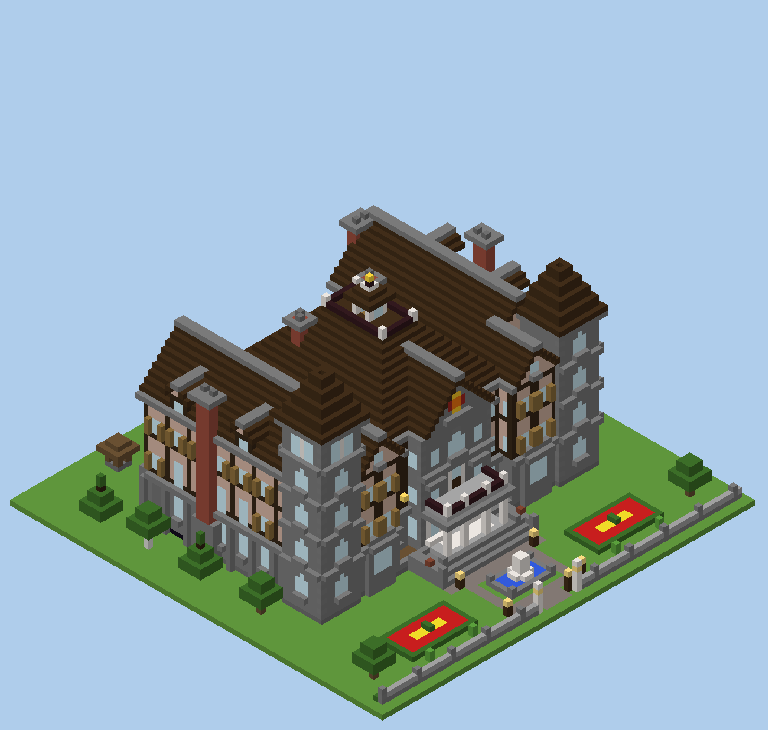
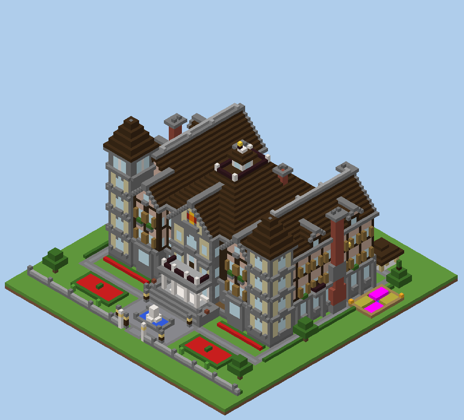
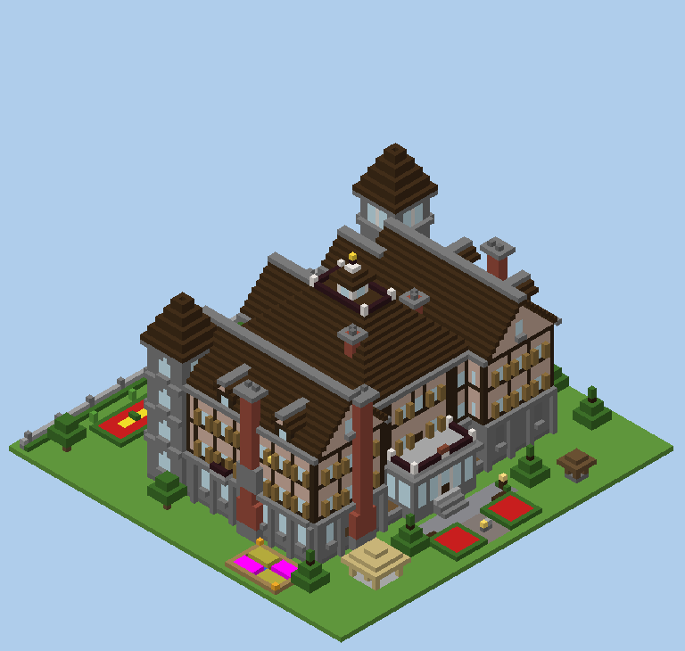
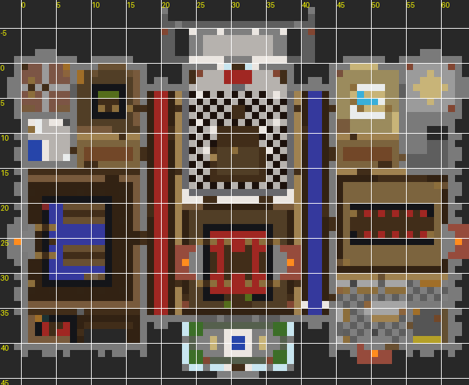

# Ashgrove Manor — command-block mansion for Minecraft Java 1.8 / 1.8.9



A large, fully furnished Victorian manor that builds itself from a **single command block**.
It uses only vanilla Java Edition 1.8.0–1.8.9 features: no mods, datapacks, functions or
structure blocks. You paste **9 commands in turn** into the same command block and press a
button after each one.

* **Size:** a 62 × 41 main house with a basement, three floors, two towers, an attic and a roof walk. The grounds cover an 83 × 83 plot.
* **Rooms:** about 60, all furnished and lit, with no dark spots where mobs could spawn.
* **Secrets:** 8 secret places, including two working piston doors, a hidden vault and an escape tunnel that comes out in a garden well.
* **Testing:** the build was run on real 1.8.0 and 1.8.9 servers and compared block by block with the design, with 0 wrong blocks.

**Full instructions, all 9 commands, the floor plans, the secrets (with spoilers) and the validation
report are in [MANSION.md](MANSION.md).**

## Server-console edition (install from your hosting dashboard)

The same mansion, placed at fixed world coordinates for a server you administer and installed by pasting
lines into the **server console**. You never open a command block.

* Front entrance at **-251 73 267**, facing **east** (+X). The house extends west.
* **24 console lines** (`commands_console/console_01.txt` ... `console_24.txt`), each at most 16,000 characters,
  pasted in order. Each build stage answers with `[Installer] Mansion Console Stage k/24 complete ...` when it is done.
* Tested on real vanilla 1.8.9 and 1.8.0 servers, with a player standing at the documented spot.

**Everything you need (the backup warning, the affected area, where to stand, the step-by-step console
procedure, recovery, verification and the secrets in world coordinates) is in
[CONSOLE_INSTALL.md](CONSOLE_INSTALL.md).**

## Astra refurbishment (apply after the console edition)



The optional Astra layer adds pale tower panels, stone-edged gables, roof cresting,
window planting, connected garden walks, and room-specific surface details while
preserving the base layout, inventories, secrets and east-facing placement.

**Follow [ASTRA_INSTALL.md](ASTRA_INSTALL.md)** and paste the numbered files in
[`commands_astra/`](commands_astra/) only after all 24 base stages finish. If the
base is already built, apply the Astra files directly; do not rebuild the base.
See [the design and validation notes](docs/ASTRA_DESIGN.md) for scope and testing.

The original command-block edition below (`commands/command_01.txt` ... `command_09.txt`) is unchanged
and still works as a fallback.

## Quick start

1. Stand at the north-west corner of a flat area at least 90 × 90 blocks. The house is built toward **+X (east) and +Z (south)**.
2. Run `/give @p command_block` and place the block on the ground. Put a stone button on its north or west face.
3. Paste [`commands/command_01.txt`](commands/command_01.txt) into the command block, click Done and press the button.
4. Wait for the chat message that says the stage is complete. Then paste the next file (`command_02.txt` … `command_09.txt`) into the **same** block and press the button again.
5. After command 9 the installer removes itself and your command block.

Each file is a single line of about 32,700 characters. Open the file, click **Raw**, select everything and copy.

| | |
|---|---|
|  |  |

## Repository layout

| Path | What it is |
|---|---|
| `MANSION.md` | The deliverable: Parts 1–7 (notes, installation, all commands, floor plan, secrets, validation) |
| `commands/command_NN.txt` | The 9 paste-ready commands, one per file (command-block edition) |
| `CONSOLE_INSTALL.md` | Server-console edition: installation guide, world coordinates, tests |
| `commands_console/console_NN.txt` | The 22 server-console lines (plus `manifest.json` with the expected replies) |
| `docs/` | Rendered views and floor plans |
| `tools/` | The generator (Python 3; `pip install -r requirements.txt`) |
| `AGENTS.md` | Handoff notes for developers / AI agents: setup, commands, architecture, rules |

## Rebuilding / checking

Developers and AI agents: start with [AGENTS.md](AGENTS.md). Setup is `pip install -r requirements.txt`
and, for the real-server tests, `tools/setup_servers.sh` (downloads the vanilla 1.8.9 and 1.8.0 server jars).

```
cd tools
python3 check.py        # voxel model: supports, fire safety, walkability (both ways), lighting
python3 export.py       # regenerates commands/, docs/ and MANSION.md
python3 final_test.py <server-dir>   # runs commands/*.txt on a real 1.8.x server jar and diffs the world
```

Server-console edition:

```
cd tools
python3 console_check.py              # turned model: text replay, supports, walking, light, fire, placement
python3 console_export.py             # regenerates commands_console/, docs/console_*.png, CONSOLE_INSTALL.md
python3 console_test.py <server-dir> [flat|terrain]   # console workflow on a real 1.8.x server jar
```

`rotation.py` turns the design to face east at -251 73 267 (coordinates and all directional metadata),
`console_build.py` packs it into console lines, and `mcbot.py` is the headless 1.8 player the real-server
test uses to keep chunks loaded and to click levers, doors and chests.

The design is written as Python modules:

* `exterior.py`, `facades.py` and `roofs.py`: the outside of the house.
* `interior_f1.py`, `interior_f2.py`, `interior_f3.py` and `basement.py`: the rooms.
* `landscape.py`: the grounds.

`engine.py` turns each placement into a relative `/fill`, `/setblock`, `/clone` or `/summon` command and
keeps a voxel model of the result. `packer.py` packs the commands into 1.8 minecart piles of at most
32,700 characters each.
